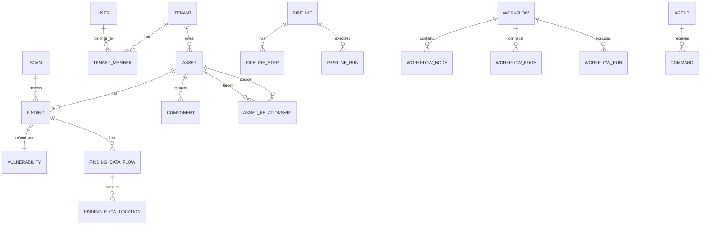

# Schema Overview

OpenCTEM uses PostgreSQL with **63 migrations** (000001–000063) organized across 8 core domains.

## Core Domains

### 1. Identity & Access Management (IAM)

| Table | Migration | Description |
|-------|-----------|-------------|
| `users` | 000002 | Global users table |
| `tenants` | 000003 | Organization/tenant boundaries |
| `tenant_members` | 000003 | User-tenant membership with role |
| `modules` | 000004 | Feature modules (licensable) |
| `permissions` | 000005 | Granular system permissions (126 total) |
| `roles` | 000006 | RBAC role definitions (Owner/Admin/Member/Viewer + custom) |
| `role_permissions` | 000006 | Permission-to-role mapping |
| `user_roles` | 000006 | User-to-role assignment per tenant |
| `groups` | 000007 | User groups for data scope access |
| `group_members` | 000007 | Group membership |
| `permission_sets` | 000041 | Custom permission set definitions |
| `assignment_rules` | 000041 | Auto-assignment rules |
| `admin_users` | 000043 | Platform admin accounts (super_admin, ops_admin, readonly) |

### 2. Asset Management

| Table | Migration | Description |
|-------|-----------|-------------|
| `assets` | 000008 | Core asset entity (JSONB `properties` for type-specific data) |
| `asset_branches` | 000009 | Repository branches/versions |
| `asset_types` | 000037 | Asset type definitions |
| `asset_groups` | 000024 | Logical grouping of assets |
| `asset_group_memberships` | 000024 | Asset-to-group mapping |
| `asset_relationships` | 000039 | Directed graph: 16 relationship types |
| `components` | 000010 | Software components/libraries (global) |
| `component_licenses` | 000044 | SPDX license tracking |

### 3. Vulnerability Management

| Table | Migration | Description |
|-------|-----------|-------------|
| `vulnerabilities` | 000011 | CVE/vulnerability definitions |
| `findings` | 000012 | Security findings (polymorphic: vulnerability, secret, compliance, web3, misconfiguration) |
| `finding_data_flows` | 000029 | SARIF codeFlows for SAST findings |
| `finding_flow_locations` | 000029 | Individual steps in data flow paths |
| `finding_sources` | 000038 | Finding source tracking |
| `exposure_events` | 000028 | Exposure/data leak events |
| `credentials` | 000022 | Leaked credential management |
| `threat_intelligence` | 000025 | Threat intel feeds |
| `suppression_rules` | 000023 | Finding suppression rules |
| `sla_policies` | 000042 | SLA policy definitions |

### 4. Scanning & Tools

| Table | Migration | Description |
|-------|-----------|-------------|
| `tools` | 000015 | Scanner tool registry |
| `tool_categories` | 000015 | Tool categorization |
| `capabilities` | 000030 | Capability registry |
| `tool_capabilities` | 000030 | Tool-to-capability junction |
| `target_asset_type_mappings` | 000031 | Smart filtering: target type → asset type |
| `scan_profiles` | 000017 | Scan configuration templates |
| `scans` | 000032 | Scan execution records |
| `scan_sessions` | 000032 | Scan session tracking |
| `tool_executions` | 000033 | Individual tool execution records |
| `agents` | 000016 | Distributed scan agents (tenant + platform) |
| `commands` | 000016 | Job queue for agents |

### 5. Pipelines & Workflows

| Table | Migration | Description |
|-------|-----------|-------------|
| `pipelines` | 000018 | Scan pipeline templates |
| `pipeline_steps` | 000018 | Steps within a pipeline |
| `pipeline_runs` | 000018 | Pipeline execution instances |
| `step_runs` | 000018 | Individual step execution records |
| `workflows` | 000040 | Automation workflow definitions |
| `workflow_nodes` | 000040 | Workflow graph nodes |
| `workflow_edges` | 000040 | Workflow graph edges |
| `workflow_runs` | 000040 | Workflow execution instances |
| `workflow_node_runs` | 000040 | Individual node execution records |

### 6. Integrations & Notifications

| Table | Migration | Description |
|-------|-----------|-------------|
| `integrations` | 000019 | External service integrations (Slack, Teams, etc.) |
| `notification_outbox` | 000020 | Transactional outbox for reliable delivery |
| `notification_events` | 000020 | Notification event archive |
| `data_sources` | 000014 | External data source connections |
| `webhooks` | 000035 | Webhook endpoints |
| `api_keys` | 000034 | API key management |

### 7. Configuration & Settings

| Table | Migration | Description |
|-------|-----------|-------------|
| `settings` | 000036 | Tenant settings (general, security, API) |
| `scope_targets` | 000027 | Scan scope target definitions |
| `scope_exclusions` | 000027 | Scan scope exclusion patterns |
| `scan_schedules` | 000027 | Scan schedule configuration |
| `rule_sets` | 000026 | Rule management for scanners |

### 8. Platform Administration

| Table | Migration | Description |
|-------|-----------|-------------|
| `admin_users` | 000043 | Platform admin accounts with bcrypt API key auth |
| `admin_audit_logs` | 000043 | Admin action audit trail (immutable) |
| `agent_leases` | 000043 | K8s-style lease management for platform agents |
| `bootstrap_tokens` | 000043 | Agent self-registration tokens |
| `agent_registrations` | 000043 | Agent registration audit trail |
| `audit_logs` | 000021 | Tenant audit trail |

## Relationships Diagram



## Finding Types and Specialized Columns

The `findings` table supports multiple finding types with specialized columns:

| Finding Type | Column Prefix | Description |
|--------------|---------------|-------------|
| `vulnerability` | (base columns) | SAST/SCA/DAST findings |
| `secret` | `secret_*` | Leaked credentials, API keys |
| `compliance` | `compliance_*` | CIS, PCI-DSS, SOC2 findings |
| `web3` | `web3_*` | Smart contract vulnerabilities |
| `misconfiguration` | `misconfig_*` | IaC/Infrastructure findings |

## Fingerprint Strategy

Findings use type-aware fingerprinting for deduplication:

| Strategy | Components | Use Case |
|----------|------------|----------|
| SAST/v1 | assetID + ruleID + filePath + normalizedSnippet | Resilient to line shifts |
| SCA/v1 | assetID + PURL + CVE | Package-based identity |
| DAST/v1 | assetID + ruleID + endpoint + parameter | URL-based identity |
| Secret/v1 | assetID + secretType + service + hash(maskedValue) | Credential identity |
| Compliance/v1 | assetID + framework + controlID | Control-based identity |
| Misconfig/v1 | assetID + policyID + resourceType + resourcePath | Resource-based identity |
| Web3/v1 | chainID + contractAddress + SWCID + functionSelector | Contract-based identity |

Fingerprints are stored in `findings.fingerprint` (primary) and `findings.partial_fingerprints` (JSONB, for multi-algorithm support).

> **Security Note**: The Secret/v1 strategy uses a SHA-256 hash of the masked value (not the raw secret) to prevent credential exposure.

## Security Considerations

### Tenant Isolation (Defense in Depth)

OpenCTEM uses a **3-layer defense** approach for tenant data isolation:

| Layer | Mechanism | Description |
|-------|-----------|-------------|
| **Layer 1** | SQL `WHERE tenant_id = ?` | Code-level enforcement in all repositories |
| **Layer 2** | PostgreSQL RLS Policies | Database-level safety net |
| **Layer 3** | Composite Indexes | Performance optimization for tenant-scoped queries |

#### Row Level Security (RLS)

RLS is enabled on all tenant-scoped tables with automatic filtering:

```sql
-- RLS policy on findings table (and similar for other tables)
CREATE POLICY tenant_isolation_findings ON findings
    FOR ALL
    USING (tenant_id = current_tenant_id())
    WITH CHECK (tenant_id = current_tenant_id());
```

**RLS-Protected Tables:**
- `findings`, `assets`, `scans`, `agents`
- `integrations`, `exposure_events`, `suppression_rules`
- `finding_activities`, `finding_comments`, `asset_branches`

#### SQL Query Pattern

All tenant-scoped queries must include `tenant_id`:

```sql
-- REQUIRED: All queries must include tenant_id filter
SELECT fl.* FROM finding_flow_locations fl
JOIN finding_data_flows df ON df.id = fl.data_flow_id
JOIN findings f ON f.id = df.finding_id
WHERE fl.file_path = $1 AND f.tenant_id = $2;  -- tenant_id is mandatory
```

#### Production Database Configuration

{: .warning }
> **CRITICAL:** Application must use non-superuser database connection for RLS to be enforced.

```bash
# Production: Use non-superuser (RLS enforced)
DATABASE_URL=postgres://openctem_app:password@db:5432/openctem
```

See: [Tenant Isolation & RLS Architecture](../architecture/tenant-isolation-security.md) for complete documentation.

### Performance Indexes

Key performance-focused migrations:

| Migration | Description |
|-----------|-------------|
| 000048 | JSONB property indexes (9 indexes for asset properties queries) |
| 000049 | Tenant isolation composite indexes (12 indexes) |
| 000050 | Security hardening CHECK constraints (13 constraints) |
| 000051 | Audit protection triggers (3 immutability triggers) |
| 000052 | Finding specialized indexes (16 indexes for common queries) |
| 000053 | Scan/dependency/command performance indexes (14 indexes) |
| 000056 | Drop redundant indexes (cleanup) |

### Data Integrity

| Migration | Description |
|-----------|-------------|
| 000050 | CHECK constraints for enum fields (status, severity, type) |
| 000051 | Immutability triggers for audit_logs, admin_audit_logs, agent_registrations |
| 000062 | UUID v7 migration (time-ordered UUIDs) |
| 000063 | Spelling standardization (cancelled vs canceled) |
