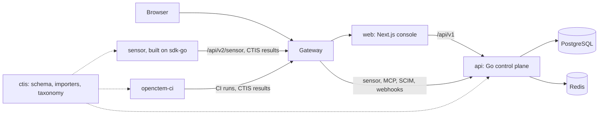

# Repository layout

The product you deploy (API and web console) lives in one repository,
[openctemio/openctem](https://github.com/openctemio/openctem). Parts that run elsewhere or have
their own consumers live in their own repositories under the
[openctemio](https://github.com/openctemio) organization.

## The repositories

| Repository | Language | License | What it is | Released as |
|---|---|---|---|---|
| [openctem](https://github.com/openctemio/openctem) | Go, TypeScript | GPL-3.0 | The platform: API (`api/`), web console (`web/`), all-in-one image (`deploy/allinone/`) | `vX.Y.Z` tags; images `ghcr.io/openctemio/openctem-api`, `openctem-web`, `openctem` (all-in-one), `migrations`, `seed`, `admin-cli` |
| [sensor](https://github.com/openctemio/sensor) | Go | GPL-3.0 | The sensor (`openctemio-sensor`) that runs scanners where the targets are and reports to the platform | its own tags; image `ghcr.io/openctemio/sensor` |
| [sdk-go](https://github.com/openctemio/sdk-go) | Go | GPL-3.0 | The Go SDK: sensor runtime (`pkg/sensorkit`), tool contract (`pkg/tool`), protocol client, the `openctem` developer CLI | Go module with its own semver |
| [ctis](https://github.com/openctemio/ctis) | Go, JSON Schema | Apache-2.0 | CTIS, the CTEM Ingest Schema: specification, JSON Schemas, Go types, report importers, the capability taxonomy | Go module `github.com/openctemio/ctis` |
| [ci](https://github.com/openctemio/ci) | Go | GPL-3.0 | `openctem-ci`, the GitHub Action and GitLab templates for scanning in CI pipelines | its own tags; images `ghcr.io/openctemio/ci`, `ci-<tool>` |
| [helm-charts](https://github.com/openctemio/helm-charts) | Helm | Apache-2.0 | The `openctem` Helm chart (optionally with a bundled sensor) | chart releases |
| [docs](https://github.com/openctemio/docs) | Markdown | | This documentation site | published on merge |

The old `openctemio/api` repository was renamed to `openctemio/openctem` (its links redirect), and
`openctemio/ui` is archived: its history lives under `web/`.

## How they fit together



- **web to api.** Every console screen is REST calls to `/api/v1`. The console holds no business
  logic; authorization is always enforced by the API. Its wire types are generated from the API's
  OpenAPI spec, so an API change and the web change that uses it land in one pull request.
- **sensor to api.** The sensor authenticates with its own credential on the sensor plane
  (`/api/v2/sensor`), takes work, runs tools and submits CTIS results.
- **sdk-go.** The sensor is built on it. Build your own collector or tool on the same SDK.
- **ctis is a shared contract, not a leaf.** The API, the SDK, the sensor and `openctem-ci` all
  decode CTIS strictly. Change the format in `ctis` first, then bump it in the consumers. The API
  does not import `sdk-go`.

## Inside openctem

```
openctem/
├── Makefile            root targets: setup, generate, dev-api, dev-web, build, test, lint, check
├── api/                Go module github.com/openctemio/openctem/api
│   ├── cmd/            server, bootstrap-admin, rekey, refingerprint, code generators
│   ├── internal/
│   │   ├── app/        application services (use cases)
│   │   ├── config/     configuration from the environment
│   │   └── infra/      adapters: http (routes, handlers, middleware), postgres, redis,
│   │                   notifier, jira, scm, llm, websocket, jobs, ...
│   ├── pkg/            shared packages: domain (entities, value objects), apierror,
│   │                   pagination, filterspec, httpsec, sensorproto, ...
│   ├── migrations/     golang-migrate SQL (baseline + later migrations), seed/
│   ├── configs/        asset-types.yaml, relationship-types.yaml, sensor and workflow templates
│   ├── api/openapi/    generated spec (not committed), sensor protocol spec, lint baselines
│   ├── deploy/         Compose deployment and the gateway (Caddy)
│   ├── tests/          unit and integration tests
│   ├── tools/          code generators and linters (routestyle, openapicontract, ...)
│   ├── changelog.d/    one changelog fragment per change
│   └── docs/           architecture notes, RFCs, development and deployment docs
├── web/                Next.js console
│   └── src/            app/ (routes), features/, components/, lib/ (API client), config/
├── deploy/             allinone/ image, observability/ stack
├── scripts/            generate-in-docker.sh
├── .github/            workflows, composite actions, scripts
└── .githooks/          pre-commit and commit-msg hooks
```

The API follows a layered (clean) architecture: domain types have no infrastructure dependencies,
application services hold the use cases, and `internal/infra` adapts HTTP, the database and
external systems. Design notes and decisions live in
[`api/docs/architecture`](https://github.com/openctemio/openctem/tree/develop/api/docs/architecture)
and [`api/docs/rfcs`](https://github.com/openctemio/openctem/tree/develop/api/docs/rfcs).

## Where to make a change

| I want to... | Go to |
|---|---|
| add or change an endpoint, a domain rule or a migration | `openctem/api` |
| change a screen | `openctem/web` |
| change an API response the console reads | `openctem`, one pull request: handler, `make generate`, web change |
| add a scanner or change sensor behavior | `sensor` (and `sdk-go` for runtime or tool-contract surface); see [Writing a tool](tool-authoring.md) |
| change the ingested data format or an importer | `ctis` first, then bump it in `openctem/api`, `sdk-go`, `sensor` |
| change Kubernetes packaging | `helm-charts` |
| change these docs | `docs` |
