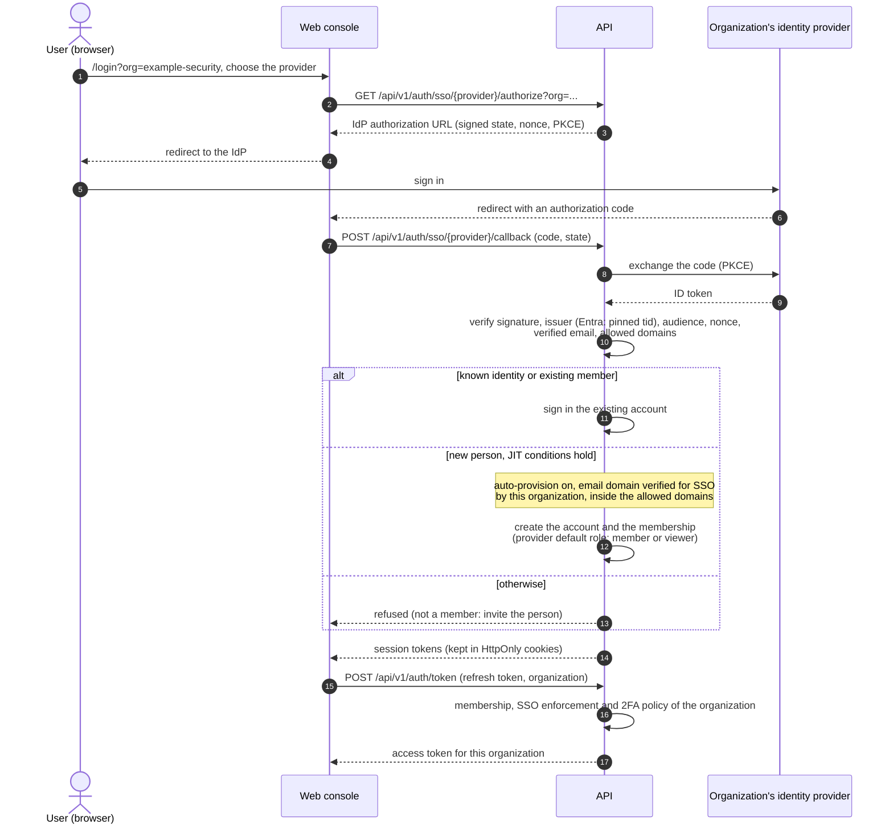

# Identity and access

This section explains how people get an account, how they get into an organization, and what they
can do there.

## Accounts and organizations

- An **account** (a user) is global to the installation and identified by its email address. One
  account can belong to several organizations.
- An **organization** (a tenant) holds assets, findings, scans, sensors and settings. Everything an
  organization owns is isolated from every other organization.
- A **membership** links an account to an organization with a role (owner, admin, member or viewer,
  plus optional custom roles). See [Roles, groups and permissions](roles-and-permissions.md).

Signing in proves who you are and gives you a session for your account. The session is then
exchanged for an access token **for one organization** at a time; the organization's policies (2FA
requirement, SSO enforcement, IP allowlist, allowed email domains) are checked at that point and
again on later requests.

## Ways to sign in

| Method | Who configures it | Scope | Page |
|---|---|---|---|
| Email and password (local account), with optional TOTP 2FA | users themselves; organizations can require 2FA | any organization the account belongs to | [Two-factor authentication](two-factor.md) |
| Organization SSO with OpenID Connect: Microsoft Entra ID, Okta, Google Workspace | platform administrator, approved by the organization owner | one organization | [Entra ID](sso-entra-id.md), [Google](sso-google.md), [OIDC and Okta](sso-oidc.md) |
| Organization SSO with SAML 2.0 | platform administrator, approved by the organization owner | one organization | [SAML 2.0](sso-saml.md) |
| Social sign-in: Google, GitHub, Microsoft | operator, with environment variables | the installation (does not join anyone to an organization) | [Google](sso-google.md#social-sign-in-with-google), [Entra ID](sso-entra-id.md#social-sign-in-with-microsoft) |

### Organization SSO sign-in, step by step

The identity provider is chosen by the organization in the sign-in link
(`/login?org=<organization-slug>`), never by the email address. The diagram
shows OpenID Connect; SAML 2.0 follows the same checks with the assertion posted
to `/api/v1/auth/saml/{org}/acs`.

An existing password account is never taken over by an SSO sign-in with the
same email: its owner signs in with the password first and links the identity
provider. SSO never grants the owner or admin role. Details:
[Verified domains and just-in-time provisioning](sign-up-and-invitations.md#verified-domains-and-just-in-time-provisioning).

## Ways into an organization

| Way | Configured by |
|---|---|
| Invitation by email | organization owners and admins |
| Account created by an organization admin (with a one-time set-password link) | organization owners and admins |
| Just-in-time provisioning at the first SSO sign-in, for email domains the organization has proven with DNS | platform administrator (SSO) and organization owner (approval) |
| SCIM 2.0 provisioning from the identity provider | organization owner (token), identity provider admin |
| Creating your own organization, when the installation allows it | platform administrator (sign-up policy) |

See [Sign-up and invitations](sign-up-and-invitations.md) and [SCIM provisioning](scim.md).

## Platform administrators and organization users

OpenCTEM separates two kinds of administrator:

| | Platform administrator | Organization owner or admin |
|---|---|---|
| Purpose | Runs the installation: creates organizations and their first owner, configures organization SSO, verified SSO domains, sign-up policy, plans, platform sensors, threat-intel feeds | Runs one organization: members, roles, teams, scope, scans, integrations, organization security settings |
| Account | A normal account that belongs to no organization, linked to a platform admin record with a console role (`super_admin`, `ops_admin` or `readonly`) | A member of the organization with the owner or admin role |
| Sign-in | The normal `/login` page, then the admin console at `/admin/login` with a TOTP code every time. Optionally through a platform identity provider (generic OIDC), still followed by TOTP. An organization's SSO can never sign in a platform administrator. | Any method the organization allows |
| API | `/api/v1/admin/*` with the console session only; no API keys | `/api/v1/*` with an access token or an organization API key |

The first platform administrator is created with the `bootstrap-admin` command during installation
(see [First administrator](../install/first-admin.md)). Further administrators are added by a super
admin in the console.

Organization tokens never work on admin routes, and console sessions never work on organization
routes.

## In this section

- [Microsoft Entra ID](sso-entra-id.md)
- [Google](sso-google.md)
- [Generic OIDC and Okta](sso-oidc.md)
- [SAML 2.0](sso-saml.md)
- [SCIM provisioning](scim.md)
- [Sign-up and invitations](sign-up-and-invitations.md)
- [Roles, groups and permissions](roles-and-permissions.md)
- [Two-factor authentication](two-factor.md)

For the security model behind these controls, see [Security](../security/index.md).
