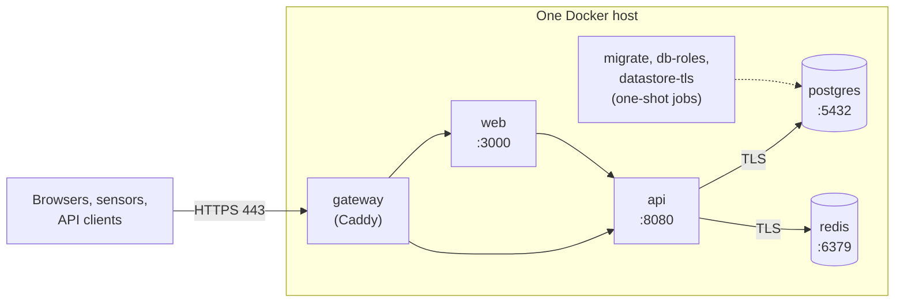
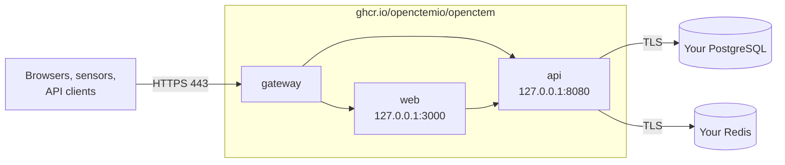
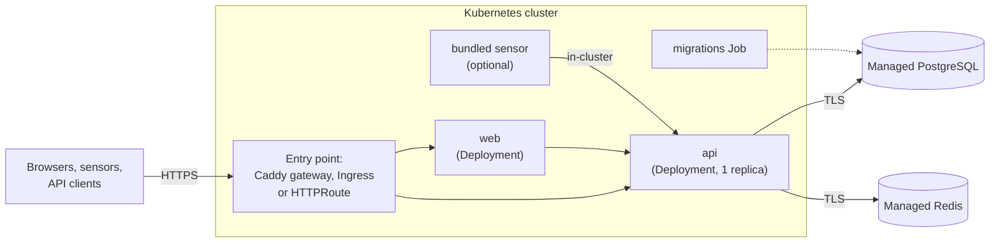
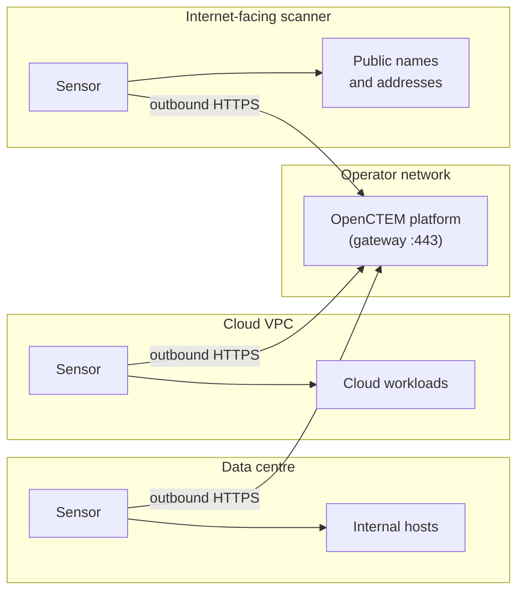
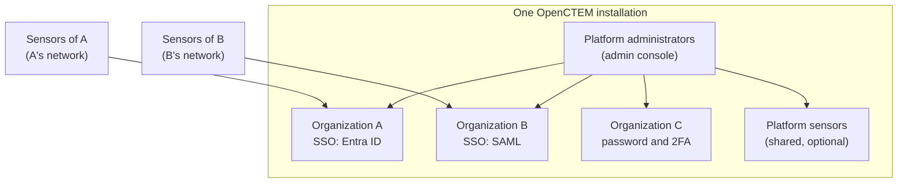

# Requirements and sizing
{: .no_toc }

OpenCTEM is self-hosted. Pick a deployment, check the requirements below, then
follow the guide. These pages describe OpenCTEM v0.9.0 and later.

For a production installation, follow the [go-live runbook](production-go-live.md):
the order of work from an empty host to a monitored installation with a tested restore.

1. TOC
{:toc}

---

## Choose a deployment

| Deployment | Runs | Best for |
|---|---|---|
| [Docker Compose](docker-compose.md) | Gateway, web console, API, PostgreSQL and Redis on one host, from `api/deploy/docker-compose.yml`. | Most single-host installs. Everything included, TLS between all parts. |
| [All-in-one image](all-in-one.md) | `ghcr.io/openctemio/openctem`: gateway, web console and API in one container. PostgreSQL and Redis are yours. | You already run PostgreSQL and Redis (managed or self-hosted). |
| [Kubernetes (Helm)](kubernetes.md) | The `openctem` chart from `openctemio/helm-charts`. | Clusters, external managed datastores, GitOps. |

All three expose the platform on one HTTPS port through the same gateway: see
[TLS and the gateway](tls-and-gateway.md). After installing, create the
[first administrator](first-admin.md).

Sensors, the components that run scans in your networks, are installed
separately: see [Sensors](../sensors/index.md).

## Deployment topologies

### Single host with Docker Compose

Everything on one host; only the gateway publishes a port.

### All-in-one container

One container runs the gateway, the web console and the API; PostgreSQL and
Redis are yours (managed or self-hosted).

### Kubernetes with Helm

The chart runs the API, the web console and the migrations, and exposes them
through one entry point: its own Caddy gateway, an Ingress or a Gateway API
HTTPRoute (`gateway.mode`). PostgreSQL and Redis are external in production.

### Sensors in customer networks

Whichever way the platform is installed, sensors run next to their targets and
only connect out. No inbound port is opened in the scanned networks.

Group the sensors that can reach the same address ranges into
[scan zones](../sensors/zones.md); see the
[network requirements](../sensors/network.md).

### One installation for many organizations

A single installation can serve several organizations, for example a service
provider or a central security team hosting business units. Each organization
has its own members, SSO, sensors and data; platform administrators run the
installation without seeing organization data.

- `TENANT_CREATION_MODE=admin_only` (the default): only platform
  administrators create organizations. `self_service`: any signed-in user can
  create one ([First administrator](first-admin.md#self-service-organizations)).
- Organization sensors take only their own organization's work. Platform
  sensors are shared capacity run by the operator; in the current release no
  organization can send scans to them yet (see [Sensors](../sensors/index.md#organization-sensors-and-platform-sensors)).
- With `self_service`, active probes on shared platform sensors need a
  verified domain by default (`SCOPE_ACTIVE_PROOF`; see
  [Scope](../scanning/scope.md#platform-guardrails)).

## Images

Every release tag `vX.Y.Z` publishes these images to the GitHub Container
Registry, for `linux/amd64` and `linux/arm64`, signed with cosign and with SBOMs
attached to the release:

| Image | Contents |
|---|---|
| `ghcr.io/openctemio/openctem-api` | API server, `bootstrap-admin`, migrations and configuration files. |
| `ghcr.io/openctemio/openctem-web` | Web console. |
| `ghcr.io/openctemio/openctem` | All-in-one: API, web console and gateway. |
| `ghcr.io/openctemio/migrations` | Database migration runner. |
| `ghcr.io/openctemio/admin-cli` | `bootstrap-admin` on its own. |
| `ghcr.io/openctemio/seed` | Demo and test data. Not for production. |

The `openctem-api`, `openctem-web`, `openctem` and `admin-cli` names start with
v0.9.0. Releases up to v0.8.0 exist as `ghcr.io/openctemio/api` and
`ghcr.io/openctemio/ui`, which keep receiving identical copies for a transition
period. Pin an exact tag in production, never `latest`.

The sensor image (`ghcr.io/openctemio/sensor`) is versioned separately.

## Software

| Component | Version |
|---|---|
| PostgreSQL | 17 (the version the Compose stack bundles and CI tests). Extensions `pgcrypto`, `pg_trgm` and `uuid-ossp` must be available. |
| Redis | 7. TLS and a password of at least 32 characters in production. |
| Docker | Engine with the Compose plugin 2.24 or later, for Compose and the all-in-one image. |
| Kubernetes | A cluster supported by Helm 3; a default StorageClass for the volumes the chart creates. |

In production (`APP_ENV=production`) the API refuses to connect to PostgreSQL or
Redis without TLS. The Compose stack sets this up for its bundled datastores;
managed services usually provide it. See
[Production checks](../configuration/environment-variables.md#production-checks).

## Sizing

OpenCTEM's load grows with the number of assets and findings and with how often
scan results arrive, not with the number of users. The figures below are
starting points for the host or cluster running the platform, not measured
benchmarks: watch the metrics in [Monitoring](../operations/monitoring.md) and
grow from there. Sensors run elsewhere and are sized separately.

| Tier | Typical use | CPU | Memory | Disk |
|---|---|---|---|---|
| Evaluation | One organization, a few thousand assets, trial data | 2 vCPU | 4 GB | 20 GB |
| Small production | A few organizations, tens of thousands of findings | 4 vCPU | 8 GB | 100 GB SSD |
| Larger production | Many organizations, hundreds of thousands of findings | 8 vCPU or more | 16 GB or more | 250 GB SSD or more; consider managed PostgreSQL |

- The API and the web console are light; PostgreSQL takes most of the memory and
  disk. The Helm chart's production example requests 250m CPU and 512 MiB for the
  API (limit 2 CPU, 1 GiB) and 100m CPU and 256 MiB per web console replica
  (limit 1 CPU, 512 MiB).
- Disk holds the database, uploaded attachments and evidence, container logs
  (Compose rotates them at 50 MB with 5 files per container) and backups. Keep at
  least 20% free: PostgreSQL stops when its disk fills.
- The optional [monitoring stack](../operations/monitoring.md) needs about 1 GB of
  memory more.
- Run one API instance: see [Scaling](../operations/scaling.md).

## Network

### Inbound

| Port | Who connects | Notes |
|---|---|---|
| 443/TCP | Browsers, sensors, API clients, SCIM, identity providers, Jira and GitHub webhooks | The only required port. |
| 80/TCP | Browsers | Optional: redirects to HTTPS, and Let's Encrypt HTTP-01 in TLS mode `acme`. |

Nothing else is published. Internally the API listens on 8080, the web console on
3000, PostgreSQL on 5432 and Redis on 6379; keep them off public networks.

### Outbound (from the API)

| Destination | Why | Needed |
|---|---|---|
| `acme-v02.api.letsencrypt.org` | Certificates in TLS mode `acme`. | Mode `acme` only. |
| `epss.empiricalsecurity.com`, `www.cisa.gov`, `raw.githubusercontent.com` | EPSS scores and the CISA KEV catalog for prioritization. | Recommended. |
| `crt.sh`, `api.certspotter.com` | Certificate Transparency discovery. | Optional (`CERT_MONITOR_ENABLED=false` turns it off). |
| `ctem.org` | CTEM-ID catalog feed. | Optional. |
| Your SMTP server | Invitations, verification and password-reset email. | Recommended. |
| Integration endpoints | Jira, GitHub or GitLab, Slack, Teams, Telegram, webhook channels, identity providers, AI providers. | Per integration. |

Webhook and integration URLs that resolve to private addresses (RFC 1918) are
refused unless `OPENCTEM_HTTPSEC_ALLOW_PRIVATE=1` is set; loopback, link-local and
cloud metadata addresses are always refused.

### DNS

One name (or a fixed IP address) for the platform, the same for browsers and
sensors: `OPENCTEM_HOSTNAME`. TLS mode `acme` needs a public DNS name that
resolves to the host. Mode `internal` also works with a bare IP address.
