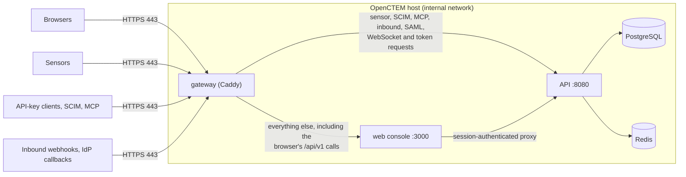

# TLS and the gateway
{: .no_toc }

OpenCTEM is exposed through one HTTPS port. A built-in gateway (Caddy with a
fixed configuration) terminates TLS and routes every request to the API or the
web console. Browsers, sensors, API-key clients, SCIM, MCP clients and inbound
webhooks all use the same address, `https://<host>`. The API, the web console,
PostgreSQL and Redis are never published.

The same gateway files run in the [Compose stack](docker-compose.md), inside the
[all-in-one image](all-in-one.md) and, as `gateway.mode: caddy`, in the
[Helm chart](kubernetes.md).

1. TOC
{:toc}

---

## How it fits together



- **One firewall rule**: inbound TCP 443 (plus 80 if you add the redirect).
- **One origin**: the console, the API and the WebSocket share it, so there is no
  CORS to maintain beyond setting the public origin.
- **Internal endpoints stay internal**: `/metrics`, `/ready` and `/debug/*` answer
  404 at the gateway.

## TLS modes

`OPENCTEM_TLS_MODE` selects one of four modes. The gateway checks its settings
before it starts and exits with code 64 and a message naming the missing
variable (`openctem-gateway: ...`).

### `internal`: the gateway's own CA

The default. For LAN installs, air-gapped sites and bare IP addresses. The
gateway creates a private CA named "OpenCTEM Internal CA" and issues a
certificate for `OPENCTEM_HOSTNAME`.

```bash
OPENCTEM_HOSTNAME=192.0.2.10
OPENCTEM_PUBLIC_URL=https://192.0.2.10
OPENCTEM_TLS_MODE=internal
```

- Works with IP addresses: clients that connect to an IP send no SNI, and the
  gateway serves the right certificate anyway.
- The root certificate is exported, world-readable, to
  `./ca/openctem-root-ca.crt` (Compose) or `/data/ca/openctem-root-ca.crt`
  (all-in-one), and refreshed if the CA changes. Give it to sensors and, if you
  like, to browsers. The API's sensor install snippets include it when
  `SENSOR_CA_CERT_FILE` points at it (the Compose stack does this).
- The CA's private key lives in the gateway's data volume (`gateway-data` in
  Compose). Back it up: if it is lost the gateway creates a new CA, and every
  sensor and browser must be given the new root.

Check the fingerprint of the root you distribute:

```bash
openssl x509 -in ca/openctem-root-ca.crt -noout -subject -fingerprint -sha256
```

Browsers show a warning until the root is imported into their trust store.

### `acme`: Let's Encrypt

For a public DNS name that resolves to the host and is reachable from the
internet on port 443.

```bash
OPENCTEM_HOSTNAME=ctem.example.com
OPENCTEM_PUBLIC_URL=https://ctem.example.com
OPENCTEM_TLS_MODE=acme
ACME_EMAIL=ops@example.com
```

Port 443 alone is enough (TLS-ALPN-01 challenge). Publishing port 80 as well
(`docker-compose.http-redirect.yml`) adds the HTTP-01 challenge and the
redirect from `http://`. Certificates renew automatically. `ACME_CA` selects
another ACME directory (for example a staging or internal ACME CA).

### `files`: your own certificate

```bash
OPENCTEM_HOSTNAME=ctem.example.com
OPENCTEM_PUBLIC_URL=https://ctem.example.com
OPENCTEM_TLS_MODE=files
```

Put the certificate in `./certs` (Compose; `TLS_CERT_DIR` changes the
directory) or mount it at `/certs` (all-in-one):

- `tls.crt`: PEM, full chain, leaf first, valid for `OPENCTEM_HOSTNAME`.
- `tls.key`: PEM private key.

`TLS_CERT_FILE` and `TLS_KEY_FILE` change the file names. After replacing the
files, restart the gateway (`docker compose restart gateway`). If the issuing CA
is private, clients must trust it as described for `internal`.

### `http`: behind your own TLS proxy

Only when an existing proxy or load balancer already terminates TLS for
browsers and sensors. The gateway then speaks plain HTTP on port 80 and still
does all the routing.

```bash
OPENCTEM_TLS_MODE=http
OPENCTEM_ALLOW_PLAIN_HTTP=true
OPENCTEM_HOSTNAME=ctem.example.com
OPENCTEM_PUBLIC_URL=https://ctem.example.com
OPENCTEM_TRUSTED_PROXIES=192.0.2.5/32
```

```bash
docker compose -f docker-compose.yml -f docker-compose.plain-http.yml up -d
```

- The gateway refuses to start unless `OPENCTEM_ALLOW_PLAIN_HTTP=true`, and logs
  a warning on every start in this mode.
- The overlay publishes `127.0.0.1:8081` instead of 443 (`GATEWAY_BIND` and
  `GATEWAY_HTTP_PORT` change it). Bind it only to the interface your proxy uses.
- Set `OPENCTEM_TRUSTED_PROXIES` to your proxy's address (space-separated CIDRs)
  so client addresses survive. A proxy on the same host reaches the port through
  Docker, so the gateway sees the Docker network's gateway address (`.1` of the
  internal network): check the `remote_ip` in `docker compose logs gateway`.
- Your proxy must forward everything for the host to the gateway without
  splitting paths, keep the `Host` header, pass `X-Forwarded-For` and
  `X-Forwarded-Proto`, allow WebSocket upgrades, and not buffer or time out long
  requests. No HSTS header is added in this mode; set it on your proxy.

An nginx example:

```nginx
map $http_upgrade $connection_upgrade { default upgrade; '' close; }

server {
    listen 443 ssl;
    http2 on;
    server_name ctem.example.com;
    ssl_certificate     /etc/nginx/tls/fullchain.pem;
    ssl_certificate_key /etc/nginx/tls/privkey.pem;

    client_max_body_size 256m;
    proxy_request_buffering off;
    proxy_buffering off;
    proxy_read_timeout 1h;

    location / {
        proxy_pass http://127.0.0.1:8081;
        proxy_http_version 1.1;
        proxy_set_header Host $host;
        proxy_set_header X-Forwarded-For $proxy_add_x_forwarded_for;
        proxy_set_header X-Forwarded-Proto https;
        proxy_set_header Upgrade $http_upgrade;
        proxy_set_header Connection $connection_upgrade;
    }
}
```

## Routing

The gateway routes by path first, then by credential. The path list is
generated from the API's route table (each route belongs to a "plane"), and CI
fails when the two disagree.

| Request | Goes to |
|---|---|
| `/api/v2/sensor/*` | API: sensors (protocol v2) |
| `/api/v1/webhooks/incoming/*` (and `/hooks/*`, reserved for inbound webhooks) | API: inbound Jira and GitHub webhooks (HMAC-verified) |
| `/scim/v2/*` | API: SCIM provisioning |
| `/api/v1/mcp` | API: MCP server (`oct_` API key) |
| `/api/v1/auth/saml/*`, `/api/v1/auth/backchannel-logout` | API: called by the identity provider |
| `/api/v1/ws` | API: the browser's WebSocket (session cookie) |
| `/health`, `/openapi.yaml`, `/docs` | API: liveness and API reference |
| `/api/*` with `Authorization: Bearer oct_...` or an `X-API-Key` header | API: API-key clients |
| `/api/*` with `Authorization: Bearer ...` and no `auth_token` cookie | API: other token clients |
| `/metrics`, `/ready`, `/debug/*` | Blocked: 404 |
| Everything else, including the browser's cookie calls to `/api/v1/*` | Web console |

Why the credential rules: the console's `/api/v1` proxy authenticates with the
browser's session cookie and does not forward the caller's `Authorization`
header, so a token client sent there would get 401. A browser always carries the
session cookie, so "Bearer token and no session cookie" is never a browser call.

{: .note }
A script that sends a Bearer token and an `auth_token` cookie together is routed
to the web console and its token is ignored. Send one or the other.

## Sensors and other clients

A sensor's API URL is the gateway URL, with no port and no path:
`https://ctem.example.com`. With `acme`, or `files` and a publicly trusted
certificate, nothing else is needed. With `internal` (or a private CA) the sensor
host must trust the root certificate: see
[Network requirements](../sensors/network.md) for the sensor settings.

Test from a sensor host before starting the sensor:

```bash
curl --cacert openctem-root-ca.crt https://ctem.example.com/health
```

| Client | URL |
|---|---|
| REST API with an `oct_` key | `https://ctem.example.com/api/v1/...` |
| SCIM 2.0 | `https://ctem.example.com/scim/v2` |
| MCP | `https://ctem.example.com/api/v1/mcp` |
| Inbound webhooks | `https://ctem.example.com/api/v1/webhooks/incoming/jira`, `.../github` |
| SAML (service-provider metadata, ACS) | `https://ctem.example.com/api/v1/auth/saml/...` |
| OIDC back-channel logout | `https://ctem.example.com/api/v1/auth/backchannel-logout` |
| API reference | `https://ctem.example.com/docs` |

Other tools on other machines need the same CA trust in mode `internal`, for
example `curl --cacert`, `NODE_EXTRA_CA_CERTS` for Node.js or
`REQUESTS_CA_BUNDLE` for Python requests.

## Client IP addresses

The audit log, rate limits and IP allowlists use the client's address.

- The gateway overwrites `X-Real-IP` and `X-Forwarded-For` with the address it
  saw; a client cannot choose its own. It reads an incoming `X-Forwarded-For`
  only from `OPENCTEM_TRUSTED_PROXIES` (default: none from outside).
- The API believes these headers only from `SERVER_TRUSTED_PROXIES`. In Compose
  that is the gateway (`.10`) and the web console (`.11`) on the fixed internal
  network (`OPENCTEM_NET_PREFIX`, default `172.30.80`); in the all-in-one image
  it is `127.0.0.1`.
- The console runs with `TRUST_PROXY_HEADERS=true` so the browser's address
  reaches the API through its proxy. This is safe only because the console is
  not published.

The Compose stack also sets the API's `CORS_ALLOWED_ORIGINS`, `APP_URL` and
`SMTP_BASE_URL` to `OPENCTEM_PUBLIC_URL`. It must be the exact origin browsers
use, including a non-default port: the API checks the WebSocket `Origin` against
it.

## Limits and headers

- Request bodies up to `GATEWAY_MAX_BODY_SIZE` (default `256MB`); the API
  enforces the per-route limits. Bodies are streamed and responses flushed
  immediately (long polls, streaming).
- HTTP/1.1 and HTTP/2; no HTTP/3.
- `Strict-Transport-Security: max-age=31536000` in modes `internal`, `acme` and
  `files`; `X-Content-Type-Options: nosniff`, `X-Frame-Options: DENY` and
  `Referrer-Policy: strict-origin-when-cross-origin` as defaults that the
  console's own headers override; the `Server` header is removed.
- The access log redacts `Authorization` and `Cookie`, removes the `X-API-Key`,
  `X-Sensor-Api-Key` and `X-CSRF-Token` headers, and replaces invitation tokens in
  legacy paths. See [Log reference](../operations/logs.md#gateway).

## Troubleshooting

| Symptom | Cause | Fix |
|---|---|---|
| `x509: certificate signed by unknown authority` | Mode `internal` (or a private CA) and the client does not trust the root. | Install the root certificate on the client. |
| `x509: certificate is valid for X, not Y` | The client uses a name or IP other than `OPENCTEM_HOSTNAME`. | Use the same address everywhere, or change `OPENCTEM_HOSTNAME` and restart the gateway. |
| The console loads but live updates never connect | `OPENCTEM_PUBLIC_URL` differs from the origin in the browser (often the port). | Set it to the exact origin, then `docker compose up -d`. |
| `bind: address already in use` on 443 | Another service holds the port. | Stop it, or set `GATEWAY_HTTPS_PORT=8443` and add `:8443` to `OPENCTEM_PUBLIC_URL`. |
| The gateway exits with `openctem-gateway: ...` | A setting is missing. | The message names the variable. |
| `ca/openctem-root-ca.crt` is missing | Not mode `internal`, or the CA was not created within 120 s. | Check `docker compose logs gateway`; restart the gateway. |
| `Pool overlaps with other one on this space` | The internal `/24` collides with another network. | Set `OPENCTEM_NET_PREFIX` to a free prefix, for example `172.31.90`. |
| A script with a Bearer token gets 401 | It also sends the `auth_token` cookie. | Do not send the session cookie with a token. |
| `413` on a large upload | Body larger than `GATEWAY_MAX_BODY_SIZE` or the API's per-route limit. | Raise `GATEWAY_MAX_BODY_SIZE` if the route allows it. |
| The audit log shows the proxy's address for every request | Mode `http` or a load balancer in front, without `OPENCTEM_TRUSTED_PROXIES`. | Set it to the proxy's CIDR. |
