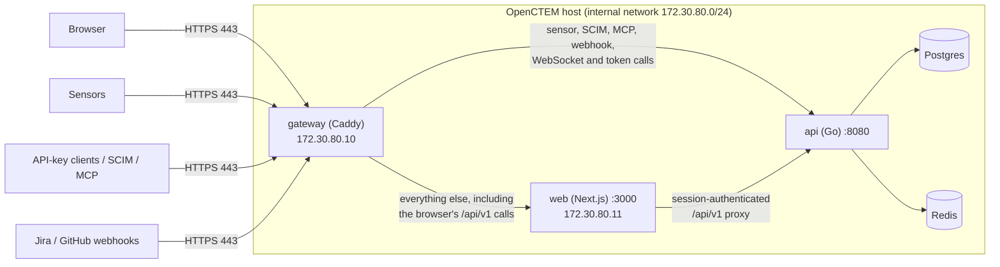

# Exposing OpenCTEM: one HTTPS port
{: .no_toc }

OpenCTEM ships a built-in gateway so a server exposes exactly **one port: 443
(HTTPS)**. Browsers, sensors, API-key clients, SCIM provisioning, MCP clients and
incoming Jira/GitHub webhooks all use the same address, `https://<host>`. The web
UI, the API, Postgres and Redis are never published.

1. TOC
{:toc}

---

## Why one port

Before the gateway, a typical install published the web UI (`:80` or `:3000`)
**and** the API (`:8080`), often with a hand-made TLS proxy on `:8443` in front
of the API. That meant two URLs to explain, two ports to open in every firewall
between sensors and the server, TLS on only one of them, and the API's internal
ports (gRPC/metrics `:9090`, the Delve debugger `:2345` in dev images) published
by accident.

With the gateway:

- **One address.** `https://<host>` serves the UI and the REST API, like
  Tenable.sc. Sensors use the same URL as browsers.
- **One firewall rule.** Inbound TCP 443 only.
- **TLS everywhere**, with four modes: an internal CA (works for bare IP
  addresses), Let's Encrypt, your own certificate, or plain HTTP behind a TLS
  proxy you already run.
- **No CORS.** The UI, the API and the WebSocket share one origin.
- **Internal endpoints stay internal.** `/metrics`, `/ready` and `/debug/*`
  answer 404 at the gateway.

## Architecture



The gateway is [Caddy](https://caddyserver.com/) with a fixed configuration. Its
files live in the `deploy/` directory of the
[api repository](https://github.com/openctemio/api/tree/develop/deploy):

| File | Purpose |
|------|---------|
| `docker-compose.yml` | The production stack. Only `gateway` publishes a port. |
| `docker-compose.http-redirect.yml` | Overlay: also publish `:80` (HTTP to HTTPS redirect, ACME HTTP-01). For `acme` mode. |
| `docker-compose.plain-http.yml` | Overlay: plain HTTP on `127.0.0.1:8081` for `http` mode behind your own TLS proxy. |
| `.env.example` | Settings template. Copy to `.env`. |
| `gateway/Caddyfile` | Routing, headers, limits, access log. |
| `gateway/modes/<mode>.global`, `<mode>.site` | One pair per TLS mode, selected by `OPENCTEM_TLS_MODE`. |
| `gateway/entrypoint.sh` | Validates the settings, exports the internal CA certificate, starts Caddy. |

The compose file mounts the whole `./gateway` **directory** into the container,
not single files, so edits to the Caddyfile are seen after a restart (a
single-file bind mount keeps the old inode when an editor replaces the file).

### Kubernetes (Helm)

The Helm chart (version 0.7.0 and later) provides the same model: an Ingress
with the same path rules, plus an optional bundled-Caddy mode for clusters
without an ingress controller. See the
[chart README](https://github.com/openctemio/helm-charts/tree/main/charts/openctem#readme)
for its values. The routing table, sensor settings and troubleshooting on this
page apply to both.

---

## Quick start (Docker Compose)

Requirements: Docker Engine 24+ with Compose v2, port 443 free on the host, and
the DNS name or IP address clients will use.

```bash
git clone https://github.com/openctemio/api.git
cd api/deploy
cp .env.example .env
```

Edit `.env`. The minimum:

```bash
OPENCTEM_VERSION=v0.9.0                  # api/ui image tag
OPENCTEM_HOSTNAME=ctem.example.com       # DNS name or IP clients use
OPENCTEM_PUBLIC_URL=https://ctem.example.com
OPENCTEM_TLS_MODE=internal               # internal | acme | files | http

# Generate each value and paste it in (.env does not run commands):
DB_PASSWORD=...                          # openssl rand -hex 24
REDIS_PASSWORD=...                       # openssl rand -hex 24 (32+ characters required)
AUTH_JWT_SECRET=...                      # openssl rand -hex 64
APP_ENCRYPTION_KEY=...                   # openssl rand -hex 32
CSRF_SECRET=...                          # openssl rand -hex 32
```

Start it and check:

```bash
docker compose up -d
docker compose ps                        # gateway, web, api, postgres, redis up;
                                         # datastore-tls and migrate exited 0
curl --cacert ca/openctem-root-ca.crt https://ctem.example.com/health
```

Then [create the first administrator and organization](../guides/getting-started.md#2-first-time-setup)
with `docker compose exec api /app/bootstrap-admin …` and sign in at
`https://ctem.example.com/login`.

### Postgres and Redis

The API runs with `APP_ENV=production`, which refuses a database or Redis
connection without TLS and a Redis password shorter than 32 characters. The
compose file therefore encrypts the internal network too:

- A one-shot `datastore-tls` job (the `postgres` image, used for its `openssl`)
  creates a private CA and a server certificate in the `datastore-tls` volume,
  and renews the certificate when it is within 30 days of expiry.
- Postgres runs with `ssl=on`; the API and `migrate` connect with
  `DB_SSLMODE=require`.
- Redis listens on TLS only (port 6379); the API uses `REDIS_TLS_ENABLED=true`
  and verifies it against `REDIS_TLS_CA_FILE=/datastore-tls/ca.crt`.

To use managed Postgres or Redis instead, set `DB_HOST` / `REDIS_HOST` (and
`REDIS_TLS_CA_FILE` if their CA is not public) in `.env`, and remove the bundled
`postgres`, `redis` and `datastore-tls` services, with the `depends_on` entries
that point at them, from your copy of `docker-compose.yml`.

### Settings reference

| Variable | Default | Meaning |
|----------|---------|---------|
| `OPENCTEM_HOSTNAME` | *(required)* | DNS name or IP address clients connect to. The certificate is issued for it. |
| `OPENCTEM_PUBLIC_URL` | *(required)* | The exact origin browsers see, e.g. `https://ctem.example.com`. Include the port if it is not 443: `https://192.168.1.10:8443`. Used for `CORS_ALLOWED_ORIGINS` (the WebSocket Origin check), `APP_URL` (SAML service-provider URLs) and links in emails (`SMTP_BASE_URL`). |
| `OPENCTEM_TLS_MODE` | `internal` | `internal`, `acme`, `files` or `http`. See [TLS modes](#tls-modes). |
| `GATEWAY_HTTPS_PORT` | `443` | Published HTTPS port. |
| `GATEWAY_BIND` | `0.0.0.0` | Interface the port is published on. |
| `GATEWAY_HTTP_PORT` | `80` (redirect overlay), `8081` (plain-HTTP overlay) | Port used by the overlays. |
| `GATEWAY_MAX_BODY_SIZE` | `256MB` | Largest request body the gateway accepts. |
| `ACME_EMAIL` | *(empty)* | Let's Encrypt account contact. Required for `acme`. |
| `TLS_CERT_DIR` | `./certs` | Directory mounted at `/certs` for `files` mode. |
| `TLS_CERT_FILE` / `TLS_KEY_FILE` | `tls.crt` / `tls.key` | File names inside `TLS_CERT_DIR`. |
| `OPENCTEM_CA_EXPORT_DIR` | `./ca` | Where the internal CA's root certificate is exported. |
| `OPENCTEM_ALLOW_PLAIN_HTTP` | `false` | Must be `true` for `http` mode. |
| `OPENCTEM_TRUSTED_PROXIES` | *(empty: none)* | Space-separated CIDRs of proxies in front of the gateway whose `X-Forwarded-For` is believed. |
| `OPENCTEM_NET_PREFIX` | `172.30.80` | First three octets of the internal `/24`. Change it if it overlaps a network on the host. |
| `CADDY_VERSION` | `2.11.4-alpine` | Gateway image tag. |
| `APP_ENV` | `production` | API environment. Production enforces TLS to Postgres and Redis. |
| `DB_SSLMODE` | `require` | Postgres TLS mode for the API and migrations. |
| `REDIS_TLS_ENABLED` / `REDIS_TLS_CA_FILE` | `true` / `/datastore-tls/ca.crt` | Redis TLS for the API. |

### Reference: gateway container environment

The gateway's `entrypoint.sh` and `Caddyfile` are portable (the same files are
meant to run in an image that bundles the API, the web UI and Caddy). Inside the
container they read:

| Variable | Default | Meaning |
|----------|---------|---------|
| `OPENCTEM_GATEWAY_DIR` | `/etc/caddy` | Directory with `Caddyfile` and `modes/`. |
| `OPENCTEM_CA_EXPORT_DIR` | `/ca` | Where the internal root CA is copied. Export is skipped if the directory does not exist. (In compose, the same name sets the **host** directory mounted there.) |
| `OPENCTEM_CERT_DIR` | `/certs` | Certificate directory for `files` mode. |
| `XDG_DATA_HOME` | `/data` | Caddy's storage: certificates, ACME account, internal CA. |
| `OPENCTEM_API_UPSTREAM` | `api:8080` | API address. |
| `OPENCTEM_WEB_UPSTREAM` | `web:3000` | Web UI address. |
| `OPENCTEM_TLS_MODE`, `OPENCTEM_HOSTNAME`, `ACME_EMAIL`, `TLS_CERT_FILE`, `TLS_KEY_FILE`, `OPENCTEM_ALLOW_PLAIN_HTTP`, `OPENCTEM_TRUSTED_PROXIES`, `GATEWAY_MAX_BODY_SIZE` | as above | Passed through from `.env`. |

Arguments given to the entrypoint replace the final `caddy run` (for a process
supervisor that starts Caddy itself); the checks and the CA export still run.

---

## Routing

The gateway decides by **path** first, then by **credential**:

| Request | Goes to |
|---------|---------|
| `/api/v1/agent/*`, `/api/v2/sensor/*`, `/api/v1/platform/*` | API (sensors) |
| `/scim/v2/*` | API (SCIM provisioning) |
| `/api/v1/mcp`, `/api/v1/mcp/*` | API (MCP, `oct_` key) |
| `/api/v1/webhooks/incoming/*` | API (Jira/GitHub webhooks, HMAC-signed) |
| `/api/v1/auth/saml/*` | API (SAML metadata, SP login redirect, ACS form POST from the IdP) |
| `/api/v1/auth/backchannel-logout` | API (OIDC back-channel logout from the IdP) |
| `/api/v1/ws` | API (browser WebSocket, single-use ticket) |
| `/health`, `/openapi.yaml`, `/docs` | API (liveness, API reference) |
| `/api/*` with `Authorization: Bearer oct_…` or an `X-API-Key` header | API (API-key clients) |
| `/api/*` with `Authorization: Bearer …` and **no** `auth_token` session cookie | API (other token clients) |
| `/metrics`, `/metrics/*`, `/ready`, `/debug/*` | **Blocked: 404** |
| Everything else, including the browser's cookie-session calls to `/api/v1/*` | Web UI |

**Why the credential split.** The web UI's `/api/v1` proxy authenticates with
the browser's session cookie and drops the caller's `Authorization` header (and
answers sensor paths with `421 WRONG_ENDPOINT`). A token client sent there would
get 401. A browser always carries the session cookie, so "Bearer token and no
session cookie" is never a browser call and is sent straight to the API. The
SAML and back-channel logout paths go to the API for a similar reason: the web
proxy follows redirects and rewrites the `Content-Type` to JSON, which breaks the
SAML redirect, the IdP's ACS form POST and the logout notification.

{: .note }
A script that sends a Bearer token **and** an `auth_token` cookie is routed to
the web UI and its token is ignored. Send one or the other.

The API's own ports are never published: `8080` (HTTP), `9090` (gRPC and
metrics) and `2345` (Delve, development images only). Neither is the web UI's
`3000`, Postgres or Redis.

---

## TLS modes

Set `OPENCTEM_TLS_MODE` in `.env`, then `docker compose up -d`. The entrypoint
checks the settings first and exits with a clear message (exit code 64) if
something is missing.

### `internal` (default): the gateway's own CA

For LAN installs, air-gapped sites and bare IP addresses. The gateway creates a
private CA named **OpenCTEM Internal CA** and issues a certificate for
`OPENCTEM_HOSTNAME`.

```bash
OPENCTEM_HOSTNAME=192.168.1.10           # or a DNS name
OPENCTEM_PUBLIC_URL=https://192.168.1.10
OPENCTEM_TLS_MODE=internal
```

- **Works with IP addresses.** Clients that connect to an IP send no SNI; the
  gateway sets `default_sni` so they still get the right certificate.
- **The root certificate is exported** to `./ca/openctem-root-ca.crt`, mode
  `0644` (Caddy's own copy under `/data` is `0600` and unreadable to others). It
  is refreshed if the CA ever changes. Give this file to sensors and, if you
  like, to browsers. See [Trusting the internal CA](#trusting-the-internal-ca).
- **Keep the `gateway-data` volume.** It holds the CA's private key. If it is
  lost the gateway creates a new CA, and every sensor and browser must be given
  the new root. Include it in backups and never run `docker compose down -v`.
  Leaf and intermediate certificates are short-lived and renewed automatically;
  the root is long-lived.

Check the fingerprint you distribute:

```bash
openssl x509 -in ca/openctem-root-ca.crt -noout -subject -fingerprint -sha256
```

Browsers show a certificate warning until the root is imported into the OS or
browser trust store (or the user accepts the warning).

### `acme`: Let's Encrypt

For a public DNS name that resolves to this host and is reachable from the
internet on port 443.

```bash
OPENCTEM_HOSTNAME=ctem.example.com
OPENCTEM_PUBLIC_URL=https://ctem.example.com
OPENCTEM_TLS_MODE=acme
ACME_EMAIL=ops@example.com
```

Port 443 alone is enough: the certificate is obtained with the TLS-ALPN-01
challenge. To also publish port 80 (HTTP to HTTPS redirect and the HTTP-01
challenge), add the redirect overlay:

```bash
docker compose -f docker-compose.yml -f docker-compose.http-redirect.yml up -d
```

Certificates and the ACME account are stored in the `gateway-data` volume and
renewed automatically. Sensors need no extra trust configuration.

### `files`: your own certificate

For a certificate from your corporate CA or a commercial CA.

```bash
OPENCTEM_HOSTNAME=ctem.corp.example
OPENCTEM_PUBLIC_URL=https://ctem.corp.example
OPENCTEM_TLS_MODE=files
# optional overrides:
# TLS_CERT_DIR=/etc/openctem/tls
# TLS_CERT_FILE=ctem.crt
# TLS_KEY_FILE=ctem.key
```

Put the files in `./certs` (or `TLS_CERT_DIR`):

- `tls.crt`: PEM, **full chain**, leaf first, valid for `OPENCTEM_HOSTNAME`.
- `tls.key`: PEM private key.

The directory is mounted read-only at `/certs`. After replacing the files, run
`docker compose restart gateway`. If the issuing CA is private, sensors must
trust it the same way as the internal CA (see below), using your CA certificate.

### `http`: behind your own TLS proxy

Only when an existing proxy or load balancer already terminates TLS for
browsers and sensors. The gateway then speaks plain HTTP and still does all the
routing.

```bash
OPENCTEM_TLS_MODE=http
OPENCTEM_ALLOW_PLAIN_HTTP=true
OPENCTEM_HOSTNAME=ctem.example.com        # still set it; the compose file requires it
OPENCTEM_PUBLIC_URL=https://ctem.example.com
OPENCTEM_TRUSTED_PROXIES=172.30.80.1/32   # your proxy's address or CIDR, see below
```

```bash
docker compose -f docker-compose.yml -f docker-compose.plain-http.yml up -d
```

- The overlay replaces the HTTPS port with `127.0.0.1:8081` (change with
  `GATEWAY_BIND` / `GATEWAY_HTTP_PORT`). Bind it only to the interface your
  proxy uses.
- The entrypoint **refuses to start** unless `OPENCTEM_ALLOW_PLAIN_HTTP=true`,
  and logs a warning on every start in this mode.
- No HSTS is added; your proxy owns TLS and should set it.
- Set `OPENCTEM_TRUSTED_PROXIES` so client IP addresses survive. A proxy on the
  same host reaches the published port through Docker, so the gateway usually
  sees the Docker network's gateway address (`172.30.80.1` with the default
  prefix). Confirm with the `remote_ip` in `docker compose logs gateway`. If it
  is not set, the entrypoint warns and the audit log records the proxy's address
  for every request.

Your proxy must forward **everything** for the host to the gateway (do not split
paths yourself), keep the `Host` header, pass `X-Forwarded-For` and
`X-Forwarded-Proto`, allow WebSocket upgrades, and not buffer or time out long
requests. An nginx example:

```nginx
server {
    listen 443 ssl http2;
    server_name ctem.example.com;
    ssl_certificate     /etc/nginx/tls/fullchain.pem;
    ssl_certificate_key /etc/nginx/tls/privkey.pem;

    client_max_body_size 256m;
    proxy_request_buffering off;
    proxy_buffering off;
    proxy_read_timeout 1h;

    location / {
        proxy_pass http://127.0.0.1:8081;
        proxy_http_version 1.1;
        proxy_set_header Host $host;
        proxy_set_header X-Forwarded-For $proxy_add_x_forwarded_for;
        proxy_set_header X-Forwarded-Proto https;
        proxy_set_header Upgrade $http_upgrade;
        proxy_set_header Connection $connection_upgrade;
    }
}

# in the http {} block:
map $http_upgrade $connection_upgrade { default upgrade; '' close; }
```

---

## Connecting sensors

A sensor's `API_URL` (or `-api-url`) is the **single gateway URL**, with no port
and no path:

```bash
API_URL=https://ctem.example.com          # not :8080, not :3000, not /api
```

Sensors keep their API keys; only the URL changes. With `acme`, or `files` with
a publicly trusted certificate, nothing else is needed. With `internal` (or a
private CA in `files` mode) the sensor must trust the root certificate.

### Trusting the internal CA

Copy `ca/openctem-root-ca.crt` from the server to each sensor host and check
its fingerprint (see [`internal`](#internal-default-the-gateways-own-ca)).
Then use **one** of:

| Option | Effect | When |
|--------|--------|------|
| `SSL_CERT_DIR=<dir containing the .crt>` | **Adds** the certificates in that directory to the system roots. | Recommended. Scanners keep trusting public CAs for templates, feeds and targets. |
| `SSL_CERT_FILE=<path to the .crt>` | **Replaces** the system CA bundle with this one file. | Only if the sensor must trust nothing else. Template and feed downloads from public sites then fail. |
| Install into the OS trust store | Everything on the host trusts it. | Binary installs where that is acceptable. |

**Docker:**

```bash
docker run -d --name openctem-sensor --restart unless-stopped \
  -v /opt/openctem/ca:/etc/openctem/ca:ro \
  -e SSL_CERT_DIR=/etc/openctem/ca \
  -e API_URL=https://ctem.example.com \
  -e API_KEY=<sensor-api-key> \
  ghcr.io/openctemio/agent:latest \
  -daemon -enable-commands -tools nuclei,trivy
```

`/opt/openctem/ca` on the sensor host holds `openctem-root-ca.crt`.

**Binary under systemd** (`/etc/systemd/system/openctem-sensor.service`):

```ini
[Service]
Environment=API_URL=https://ctem.example.com
Environment=API_KEY=<sensor-api-key>
Environment=SSL_CERT_DIR=/etc/openctem/ca
ExecStart=/usr/local/bin/agent -daemon -enable-commands -tools nuclei,trivy
Restart=always
```

```bash
sudo install -d /etc/openctem/ca
sudo install -m 0644 openctem-root-ca.crt /etc/openctem/ca/
sudo systemctl daemon-reload && sudo systemctl restart openctem-sensor
```

Or, to trust it host-wide on Debian/Ubuntu instead:

```bash
sudo cp openctem-root-ca.crt /usr/local/share/ca-certificates/
sudo update-ca-certificates
```

Test from the sensor host before starting the sensor:

```bash
curl --cacert /etc/openctem/ca/openctem-root-ca.crt https://ctem.example.com/health
```

### API-key clients, SCIM, MCP and webhooks

Everything uses the same origin:

| Client | Base URL |
|--------|----------|
| REST API with an `oct_` key (`Authorization: Bearer oct_…` or `X-API-Key`) | `https://ctem.example.com/api/v1/...` |
| SCIM 2.0 (Entra ID, Okta, ...) | `https://ctem.example.com/scim/v2` |
| MCP | `https://ctem.example.com/api/v1/mcp` |
| Jira / GitHub incoming webhooks | `https://ctem.example.com/api/v1/webhooks/incoming/...` (same path as before) |
| SAML (SP metadata, ACS) | `https://ctem.example.com/api/v1/auth/saml/...` |
| OIDC back-channel logout | `https://ctem.example.com/api/v1/auth/backchannel-logout` |
| API reference | `https://ctem.example.com/docs`, `https://ctem.example.com/openapi.yaml` |
| Browser WebSocket | `wss://ctem.example.com/api/v1/ws` (automatic; leave `NEXT_PUBLIC_WS_BASE_URL` unset) |

Clients on other machines need the same CA trust as sensors in `internal` mode
(`curl --cacert ...`, `SSL_CERT_DIR`, `NODE_EXTRA_CA_CERTS` for Node.js,
`REQUESTS_CA_BUNDLE` for Python requests).

---

## Client IP addresses and trusted proxies

The API's audit log, rate limits and IP allowlists need the real client address.

- The gateway **overwrites** `X-Real-IP` and `X-Forwarded-For` with the address
  it saw; a client cannot choose its own.
- The API trusts these headers only from the gateway (`.10`) and the web UI
  (`.11`) on the fixed internal `/24` (`OPENCTEM_NET_PREFIX`, default
  `172.30.80`), via `SERVER_TRUSTED_PROXIES`. Anything else is recorded as its
  own TCP peer.
- The web UI runs with `TRUST_PROXY_HEADERS=true` so the browser's address
  reaches the API through its proxy. This is safe only because the web
  container is not published.
- If a load balancer or proxy sits in front of the gateway, list it in
  `OPENCTEM_TRUSTED_PROXIES` (space-separated CIDRs). By default nothing in
  front is trusted.

Because all of this is one origin, there is no CORS configuration to maintain.
`CORS_ALLOWED_ORIGINS` is still set to `OPENCTEM_PUBLIC_URL`, because the API
checks the WebSocket `Origin` against it. The compose file also sets the API's
`APP_URL` (SAML service-provider URLs) and `SMTP_BASE_URL` (links in emails)
to `OPENCTEM_PUBLIC_URL`, so the URLs the API generates use the public origin.

---

## Limits, streaming and headers

- **Request bodies** up to `GATEWAY_MAX_BODY_SIZE` (default `256MB`, above the
  API's largest per-route limit of 200 MB for asset import). The API enforces
  the real per-route limits. Bodies are streamed, not buffered.
- **Responses** are flushed immediately (long polls, server-sent events,
  streaming). There are no proxy timeouts.
- **Protocols:** HTTP/1.1 and HTTP/2. No HTTP/3 (no UDP listener).
- **Headers:**
  - `Strict-Transport-Security: max-age=31536000` in the TLS modes (`internal`,
    `acme`, `files`).
  - `X-Content-Type-Options: nosniff`, `X-Frame-Options: DENY` and
    `Referrer-Policy: strict-origin-when-cross-origin` as **defaults only**. The
    web UI's own CSP and frame headers win.
  - The `Server` header is removed.

---

## Health checks

| Endpoint | Where | Use |
|----------|-------|-----|
| `https://<host>/health` | Public | Liveness for load balancers and uptime checks. |
| `/ready` | Internal only (404 at the gateway) | Readiness detail (database, Redis). |
| `/metrics` | Internal only (404 at the gateway) | Prometheus metrics. |

Reach the internal endpoints from inside the Docker network:

```bash
docker compose exec api wget -qO- localhost:8080/ready
docker compose exec api wget -qO- localhost:8080/metrics | head
```

A Prometheus server must run on the same Docker network (or the cluster
network on Kubernetes) to scrape `api:8080/metrics`. See the
[Monitoring Guide](MONITORING.md).

The gateway container's own healthcheck queries Caddy's admin API, which
listens on `localhost:2019` inside the container only.

---

## Logs

```bash
docker compose logs -f gateway
```

- One readable console line per request on stdout (not JSON), plus Caddy's
  runtime log.
- Secrets are removed: `Authorization` and `Cookie` are redacted by Caddy; the
  `X-API-Key`, `X-Sensor-Api-Key` and `X-CSRF-Token` headers are deleted; the
  WebSocket `ticket` query value is replaced with `REDACTED`.
- Every service uses Docker log rotation: 50 MB per file, 5 files.

---

## Troubleshooting

| Symptom | Cause | Fix |
|---------|-------|-----|
| Sensor gets `421 WRONG_ENDPOINT` (older UI: `401 API key required`, reported as an invalid key) | The sensor's `API_URL` points at the old web UI port (`:80`, `:3000`), bypassing the gateway. | Set `API_URL=https://<host>`. Through the gateway, sensor paths always reach the API. |
| Sensor or client: `x509: certificate signed by unknown authority` | `internal` mode (or a private CA) and the client does not trust the root. | [Trust the internal CA](#trusting-the-internal-ca) (`SSL_CERT_DIR`). |
| `x509: certificate is valid for X, not Y` | The client uses a name or IP other than `OPENCTEM_HOSTNAME`. | Use the same address everywhere, or change `OPENCTEM_HOSTNAME` and restart the gateway. |
| UI loads but live updates never connect; API logs a rejected WebSocket origin | `OPENCTEM_PUBLIC_URL` does not match what the browser shows, including the port (e.g. `https://host` while the browser is on `https://host:8443`). | Set `OPENCTEM_PUBLIC_URL` to the exact origin, then `docker compose up -d`. |
| Gateway fails: `bind: address already in use` on 443 | Another service (an old nginx, the old TLS proxy) holds the port. | `sudo ss -ltnp 'sport = :443'`, stop it; or set `GATEWAY_HTTPS_PORT=8443` **and** add `:8443` to `OPENCTEM_PUBLIC_URL`. |
| Gateway exits with `openctem-gateway: ...` | The entrypoint found a missing setting (`ACME_EMAIL`, certificate file, `OPENCTEM_ALLOW_PLAIN_HTTP`, unknown mode). | Read the message; it names the variable. |
| `./ca/openctem-root-ca.crt` is missing | Not `internal` mode, or the CA was not created within 120 s. | `docker compose logs gateway`; restart the gateway. |
| `Pool overlaps with other one on this space` | The internal `/24` collides with another Docker or host network. | Set `OPENCTEM_NET_PREFIX` to a free prefix (e.g. `172.31.90`). |
| A script with a Bearer token gets 401 | It also sends the `auth_token` cookie, so the gateway routes it to the web UI. | Do not send the session cookie with a token. |
| `413` on a large upload | Body larger than `GATEWAY_MAX_BODY_SIZE` (or the API's per-route limit). | Raise `GATEWAY_MAX_BODY_SIZE` if the API's limit allows it. |
| Audit log shows the proxy's IP for every request | `http` mode or a load balancer in front, without `OPENCTEM_TRUSTED_PROXIES`. | Set it to the proxy's CIDR. |

---

## Migrating from the two-port setup

Applies to installs that publish the web UI (`:80` or `:3000`) and the API
(`:8080`), with or without a hand-made TLS proxy on `:8443`. Plan a short
maintenance window: the UI and API restart once.

### 1. Inventory and back up

- List everything that uses the old URLs: sensors (`API_URL`), API-key scripts
  and CI jobs, the SCIM base URL configured at your IdP, MCP clients, webhook
  URLs in Jira and GitHub, SSO redirect URIs, monitoring checks.
- Back up the database ([Backup & Restore](backup-restore.md)) and the old
  compose file and `.env`.

### 2. Deploy the gateway stack on the same data

1. Get `deploy/` (see [Quick start](#quick-start-docker-compose)) and copy the
   **existing** secrets into the new `.env`: `DB_PASSWORD`, `REDIS_PASSWORD`,
   `AUTH_JWT_SECRET`, `APP_ENCRYPTION_KEY`, `CSRF_SECRET`. A new
   `APP_ENCRYPTION_KEY` makes stored integration credentials unreadable. If the
   old `REDIS_PASSWORD` is shorter than 32 characters, generate a new one (Redis
   takes it at start, nothing else stores it).
2. Make sure the new stack uses the **existing Postgres data**. The new compose
   project is named `openctem`, so its volume is `openctem_postgres-data`. If
   `docker volume ls` shows the old data under another name, point the new
   stack at it with a `docker-compose.override.yml` next to
   `docker-compose.yml`:

   ```yaml
   volumes:
     postgres-data:
       external: true
       name: <old-project>_postgres_data   # from docker volume ls
   ```

   Or restore the backup into the new stack. Starting on an empty volume gives
   an empty installation. The existing data works unchanged with the new
   Postgres TLS settings (they are server flags, not stored in the data).
3. Stop the old stack **without** removing volumes (`docker compose down`, never
   `down -v`), including any old TLS proxy that holds port 443.
4. Start the new one: `docker compose up -d` (add the overlay for your TLS
   mode).
5. Verify: `curl https://<host>/health`, log in from a browser, and check that
   live updates (WebSocket) connect.

### 3. Repoint sensors

Set each sensor's `API_URL` to `https://<host>` (no `:8080`, no `:8443`) and,
for `internal` mode, [trust the CA](#trusting-the-internal-ca). Sensors keep
their API keys. Restart them and confirm each one's last-seen time updates in
the UI.

### 4. Update other clients

- API-key clients and CI jobs: base URL `https://<host>`.
- SCIM: change the tenant URL at your IdP to `https://<host>/scim/v2`.
- MCP clients: `https://<host>/api/v1/mcp`.
- Jira and GitHub webhooks: change scheme, host and port to `https://<host>`;
  the path is unchanged.
- SSO: if the origin users see changed (e.g. from `http://host:3000`), update
  what is registered at your IdP: OIDC redirect URIs, the SAML metadata and ACS
  URLs (`https://<host>/api/v1/auth/saml/...`) and the back-channel logout URL
  (`https://<host>/api/v1/auth/backchannel-logout`). All are on the single
  origin.

### 5. Close the old ports

The new compose file publishes only the gateway. Remove any leftover port
publications from your own overrides (`8080`, `9090`, `2345`, `3000`, `80`,
`8443`) and close them in the host and network firewalls, leaving inbound TCP
443 (plus 80 if you use the redirect overlay):

```bash
sudo ss -ltnp | grep -E ':(80|3000|8080|8443|9090|2345)\b'   # expect nothing
sudo ufw allow 443/tcp
sudo ufw delete allow 8080/tcp      # repeat for 3000, 8443, 9090, 2345
```

{: .warning }
Docker publishes ports through its own iptables rules, which bypass `ufw`. A
port that is still published in a compose file stays reachable even after a
`ufw` rule removes it. Removing the publication is what closes it.

### Rollback

1. `docker compose down` in the new `deploy/` directory (no `-v`: the
   `gateway-data` volume holds the internal CA and certificates, the database
   volume your data).
2. Start the old stack with its saved compose file and `.env`.
3. Point sensors and clients back at the old URLs. Their keys did not change.

Both stacks use the same database, and the gateway does not change any data, so
rolling back loses nothing except requests made during the switch.
