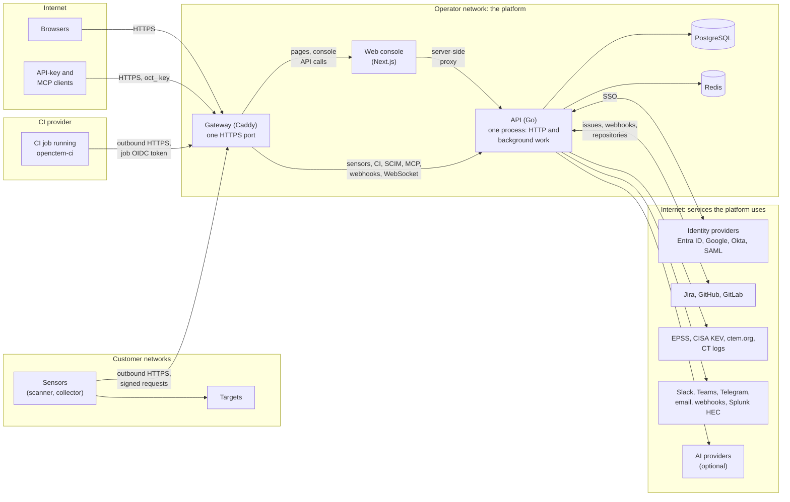
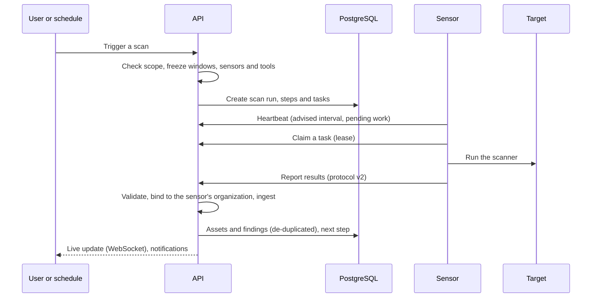
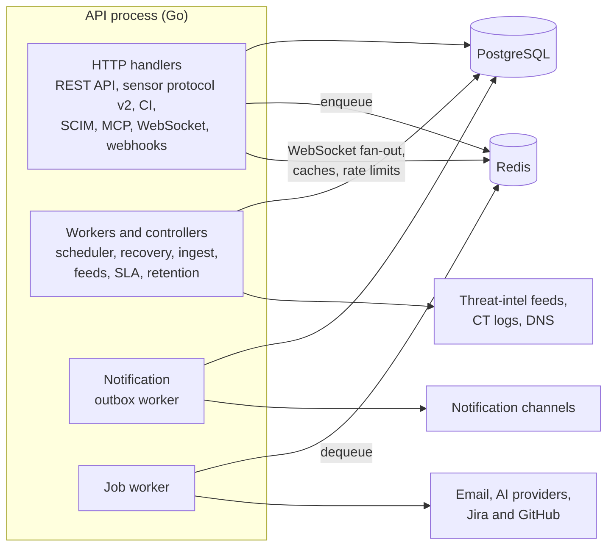
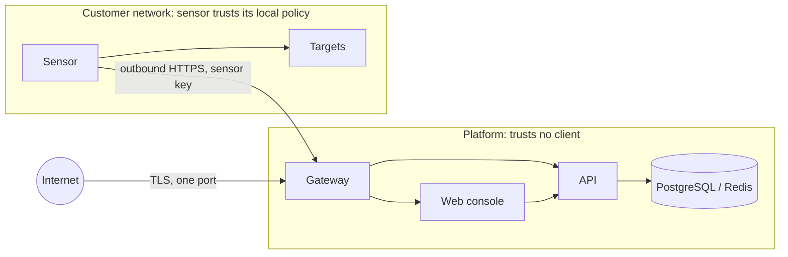

# Architecture
{: .no_toc }

The components of an OpenCTEM installation, how data moves between them, how
organizations are kept apart, and where the trust boundaries are. Engineering
detail for each part is in
[api/docs/architecture](https://github.com/openctemio/openctem/tree/develop/api/docs/architecture)
in the openctem repository.

1. TOC
{:toc}

---

## Components

The subgraphs are the trust boundaries. The platform runs in the operator's
network and accepts connections only through the gateway. Sensors run in the
networks they scan and only connect out. CI jobs run at the CI provider and
prove who they are with the provider's OIDC token. The platform never opens a
connection to a sensor or a CI job, and never sends probes to targets itself.

| Component | What it does | Code |
|---|---|---|
| Gateway | The single public entry point. Terminates TLS (four modes) and routes each request to the API or the web console by path and credential. | [`api/deploy/gateway`](https://github.com/openctemio/openctem/tree/develop/api/deploy/gateway) |
| Web console | The user interface and the admin console. Serves pages and proxies the browser's API calls (authenticated by the session cookie) to the API on the server side. The browser's WebSocket goes from the gateway straight to the API. Holds no state of its own. | [`web/`](https://github.com/openctemio/openctem/tree/develop/web) |
| API | All business logic: the REST API, the sensor protocol, ingest of scan results, the WebSocket for live updates, and the background work (see [Background work](#background-work)). One long-running process; `bootstrap-admin` and the maintenance commands are separate one-shot binaries. | [`api/`](https://github.com/openctemio/openctem/tree/develop/api) |
| PostgreSQL | The system of record for every organization's data, the audit logs and the job queues that must survive a restart. | |
| Redis | Caches, permission versions, rate-limit state, the background job queue and the WebSocket fan-out. Not a system of record. | |
| Sensors | Run scans close to the targets. Connect outbound to the gateway, claim tasks, run the scanners, report results. Released separately. | [openctemio/sensor](https://github.com/openctemio/sensor), [openctemio/sdk-go](https://github.com/openctemio/sdk-go) |
| CI runner | `openctem-ci` runs one scan capability in a CI job and uploads the result with the job's OIDC identity. | [openctemio/ci](https://github.com/openctemio/ci) |

The API is a single Go binary organised in layers (domain, application services,
infrastructure adapters) per bounded context; see
[clean-arch.md](https://github.com/openctemio/openctem/blob/develop/api/docs/architecture/clean-arch.md)
and
[project-structure.md](https://github.com/openctemio/openctem/blob/develop/api/docs/architecture/project-structure.md).

## Data flow

### A scan, end to end

- Sensors only connect out. The platform never opens a connection to a sensor;
  work waits in a queue until a sensor with the right tools, in the right scan
  zone, claims it.
- A claimed task has a lease that every heartbeat renews. A sensor that
  disappears loses its lease, and the task goes back to the queue.
- Results are validated, capped and bound to the organization of the sensor's
  key, never to anything the report says about itself. Sensor results are
  stored first and applied by the background ingest worker.

Details: [scan-lifecycle.md](https://github.com/openctemio/openctem/blob/develop/api/docs/architecture/scan-lifecycle.md),
[scan-orchestration.md](https://github.com/openctemio/openctem/blob/develop/api/docs/architecture/scan-orchestration.md),
[sensors.md](https://github.com/openctemio/openctem/blob/develop/api/docs/architecture/sensors.md).

### Other inputs

| Input | Path |
|---|---|
| CI pipelines | `openctem-ci` exchanges the job's OIDC token for a short-lived run token and uploads CTIS or SARIF. |
| Imports | Files from other scanners (Nessus, Qualys, SARIF, trivy, nuclei, ZAP and others) uploaded in the console or the API. |
| Connectors and integrations | SCM repositories (GitHub, GitLab), Tenable.sc, DefectDojo, Entra ID identity exposures, SIEM. |
| Discovery jobs | Certificate Transparency logs and DNS checks of each organization's own domains, run by the API. |
| Threat intelligence | EPSS scores and the CISA KEV catalog, refreshed daily, used in prioritization. |

### Outputs

Notifications are written to an outbox in the same transaction as the change
that caused them and delivered by a background worker to Slack, Teams,
Telegram, email, webhooks or Splunk HTTP Event Collector. Jira and GitHub
issues are created and synchronised both ways.
Reports are rendered and emailed on schedules. The REST API and the read-only MCP
server serve the data to other tools.

## Background work

The API process also runs the platform's background work; there is no
separate worker process. Most of it is driven by PostgreSQL (leases and
`SKIP LOCKED` queues); only the job worker uses a Redis queue. Run one API
instance (see [Scaling](../operations/scaling.md)). The main jobs:

| Work | What it does | Every |
|---|---|---|
| Scan scheduler | Starts the scans whose schedule is due | 1 minute |
| Scan timeout, retry and stalled-run repair | Enforces run deadlines, retries failed runs with a backoff, repairs runs that stopped advancing | 1 minute |
| Command recovery | Returns tasks whose sensor lease expired to the queue; fails tasks that keep failing | 1 minute |
| Command expiration | Expires tasks no sensor claimed in time | 1 minute |
| Sensor health | Marks sensors whose heartbeats stopped as offline and notifies | 30 seconds |
| Ingest worker | Applies queued results (sensor reports, and API ingest with `INGEST_MODE=async`) | 2 seconds |
| Notification outbox | Delivers notifications written in the same transaction as their cause | 5 seconds |
| Job worker (Redis queue) | Email, AI triage, Jira and GitHub status sync | on demand |
| Threat intelligence | EPSS and CISA KEV refresh, then escalates findings on known-exploited CVEs | 24 hours |
| Certificate Transparency and DNS checks | Attack surface monitoring of each organization's domains | per organization, 24 hours by default |
| SLA escalation | Warns before and on SLA breaches | 15 minutes |
| Retest scheduler, report scheduler | Continuous retests; scheduled reports by email | 1 minute |
| Approval and access expiry | Expires risk acceptances (the finding reopens), memberships and scope exclusions past their end | 1 minute to 1 hour |
| SSO domain re-verification | Re-checks the DNS proof of SSO domains | 12 hours |
| Retention | Purges old sessions, notifications, task logs, heartbeats, evidence and deleted assets per their retention | 1 to 24 hours |

## Tenancy and isolation

An **organization** (a tenant in the code) owns all of its data: assets,
findings, scans, sensors, integrations, users' memberships and audit log.

- **Every organization-owned table carries `tenant_id`, and every query
  filters on it** (child rows such as the steps of a scan workflow belong to a
  parent row that carries it). The
  organization comes from the authenticated credential: the session's selected
  organization, the organization of an API key, or the organization of a sensor
  key. A request body or a report never chooses it.
- **Caches are keyed by organization**, and permission changes take effect on
  the next request.
- **Credentials are per organization**: each organization's integrations and
  identity providers use their own secrets, encrypted with `APP_ENCRYPTION_KEY`.
- **Inside an organization**, roles decide what a user can do and access groups
  decide which assets (and their findings) a member can see. A member in no
  group sees no assets.
- **Platform administrators** are separate accounts that belong to no
  organization. They create organizations and run platform sensors from the
  admin console, and cannot read organization data.
- **Platform sensors** are shared scanning capacity run by the operator. An
  organization uses them through scans but never sees or manages them, and
  results are bound to the organization whose task the sensor ran.

**Planned:** PostgreSQL row-level security policies exist for the main tenant
tables but are not enabled; they will be turned on table by table as a second
layer under the application's checks.

Details:
[authorization-matrix.md](https://github.com/openctemio/openctem/blob/develop/api/docs/architecture/authorization-matrix.md),
[access-control-rules.md](https://github.com/openctemio/openctem/blob/develop/api/docs/architecture/access-control-rules.md).

## Trust boundaries

| Boundary | Controls |
|---|---|
| Internet to platform | One TLS port; internal endpoints (`/metrics`, `/ready`, `/debug`) blocked at the gateway; client addresses believed only from configured proxies; rate limits; production start-up checks for TLS to the datastores and strong secrets. |
| Browser to API | Session cookies (`Secure`, `SameSite`), CSRF protection, step-up re-authentication for sensitive actions, permission checks on every route with data scope inside the organization. |
| Automation to API | `oct_` API keys are bound to one organization and are read-only on the REST API; SCIM and CI use their own credentials. |
| Sensor to platform | Each sensor has its own key, bound to one organization; results are treated as hostile input (validated, size-capped, bound to the key's organization, quarantined when they do not match the task). |
| Platform to sensor | A sensor runs only the tools it has, can enforce a local policy set by the network owner (allowed targets, ports, tools, kill switch) whatever the platform sends, and accepts custom scanner templates only when signed. |
| Platform to outside services | Outbound URLs and SMTP hosts are checked against private, loopback and metadata addresses before connecting. |

Security model and hardening: [Security](../security/index.md). Engineering
detail:
[sensor-platform-trust.md](https://github.com/openctemio/openctem/blob/develop/api/docs/architecture/sensor-platform-trust.md).
