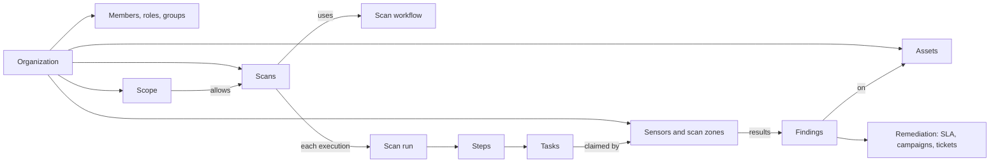
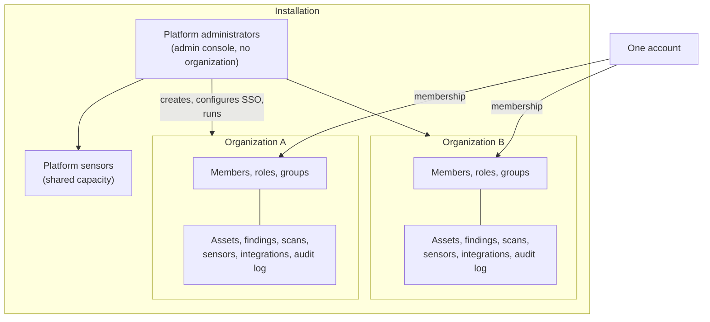
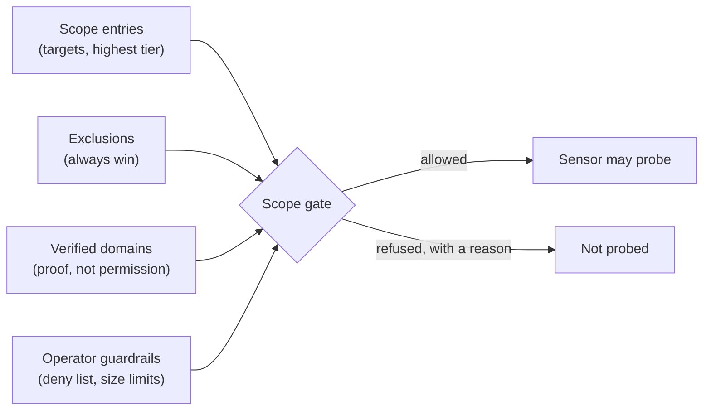
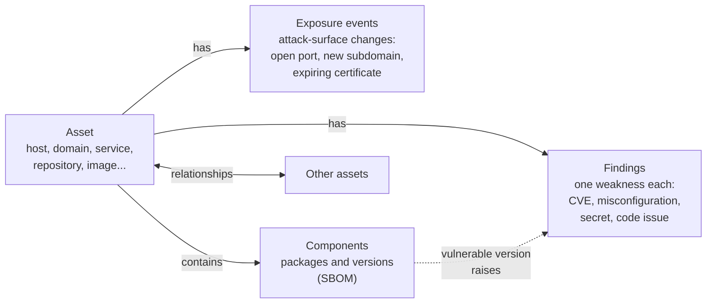
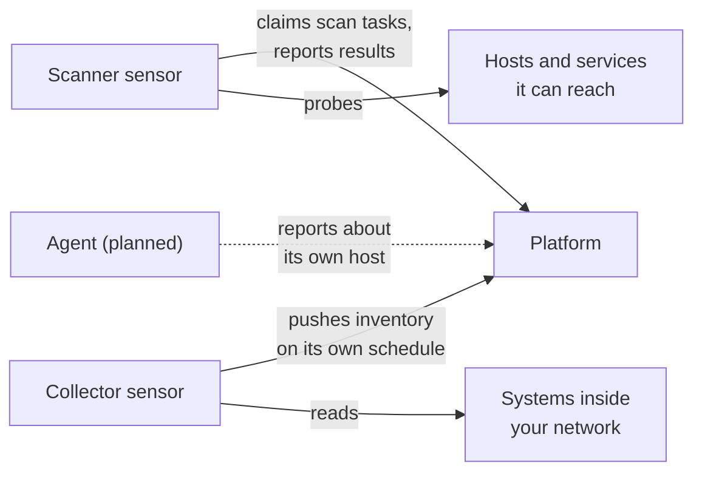
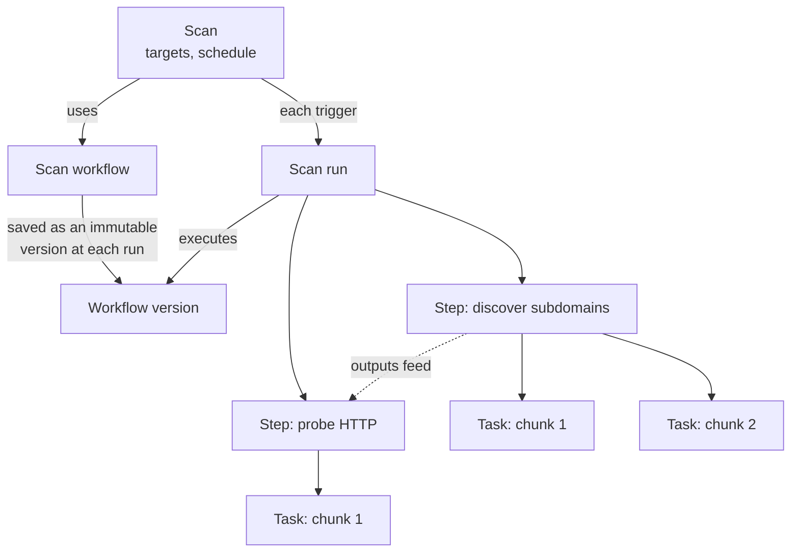

# Concepts
{: .no_toc }

The main objects in OpenCTEM and how they relate. Short definitions are in the
[Glossary](glossary.md); the tables behind these objects are in the
[Data model](data-model.md).

1. TOC
{:toc}

---

## The model at a glance

## Installation, organizations and people

- An **installation** is one deployment of the platform. It is run by
  **platform administrators**, who use the admin console to create
  organizations and manage platform sensors. They are not members of any
  organization and do not see organization data.
- An **organization** (a *tenant* in engineering documents) is the unit of
  isolation. Everything below belongs to exactly one organization.
- **Members** belong to one or more organizations. Their **role** (owner, admin,
  member, viewer, or a custom role) decides what they can do. **Access groups**
  decide which assets, and so which findings, a member can see. Owners and
  admins see everything in their organization.
- People sign in with a password and optional two-factor authentication, or
  through the organization's SSO (OpenID Connect, Microsoft Entra ID, SAML),
  with optional SCIM provisioning. See [Identity and access](../identity/index.md).

One account can be a member of several organizations, with a different role in
each, and works in one organization at a time. Nothing crosses from one
organization to another; platform administrators manage organizations but
cannot read their data.

## Scope

The **scope** says what an organization may test: **targets** (domains, IP
ranges, repositories) and **exclusions**. Every scan is checked against it when it
is triggered. Domains can be **verified** (DNS proof of control); the operator
decides when active scanning requires a verified domain and which names and
ranges no organization may target at all. See
[Scope and authorization to scan](../scanning/scope.md).

## Assets

An **asset** is anything you own that can be attacked: a domain, an IP address,
a host, a service, a web endpoint, a certificate, a code repository, a cloud
account, a container image, an identity. Assets are typed (type, sub-type,
class), carry a **criticality**, an **owner**, labels, and relationships to other
assets. They arrive from scans, imports, integrations and discovery jobs, and
the same thing reported by different sources is merged into one asset.

**Asset groups** organise assets; **crown jewels** and **business services**
mark what matters most and raise the priority of findings on them.

## Findings and exposures

A **finding** is one weakness on one asset: a vulnerability, a misconfiguration,
an exposed secret, a weak dependency. Findings from different tools and scans
are de-duplicated by fingerprint, so a rescan updates a finding instead of
creating a new one. Each finding has a severity, a **priority** that explains how
it was computed (EPSS, CISA KEV, asset criticality, reachability and exposure,
priority rules), and a status that moves through a lifecycle, for example
`new`, `confirmed`, `in_progress`, `fix_applied`, `resolved`, or `false_positive`
and `accepted`. The full state diagram, including `validated_fixed`, `not_observed` and
regression reopen, is in
[Exposures and findings](../user-guide/05-exposures-and-findings.md#status-workflow).

An **exposure event** records an attack-surface change that is not a
vulnerability: an open port, a public bucket, an expiring certificate, a leaked
credential.

**Exposure** in the wider sense (as in *exposure management*) is everything an
attacker could use: the findings and exposure events on your assets, ranked by
priority.

## Sensors

A **sensor** is software you run where the targets are. It connects out to the
platform with its own key, sends heartbeats, claims tasks it has the tools for,
runs the scanners, and reports results. A sensor's **role** says what it does:
**scanner** (assesses other hosts it can reach), **collector** (pushes data from
systems inside your network) or **agent** (reports about the host it runs on).

Every arrow starts at the sensor: sensors only connect out.

- **Organization sensors** belong to one organization.
- **Platform sensors** are shared capacity run by the operator; organizations use
  them through scans without seeing them.
- A **scan zone** is a set of address ranges plus the sensors that can reach
  them. Network scans are routed to the narrowest zone that holds the target, and
  the zone's sensors share the work.

See [Sensors](../sensors/index.md).

## Scans

| Object | What it is |
|---|---|
| **Scan workflow** | A reusable graph of steps: which tools run, in which order, on what. |
| **Scan** | A configuration: targets, the scan workflow, the schedule. |
| **Scan run** | One execution of a scan. |
| **Step** | One step of a scan run (one tool on the run's targets). |
| **Task** | One unit of sensor work within a step, for a chunk of targets. Sensors claim tasks. |

A scan run starts only by triggering a scan (by hand or on its schedule), so
every run passes the same checks: scope, scan freeze windows, available sensors
and tools. See [Scanning](../scanning/index.md).

**CI pipelines** scan code in your own CI system and report each **CI run** to
the platform, which can fail the pipeline on a policy gate.

## Turning findings into fixes

- **Automations** are event rules: *when* something happens (a finding is
  created, a status changes, a scan completes), *if* conditions hold, *then* act
  (assign, notify, open a ticket).
- **SLAs** set a remediation deadline per priority or severity and warn before
  it is missed.
- **Remediation campaigns** group findings with an owner and a deadline and
  track progress; **tickets** link findings to Jira issues in both directions.
- **Validation and retest** ask a sensor to re-check a finding safely, before
  triage or after a fix, and record the evidence.
- **CTEM cycles** frame a period of work with objectives, scope and attacker
  profiles, and measure it.

## Integrations and access for tools

- **Integrations** are external systems the platform calls: SCM (GitHub,
  GitLab), ticketing (Jira), notification channels, SIEM, scanners with an API,
  identity providers.
- **API keys** (`oct_...`) let scripts and AI clients read an organization's data
  through the REST API and the MCP server. See [API](../api/index.md).
