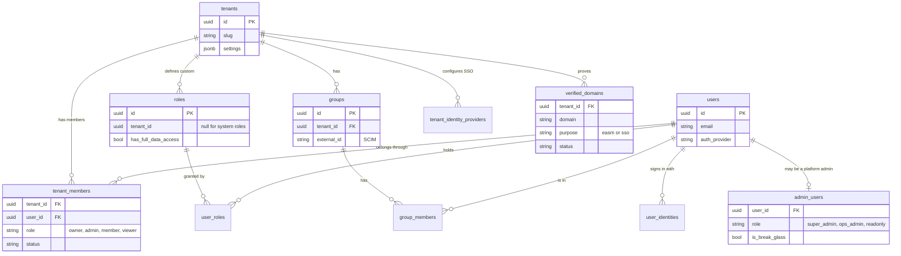
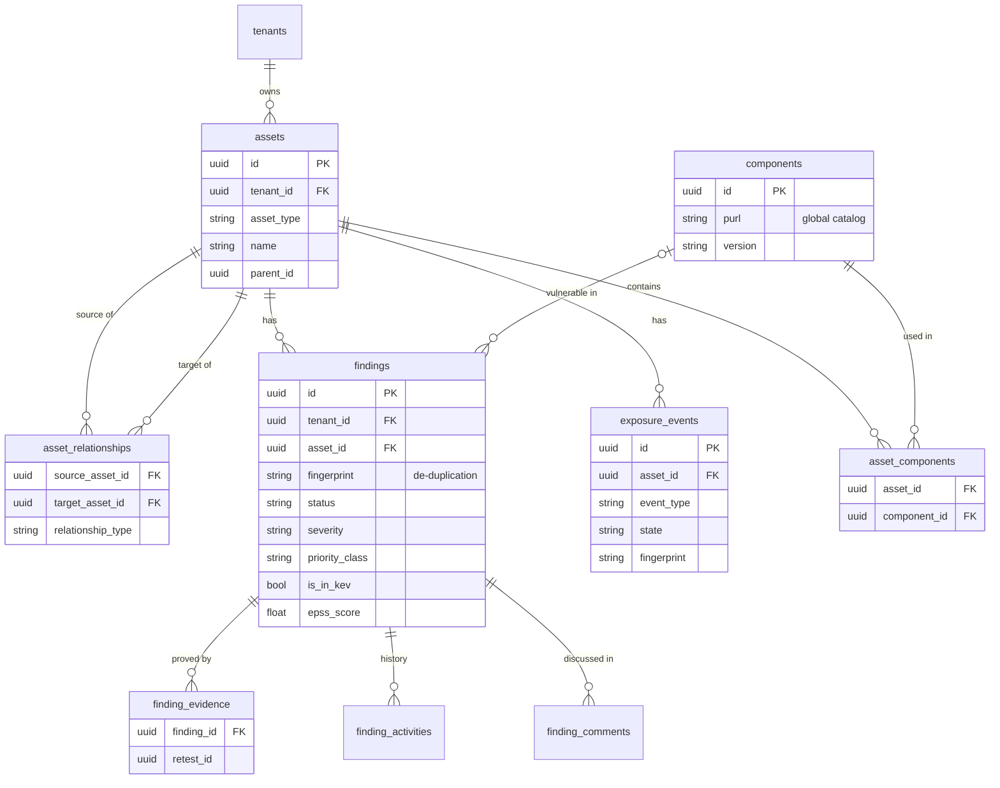
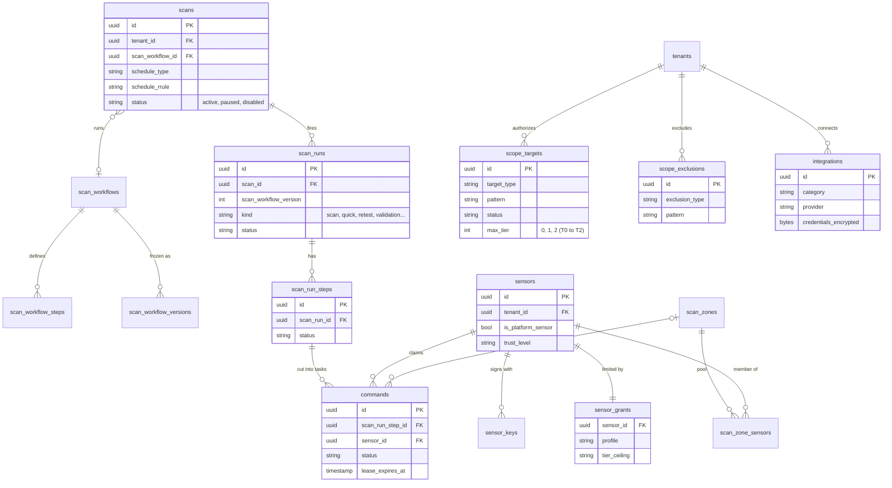

# Data model
{: .no_toc }

The main records OpenCTEM keeps and how they relate, with the PostgreSQL table
names used in the code. This is an overview of the key entities, not the full
schema: the schema is defined by the migrations in
[`api/migrations`](https://github.com/openctemio/openctem/tree/develop/api/migrations).

1. TOC
{:toc}

---

## Organizations, people and access

An organization is a row in `tenants`. Accounts (`users`) are global to the
installation; a membership (`tenant_members`) links an account to an
organization with a base role, and custom roles and groups refine what the
member can do and see.

- **System roles** (owner, admin, member, viewer) are shared rows with no
  `tenant_id`; custom roles belong to one organization.
- **Groups** decide which assets a member sees: through `group_asset_scope_rules`
  and the per-asset `asset_access_grants`, resolved into
  `user_accessible_assets`.
- **Platform administrators** (`admin_users`) are linked to an account that
  belongs to no organization.

## Assets, findings and exposures

- A **finding** is one weakness on one asset; its `fingerprint` makes a rescan
  update the same row instead of adding a new one. Its statuses are described in
  [Exposures and findings](../user-guide/05-exposures-and-findings.md#status-workflow).
- An **exposure event** is one attack-surface change on an asset, with a state
  (active, resolved, accepted, false positive) and first and last sightings.
- **Components** (packages with a version, identified by a purl) are a catalog
  shared by the installation; which asset uses which component is
  per organization (`asset_components`).

## Scans, sensors and scope

- **Tasks** are rows of `commands`: each belongs to one step run, may be pinned
  to a scan zone, and carries the lease of the sensor that claimed it.
- A run records the **version** of the scan workflow it executes
  (`scan_workflow_versions`), so editing a workflow never changes a run in
  progress.
- A sensor's **grant** (`sensor_grants`) and **keys** (`sensor_keys`, public
  keys only) are checked on every request; `scan_zone_sensors` is the zone's pool.
- **Integrations** hold per-organization credentials, encrypted with
  `APP_ENCRYPTION_KEY`; notification channels are integrations too.

## Organization isolation in the schema

Every organization-owned table has a `tenant_id` column, and the application
filters every query on it. Child rows that have no `tenant_id` of their own
(for example `scan_workflow_steps`, `scan_run_steps`, `group_members`) are only
reached through a parent row that has one. A few tables are installation-wide by
design: `users`, `components`, `permissions`, `admin_users` and the platform
settings. See [Tenancy and isolation](architecture.md#tenancy-and-isolation).
