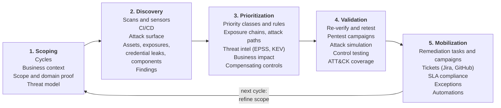

# What is OpenCTEM

OpenCTEM is an open-source, self-hosted platform for **Continuous Threat
Exposure Management (CTEM)**: it keeps an inventory of what your organization
exposes, finds the weaknesses in it, ranks them by real risk, checks which ones
can actually be exploited, and drives their remediation, as a repeating cycle.
It is multi-tenant: one installation serves several organizations, each isolated
from the others. The code is under the GPL-3.0 licence at
[github.com/openctemio](https://github.com/openctemio).

*Figure: The dashboard: what is exploitable now, how the priority classes trend, and where each CTEM stage stands.*

## The problem

Most security teams already have scanners. What they lack is the loop around
them:

- **Nobody knows the whole attack surface.** Subdomains, cloud services,
  repositories and forgotten hosts appear faster than any spreadsheet tracks
  them, and each tool sees only part of it.
- **Findings pile up without an order.** Thousands of results from many tools,
  many of them duplicates, with a severity that says nothing about whether the
  issue is reachable, exploited in the wild or on a system that matters.
- **Fixes are not proven.** A ticket is closed, but nobody checks that the
  weakness is gone, or notices when it comes back.
- **Scanning is risky to run.** Who authorized this target? Which network may
  this scanner reach? Who can see the results?

OpenCTEM answers these with one inventory, one prioritization model, one
authorization gate for every probe, and one workflow from discovery to a
verified fix.

## Who it is for

- **Security teams** running a vulnerability or exposure management programme
  across infrastructure, applications, code and cloud.
- **Asset owners and developers** who need to see and fix the findings on their
  own systems, without seeing everything else.
- **Service providers and platform teams** operating one installation for
  several organizations, each with its own users, SSO and data.

## How it works, in five minutes

The boxes are the stages of the CTEM loop with the console areas that serve
each one; the left sidebar of the console follows the same order.

1. **Decide what matters and what you may test.** Under **Scoping** you open a
   CTEM cycle, mark crown jewels and business services, and write the scope:
   which domains and address ranges may be probed, at which intensity, and what
   is excluded. Domains can be proven with a DNS record.
2. **Find what you have and what is wrong with it.** You install
   [sensors](../sensors/index.md) in the networks to scan; they connect out to
   the platform, pull scan tasks, run open-source scanners (nuclei, subfinder,
   httpx, naabu and others) and send results back. CI pipelines, file imports,
   connectors and the platform's own Certificate Transparency and DNS checks
   feed the same inventory. Everything is merged into one set of **assets** and
   de-duplicated **findings**.
3. **Rank by real risk.** Each finding gets a priority that explains itself:
   severity, EPSS, CISA KEV, how critical the asset is, whether it is reachable
   from the internet, and your own priority rules.
4. **Prove it.** Sensors re-check findings with safe probes, retests confirm
   fixes, and pentest campaigns record manual results with evidence.
5. **Get it fixed.** Findings are assigned to owners, grouped into remediation
   campaigns, synchronised with Jira or GitHub issues, tracked against SLAs and
   automated with event rules. A fix is only closed once it is verified, and a
   finding that comes back is reopened as a regression.

Then the next cycle starts, with what the last one taught you.

| Stage | Question | What OpenCTEM provides |
|---|---|---|
| Scoping | What matters, and what are we allowed to test? | CTEM cycles with objectives, business units and services, crown jewels, attacker profiles, and a scope of targets and exclusions with domain verification and operator guardrails. |
| Discovery | What do we have, and what is wrong with it? | An asset inventory fed by scans, imports and integrations; external attack surface discovery (Certificate Transparency, DNS checks); scans run by sensors in your networks; CI scanning; findings from many tools, de-duplicated. |
| Prioritization | What should we fix first? | A transparent priority built from severity, EPSS, CISA KEV, asset criticality, reachability and exposure, with priority rules, attack paths and AI-assisted triage (optional, your own model provider). |
| Validation | Is it really exploitable, and is the fix real? | Re-verification of findings by sensors with safe checks, continuous retest of fixed findings, pentest campaigns, and recorded evidence. |
| Mobilization | Who fixes it, by when? | Assignment rules, SLAs, remediation campaigns, Jira and GitHub ticket sync, notifications, reports. |

## How it is delivered

- **The platform**: an API (Go), a web console (Next.js) and a gateway, with
  PostgreSQL and Redis. Install it with Docker Compose, as one all-in-one
  container, or on Kubernetes with Helm. See [Install](../install/index.md) and
  [Architecture](architecture.md).
- **Sensors**: small programs you run where the targets are (a data centre, a
  cloud VPC, a lab network). They connect out to the platform over HTTPS, pick
  up scan tasks, run the scanners and report results. See
  [Sensors](../sensors/index.md).
- **CI scanning**: `openctem-ci` runs code scans in your CI pipelines and
  reports with the job's OIDC identity, without a stored key. See
  [CI integration](../scanning/ci-integration.md).
- **Open formats**: results arrive as CTIS (the open ingest schema, which also
  carries SBOM dependencies) or SARIF, and importers read Nessus, Qualys,
  trivy, grype, semgrep, nuclei, ZAP, CSAF, OpenVEX and DefectDojo files. A REST
  API and an MCP server expose the data. See [API](../api/index.md).

## Shipped and planned

These pages describe what ships in the current release (v0.9.0 and later). Work
that is designed but not shipped is marked **Planned** where it is mentioned.

| Shipped | Planned |
|---|---|
| The five CTEM stages in the console, multi-tenant with per-organization SSO (OpenID Connect, Entra ID, Google, SAML 2.0) and SCIM | Running more than one API instance for high availability (today one API instance; see [Scaling](../operations/scaling.md)) |
| Scanner sensors with pairing, grants, scan zones and freeze windows, over sensor protocol v2 (HTTPS) | Sensor protocol v3 (gRPC with mutual TLS, HTTPS fallback) |
| Collector sensors (platform and SDK runtime) | An endpoint agent that reports about its own host |
| Scan workflows with the capabilities listed in [Scan workflows](../scanning/scan-workflows.md#capabilities) | Further capabilities such as `check.takeover`, `check.tls`, `cloud.posture` |
| Organization isolation enforced by the application on every query | PostgreSQL row-level security as a second layer (policies exist, not enabled; see [Architecture](architecture.md#tenancy-and-isolation)) |
| Sensors reach targets directly or through their host's proxy | Per-zone egress proxies |

The design documents (RFCs) and the roadmap live in the
[openctem repository](https://github.com/openctemio/openctem/tree/develop/api/docs).

## Read next

- [Quickstart](../quickstart.md): install, pair a sensor and run a first scan
  in about 15 minutes.
- [Architecture](architecture.md): the components and how data flows.
- [Concepts](concepts.md): organizations, scope, assets, findings, scans and
  sensors.
- [Data model](data-model.md): the main records and how they relate.
- [Glossary](glossary.md).
