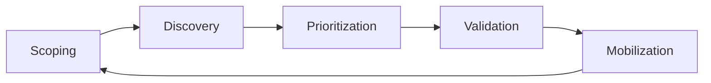

# What is OpenCTEM

OpenCTEM is an open-source, self-hosted platform for **Continuous Threat
Exposure Management (CTEM)**: it keeps an inventory of what your organization
exposes, finds the weaknesses in it, ranks them by real risk, checks which ones
can actually be exploited, and drives their remediation, as a repeating cycle.
It is multi-tenant: one installation serves several organizations, each isolated
from the others. The code is under the GPL-3.0 licence at
[github.com/openctemio](https://github.com/openctemio).

## The CTEM loop

| Stage | Question | What OpenCTEM provides |
|---|---|---|
| Scoping | What matters, and what are we allowed to test? | CTEM cycles with objectives, business units and services, crown jewels, attacker profiles, and a scope of targets and exclusions with domain verification and operator guardrails. |
| Discovery | What do we have, and what is wrong with it? | An asset inventory fed by scans, imports and integrations; external attack surface discovery (Certificate Transparency, DNS checks); scans run by sensors in your networks; CI scanning; findings from many tools, de-duplicated. |
| Prioritization | What should we fix first? | A transparent priority built from severity, EPSS, CISA KEV, asset criticality, reachability and exposure, with priority rules, attack paths and AI-assisted triage (optional, your own model provider). |
| Validation | Is it really exploitable, and is the fix real? | Re-verification of findings by sensors with safe checks, continuous retest of fixed findings, and recorded evidence. |
| Mobilization | Who fixes it, by when? | Assignment rules, SLAs, remediation campaigns, Jira ticket sync, notifications, reports. |

## Who it is for

- **Security teams** running a vulnerability or exposure management programme
  across infrastructure, applications, code and cloud.
- **Asset owners and developers** who need to see and fix the findings on their
  own systems, without seeing everything else.
- **Service providers** operating the platform for several client
  organizations, each with its own users, SSO and data.

## How it is delivered

- **The platform**: an API (Go), a web console (Next.js) and a gateway, with
  PostgreSQL and Redis. Install it with Docker Compose, as one all-in-one
  container, or on Kubernetes with Helm. See [Install](../install/index.md).
- **Sensors**: small agents you run where the targets are (a data centre, a
  cloud VPC, a laptop on a lab network). They connect out to the platform over
  HTTPS, pick up scan tasks, run open-source scanners (nuclei, subfinder, httpx,
  naabu, semgrep, trivy, betterleaks and others) and report results. See
  [Sensors](../sensors/index.md).
- **CI scanning**: `openctem-ci` runs scans in your CI pipelines and reports
  with the job's OIDC identity, without a stored key. See
  [CI integration](../scanning/ci-integration.md).
- **Open formats**: results arrive as CTIS (the open ingest schema, which also
  carries SBOM dependencies) or SARIF, and importers read Nessus, Qualys,
  trivy, grype, semgrep, nuclei, ZAP, CSAF, OpenVEX and DefectDojo files. A REST
  API and an MCP server expose the data. See [API](../api/index.md).

## Shipped and planned

These pages describe what ships in the current release (v0.9.0 and later). Work
that is designed but not shipped is marked **Planned** where it is mentioned, for
example:

- **Planned:** running more than one API instance for high availability. Today
  the API runs as a single instance (see [Scaling](../operations/scaling.md)).
- **Planned:** enforcing organization isolation additionally with PostgreSQL
  row-level security. Isolation is enforced by the application today (see
  [Architecture](architecture.md#tenancy-and-isolation)).

The design documents (RFCs) and the roadmap live in the
[openctem repository](https://github.com/openctemio/openctem/tree/develop/api/docs).

## Read next

- [Architecture](architecture.md): the components and how data flows.
- [Concepts](concepts.md): organizations, assets, findings, scans and sensors.
- [Glossary](glossary.md).
- [Install](../install/index.md).
