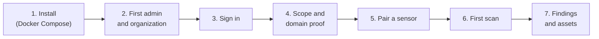

# Quickstart
{: .no_toc }

From nothing to your first findings in about 15 minutes: install the platform
on one host with Docker Compose, create the first administrator and
organization, authorize a target, pair a sensor, run a scan and read the
results. Each step links to the full page when you need more than the short
path.

1. TOC
{:toc}

---



## What you need

- A Linux host with 2 vCPU, 4 GB of memory and 20 GB of disk, Docker Engine and
  the Compose plugin 2.24 or later, `git` and `openssl`
  ([Requirements and sizing](install/index.md)).
- A DNS name or IP address for the platform. This guide uses
  `ctem.example.com`.
- A second host (or the same one) in the network you want to scan, with Docker,
  for the sensor. It needs only outbound HTTPS to the platform.
- A domain you control and may scan, and access to its DNS to add one TXT
  record. This guide uses `example.com`.

{: .warning }
Scan only systems you own or are authorized to test. OpenCTEM refuses targets
that no scope entry of your organization covers, but deciding what you may
test is your responsibility.

## 1. Install the platform

```bash
git clone https://github.com/openctemio/openctem.git
cd openctem
git checkout v0.9.0          # the release you deploy
cd api/deploy
cp .env.example .env
for v in DB_SUPERUSER_PASSWORD DB_MIGRATE_PASSWORD DB_PASSWORD REDIS_PASSWORD; do
  sed -i "s|^$v=.*|$v=$(openssl rand -hex 24)|" .env
done
sed -i "s|^AUTH_JWT_SECRET=.*|AUTH_JWT_SECRET=$(openssl rand -hex 64)|" .env
sed -i "s|^APP_ENCRYPTION_KEY=.*|APP_ENCRYPTION_KEY=$(openssl rand -hex 32)|" .env
sed -i "s|^CSRF_SECRET=.*|CSRF_SECRET=$(openssl rand -hex 32)|" .env
chmod 600 .env
```

Edit `.env` and set at least:

```bash
OPENCTEM_VERSION=v0.9.0
API_IMAGE=ghcr.io/openctemio/openctem-api
UI_IMAGE=ghcr.io/openctemio/openctem-web
OPENCTEM_HOSTNAME=ctem.example.com
OPENCTEM_PUBLIC_URL=https://ctem.example.com
OPENCTEM_TLS_MODE=internal     # the gateway's own CA; acme for Let's Encrypt
```

Start it and check it answers:

```bash
docker compose up -d
docker compose ps
curl --cacert ca/openctem-root-ca.crt https://ctem.example.com/health
```

The one-shot jobs (`datastore-tls`, `db-roles`, `migrate`) exit with code 0;
`gateway`, `web`, `api`, `postgres` and `redis` stay up. Back up `.env` now:
`APP_ENCRYPTION_KEY` cannot be recovered.

Full guide: [Docker Compose](install/docker-compose.md). TLS choices:
[TLS and the gateway](install/tls-and-gateway.md).

## 2. Create the first administrator and organization

```bash
docker compose exec api /app/bootstrap-admin \
  -email=admin@example.com \
  -backup-email=breakglass@example.com \
  -org-name="Example Corp" \
  -org-owner-email=owner@example.com
```

The output prints a temporary password for the platform administrator and the
break-glass administrator, and a one-time set-password link for the
organization owner (also emailed when SMTP is configured). Copy them now: they
are shown once.

- The **platform administrator** runs the installation from the admin console
  (`/admin`) and cannot see organization data.
- The **organization owner** works inside the organization. The rest of this
  guide uses the owner's account.

Full guide: [First administrator](install/first-admin.md).

## 3. Sign in as the owner

Open the set-password link, choose a password, and sign in at
`https://ctem.example.com/login`. With TLS mode `internal`, the browser warns
until you import `ca/openctem-root-ca.crt`. You land on the dashboard of
**Example Corp**; lists are empty until the first scan.


*Figure: the dashboard, here for an organization that already has scan results. A new organization shows empty lists until its first scan.*

Enroll an authenticator app under your account's **Security** settings while
you are here ([Two-factor authentication](identity/two-factor.md)).

## 4. Authorize a target: scope and domain proof

Nothing is actively probed unless an **active scope entry** of your
organization covers it.

1. Open **Scoping > Scope**, tab **In scope**, and add `*.example.com` (it
   covers `example.com` and every name below it). Keep the default highest
   tier, `t1` (non-intrusive active checks). Turn **discovery** on so attack
   surface monitoring watches the domain.
2. Adding scope widens what may be probed, so the console asks you to
   re-authenticate. With a single administrator no second approval is needed
   and the entry becomes `active`.
3. Open the **Domain proof** tab, add `example.com` and publish the TXT record
   it shows:

   | Host | Value |
   |---|---|
   | `_openctem-verify.example.com` | `openctem-domain-verification=<token>` |

   Then choose **Check now**. Proof is not authorization (the scope entry
   is), but intrusive checks, and some installations, require it.


*Figure: scope entries. Each entry names what the organization may actively probe.*

Details: [Scope and authorization to scan](scanning/scope.md).

## 5. Pair a sensor

On the host in the network you want to scan:

```bash
docker run -d --name openctem-sensor --restart unless-stopped \
  -e API_URL=https://ctem.example.com \
  -v openctem-outbox:/var/lib/openctem/outbox \
  -v openctem-state:/var/lib/openctem/state \
  -v openctem-content:/var/lib/openctem/content \
  ghcr.io/openctemio/sensor:v0.11.0
docker logs openctem-sensor
```

With TLS mode `internal`, give the sensor the platform's CA as well: mount
`ca/openctem-root-ca.crt` read-only and set `SENSOR_CA_CERT_FILE`, or pin it
with `SENSOR_CA_FINGERPRINT` (see
[Deploy with Docker](sensors/deploy-docker.md)).

The log shows a pairing **code** and a **fingerprint**. In the console:

1. Open **Discovery > Sensors > Pair a sensor**, tab **Enter code**, and type
   the code.
2. Compare the fingerprint word for word with the sensor's log. If it differs,
   deny the request.
3. Keep the profile **Internal network scanner** (or **External attack
   surface** for a sensor that scans only internet-facing targets), tick the
   fingerprint confirmation, re-authenticate and **Approve**.
4. Open the sensor and choose **Promote to Trusted**. A new sensor receives only
   passive work (subdomain discovery, DNS resolution) until it is trusted.


*Figure: approving a pairing request. Compare the fingerprint with the one the sensor printed.*

The sensor shows as `online` within a few seconds. Details:
[Pairing and enrollment](sensors/pairing.md).

## 6. Run your first scan

1. Open **Discovery > Scans > New scan**.
2. Targets: `example.com`.
3. What to run: the starter scan workflow **Discover** (find subdomains,
   resolve them, probe their web services) or **Discover + Vuln** (adds port
   scans and non-intrusive nuclei templates).
4. The last step previews which sensor takes each target and whether every
   step has a sensor that can run it.
5. Save, then **Run now**.


*Figure: the New scan wizard.*

Follow the run under **Discovery > Scans > Runs**: each step, its tasks, the
sensor that claimed them and their logs. A run ends `completed`, or `partial`
when part of the work could not be done. Details:
[Scans and scan runs](scanning/scans-and-runs.md).

## 7. Read the results

- **Assets**: the subdomains, addresses, services and certificates the scan
  found, merged into one inventory.
- **Attack surface > Review**: names found by discovery that need a decision
  (ours, not ours, a dependency) before they are actively probed.
- **Findings**: each weakness on an asset, with its severity, priority and
  evidence. Open one to triage it, assign it or ask for a retest.
- **Discovery > Exposures**: attack-surface changes such as new subdomains,
  open ports or expiring certificates.


*Figure: the findings list after the first scans.*

## Next

- Invite your team: [Sign-up and invitations](identity/sign-up-and-invitations.md)
  and [Roles, groups and permissions](identity/roles-and-permissions.md), or
  connect your identity provider ([Identity and access](identity/index.md)).
- Schedule the scan, and scan code in CI with
  [CI integration](scanning/ci-integration.md).
- Add business context and run the loop as CTEM cycles: [User guide](user-guide/index.md).
- Before production: [email](configuration/email.md),
  [backups](operations/backup-restore.md),
  [monitoring](operations/monitoring.md) and [hardening](security/hardening.md).
