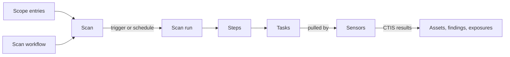

# Scanning

OpenCTEM plans scans on the platform and runs them on [sensors](../sensors/index.md)
in your networks. Every target passes one authorization gate before any
sensor sees it, and every result comes back through the same ingest path, so
findings and assets from scans, CI pipelines and imports land in one
inventory.

| Concept | What it is | Where |
|---|---|---|
| [Scope](scope.md) | What your organization may actively probe | Scoping > Scope |
| [Scan workflow](scan-workflows.md) | A graph of steps, each one capability run by one tool | Discovery > Scans > Workflows |
| [Scan](scans-and-runs.md) | Targets, a single tool or a scan workflow, and a schedule | Discovery > Scans |
| [Scan run](scans-and-runs.md#scan-runs) | One execution of a scan; split into steps and tasks | Discovery > Scans > Runs |
| [Tools](tools.md) | The scanners sensors run, and their availability | Settings > Scanning > Tools |
| [CI integration](ci-integration.md) | Code scanning in your pipelines, with a gate | Discovery > CI/CD |
| [Attack surface monitoring](easm.md) | Passive discovery and checks of your internet-facing names | Attack surface |

## Your first scan

1. **Install and pair a sensor** where it can reach your targets
   ([Docker](../sensors/deploy-docker.md), [Pairing](../sensors/pairing.md)).
   Promote it to **Trusted** so it may run active checks.
2. **Add a scope entry** for what you want to scan under
   **Scoping > Scope > In scope**, for example `*.example.com` or
   `203.0.113.0/24`. Without one, internet-facing targets are refused.
3. **Create the scan**: **Discovery > Scans > New scan**. Pick the targets
   (names, addresses or asset groups), then either a single tool or a scan
   workflow. The starter workflow **Discover** finds subdomains, resolves
   them and probes their web services; **Discover + Vuln** adds port scans
   and non-intrusive nuclei templates. The last step previews which sensor
   and zone each target goes to.
4. **Run it**: **Run now**, or give it a schedule.
5. **Follow the run** under **Discovery > Scans > Runs**: each step, its
   tasks, the sensors that took them and their logs.
6. **Review the results** under **Assets**, **Findings** and
   **Attack surface**.

**Quick scan** runs a single tool against a few targets without saving a
scan first.

## What is checked before anything runs

| Check | Result when it fails |
|---|---|
| The target is valid (no loopback, link-local or metadata address; private addresses only inside a scan zone) | Refused |
| An active scope entry covers the target at the needed tier, and no exclusion matches | Refused (`TARGET_OUT_OF_SCOPE`) or skipped with a run warning |
| The person (or the scan owner, for scheduled runs) may act on the asset | Refused or skipped |
| A sensor that may run the tool is online | Refused (`NO_SENSOR_FOR_TOOL`) |
| No freeze window holds the work | Deferred (scheduled) or refused (`SCAN_FREEZE_ACTIVE`) |
| The target is routed to a zone with sensors | Uncovered targets are skipped and listed |

Then, on the sensor: its grant, its sensor-local policy and its target guard.
