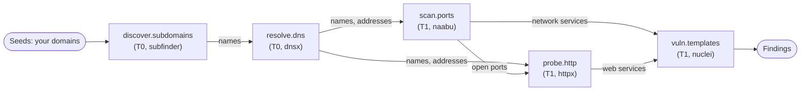

# Scan workflows

A **scan workflow** is a graph of steps. Each step runs one **capability**
(for example "discover subdomains" or "probe HTTP") with one tool, and what a
step finds becomes the input of the steps after it. A scan runs either a
single tool or a scan workflow.

Manage scan workflows under **Discovery > Scans > Workflows**: a visual
builder with a palette of capabilities, or the API `/api/v1/scan-workflows`.
They need the `scan_workflows` module and the `scans:workflows:read`,
`scans:workflows:write` and `scans:workflows:delete` permissions.

## Starter workflows

Every organization gets five system workflows built only from capability
steps, so they run on whichever implementation your sensors have:

| Workflow | Steps |
|---|---|
| Discover | discover subdomains, then resolve DNS, then probe HTTP |
| Discover + Vuln | discover subdomains, resolve DNS, scan ports, probe HTTP, then vulnerability templates (fed by the probe and the ports) |
| Web app | probe HTTP, crawl, then vulnerability templates |
| Network | scan ports, probe HTTP, then vulnerability templates |
| Code / CI | secrets, SAST, dependency and IaC scans of a repository, in parallel |

System workflows cannot be edited; clone one to change it.

The **Discover + Vuln** graph, as an example. Each arrow carries the assets the
earlier step found, and every new target passes the scope gate before the next
step probes it:

## Capabilities

The platform's capability catalogue decides which steps exist, what each one
consumes and produces, and its tier. A tenant, a sensor or a report cannot
widen it.

| Capability | Takes → produces | Tier | Tools (default first) |
|---|---|---|---|
| `discover.subdomains` | domain → subdomains | T0 | subfinder |
| `resolve.dns` | names → names, IP addresses | T0 | dnsx |
| `scan.ports` | names, addresses → open ports | T1 | naabu |
| `probe.http` | names, addresses, ports → HTTP services, certificates | T1 | httpx |
| `crawl.web` | HTTP services, URLs → discovered URLs | T1 | katana |
| `vuln.templates` | web and network services → findings | T1 | nuclei |
| `dast.web` | web applications → findings | T2 | zap |
| `secrets.code` | repository → findings | T0 | betterleaks, trufflehog, gitleaks |
| `sast.code` | repository → findings | T0 | semgrep, codeql |
| `sca.deps` | repository, container → findings | T0 | trivy, osv-scanner, grype |
| `iac.misconfig` | repository → findings | T0 | checkov, kics, trivy |
| `container.image` | container → findings | T0 | trivy, grype |
| `network_va.connector` | addresses, hosts, networks → findings | T1 | tenable_sc |

The official sensor ships subfinder, dnsx, naabu, httpx, katana, nuclei,
semgrep, trivy and betterleaks (see [Tools](tools.md)). A step whose
capability has no tool on any of your sensors cannot run. Further
capabilities (for example `check.takeover`, `check.tls`, `cloud.posture`)
are defined but **planned**: they are listed as unavailable and cannot be
used in a step.

## Choosing the tool of a step

A step picks its tool in one of three ways:

- **Auto**: any implementation of the capability, the default first.
- **Prefer**: an ordered list of tools; each must implement the capability.
- **Pin**: exactly one tool.

The tool chosen is recorded on the step run. A tool that does not accept a
setting the step sets is not eligible, and the step says why instead of
dropping the setting.

## Step settings

Standard parameters of a capability are typed and checked on every save.
Each tool receives them under its own name. Tool-specific extras go under
`x.<tool>` and only on a step pinned to that tool. Settings the sensor
applies today:

| Tool | Settings |
|---|---|
| naabu | `ports`, `top_ports`, `exclude_ports`, `rate`, `retries`. Port lists only (`80,443,8000-8100`, `top-100`, `top-1000`, `full`); `rate` can only lower the sensor's rate |
| nuclei | `tags`, `exclude_tags`, `severity`, and `rate_limit`, `concurrency`, `bulk_size` up to the sensor's ceilings. `dos`, `fuzz`, `fuzzing` and `intrusive` are refused as tags; `exclude_tags` only adds to the sensor's exclusions |

A value the tool's settings schema refuses fails the step at save time
(`INVALID_STEP_SETTING`) and again on the sensor.

## How data flows between steps

- A step's targets are the run's seeds plus what its direct predecessors
  produced, of the types it takes.
- Data flows **through the inventory only**: the platform records the assets
  each task's report wrote and feeds those to the next step. A sensor never
  feeds another sensor, and cannot attribute output to another step or run.
- **Every hop passes the gate** before it becomes a target: strict name
  parsing, scope exclusions, the run's scan zone, the scope check of the
  person who triggered the run and the ownership check. A passive (T0) step
  may take names awaiting review; an active (T1) step takes only names your
  scope authorizes; an intrusive (T2) step never takes derived targets.
- A derived target is at most **3 discovery hops** from the seeds. A port,
  service or URL on a host the run already reached keeps that host's hop.
- Each capability caps its fan-out (at most 10,000 targets per run, 5,000
  children per parent).
- A step whose predecessors produced nothing it can take completes with
  "no inputs" and the run moves on.

## Chunks and politeness

A step whose tool takes a list of targets is cut into **chunks**, one task
each, that any eligible sensor of the zone may claim:

| Capability | Chunk size |
|---|---|
| `resolve.dns`, `probe.http` | 200 |
| `discover.subdomains`, `scan.ports` | 50 |
| `vuln.templates` | 25 |
| `crawl.web`, `dast.web` | 10 |

Code, image and connector steps are not cut. Within an organization, a
chunk of an active step is claimed only while no other running task holds
one of its hosts, so one host is probed by one task at a time.

## Validation and versions

- Every save checks the graph: capabilities exist and are routable, a pinned
  tool implements its step, edges connect compatible types (the builder
  suggests the step that would connect two incompatible ones, for example an
  HTTP probe between subdomain discovery and crawling), no cycles, at most 30
  steps and 120 edges. `POST /api/v1/scan-workflows/verify` checks a draft
  without saving it.
- When a run starts, the workflow is saved as an immutable version. The run
  uses that version to the end; an edit made while it runs changes the next
  run only.

## Preview before running

The new-scan wizard ends with a preview (`POST /api/v1/scans/workflow-preview`):
for each step the capability, tier, the tool that would run and whether a
sensor in the scan's zone can run it; the zone routing of a sample of the
targets; and any active freeze window. A step no sensor can run blocks the
scan with the same `NO_SENSOR_FOR_TOOL` reason the trigger would give.

## Automations are different

**Automations** (**Mobilization > Automations**, `/api/v1/workflows`) are
event rules: *when* something happens (a finding is created, a scan run
completes), *if* conditions match, *then* act (notify, open a ticket, start a
scan). A scan an automation starts goes through the same gate as any other
trigger. Automation-caused events never re-trigger the automation that caused
them, and chains stop after three levels.
