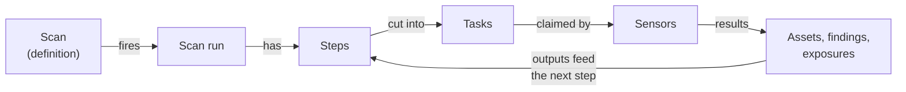
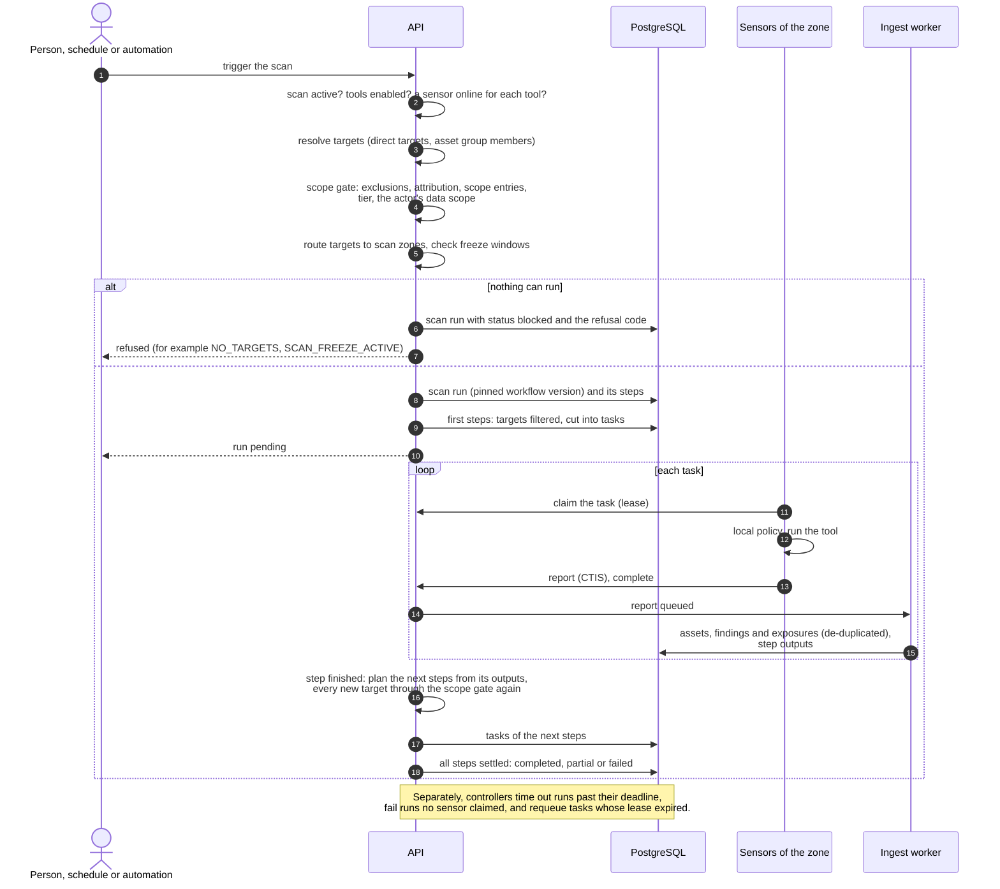

# Scans and scan runs

A **scan** says what to scan, with which tool or scan workflow, and when. Each
time it fires, it creates a **scan run**; the run is split into **steps** (one
per tool or workflow step), and each step is cut into **tasks** that sensors
claim and run. Results flow back into the inventory, and the next steps take
what the earlier ones found.

| Term | Meaning | API |
|---|---|---|
| **Scan** | What to scan, how, and when | `/api/v1/scans` |
| **Scan run** | One execution of a scan | `/api/v1/scan-runs` |
| **Step** | One step of a run: a single tool, or one step of a [scan workflow](scan-workflows.md) | in `GET /api/v1/scan-runs/{id}` |
| **Task** | One unit of sensor work of a step: one tool on a slice of the targets, held by one sensor under a lease | `GET /api/v1/scan-runs/{id}/tasks` |

Everything is under **Discovery > Scans**, with the tabs **Scans**, **Runs**
and **Workflows**. Reading needs `scans:read`; creating, editing and
canceling need `scans:write`; running needs `scans:write` and
`scans:execute`.

## Scans

A scan has:

- **Targets**: names, addresses, CIDRs or URLs typed directly, and asset
  groups. Group members are read when the run starts. At most 10,000
  resolved targets per scan. Archived assets are skipped; stale ones are
  scanned (a scan is how they are seen again).
- **What to run**: a single tool with its settings, or a scan workflow.
- **Scan zone**: **Automatic** (route each target to its zone) or one zone
  ([Scan zones](../sensors/zones.md)).
- **Schedule**: manual, daily, weekly or monthly at a time, or a recurrence
  rule (RFC 5545 `RRULE` parts, for example `FREQ=WEEKLY;BYDAY=MO;BYHOUR=2`),
  in a time zone you choose. Schedules more frequent than every 15 minutes are
  refused. The scan page lists the next occurrences
  (`POST /api/v1/scans/schedule-preview`).
- **Timeout**: default 1 hour, from 30 seconds to 24 hours.
- **Retries**: up to 10, with a backoff (default 60 seconds).
- **Status**: `active`, `paused` or `disabled`. Only active scans run on
  their schedule.

*Figure: Scans.*

Creating or editing a scan runs the [scope gate](scope.md) on its direct
targets: a target your organization may not probe refuses the whole request
(`TARGET_OUT_OF_SCOPE`, each target with its reason).

Other actions: **Quick scan** (one tool, a few targets, no saved scan),
clone, export and import (`GET /api/v1/scans/{id}/export`,
`POST /api/v1/scans/import`), and bulk activate, pause, disable and delete.

## Starting a run

A run starts only from a scan, so every run passes the same gate:

- **Run now** in the console, or `POST /api/v1/scans/{id}/trigger`;
- the scan's **schedule**;
- an [automation](scan-workflows.md#automations-are-different) step;
- an automatic **retry** of a failed run.

When a run starts, the targets are resolved (direct targets and group
members), checked against scope, exclusions and the actor's access, routed to
zones and cut into tasks. If nothing can run, the trigger is refused before a
run exists, for example `NO_TARGETS`, `ALL_TARGETS_EXCLUDED`,
`NO_ZONE_COVERAGE`, `ZONE_SPLIT_REQUIRED`, `NO_SENSOR_FOR_TOOL`,
`TOOL_DISABLED` or `SCAN_FREEZE_ACTIVE`.

The whole path of a run, from the trigger to its final status:

- **One run per occurrence.** Each scheduled occurrence creates at most one
  run, however many API replicas are running.
- **No overlap.** A scheduled occurrence is skipped while the scan's
  previous run is still active. Occurrences missed while the platform was
  down are skipped, not replayed.
- **Freeze windows.** A scheduled run that falls in a freeze window is
  deferred to the window's end; other triggers are refused unless overridden
  ([Freeze windows](../sensors/zones.md#freeze-windows)).
- **Rollover.** When a run reaches its deadline, its unfinished targets are
  recorded and the next scheduled run plans them first.

## Scan runs

*Figure: Scan runs.*

| Status | Meaning | Final |
|---|---|---|
| `pending` | Created; no task claimed yet | no |
| `running` | At least one task claimed or started | no |
| `completed` | Every task completed | yes |
| `partial` | Some work completed and some failed, or the deadline passed with work done, or zone routing left targets uncovered. Results are kept | yes |
| `failed` | No task completed: all failed, or no sensor claimed any task within 4 hours (scheduled runs) or 1 hour (other runs) | yes |
| `timeout` | The deadline passed and no task completed | yes |
| `canceled` | Stopped by a person | yes |
| `blocked` | Refused before anything was dispatched (scope, freeze window, no sensor or tool, no target) | yes |

A finished run never changes again: a late result, a cancel racing a
completion or a duplicate report cannot reopen it or count its findings
twice. The deadline of a run is its scan's timeout, at most 24 hours.

### Steps and tasks

Each step of a run shows its state (pending, waiting for a sensor, running,
succeeded, partial, failed, skipped, canceled), the tool the planner chose,
its tasks by state, and the findings it produced. The run page offers:

- **Tasks**: each task, its state and the sensor that took it, with its
  **Logs** (what the tool and the sensor logged, kept 14 days). A task
  refused before any tool started shows the refusal reason.
- **Map**: the run drawn on the workflow version it executes.
- **Stages**: per step, how many targets came from the seeds or from earlier
  steps, and how many were skipped and why.

*Figure: A completed run: each stage with its tool, inputs and planned targets, and the timeline of its tasks.*

A task is claimed by a sensor under a lease that the sensor's heartbeats
renew. If a sensor goes silent, its tasks go back to the queue about a minute
after the lease runs out (3 minutes by default) and another sensor of the
zone takes them.

### Failures and retries

- Permanent failures (refused targets, invalid settings, missing tools) are
  never retried.
- Lost work and timeouts are retried twice, with a backoff.
- Other failures follow the scan's retry setting.

### Cancel a run

**Cancel run** on the run page, or `POST /api/v1/scan-runs/{id}/cancel`
(`scans:write`). The run becomes `canceled` at once; its open steps and tasks
are closed and never re-queued. A sensor holding a task hears about it on its
next heartbeat (within about 5 seconds while it works) and stops the tool; an
offline sensor hears it when it reports the task again. Canceling again does
nothing.

## Results

Sensors send results as CTIS reports bound to their task. The platform
accepts a report only from the sensor that holds the task's current lease,
for that task's tool and targets, and only with the asset types the tool is
declared to produce. Out-of-contract assets are, by default, held in the
sensor results quarantine for review instead of applied. Findings and assets then appear under **Findings**, **Assets** and
**Attack surface**, with the scan run as their source.

A finding that a later scan no longer sees is not resolved automatically by
default. Fix verification uses [retests](../user-guide/index.md) of the
finding instead.

## Scan profiles

A **scan profile** (**Settings > Scanning > Scan profiles**,
`/api/v1/scan-profiles`) is a reusable set of tool settings: which tools are
enabled with which options, an intensity (`low`, `medium`, `high`), a timeout,
and for template-based tools which templates to use (`default`, `custom` or
`both`, with the custom template ids). The platform provides system profiles;
organizations clone and adapt them, and one profile can be the default. A
scan can reference a profile.
