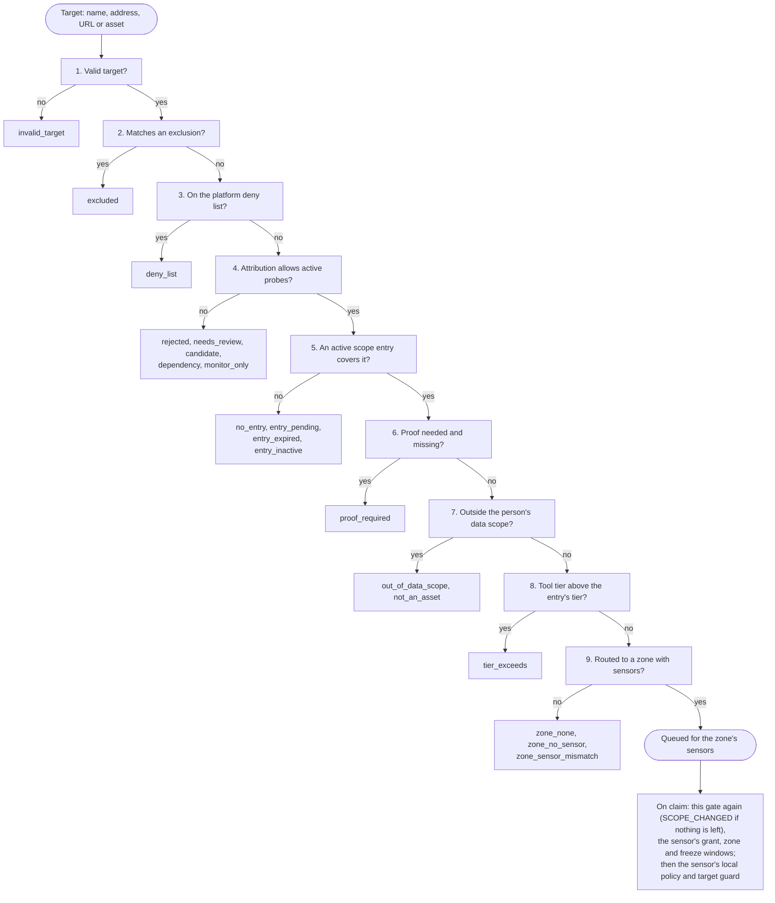

# Scope and authorization to scan

**Scope** is what your organization may actively probe. A sensor sends
traffic to a target only when an **active scope entry** of your organization
covers it. Nothing else authorizes an active probe: not a verified domain,
not an asset being in the inventory, not a person confirming an asset as
yours. There is no switch that turns scope off.

Manage scope under **Scoping > Scope**, with the tabs **In scope** (entries),
**Out of scope** (exclusions), **Approvals** and **Domain proof**. The
organization's rules are in **Settings > Policies > Scope policy**.

Design: [RFC-054](https://github.com/openctemio/openctem/blob/develop/api/docs/rfcs/RFC-054-scope-model.md).

## Patterns

| Entry | Covers |
|---|---|
| `example.com` | exactly `example.com` |
| `*.example.com` | `example.com` and every name below it, at any depth |
| `*.example.com` plus the exclusion `example.com` | the names below `example.com`, not `example.com` itself |
| `203.0.113.10`, `203.0.113.0/24`, `203.0.113.10-203.0.113.20` | those addresses |

Matching ignores case and one trailing dot, and compares internationalized
names in their ASCII form. A name grant never becomes an address grant: an
address is covered only by an address, range or CIDR entry, never because an
in-scope name resolves to it.

**Exclusions always win.** An exclusion matching the target, its URL or
`host:port` forms, or the inventory name of the asset behind it, refuses the
probe on every path.

## Entries

Each entry has a status and a tier ceiling:

- **Status.** `pending` (waiting for approval; authorizes nothing), `active`,
  `inactive` or `expired`.
- **Permanent or one-off.** A one-off entry has an expiry (default 7 days, at
  most the organization's maximum, never more than 30) and a reason. It stops
  authorizing the moment it expires.
- **Highest tier** (`max_tier`): `t0` passive only, `t1` non-intrusive active
  checks (the default), `t2` intrusive. A probe above an entry's tier is
  refused with `tier_exceeds`.
- **Discovery.** A permanent domain entry with discovery on is a root for
  [attack surface monitoring](easm.md): Certificate Transparency and DNS
  checks watch it, and names found under it join the inventory.

| Tier | Means | Examples |
|---|---|---|
| T0 | No traffic to the target beyond DNS | subdomain discovery, DNS resolution, code and dependency analysis |
| T1 | Non-intrusive active checks | port scans, HTTP probes, crawling, nuclei templates (intrusive, DoS, fuzzing and brute-force templates are always excluded) |
| T2 | Intrusive | DAST. Needs a verified domain and a T2 entry; derived targets are never fed to it |

*Figure: Scope entries in effect.*

## Widening needs approval

Creating, activating, extending or raising the tier of an entry, and removing
or shortening an exclusion, **widen** scope. They need:

- the scope approval permission (`attack_surface:scope:approve`) and re-authentication;
- approval by other approvers: the organization's approval count, by default
  one when the organization has two or more administrators (and always at
  least one for a T2 entry). Until then the entry is `pending`.

*Figure: A cloud account and an exclusion waiting for approval.*

Every widening that takes effect notifies all owners and administrators and
is audited. Members with `attack_surface:scope:write` only **request** a
one-off entry for one name or address, with a reason; an approver decides it
on the **Approvals** tab. Narrowing (deactivating, deleting, an earlier
expiry, a lower tier) is always one step.

### Scope policy settings

| Setting | Values | Default |
|---|---|---|
| Discovered names join the inventory | on, off | on |
| Who adds one-off entries | administrators; administrators and requests; nobody | administrators and requests |
| Maximum days for a one-off entry | 1-30 | 7 |
| Approvals for widening | default, 0, 1, 2 | default: `min(1, administrators - 1)` |
| Default tier of new entries | `t0`, `t1` | `t1` |

## Ownership of discovered names

Besides scope, an asset must not be refused by its **attribution**: names
the organization marked "Not ours" (and every name below them), and names
awaiting review, are not actively probed. Names covered by a permanent scope
entry are confirmed into the inventory automatically; names found elsewhere
wait in the review queue under **Attack surface > Review**. See
[Attack surface monitoring](easm.md#review-queue).

## Proof of control

A **verified domain** proves that your organization controls a domain's DNS.
It is proof, not authorization: a scope entry is still required. Proof is
needed when:

- a probe is intrusive (T2): always;
- the platform operator requires it for shared platform sensors or for every
  active probe (below).

*Figure: Domain proof.*

To verify a domain, open **Scoping > Scope > Domain proof** (needs the Attack
surface module and `attack_surface:scope:write`), add the domain and publish the TXT record
shown:

| Host | Value |
|---|---|
| `_openctem-verify.example.com` | `openctem-domain-verification=<token>` |

Then choose **Check now** (up to 10 checks per organization per hour). The
platform re-checks every verified domain every 12 hours; a domain whose
record is gone becomes **failed** and stops counting as proof. Verifying a
domain here never enables sign-in for it: SSO domains are set up by the
platform administrator. Public suffixes and shared consumer domains are
refused.

## Platform guardrails

The platform operator sets these; no organization can change them.

| Setting | Effect |
|---|---|
| `SCOPE_ACTIVE_PROOF` | `off`: no proof needed (except T2). `platform_sensors`: a job on shared platform sensors needs every target at or under a verified domain. `all`: every active probe of an internet target needs one. Unset: `platform_sensors` when `TENANT_CREATION_MODE=self_service`, otherwise `off`. |
| Public suffixes | No entry may be, or wildcard, a public suffix (`*.com`, `*.co.uk`, `*.azurewebsites.net`) |
| Government and military names | Refused |
| Shared provider apexes | Refused as wildcard roots (`*.amazonaws.com`); exact names under them stay allowed |
| `0.0.0.0/0`, `::/0`, link-local and metadata addresses | Refused |
| `SCOPE_DENY_EXTRA` | The operator's own comma-separated domains and CIDRs that no organization may target |
| `SCOPE_MAX_PUBLIC_CIDR_V4` / `_V6` | Largest public range an entry may cover: `/16` and `/32` by default |

A deny-listed target is refused at dispatch too, even inside an
organization's own entry.

## Private networks

Private addresses and internal names are not authorized by scope entries but
by [scan zones](../sensors/zones.md): a private target is accepted only when
one of your zones covers it, and is scanned only by that zone's sensors.

## The gate, check by check

Every target goes through the same ordered checks before a sensor may receive
it. The first check that fails refuses the target with its code (table below).

1. Malformed, loopback, link-local and metadata addresses are invalid;
   private addresses are valid only inside one of your scan zones.
2. Exclusions always win.
3. The operator's guardrails (below).
4. Names marked "Not ours", awaiting review, dependencies and monitor-only
   names are never actively probed ([Ownership](#ownership-of-discovered-names)).
5. Only `active` entries authorize.
6. A T2 probe always needs a verified domain; `SCOPE_ACTIVE_PROOF` can require
   one for more ([Proof of control](#proof-of-control)).
7. The person who triggered the run (or the scan owner, for scheduled runs)
   must be allowed to act on the asset. This check comes before the tier check,
   so a target the person may not scan is reported as out of their data scope
   and reveals nothing about the scope entries that cover it.
8. Each entry's highest tier caps the probes it allows.
9. See [Scan zones](../sensors/zones.md#how-a-target-is-routed).

The gate runs when a scan is created or edited, when a run is triggered, for
every target a workflow step derives from an earlier step, for validation and
retest jobs, and for `POST /api/v1/scope/check` (which dispatches nothing).
When a sensor claims a task, the platform runs this gate again on the task's
targets with the inputs recorded at dispatch: targets that left scope since the
task was queued are removed, and a task with none left fails with
`SCOPE_CHANGED` ([Scans and scan runs](scans-and-runs.md)). It also checks the
sensor's grant, its zone and the freeze windows, and the sensor then applies
its own local policy and target guard before any tool starts.

## Check before you scan

`POST /api/v1/scope/check` (`attack_surface:scope:read`) runs the whole gate for up to 200
targets or asset ids without dispatching anything, and answers for each one
whether it is allowed, why not, and what would fix it. Every refusal on any
path carries the same codes:

| Code | Meaning | Typical fix |
|---|---|---|
| `no_entry` | No scope entry covers the target | Add an entry, or request a one-off |
| `entry_pending`, `entry_expired`, `entry_inactive` | Covered only by an entry that is not in effect | Approve, renew or activate it |
| `tier_exceeds` | Covering entries allow a lower tier | Raise the entry's tier |
| `excluded` | An exclusion matches | Remove the exclusion |
| `rejected`, `needs_review`, `candidate`, `monitor_only`, `dependency` | The asset's attribution does not allow active probes | Review the asset |
| `proof_required` | Proof is required and the target is not under a verified domain | Verify the domain |
| `deny_list` | Platform policy | Contact the platform operator |
| `invalid_target` | Malformed, loopback, link-local, metadata, or private outside a zone | |
| `zone_none`, `zone_no_sensor`, `zone_sensor_mismatch` | Scan-zone routing | Add or fix a zone |
| `out_of_data_scope`, `not_an_asset` | The person may not act on this target | |

A scan that names refused targets is refused as a whole at creation
(`TARGET_OUT_OF_SCOPE`, with each target and its code). At run time, refused
targets are skipped with a warning on the run.
