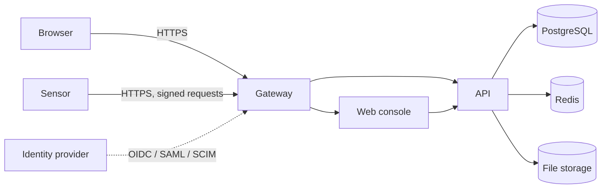

# Security model

OpenCTEM holds a map of an organization's attack surface and its weaknesses, and it can direct sensors
to probe networks. This page describes how the platform protects that data and that capability: who
can sign in, what they can do, how organizations are kept apart, what may be scanned, how sensors and
the platform limit each other, how secrets are stored, and how actions are recorded.

Related pages:

- [Production hardening](hardening.md): the checklist for operators.
- [Vulnerability disclosure](vulnerability-disclosure.md): how to report a security issue.
- [Data handling and privacy](data-handling.md): what is stored, for how long, and how it is deleted.
- [Audit log](audit-log.md): what is recorded and how tampering is detected.
- [Identity and access](../identity/index.md): configuring sign-in, SSO, SCIM and roles.

## Components and trust boundaries

- The **gateway** terminates TLS and is the only published service in the production deployment.
- The **API** makes every authorization decision. The web console holds no authority of its own.
- **Sensors** run in the networks they scan and only make outbound connections to the platform.
- PostgreSQL, Redis and file storage are reached only by the API.

## Authentication

| Principal | Credential | Notes |
|---|---|---|
| Person | Session from email and password (with optional TOTP 2FA), organization SSO (OIDC, SAML), or social sign-in | Short-lived access tokens, rotating refresh tokens |
| Automation | Organization API key `oct_...` | Read-only on the REST API, acts as its creator with a subset of their permissions |
| Identity provider (provisioning) | SCIM token `oct_scim_...` | One organization per token |
| Sensor | Ed25519 key-bound identity (paired sensors), or a sensor key | Accepted only on sensor routes |
| Platform administrator | Separate console session with TOTP | Accepted only on admin routes |

Each credential works only on its own set of routes: a sensor key is refused on user routes, an
organization token on admin routes, and so on.

### Sessions and tokens

- Sign-in creates a **session** for the account. The session yields a refresh token (cookie
  `refresh_token`, `HttpOnly`) and, per organization, a short-lived **access token** (a signed JWT,
  `AUTH_ACCESS_TOKEN_DURATION`, default 15 minutes).
- Refresh tokens (`AUTH_REFRESH_TOKEN_DURATION`, default 7 days) **rotate** on every use. Presenting a
  refresh token that was already used revokes the whole token family. A session ends after
  `AUTH_SESSION_DURATION` (default 30 days) regardless of activity.
- A user can have at most `AUTH_MAX_ACTIVE_SESSIONS` (default 10) sessions; the oldest is revoked
  beyond that. Users see and revoke their sessions under **Account > Security**.
- Sign-out, password change, enabling 2FA, suspension and back-channel logout from an identity
  provider revoke sessions **immediately**: revoked session ids are checked on every request (through
  Redis; without Redis, access tokens stay valid until they expire).
- Cookies are `Secure` (required in production) and `SameSite=Lax` by default. Cookie-authenticated
  requests need a double-submit CSRF token.
- Session tokens, refresh tokens and reset, verification and invitation tokens are stored only as
  hashes.

### Passwords and 2FA

- Passwords: at least 12 characters by default, composition rules, refused if on a list of about 47,000
  commonly breached passwords; stored with bcrypt (cost 12).
- Wrong passwords or codes lock the account after 5 attempts for 15 minutes. Sign-in endpoints have
  per-IP rate limits shared across API replicas, and do not reveal whether an account exists.
- TOTP 2FA with single-use codes and 10 recovery codes; organizations can require it. See
  [Two-factor authentication](../identity/two-factor.md).

### Organization SSO

OIDC (Entra ID, Okta, Google Workspace) and SAML 2.0 per organization. Every ID token is verified
(signature against the provider's keys, issuer, audience, expiry, nonce; PKCE always on). Accounts are
bound to the provider's immutable user id, and a federated sign-in never takes over a password
account. Just-in-time provisioning admits new people only from email domains the organization has
proven with DNS, and never as admin or owner. Organization SSO is configured by the platform
administrator and each change must be approved by an organization owner. An organization can enforce
SSO; its owner keeps password access so the organization cannot be locked out. See
[Identity and access](../identity/index.md).

A sign-in through organization A's identity provider counts as SSO **only for A**. Exchanged for an
access token in another organization, it is treated like a password session, so it cannot skip that
organization's SSO enforcement or 2FA requirement.

### Step-up re-authentication

Actions that create long-lived credentials, change who can sign in, widen scan scope, or delete the
organization or a person's data require a proof of identity from the last 10 minutes in the same
session (a TOTP code, a password, or a fresh sign-in at the identity provider). See
[Step-up re-authentication](../identity/two-factor.md#step-up-re-authentication).

## Authorization

Three layers apply to every organization request:

1. **Roles and permissions**: built-in roles (owner, admin, member, viewer) and custom roles made of
   about 160 permissions. Custom roles cannot hold more than their creator holds, and some sensor and
   CI permissions are reserved for owners and admins.
2. **Data scope**: members and viewers see only the assets assigned to their teams or granted to them
   directly, and the findings and other records linked to those assets. With no assignment they see
   nothing. Out-of-scope records answer `404`.
3. **Modules**: a disabled module answers `403 MODULE_NOT_ENABLED`. Modules are a product switch, not
   a security boundary.

Permissions are re-read on each request, so a revoked permission takes effect at once. Organization
API keys are read-only and never get the owner/admin bypass or full data access.

See [Roles, groups and permissions](../identity/roles-and-permissions.md). The route-by-route matrix is
[authorization-matrix.md](https://github.com/openctemio/openctem/blob/develop/api/docs/architecture/authorization-matrix.md).

## Organization isolation

Organizations (tenants) share one database. Isolation is enforced in the API:

- Every organization-owned table has a `tenant_id`, and every query filters on it.
- The organization is taken from the authenticated credential (access token, API key, SCIM token,
  sensor identity), never from the request body. A record of another organization answers `404`.
- Per-organization configuration (SSO, integrations, credentials, storage settings) is stored per
  organization, and integrations use that organization's credentials only.
- Automated tests check cross-organization access on the API routes.

**Database row-level security** policies exist for the organization-owned tables, but they are **not
enabled**: isolation relies on the application's queries, not on PostgreSQL. Enabling row-level
security table by table is planned. Running the API with the least-privilege database role is a
prerequisite and is recommended now (see [Hardening](hardening.md#use-least-privilege-database-roles)).

## Authorization to scan

Scanning other people's systems without permission is the main abuse risk of a platform like this.
Every path that makes a sensor send traffic to a target passes one fail-closed gate before a job
exists:

- **Scope entries.** A target must be covered by an active, unexpired scope entry of the organization.
  `*.example.com` covers `example.com` and every name below it. Creating, extending or raising the
  tier of an entry is **widening**: it needs the `attack_surface:scope:approve` permission, step-up,
  and (with two or more admins) approval by another person. Others can only request one-off entries.
  Narrowing is always one click. Every widening is audited and notified to owners and admins.
- **Exclusions** are checked on every dispatch.
- **Ownership.** An asset marked as rejected, a candidate, needing review, or a third-party dependency
  is not probed.
- **Domain proof.** An organization proves a domain with a DNS TXT record. Proof is required for
  intrusive (tier T2) checks, for jobs on shared platform sensors (`SCOPE_ACTIVE_PROOF=platform_sensors`)
  or for every active probe (`SCOPE_ACTIVE_PROOF=all`). When unset, the mode is `platform_sensors` if
  organizations are self-service and `off` otherwise.
- **Platform guardrails** set by the operator: no public suffixes, government or military names,
  `0.0.0.0/0`, link-local or cloud metadata addresses, nothing in `SCOPE_DENY_EXTRA`, and public ranges
  no larger than `SCOPE_MAX_PUBLIC_CIDR_V4` (default `/16`) and `SCOPE_MAX_PUBLIC_CIDR_V6` (default
  `/32`).
- **Tier ceilings.** Each scope entry authorizes probes up to a maximum tier; a tool whose checks are
  more intrusive is refused for that target.
- **Private addresses** are allowed only inside the organization's scan zones.

See [Scope and authorization to scan](../scanning/scope.md).

## Sensor and platform trust

The design goal is mutual distrust: a compromised sensor must not be able to attack the platform, and
a compromised platform must not be able to turn sensors into weapons. The current controls:

**Identity.** A paired sensor holds an Ed25519 private key that never leaves its host; every request is
signed (HTTP Message Signatures, RFC 9421) with a nonce and a body digest. Pairing is approved by an
organization admin with step-up after comparing a short code. An organization can require key-bound
identity and refuse bearer-key sensors. Revoking or disabling a sensor takes effect on its next request
and takes back its queued work. See [Pairing and enrollment](../sensors/pairing.md).

**Grants.** Each sensor has a grant (what job types, tools and tiers it may run). Polls and claims are
checked against it, and a missing grant withholds every job. Widening a grant needs step-up and is
notified to admins.

**Results.** The organization always comes from the sensor's identity. A report is bound to a job when
it names a job assigned to that sensor, and a bound report can change only the existing assets its
job covers. Unsolicited reports are accepted from collector and CI roles; from other sensors they are
quarantined for review (the default for new organizations) or applied with limits and audited, by
organization policy. Unsolicited reports never reopen findings a person resolved and never close
findings. Sensor-supplied text is length-capped and rendered as text.

**Sensor-local policy.** The owner of the scanned network can install a read-only policy file on the
sensor host that lists allowed and denied ranges, ports, tools, job types and switches for custom
templates and out-of-band callbacks, plus a kill switch. The sensor refuses any job outside it, even
one the platform sends, and the platform cannot change it. The sensor always refuses loopback,
link-local and cloud metadata addresses, and private ranges unless explicitly allowed. An organization
can require an enforced local policy before private targets are dispatched. See the sensor's
[local policy reference](https://github.com/openctemio/sensor/blob/main/docs/LOCAL_POLICY.md).

**Declarative jobs.** Jobs name a registered tool and its targets; there is no job type that runs a
shell command, and dangerous tool flags are refused. Custom scanner templates sent by the platform are
signed per command (Ed25519, DSSE envelope, one-hour expiry) and verified by the sensor against the
organization key its operator pinned.

**Limits.** Signing of every job by a signing service separate from the API, a separate sensor gateway
process, and two-person approval for every scope widening are **planned** (RFC-040). Today the API
process that serves sensors also serves users. The engineering status is in
[sensor-platform-trust.md](https://github.com/openctemio/openctem/blob/develop/api/docs/architecture/sensor-platform-trust.md).

## Secrets

- **`APP_ENCRYPTION_KEY`** (32 bytes, required outside development) encrypts stored secrets with
  AES-256-GCM: integration credentials and webhook secrets, SSO client secrets, user and admin TOTP
  secrets, file-storage credentials, bring-your-own AI keys, the secret store, and leaked-credential
  values captured as evidence. The API refuses to start in production without it.
- API keys, SCIM tokens and sensor keys are stored only as HMAC-SHA256 hashes keyed with a pepper
  derived from the same key. Their plaintext is shown once at creation.
- **Rotation** is supported: `cmd/rekey` re-encrypts every stored secret in one transaction, and
  `APP_ENCRYPTION_KEY_PREVIOUS` keeps old tokens working while they are re-hashed on use. See
  [Hardening](hardening.md#protect-and-rotate-the-encryption-key).
- Scanner credentials live on the sensor host by design (local configuration or environment). Avoid
  typing secrets into scan configuration fields: they are stored and sent to sensors as given.
- Logs redact fields named like passwords, tokens, secrets, cookies and email addresses.

## Audit log

Security-relevant actions are written to a per-organization audit log, linked into a SHA-256 hash
chain that is verified hourly. Platform administrator actions have their own log. See
[Audit log](audit-log.md).

## Platform administration

Platform administrators use a separate console with its own sessions (8 hours absolute, 30 minutes
idle), a TOTP code at every sign-in, and three roles (`super_admin`, `ops_admin`, `readonly`). The
riskiest console actions (sign-up policy, audit chain rebaseline) need a fresh code. Organization SSO
can never authenticate a platform administrator. Console actions are recorded in the platform audit
log, and actions inside an organization also in that organization's log.

## Secure development

The repositories run static analysis (CodeQL, gosec), dependency and image vulnerability scanning
(govulncheck, Trivy), secret detection and automated dependency updates in CI. Container images are
signed with cosign. Security fixes are published as GitHub security advisories; see
[Vulnerability disclosure](vulnerability-disclosure.md).
