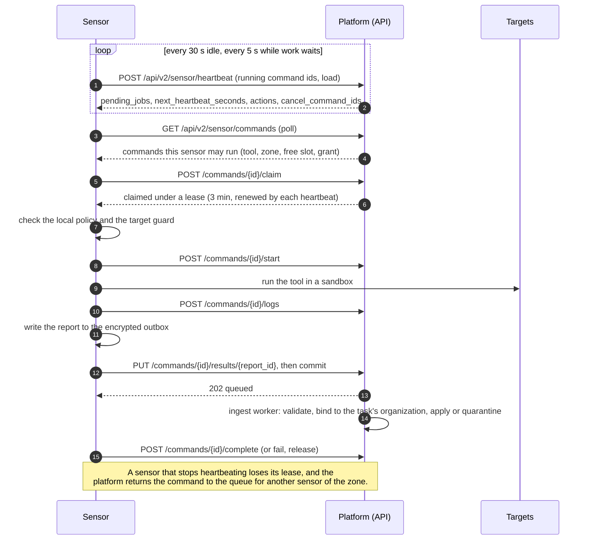

# Sensors

A **sensor** is OpenCTEM software that runs in your network, connects out to
the platform, and does the work that touches your systems: port scans, HTTP
probes, vulnerability templates, code scans. The platform never opens a
connection to a sensor and never sends packets to your targets itself. It
plans the work; sensors pull it, run it and send the results back.

The scanning sensor is [`openctemio/sensor`](https://github.com/openctemio/sensor)
(binary `openctemio-sensor`, image `ghcr.io/openctemio/sensor`). It is built on
the sensor runtime of [`openctemio/sdk-go`](https://github.com/openctemio/sdk-go).

## Roles

Every sensor has one role. The role decides what work it may receive.

| Role | Type in the API | Does | Status |
|---|---|---|---|
| Scanner | `worker` ("Worker (scans)" in the console) | Assesses other hosts and repositories: runs the scans the platform dispatches. Routed by [scan zone](zones.md). | Shipped: `openctemio/sensor` |
| Collector | `collector` | Pushes inventory from systems inside your network on its own schedule. Takes no dispatched scans; its tools have the kind `collector` and cannot be picked in a scan. | Supported by the platform and the SDK runtime |
| Agent (endpoint) | `sensor` ("Endpoint" in the console) | Reports only about the host it is installed on (grant profile `endpoint-agent`). | Planned: no endpoint agent is released yet |

CI pipelines are not sensors. They report with their CI provider's OIDC
identity; see [CI integration](../scanning/ci-integration.md).

## Organization sensors and platform sensors

- **Organization sensors** are installed by an organization, appear on its
  **Sensors** page and only ever take that organization's work. Every scan in
  the current release runs on organization sensors.
- **Platform sensors** are shared sensors that a platform operator runs and
  manages in the platform admin console. They never appear on an
  organization's Sensors page, and their output never names them. In the
  current release no organization may send scans to platform sensors; the
  scan option exists in the data model but is not offered. Where an operator
  offers them, every target must be at or under a verified domain (see
  [Scope](../scanning/scope.md#proof-of-control)).

## How work reaches a sensor

The sensor speaks **protocol v2** over HTTPS (`/api/v2/sensor/*` on the
platform URL). A planned protocol v3 (gRPC with mutual TLS, HTTPS fallback)
is not released.

A **command** is the sensor-side name of a [scan run's task](../scanning/scans-and-runs.md#steps-and-tasks).
The paths above are under `/api/v2/sensor`. A sensor that paired signs every
request with its own key ([Pairing](pairing.md)); there is no separate lease
renewal call, because the heartbeat lists the commands the sensor is running.

1. **Heartbeat.** About every 30 seconds while idle, every 5 seconds while work
   is waiting. The answer says whether work is waiting (the "doorbell"); it
   never carries a job.
2. **Pull and claim.** The sensor polls for commands and claims the ones it
   may run. A command is offered only to a sensor that reports the command's
   tool installed, belongs to the command's scan zone, has a free slot, and
   whose [grant](pairing.md#grants-and-trust) admits the job.
3. **Lease.** A claimed command is held under a lease (3 minutes by default)
   that every heartbeat renews. If the sensor stops heartbeating, the lease
   runs out and the command goes back to the queue for another sensor of the
   same zone. A sensor that lost a command can no longer complete it, so a
   result is never stored twice.
4. **Local checks.** Before any tool starts, the sensor checks the job against
   its [local policy](network.md#sensor-local-policy) and its target guard.
5. **Results.** Results are written to an encrypted on-disk outbox first and
   deleted only after the platform accepted them, so a restart or an outage
   loses nothing.
6. **Cancel.** Canceling a run tells the holding sensor on its next heartbeat;
   it stops the tool.

## What runs inside

The sensor runs the tools installed next to it and reports them, with their
versions, in its manifest. Nothing is declared on the platform: a scan for a
tool is dispatched only to sensors that report that tool installed.

Images are published as `ghcr.io/openctemio/sensor:<version>` (and
`<version>-<variant>`); pin a version.

| Image | Tools | Default command |
|---|---|---|
| `sensor:<version>` (also `-default`) | nuclei, subfinder, dnsx, naabu, httpx, katana, with a pinned nuclei-templates release | `-daemon -enable-commands -verbose` |
| `sensor:<version>-nuclei` | nuclei | `-tool nuclei --help` |
| `sensor:<version>-semgrep` | semgrep | `-tool semgrep --help` |
| `sensor:<version>-trivy` | trivy | `-tool trivy --help` |
| `sensor:<version>-betterleaks` | betterleaks | `-tool betterleaks --help` |

{: .note }
From sensor v0.11.0 the default image carries nuclei and the recon tools only.
Up to v0.10.0 it also carried semgrep, betterleaks and trivy. Code scanning in
CI moved to [`openctemio/ci`](../scanning/ci-integration.md). A daemon that must
run semgrep, betterleaks or trivy uses the per-tool image.

`openctemio-sensor -list-tools` prints each scanner and whether its binary is
available. `SENSOR_TOOLS` (or `-tools`) is an optional allowlist that narrows
what the sensor runs and reports.

Every tool run is confined: a private throwaway directory, resource limits,
no privilege escalation, Landlock file access rules (Linux 5.13 or later) and
a seccomp filter. `SENSOR_SANDBOX=required` makes the sensor refuse to start
when the host cannot enforce all of it. The sensor never uses a Docker socket.

## Health on the Sensors page

**Discovery > Sensors** lists the organization's sensors with a computed
state: `online`, `degraded` (online with a health reason, for example a
failed setup check or stale scanner content), `late`, `stale`, `offline`,
`never_connected`, `disabled` or `revoked`. A sensor that is `late` still
takes work; `stale` and `offline` sensors do not, and their pending work is
released to the rest of the zone. Each sensor's drawer shows its setup
checklist, tools and content, grant, local policy state and activity.

## Next

- Install: [Docker](deploy-docker.md), [Kubernetes](deploy-kubernetes.md) or
  [binary](deploy-binary.md)
- [Pair it](pairing.md) with your organization
- Route it with [scan zones](zones.md) and check the
  [network requirements](network.md)
- [Troubleshooting](troubleshooting.md)
