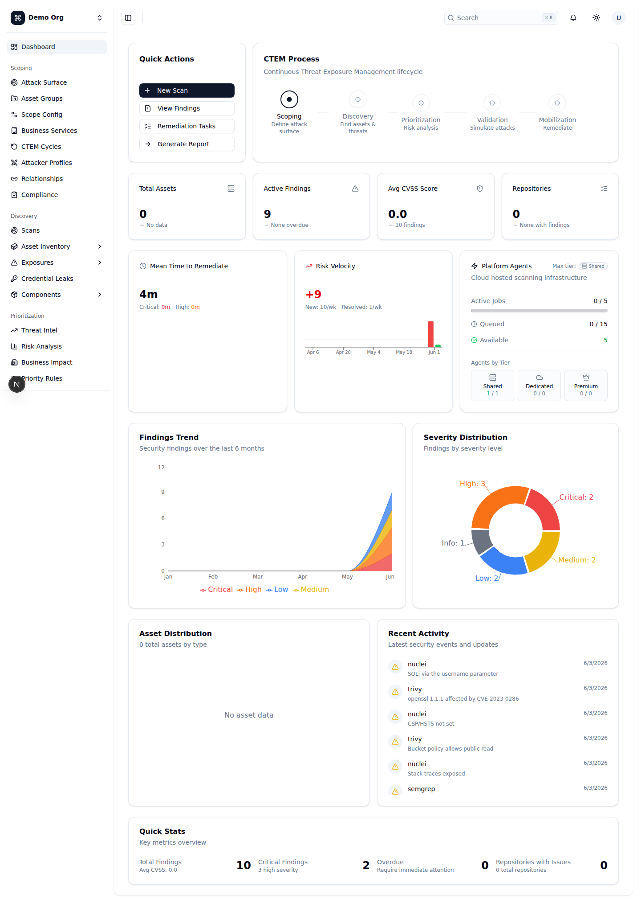
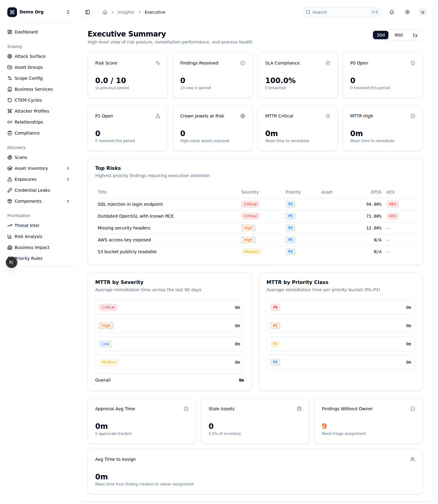
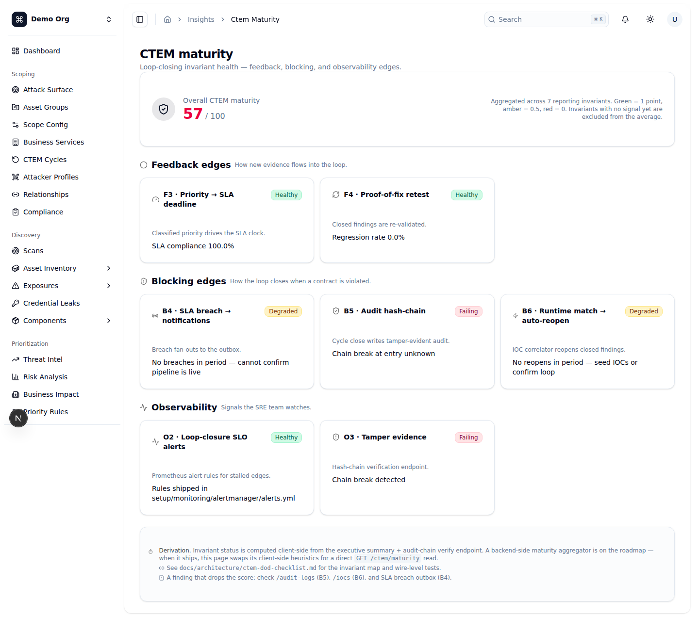
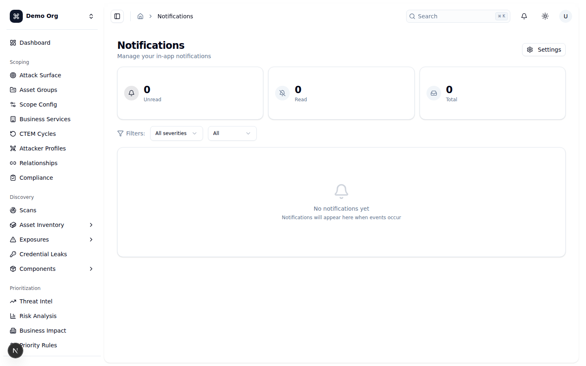
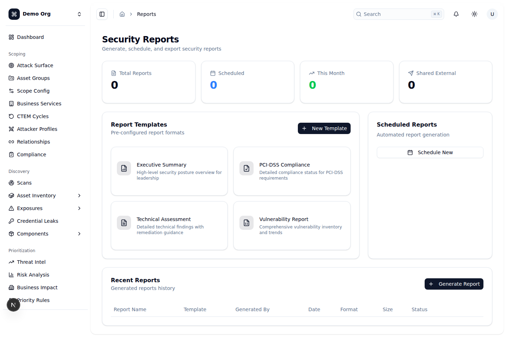
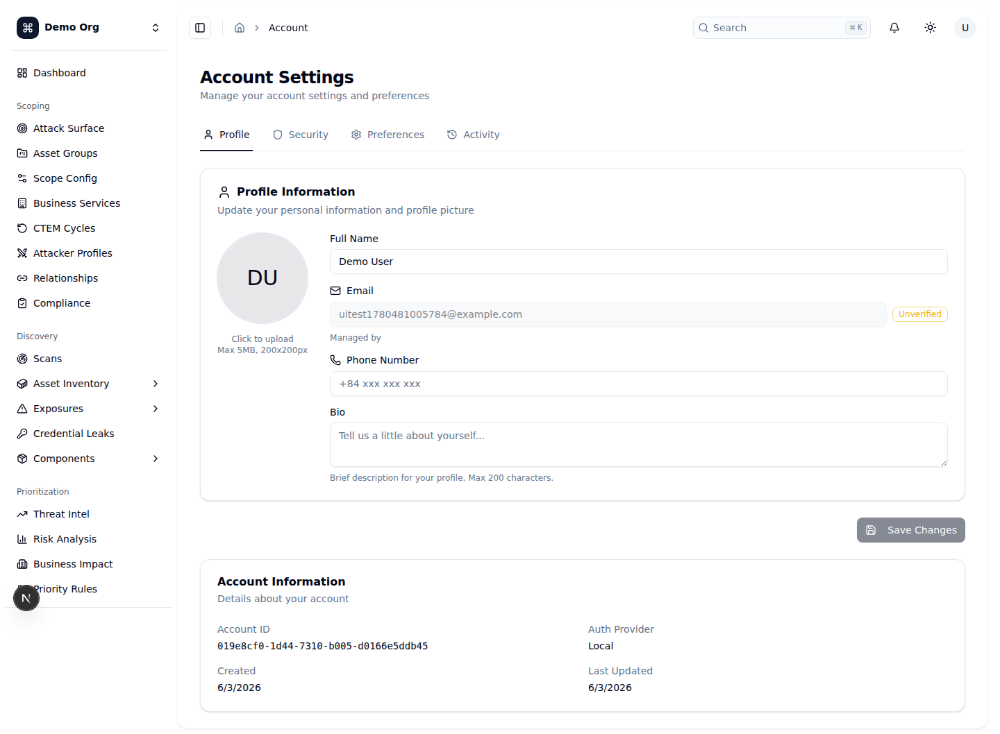
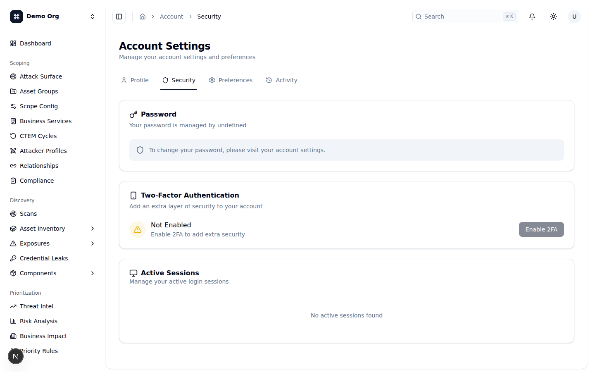
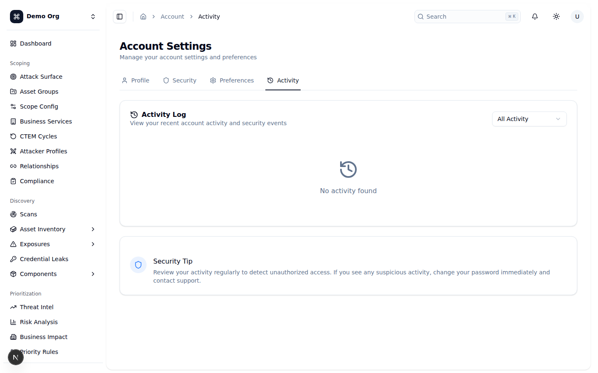

# Hướng dẫn sử dụng OpenCTEM — Phần 1: Bắt đầu & Dashboard

## OpenCTEM là gì?

OpenCTEM là một nền tảng **Continuous Threat Exposure Management (CTEM)** đa người thuê (multi-tenant) — nghĩa là mỗi tổ chức (team/tenant) có dữ liệu tách biệt hoàn toàn với nhau. Toàn bộ nền tảng được tổ chức theo **5 giai đoạn của vòng đời CTEM**:

1. **Scoping** — Xác định bề mặt tấn công và bối cảnh nghiệp vụ (attack surface, business context).
2. **Discovery** — Phát hiện tài sản (assets), lỗ hổng và các điểm phơi nhiễm (exposures).
3. **Prioritization** — Xếp hạng rủi ro theo khả năng bị khai thác và mức độ tác động.
4. **Validation** — Kiểm chứng mối đe dọa và thử nghiệm các biện pháp kiểm soát an ninh.
5. **Mobilization** — Thực thi việc khắc phục (remediation) và theo dõi tiến độ.

### Đăng nhập

- Truy cập trang `/login`. Bạn có thể đăng nhập bằng **email + mật khẩu** hoặc qua **SSO** với `Google`, `GitHub` hoặc `Microsoft`.
- Người dùng **đầu tiên** chưa thuộc tenant nào sẽ được chuyển tới luồng onboarding `/onboarding/create-team` để **tạo một team/tenant mới**. Sau khi tạo xong, bạn sẽ vào thẳng Dashboard.
- Luồng tổng quát: `Chưa đăng nhập → /login → Chưa có tenant → /onboarding/create-team → Dashboard`.

### Giao diện chung (global chrome)

Mọi trang trong khu vực dashboard đều dùng chung bộ khung sau:

- **Sidebar bên trái**: điều hướng được nhóm theo đúng 5 giai đoạn CTEM (`Scoping`, `Discovery`, `Prioritization`, `Validation`, `Mobilization`), bên trên cùng là mục `Dashboard`. Một số mục có menu con (ví dụ `Asset Inventory`, `Exposures`).
- **Thanh trên cùng (header)** chứa, từ trái sang phải, bốn thành phần:
  - `Search` — ô tìm kiếm toàn cục, mở **command palette** bằng phím tắt **Cmd/Ctrl + K**.
  - `NotificationBell` — chuông thông báo, hiển thị số thông báo chưa đọc.
  - `ThemeSwitch` — nút chuyển chủ đề sáng/tối (light/dark).
  - `ProfileDropdown` — menu tài khoản (truy cập `Account`, đăng xuất...).
- **Tenant switcher** (`team-switcher`) cho phép chuyển nhanh giữa các tenant/team mà bạn là thành viên.

> Lưu ý quyền: nhiều nút/màn hình bị ẩn hoặc vô hiệu hóa tùy theo phân quyền RBAC của bạn (cơ chế `Can` / `PermissionGate`). Nếu không thấy một nút, rất có thể bạn chưa có quyền tương ứng.

---

## Dashboard / Tổng quan (`/`)
**Mục đích:** Cung cấp cái nhìn tổng quan về tình trạng CTEM của tenant hiện tại — vị trí trong vòng đời CTEM, các chỉ số chính, xu hướng và hoạt động gần đây.
**Cách dùng:**
1. Khối **`CTEM Process`** hiển thị một thanh tiến trình (stepper) tự động xác định giai đoạn hiện tại từ dữ liệu thật: chưa có asset → `Scoping`; có asset nhưng chưa có finding → `Discovery`; có finding → `Prioritization`; có finding đã triage → `Validation`; có finding đã resolved/closed → `Mobilization`.
2. Khối **`Quick Actions`** chứa 4 nút điều hướng nhanh: `New Scan` (tới `/scans`), `View Findings` (`/findings`), `Remediation Tasks` (`/remediation`), `Generate Report` (`/reports`).
3. Hàng **stat cards** hiển thị `Total Assets`, `Active Findings`, `Avg CVSS Score`, `Repositories`.
4. Hàng vận hành gồm các thẻ `MTTR`, `Risk Velocity` và `Platform Agents` (`PlatformStatsCard`).
5. Hàng biểu đồ: **`Findings Trend`** (diện tích, theo severity trong 6 tháng) và **`Severity Distribution`** (biểu đồ tròn theo mức độ nghiêm trọng).
6. Phần dưới gồm **`Asset Distribution`** (biểu đồ cột theo loại tài sản), **`Recent Activity`** (sự kiện gần nhất, tối đa 10 dòng) và **`Quick Stats`** (`Total Findings`, `Critical Findings`, `Overdue`, `Repositories with Issues`).
**Ghi chú:** Khi tenant chưa có dữ liệu, các khối hiển thị trạng thái rỗng như “No findings trend data”, “No asset data”, “No recent activity”. Các nút trong `Quick Actions` bị **vô hiệu hóa kèm tooltip** nếu bạn thiếu quyền tương ứng (`scans:write`, `findings:read`, `remediation:read`, `reports:read`). Nếu API lỗi sẽ có banner vàng “Failed to load dashboard data” với nút `Retry`.

## Executive Summary (`/insights/executive`)
**Mục đích:** Bảng tổng hợp cấp lãnh đạo về tư thế rủi ro, hiệu suất khắc phục và sức khỏe quy trình.
**Cách dùng:**
1. Dùng bộ chọn khoảng thời gian ở góc phải tiêu đề: `30d`, `90d`, `1y` để đổi kỳ báo cáo cho phần tổng hợp.
2. Hàng stat cards trên cùng: `Risk Score` (thang /10, kèm thay đổi so với kỳ trước), `Findings Resolved`, `SLA Compliance`, `P0 Open`.
3. Hàng chỉ số phụ: `P1 Open`, `Crown Jewels at Risk`, `MTTR Critical`, `MTTR High`.
4. Bảng **`Top Risks`** liệt kê các finding ưu tiên cao nhất với cột `Title`, `Severity`, `Priority` (P0–P3), `Asset`, `EPSS`, `KEV`.
5. Hai thẻ **`MTTR by Severity`** và **`MTTR by Priority Class`** (cố định 90 ngày) hiển thị thời gian khắc phục trung bình.
6. Khối **Process Metrics**: `Approval Avg Time`, `Stale Assets`, `Findings Without Owner`, `Avg Time to Assign` (cố định 90 ngày).
**Ghi chú:** Khi không đủ dữ liệu, bạn sẽ thấy “No top risks for the selected period.”, “Not enough resolved findings to calculate MTTR.” hoặc “No priority class data yet.”. Lưu ý MTTR và Process Metrics luôn tính trên 90 ngày bất kể bộ chọn kỳ ở trên.

## CTEM maturity (`/insights/ctem-maturity`)
**Mục đích:** Theo dõi sức khỏe của từng “invariant” (bất biến) khép kín vòng lặp CTEM — các cạnh feedback, blocking và observability — để xem nhanh phần nào đang xanh/vàng/đỏ.
**Cách dùng:**
1. Thẻ **`Overall CTEM maturity`** ở đầu trang hiển thị điểm trưởng thành tổng (0–100): mỗi invariant Healthy = 1 điểm, Degraded = 0.5, Failing = 0; những invariant chưa có tín hiệu bị loại khỏi mẫu số.
2. Mục **`Feedback edges`**: gồm `F3 · Priority → SLA deadline` (xanh khi SLA compliance ≥ 90%) và `F4 · Proof-of-fix retest` (xanh khi regression rate < 5%).
3. Mục **`Blocking edges`**: `B4 · SLA breach → notifications`, `B5 · Audit hash-chain`, `B6 · Runtime match → auto-reopen`.
4. Mục **`Observability`**: `O2 · Loop-closure SLO alerts`, `O3 · Tamper evidence`.
5. Mỗi thẻ hiển thị nhãn trạng thái `Healthy` / `Degraded` / `Failing` / `Unknown` cùng dòng chi tiết.
**Ghi chú:** Trạng thái được tính phía client từ executive-summary và endpoint kiểm tra chuỗi audit. Việc xác minh chuỗi audit (`B5`/`O3`) là **chỉ dành cho admin** — người không phải admin sẽ thấy hai thẻ này ở trạng thái `Unknown` (server trả 403). Nếu tenant chưa có tín hiệu nào, trang hiện cảnh báo “No CTEM signals available yet.”.

## Notifications (`/notifications`)
**Mục đích:** Quản lý các thông báo trong ứng dụng (in-app notifications) gửi tới bạn khi có sự kiện an ninh.
**Cách dùng:**
1. Ba thẻ thống kê ở đầu trang: `Unread` (chưa đọc), `Read` (đã đọc), `Total` (tổng).
2. Nếu có thông báo chưa đọc, nút **`Mark all as read`** xuất hiện ở góc phải để đánh dấu tất cả là đã đọc. Nút **`Settings`** dẫn tới `/settings/notifications`.
3. Khu vực **Filters** có hai bộ lọc: theo `Severity` (`All severities`/`Critical`/`High`/`Medium`/`Low`/`Info`) và theo trạng thái đọc (`All`/`Unread`/`Read`). Đổi bộ lọc sẽ tự về trang 1.
4. Mỗi dòng thông báo hiển thị tiêu đề, nhãn loại, mức severity và thời gian tương đối; thông báo chưa đọc có nền nhấn và chấm tròn. Bấm vào một thông báo (nếu có liên kết) sẽ điều hướng tới mục liên quan và tự đánh dấu đã đọc.
5. Dùng **`Previous`** / **`Next`** ở cuối để phân trang (20 mục mỗi trang).
**Ghi chú:** Khi rỗng hiển thị “No notifications yet”; khi lọc không khớp hiển thị “No matching notifications”. Nếu tải lỗi sẽ hiện “Failed to load notifications”.

## Security Reports (`/reports`)
**Mục đích:** Tạo, lên lịch và xuất các báo cáo an ninh.
**Cách dùng:**
1. Hàng thống kê ở đầu trang: `Total Reports`, `Scheduled`, `This Month`, `Shared External`.
2. Khối **`Report Templates`** liệt kê các mẫu dựng sẵn (`Executive Summary`, `PCI-DSS Compliance`, `Technical Assessment`, `Vulnerability Report`); nút `New Template` để tạo mẫu mới.
3. Khối **`Scheduled Reports`** hiển thị các báo cáo tự động theo lịch, kèm nút `Schedule New`.
4. Bảng **`Recent Reports`** liệt kê lịch sử báo cáo đã tạo (`Report Name`, `Template`, `Generated By`, `Date`, `Format`, `Size`, `Status`), với nút `Generate Report` để tạo báo cáo mới.
**Ghi chú:** Phần backend báo cáo hiện **chưa được nối hoàn chỉnh** — các số thống kê mặc định là 0, danh sách `Scheduled Reports` và bảng `Recent Reports` đang trống. Đây là giao diện khung; các mẫu báo cáo hiển thị nhưng dữ liệu lịch sử/lịch chạy sẽ xuất hiện khi backend reports được triển khai.

## Account Settings — Profile (`/account`)
**Mục đích:** Quản lý thông tin cá nhân và ảnh đại diện của tài khoản.
**Cách dùng:**
1. Trang `Account Settings` có thanh tab: `Profile`, `Security`, `Preferences`, `Activity`. Tab `Profile` là mặc định.
2. Khối **`Profile Information`**: rê chuột lên avatar rồi bấm để **tải ảnh lên** (tối đa 5MB, sẽ được thu nhỏ về ~200×200px). Ảnh mới ở trạng thái “Preview - Unsaved”; bấm `Save` để lưu hoặc `Cancel` để hủy. Nếu đã có avatar, có thể bấm `Remove` để xóa.
3. Chỉnh các trường `Full Name`, `Phone Number`, `Bio`. Trường `Email` ở chế độ chỉ đọc và có huy hiệu `Verified`/`Unverified`.
4. Bấm **`Save Changes`** (chỉ bật khi có thay đổi) để lưu hồ sơ.
5. Khối **`Account Information`** hiển thị `Account ID`, `Auth Provider`, `Created`, `Last Updated`.
**Ghi chú:** Nếu tài khoản đăng nhập qua SSO (auth provider khác `local`), email sẽ ghi chú “Managed by &lt;provider&gt;”. Bio giới hạn ~200 ký tự.

## Account Settings — Security (`/account/security`)
**Mục đích:** Quản lý mật khẩu, xác thực hai lớp (2FA) và các phiên đăng nhập đang hoạt động.
**Cách dùng:**
1. Khối **`Password`**: với tài khoản `local`, bấm `Change Password` để mở hộp thoại nhập `Current Password`, `New Password` (tối thiểu 8 ký tự) và `Confirm New Password`, sau đó bấm `Change Password`.
2. Khối **`Two-Factor Authentication`** hiển thị trạng thái `Enabled`/`Not Enabled`. Nút `Enable 2FA`/`Manage 2FA` hiện đang **bị vô hiệu hóa** (tooltip “Coming soon”).
3. Khối **`Active Sessions`** liệt kê phiên hiện tại (gắn nhãn `Current`) và các phiên khác kèm trình duyệt/OS, IP, vị trí, thời điểm hoạt động cuối. Bấm biểu tượng đăng xuất trên một phiên để thu hồi nó; bấm **`Sign Out All Others`** để thu hồi tất cả phiên còn lại. Mọi thao tác thu hồi đều có hộp thoại xác nhận.
**Ghi chú:** Nếu đăng nhập qua SSO, khối mật khẩu sẽ hiển thị thông báo phải đổi mật khẩu tại nhà cung cấp tương ứng (không có nút đổi tại đây). Khi không có phiên nào: “No active sessions found”. Tính năng 2FA hiện chưa khả dụng.

## Account Settings — Activity (`/account/activity`)
**Mục đích:** Xem lịch sử hoạt động của tài khoản và các sự kiện an ninh liên quan tới bạn.
**Cách dùng:**
1. Khối **`Activity Log`** liệt kê các sự kiện; mỗi dòng có biểu tượng theo nhóm hành động, tiêu đề hành động, huy hiệu kết quả (thành công/thất bại), thông điệp, IP và thời gian tương đối.
2. Dùng bộ lọc ở góc phải để lọc theo loại: `All Activity`, `Authentication`, `Account`, `Settings`, `Permissions`. Đổi bộ lọc sẽ tự về trang 1.
3. Dùng các nút mũi tên ở cuối để phân trang (10 mục mỗi trang).
4. Cuối trang có khối **`Security Tip`** nhắc bạn rà soát hoạt động định kỳ để phát hiện truy cập trái phép.
**Ghi chú:** Khi không có dữ liệu hiển thị “No activity found”. Danh sách được lọc và phân trang phía client dựa trên nhật ký hoạt động của chính người dùng đang đăng nhập.

---

## Checklist

- [x] Dashboard / Tổng quan (`/`) — đã tài liệu hóa: CTEM stepper, Quick Actions, stat cards, biểu đồ trend/severity, asset distribution, recent activity, quick stats.
- [x] Executive Summary (`/insights/executive`) — đã tài liệu hóa: bộ chọn kỳ 30/90/365 ngày, stat cards, Top Risks, MTTR, Process Metrics.
- [x] CTEM maturity (`/insights/ctem-maturity`) — đã tài liệu hóa: điểm trưởng thành tổng, các invariant feedback/blocking/observability, lưu ý quyền admin cho audit chain.
- [x] Notifications (`/notifications`) — đã tài liệu hóa: thống kê, bộ lọc severity/trạng thái, mark-as-read, phân trang.
- [x] Security Reports (`/reports`) — đã tài liệu hóa: thống kê, templates, scheduled, recent reports; ghi chú backend chưa nối.
- [x] Account Settings — Profile (`/account`) — đã tài liệu hóa: avatar, các trường hồ sơ, Account Information.
- [x] Account Settings — Security (`/account/security`) — đã tài liệu hóa: đổi mật khẩu, 2FA (coming soon), quản lý phiên.
- [x] Account Settings — Activity (`/account/activity`) — đã tài liệu hóa: nhật ký hoạt động, bộ lọc, phân trang.
