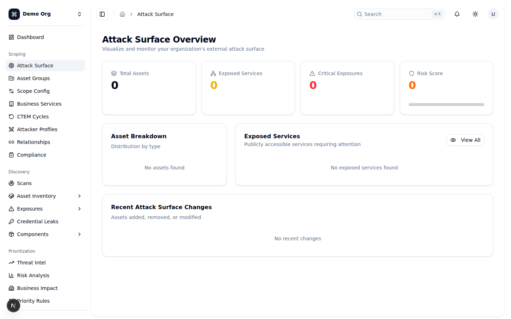
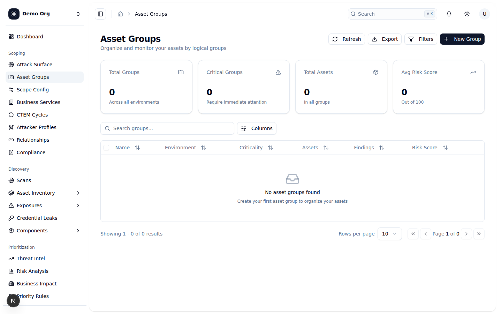
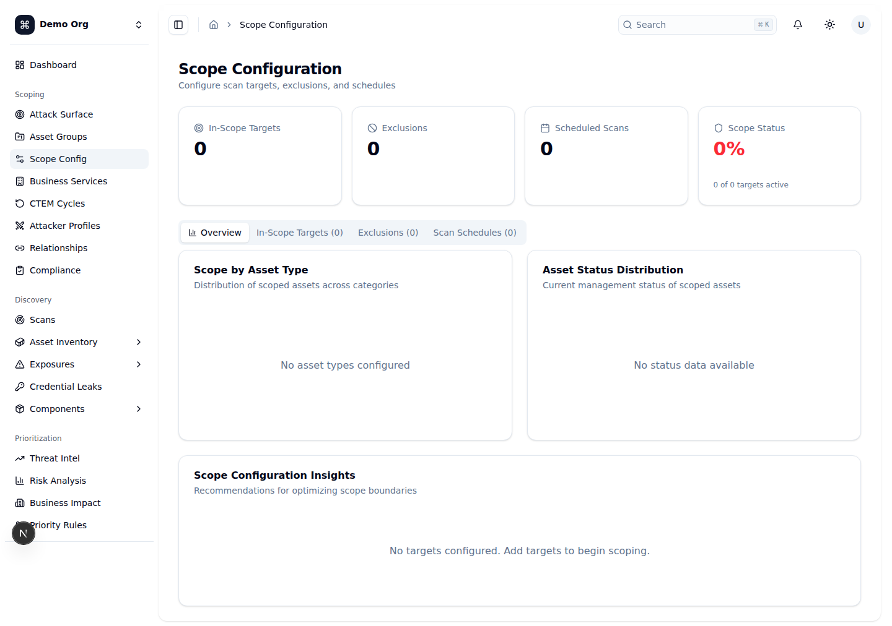
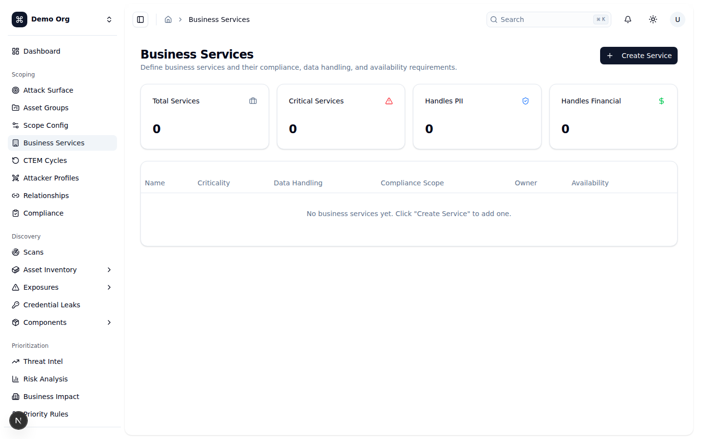
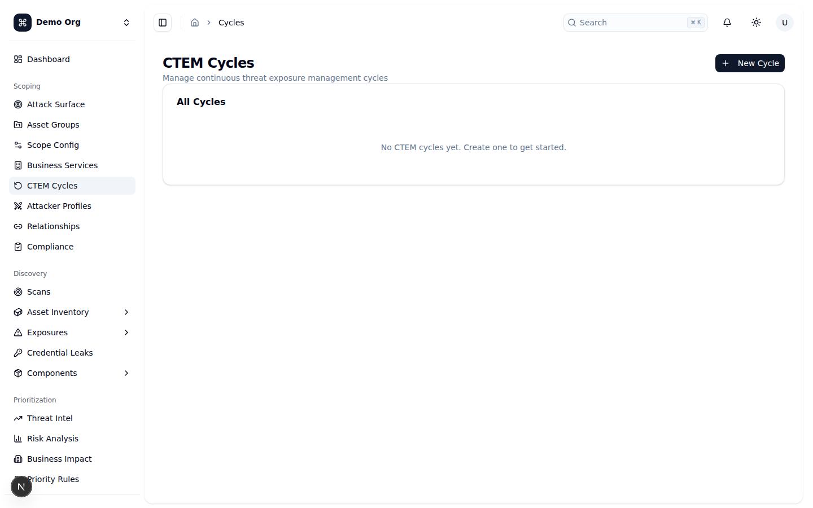
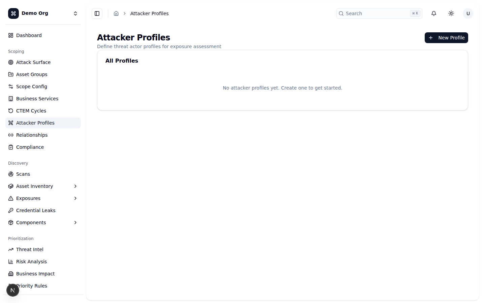
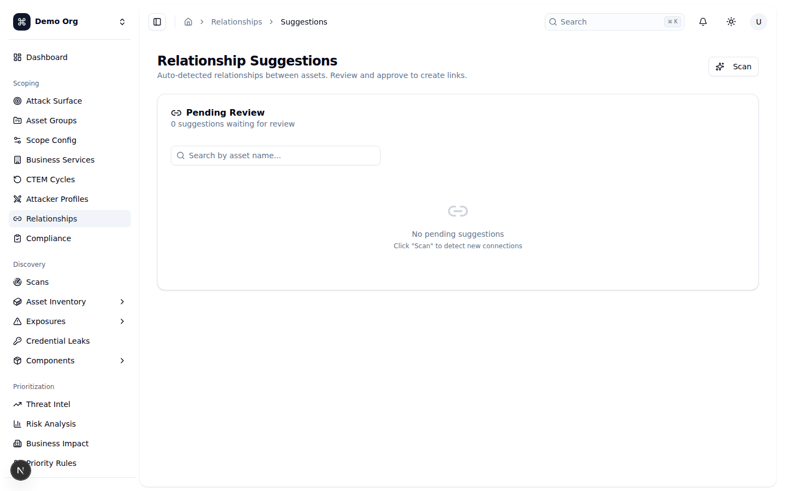
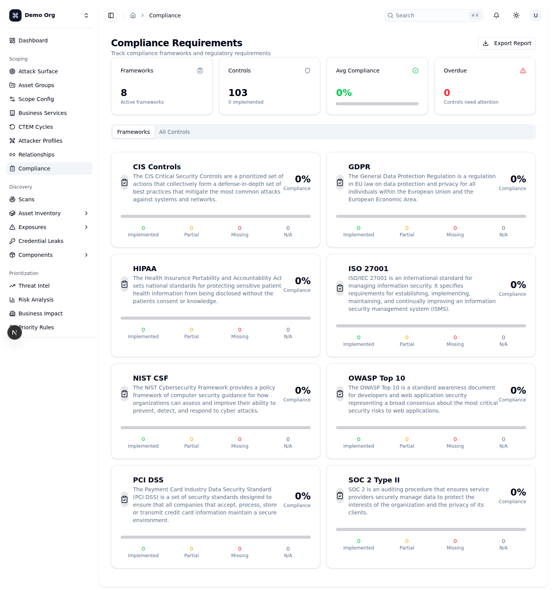
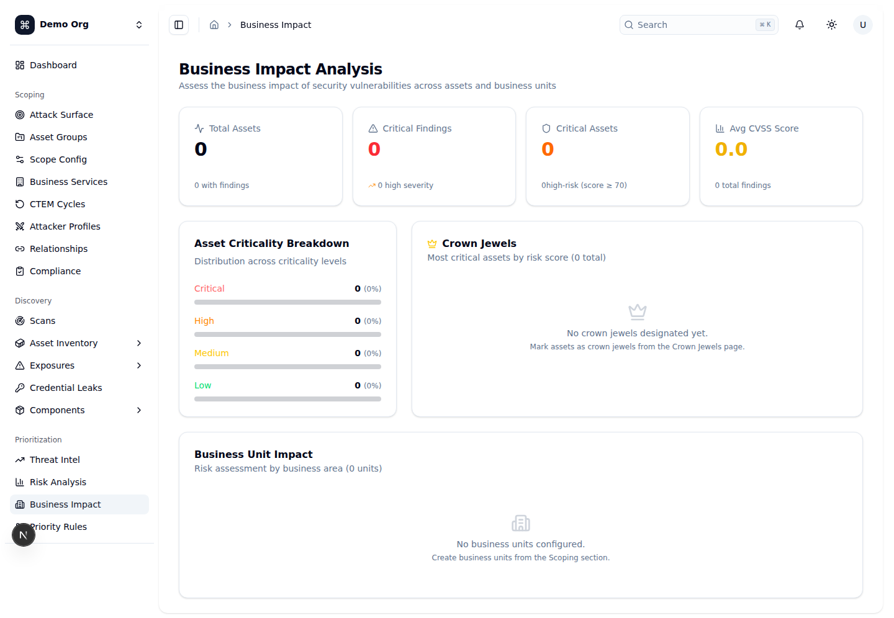

# Giai đoạn Scoping (Xác định phạm vi)

Scoping là giai đoạn đầu tiên của vòng đời CTEM: bạn quyết định *cái gì* nằm trong phạm vi đánh giá phơi nhiễm và gắn nó với *bối cảnh nghiệp vụ*. Trong OpenCTEM, bạn bắt đầu bằng việc quan sát bề mặt tấn công (`Attack Surface`), gom tài sản thành các nhóm logic (`Asset Groups`), khai báo target/exclusion và lịch quét (`Scope Configuration`), rồi gắn ý nghĩa nghiệp vụ thông qua dịch vụ nghiệp vụ (`Business Services`), yêu cầu tuân thủ (`Compliance`) và phân tích tác động (`Business Impact`). Mỗi chu kỳ đánh giá được đóng khung bằng một `CTEM Cycle`, còn `Attacker Profiles` và `Relationship Suggestions` giúp định hình góc nhìn của kẻ tấn công và bản đồ quan hệ giữa các tài sản. Cùng nhau, các tính năng này trả lời câu hỏi "chúng ta đang bảo vệ cái gì và tại sao nó quan trọng" trước khi chuyển sang giai đoạn Discovery.

## Attack Surface Overview (`/attack-surface`)
**Mục đích:** Cung cấp cái nhìn tổng quan về bề mặt tấn công của tổ chức — tổng số tài sản, dịch vụ đang phơi nhiễm, số phơi nhiễm nghiêm trọng (`Critical Exposures`) và điểm rủi ro (`Risk Score`) — để xác định phạm vi cần theo dõi.
**Cách dùng:**
1. Mở `/attack-surface`. Bốn thẻ thống kê ở đầu trang hiển thị `Total Assets`, `Exposed Services`, `Critical Exposures` và `Risk Score`, kèm xu hướng thay đổi trong tuần.
2. Xem khối `Asset Breakdown` để biết phân bố tài sản theo loại (`Domains`, `Hosts`, `Cloud Accounts`, ...) và số lượng đang phơi nhiễm của mỗi loại.
3. Trong khối `Exposed Services`, xem các dịch vụ truy cập công khai cần chú ý; nhấn `View All` để xem đầy đủ.
4. Cuộn xuống `Recent Attack Surface Changes` để theo dõi tài sản được thêm (`added`), gỡ bỏ (`removed`) hoặc thay đổi (`modified`).
**Ghi chú:** Trang này chỉ đọc, dùng để quan sát — không có thao tác chỉnh sửa. Khi chưa có dữ liệu, các khối hiển thị "No assets found", "No exposed services found" hoặc "No recent changes". Nếu tải lỗi sẽ có banner đỏ "Failed to load attack surface data". Trang còn có các tab con `external`, `internal`, `cloud` để xem chi tiết theo vùng phơi nhiễm.

## Asset Groups (`/asset-groups`)
**Mục đích:** Tổ chức tài sản thành các nhóm logic theo môi trường (`environment`) và mức độ trọng yếu (`criticality`) để theo dõi rủi ro và findings theo từng nhóm.
**Cách dùng:**
1. Mở `/asset-groups`. Các thẻ thống kê hiển thị `Total Groups`, `Critical Groups`, `Total Assets` và `Avg Risk Score`.
2. Nhấn `New Group` để tạo nhóm mới (cần quyền ghi).
3. Dùng `Filters` để lọc theo `Environment` (production/staging/development/testing), `Criticality` (critical/high/medium/low), khoảng `Risk Score` và `Has Findings`/`No Findings`; nhấn `Apply` hoặc `Clear all`.
4. Trên mỗi dòng, mở menu `...` để `Quick View`, `Open Full Page`, `Edit`, `Add Assets`, `Manage Assets`, `Copy ID`, `Copy Link` hoặc `Delete`.
5. Chọn nhiều nhóm bằng checkbox để thực hiện thao tác hàng loạt: đổi `Criticality`, đổi `Environment` hoặc `Delete`.
6. Nhấn `Export` để xuất CSV/JSON, `Refresh` để tải lại.
**Ghi chú:** Các hành động `Edit`/`Add Assets`/`Manage Assets` yêu cầu quyền `AssetGroupsWrite`; `Delete` yêu cầu `AssetGroupsDelete`; nút `New Group` bị vô hiệu hóa nếu thiếu quyền ghi. Khi chưa có nhóm, bảng hiển thị "No asset groups found" với gợi ý tạo nhóm đầu tiên. Xóa nhóm sẽ bỏ gán (unassign) tất cả tài sản trong nhóm chứ không xóa tài sản.

## Scope Configuration (`/scope-config`)
**Mục đích:** Cấu hình ranh giới phạm vi: khai báo target trong phạm vi (`In-Scope Targets`), loại trừ (`Exclusions`) và lịch quét tự động (`Scan Schedules`).
**Cách dùng:**
1. Mở `/scope-config`. Thẻ thống kê hiển thị `In-Scope Targets`, `Exclusions`, `Scheduled Scans` và `Scope Status` (% độ phủ).
2. Tab `Overview` hiển thị biểu đồ `Scope by Asset Type`, `Asset Status Distribution` và các khuyến nghị trong `Scope Configuration Insights`.
3. Tab `In-Scope Targets`: nhấn `Add Target`, chọn `Type` (theo nhóm Network & External, Applications, Cloud, Infrastructure, Code & CI/CD, Other), nhập `Pattern` (có validate định dạng và kiểm tra trùng) và `Description`. Bật/tắt trạng thái bằng `Switch`, hoặc dùng menu `...` để `Edit`/`Remove`.
4. Tab `Exclusions`: nhấn `Add Exclusion`, nhập `Type`, `Pattern` và `Reason` cho phần loại trừ khỏi đánh giá.
5. Tab `Scan Schedules`: nhấn thêm lịch, đặt `Name`, `Scan Type`, `Frequency` (hourly → continuous, on_commit, on_demand), `Targets` (danh sách cách nhau dấu phẩy) và `Time`. Có thể chạy ngay bằng `Run Now`.
6. Dùng ô tìm kiếm và bộ lọc theo loại ở mỗi tab; danh sách có phân trang.
**Ghi chú:** Mọi thao tác thêm/sửa/xóa target và exclusion yêu cầu quyền `ScopeWrite`; xóa yêu cầu `ScopeDelete`; công tắc bật/tắt trạng thái bị vô hiệu khi thiếu `ScopeWrite`. Pattern không hợp lệ hoặc trùng sẽ báo lỗi đỏ ngay trong form. Khi chưa có dữ liệu, bảng hiển thị "No targets configured yet. Click 'Add Target' to get started." Nếu thêm target gây chồng lấn (overlap), hệ thống hiển thị cảnh báo dạng toast.

## Business Services (`/business-services`)
**Mục đích:** Định nghĩa các dịch vụ nghiệp vụ cùng yêu cầu tuân thủ, đặc tính xử lý dữ liệu (PII/PHI/Financial) và mục tiêu khả dụng (availability, RPO, RTO) để gắn bối cảnh nghiệp vụ cho phạm vi.
**Cách dùng:**
1. Mở `/business-services`. Thẻ thống kê hiển thị `Total Services`, `Critical Services`, `Handles PII` và `Handles Financial`.
2. Nhấn `Create Service` để mở form (cần quyền ghi).
3. Nhập `Name` (bắt buộc), `Description`, chọn `Criticality` (critical/high/medium/low).
4. Trong `Compliance Scope`, bật các khung tuân thủ áp dụng: `PCI-DSS`, `HIPAA`, `SOC2`, `GDPR`, `ISO27001`, `NIST`.
5. Trong khối `Data Handling`, bật `Handles PII`, `Handles PHI`, `Handles Financial Data` tùy đặc tính dữ liệu.
6. Nhập `Availability (%)`, `RPO (min)`, `RTO (min)`, `Owner Name`, `Owner Email` rồi nhấn `Create`/`Update`.
7. Dùng menu `...` trên mỗi dòng để `Edit` hoặc `Delete`.
**Ghi chú:** Nút `Create Service` và menu thao tác chỉ hiện khi có quyền `BusinessServicesWrite`. `Name` là trường bắt buộc. Khi chưa có dịch vụ, bảng hiển thị "No business services yet. Click "Create Service" to add one." Nếu tải lỗi, bảng hiển thị thông báo lỗi kèm nút `Retry`. Xóa dịch vụ là hành động không thể hoàn tác.

## CTEM Cycles (`/cycles`)
**Mục đích:** Quản lý các chu kỳ CTEM (Continuous Threat Exposure Management) — đóng khung từng đợt đánh giá phơi nhiễm theo thời gian với vòng đời trạng thái rõ ràng.
**Cách dùng:**
1. Mở `/cycles`. Bảng `All Cycles` liệt kê các chu kỳ kèm `Status`, `Start Date`, `End Date`.
2. Nhấn `New Cycle`, nhập `Name` (bắt buộc), `Description`, `Start Date`, `End Date` rồi nhấn `Create`.
3. Chuyển trạng thái theo vòng đời qua các nút hành động trên mỗi dòng:
   - `planning` → `Activate` (kích hoạt)
   - `active` → `Start Review` (chuyển sang review)
   - `review` → `Close` (đóng chu kỳ)
   - `closed` hiển thị nhãn `Completed`.
4. Mỗi lần chuyển trạng thái sẽ hiện hộp xác nhận giải thích hệ quả trước khi thực hiện.
**Ghi chú:** Các chuyển đổi trạng thái có hệ quả quan trọng và được nhắc rõ trong hộp xác nhận: kích hoạt (`Activate`) sẽ "đóng băng" phạm vi tài sản thành một snapshot bất biến (không thể đổi sau đó); đóng (`Close`) là thao tác **không thể hoàn tác**, chu kỳ và snapshot trở thành dữ liệu lưu trữ chỉ-đọc. Khi chưa có chu kỳ, trang hiển thị "No CTEM cycles yet. Create one to get started."

## Attacker Profiles (`/attacker-profiles`)
**Mục đích:** Định nghĩa các hồ sơ tác nhân đe dọa (threat actor) để đánh giá phơi nhiễm theo góc nhìn của kẻ tấn công cụ thể.
**Cách dùng:**
1. Mở `/attacker-profiles`. Bảng `All Profiles` liệt kê các hồ sơ kèm `Type`, `Capabilities` và cờ `Default`.
2. Nhấn `New Profile` (cần quyền ghi).
3. Nhập `Name` (bắt buộc), `Description`, chọn `Profile Type` (`Nation State`, `Cybercriminal`, `Hacktivist`, `Insider`, `Script Kiddie`, `Custom`).
4. Nhập `Capabilities` dạng danh sách cách nhau bằng dấu phẩy (ví dụ: phishing, zero-day, lateral movement) rồi nhấn `Create`.
5. Với hồ sơ tùy chỉnh, dùng nút thùng rác để xóa (có hộp xác nhận).
**Ghi chú:** Tạo và xóa hồ sơ yêu cầu quyền `AttackerProfilesWrite`. Các hồ sơ mặc định (`is_default`) có biểu tượng khóa, được gắn nhãn `Default` và **không thể xóa**. Khi chưa có hồ sơ, trang hiển thị "No attacker profiles yet. Create one to get started." Xóa là hành động không thể hoàn tác.

## Relationship Suggestions (`/relationships/suggestions`)
**Mục đích:** Xem xét và phê duyệt các quan hệ giữa tài sản được hệ thống tự động phát hiện, giúp xây dựng bản đồ liên kết (graph) chính xác cho phạm vi.
**Cách dùng:**
1. Mở `/relationships/suggestions`. Bảng `Pending Review` liệt kê đề xuất với `Source`, `Relationship`, `Target`, `Reason` và `Confidence`.
2. Nhấn `Scan` để hệ thống quét và sinh đề xuất mới.
3. Dùng ô "Search by asset name..." để lọc theo tên tài sản.
4. Với mỗi đề xuất: nhấn `Approve` để tạo quan hệ, hoặc nút `X` để bỏ qua (`dismiss`). Nhấn vào nhãn loại quan hệ để đổi sang loại khác (`Contains`, `Resolves To`, `Runs On`, `Depends On`, ...).
5. Chọn nhiều dòng bằng checkbox rồi nhấn `Approve Selected (n)` để phê duyệt hàng loạt; hoặc nhấn `Approve All (n)` để phê duyệt tất cả.
6. Dùng `Previous`/`Next` để chuyển trang.
**Ghi chú:** Các thao tác `Approve All` và `Approve Selected` đều có hộp xác nhận vì tạo quan hệ là thao tác không thể hoàn tác. Confidence được tô màu: ≥90% xanh, ≥70% vàng, còn lại đỏ. Khi không có đề xuất, trang hiển thị "No pending suggestions" với gợi ý nhấn `Scan`; nếu tìm kiếm không khớp sẽ hiển thị "No matching suggestions". Nếu tải lỗi sẽ có banner lỗi đỏ.

## Compliance Requirements (`/compliance`)
**Mục đích:** Theo dõi các khung tuân thủ (frameworks) và yêu cầu pháp lý/kiểm soát (controls), đánh giá mức độ triển khai để đưa yêu cầu tuân thủ vào phạm vi CTEM.
**Cách dùng:**
1. Mở `/compliance`. Thẻ thống kê hiển thị `Frameworks`, `Controls`, `Avg Compliance` (%) và `Overdue`.
2. Tab `Frameworks` hiển thị từng khung dưới dạng thẻ với điểm tuân thủ và phân bố controls (`Implemented`, `Partial`, `Missing`, `N/A`); nhấn vào thẻ để xem controls của khung đó.
3. Tab `All Controls`: lọc theo `Framework` và `Status` (Implemented/Partial/Not Implemented/N/A); nhấn `Clear filters` để xóa lọc.
4. Nhấn vào một control để mở panel chi tiết (mô tả, evidence, findings, owner, due date, notes, last assessed).
5. Nhấn `Update Status` (hoặc menu `...` → `Update Status`) để cập nhật `Status`, `Priority`, `Owner`, `Due Date`, `Notes` rồi `Save Changes`.
6. Nhấn `Export Report` để xuất báo cáo.
**Ghi chú:** Điểm tuân thủ được tính theo công thức (Implemented + Partial×0.5) / Total. Khi chưa có khung nào, tab Frameworks hiển thị "No compliance frameworks configured yet."; tab Controls hiển thị "No controls found." khi không có control khớp bộ lọc.

## Business Impact Analysis (`/business-impact`)
**Mục đích:** Đánh giá tác động nghiệp vụ của các lỗ hổng bảo mật trên toàn bộ tài sản và đơn vị nghiệp vụ, làm cơ sở xác định ưu tiên trong phạm vi.
**Cách dùng:**
1. Mở `/business-impact`. Bốn thẻ tổng quan hiển thị `Total Assets`, `Critical Findings`, `Critical Assets` và `Avg CVSS Score`.
2. Xem khối `Asset Criticality Breakdown` để biết phân bố tài sản theo mức trọng yếu (critical/high/medium/low) kèm phần trăm.
3. Xem khối `Crown Jewels` để biết các tài sản trọng yếu nhất xếp theo `risk_score`, kèm số findings và mức rủi ro.
4. Cuộn xuống bảng `Business Unit Impact` để xem rủi ro theo từng đơn vị nghiệp vụ: `Owner`, `Assets`, `Critical Findings`, `Total Findings`, `Avg Risk Score`, `Risk Level`.
**Ghi chú:** Trang này chỉ đọc, tổng hợp dữ liệu từ findings, tài sản, crown jewels và business units. Nếu chưa có crown jewel, khối hiển thị "No crown jewels designated yet." kèm gợi ý đánh dấu từ trang Crown Jewels. Nếu chưa có đơn vị nghiệp vụ, bảng hiển thị "No business units configured." kèm gợi ý tạo từ mục Scoping. Mức rủi ro tính theo điểm: ≥75 Critical, ≥50 High, ≥25 Medium, còn lại Low.

## Checklist
- [x] Attack Surface Overview — chỉ đọc; thống kê, asset breakdown, exposed services, recent changes; có tab con external/internal/cloud
- [x] Asset Groups — CRUD nhóm + thao tác hàng loạt + lọc + export; quyền AssetGroupsWrite/Delete
- [x] Scope Configuration — quản lý targets/exclusions/schedules theo tab; quyền ScopeWrite/Delete; có validate pattern và cảnh báo overlap
- [x] Business Services — CRUD dịch vụ với compliance scope, data handling, availability/RPO/RTO; quyền BusinessServicesWrite
- [x] CTEM Cycles — tạo và chuyển trạng thái planning→active→review→closed với xác nhận; activate đóng băng scope, close không hoàn tác
- [x] Attacker Profiles — CRUD hồ sơ tác nhân; hồ sơ default không xóa được; quyền AttackerProfilesWrite
- [x] Relationship Suggestions — quét, phê duyệt/bỏ qua/đổi loại, phê duyệt hàng loạt và toàn bộ
- [x] Compliance Requirements — frameworks + controls, đánh giá trạng thái, export report
- [x] Business Impact Analysis — chỉ đọc; criticality breakdown, crown jewels, tác động theo business unit
