# Discovery — Quét & Kho tài sản (Asset Inventory)

## Tổng quan

Module **Discovery** (Khám phá) là điểm khởi đầu của quy trình CTEM trên OpenCTEM. Nó gồm hai phần liên kết chặt chẽ với nhau:

1. **Scan Management** (`/scans`) — nơi bạn tạo, lên lịch và theo dõi các lần quét bảo mật. Quét là cơ chế chính để phát hiện và đưa tài sản (asset) vào hệ thống.
2. **Asset Inventory** (`/assets`) — kho tài sản hợp nhất, cung cấp khả năng nhìn thấy toàn diện (full visibility) về toàn bộ bề mặt tấn công của tổ chức: tên miền, IP, website, API, máy chủ, container, cloud, kho mã nguồn, v.v.

**Lưu ý quan trọng về luồng dữ liệu:** Tài sản trong kho **được điền vào bởi các lần quét** (hoặc kết nối nhà cung cấp cloud, hoặc nhập thủ công). Khi tenant của bạn chưa chạy lần quét nào, hầu hết các trang tài sản sẽ hiển thị **trạng thái rỗng (empty state)** kèm gợi ý hành động — ví dụ trang tổng quan `Asset Inventory` sẽ hiện thẻ "No assets discovered yet" với các nút `Run Discovery Scan`, `Connect Provider`, `Configure Scope`. Vì vậy, trình tự khuyến nghị là: **tạo scan trước → đợi quét hoàn tất → xem tài sản trong kho.**

### Phân loại tài sản (Asset Type Taxonomy)

OpenCTEM chuẩn hóa tài sản theo mô hình CTEM với 8 nhóm danh mục. Trang tổng quan `/assets` nhóm các loại tài sản theo các danh mục sau (chỉ hiển thị danh mục có dữ liệu):

| Danh mục (Category) | Mô tả | Các loại tài sản |
|---|---|---|
| `External Attack Surface` | Tài sản tiếp xúc Internet và điểm vào | Domains, Subdomains, Certificates, IP Addresses |
| `Applications` | Ứng dụng web, di động và API | Websites, APIs, Web Applications, Mobile Apps |
| `Infrastructure` | Máy chủ, VM, container, Kubernetes, dịch vụ | Hosts, Containers, Kubernetes, Services |
| `Network & Security` | Thiết bị mạng và an ninh | Firewalls, Load Balancers, Switches, Routers |
| `Cloud` | Tài khoản cloud và lưu trữ | Cloud Accounts, Storage |
| `Data` | Cơ sở dữ liệu và kho dữ liệu | Databases |
| `Identity & Access` | Người dùng, vai trò, tài khoản dịch vụ | Users, Roles, Service Accounts |
| `Code & CI/CD` | Kho mã nguồn và pipeline | Repositories |

Mỗi tài sản còn được phân loại theo các trục bổ sung: **Criticality** (Low/Medium/High/Critical — mức độ quan trọng với nghiệp vụ), **Scope** (Internal/External/Cloud/Partner/Vendor/Shadow IT — ai sở hữu), **Exposure** (Public/Restricted/Private/Isolated/Unknown — mức độ tiếp cận từ Internet) và **Risk Score** (0–100, tính từ độ quan trọng, mức phơi bày và số lỗ hổng).

---

## Scan Management (`/scans`)

**Mục đích:** Quản lý toàn bộ các cấu hình quét (scan configuration) định kỳ/lặp lại và theo dõi từng lần thực thi (run). Đây là nơi bạn khởi tạo việc khám phá tài sản và rà quét lỗ hổng.

**Cách dùng:**
1. Trang chia làm hai tab chính: `Configurations` (cấu hình quét đã lưu) và `Runs` (lịch sử thực thi).
2. Ở tab `Configurations`, dãy thẻ thống kê phía trên hiển thị số cấu hình theo trạng thái — `Total Configs`, `Active`, `Paused`, `Disabled`, và `Total Runs`. Nhấp vào từng thẻ để lọc nhanh danh sách bên dưới.
3. Bảng cấu hình hiển thị các cột: `Name` (kèm mô tả), `Type` (Workflow / Single Scanner), `Status` (công tắc bật/tắt trực tiếp Active↔Paused), `Progress` (tỷ lệ thành công), `Runs` (tổng số lần chạy), `Results` (số lần thành công/thất bại), `Schedule` (Manual/Daily/Weekly/Monthly kèm thời điểm chạy kế tiếp).
4. Dùng ô `Search configurations...` để tìm theo tên; nút `Filters` để lọc theo `Scan Type`, `Schedule Type`, và `Tags`.
5. Mỗi dòng có menu thao tác (biểu tượng ⋯): `View Details`, `Edit`, `Trigger Scan`, `Clone`, `Pause`/`Resume`, `Delete`.
6. **Bulk actions:** Tích chọn nhiều dòng để hiện menu hành động hàng loạt — `Activate Selected`, `Pause Selected`, `Disable Selected`, `Delete Selected`.
7. Nhấp vào một dòng (ngoài các phần tử tương tác) để mở **panel chi tiết** bên phải, gồm 3 tab: `Overview` (thống kê run, success rate), `Configuration`, `Details`. Tại đây có các nút nhanh `Trigger`, `Pause`/`Resume`, `Enable`.

**Hai cách tạo quét:** Góc trên phải có hai nút (chỉ hiển thị nếu bạn có quyền `scans:write`):
- **`Quick Scan`** — hộp thoại đơn giản một trang: dán danh sách target (mỗi target ngăn cách bằng dòng mới, dấu phẩy hoặc chấm phẩy), chọn scanner (`Nuclei`, `Nmap`, `Subfinder`, `HTTPx`), nhấn `Start Scan` để quét ngay. Phù hợp khi cần rà nhanh một vài mục tiêu.
- **`New Scan`** — trình hướng dẫn nhiều bước (chi tiết bên dưới), dùng để tạo cấu hình quét đầy đủ, có thể lên lịch.

**Ghi chú:** Xóa một cấu hình sẽ xóa luôn toàn bộ lịch sử run liên quan (không hoàn tác được). Tab `Runs` cho phép lọc theo trạng thái thực thi: `Running`, `Queued`, `Pending`, `Completed`, `Failed`, `Timed Out`.

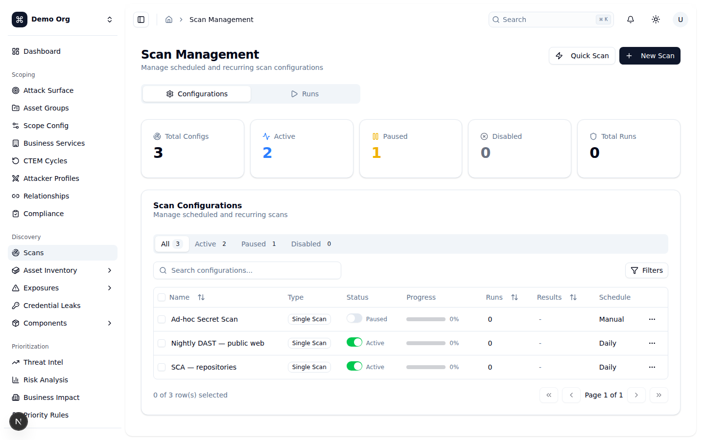
*🌙 Dark mode:* 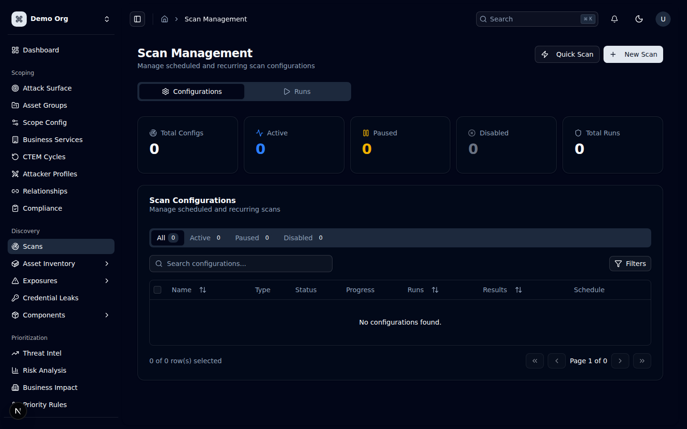

### Trình hướng dẫn tạo quét (New Scan Wizard)

Hộp thoại `New Scan` dẫn bạn qua **4 bước** (thanh stepper phía trên: `Basic Info` → `Targets` → `Options` → `Schedule`). Bạn có thể nhấn `Next`/`Back` để di chuyển; mỗi bước được kiểm tra hợp lệ trước khi sang bước tiếp theo. Có thể nhấp vào các bước đã hoàn thành trên stepper để quay lại.

**Bước 1 — `Basic Info` (Thông tin cơ bản):**
- `Scan Name` (bắt buộc): đặt tên gợi nhớ, ví dụ "Production Security Scan".
- `Scan Type` (chế độ Single): chọn một trong `Full Scan` (đánh giá lỗ hổng toàn diện), `Quick Scan` (kiểm tra nhanh vấn đề nghiêm trọng), `Custom` (chọn từng kiểm tra), `Compliance` (PCI DSS / ISO 27001 / SOC2).
- Mở rộng `Advanced Options` để cấu hình:
  - **`Scan Mode`**: `Single Scan` (chạy một lần với cấu hình tùy chỉnh) hoặc `Workflow Scan` (dùng quy trình định sẵn gồm nhiều công cụ). Ở chế độ Workflow, bạn chọn một workflow (ví dụ "Full Reconnaissance", "Vulnerability Assessment", "Quick Security Check", "Compliance Audit", "Full Penetration Test") và xem trước thời lượng ước tính cùng các bước công cụ.
  - **`Agent Preference`**: `Auto` (hệ thống tự chọn agent tốt nhất), `Your Agent` (chỉ dùng agent của tổ chức bạn), `Platform Agent` (dùng agent cloud do OpenCTEM quản lý, chạy nhanh hơn).

**Bước 2 — `Targets` (Mục tiêu):** Có thể kết hợp nhiều nguồn mục tiêu cùng lúc; phải chọn **ít nhất một** mục tiêu để tiếp tục. Ba mục có thể thu/mở (collapsible):
- **`Asset Groups`**: tích chọn các nhóm tài sản đã định nghĩa sẵn; mỗi nhóm hiển thị số lượng tài sản.
- **`Individual Assets`**: tìm và chọn từng tài sản riêng lẻ theo tên (hỗ trợ tìm kiếm có debounce và phân trang). Các tài sản đã chọn hiện dưới dạng "pill" có thể bỏ chọn.
- **`Custom Targets`**: nhập tự do mỗi target một dòng. Hệ thống **xác thực thời gian thực** từng dòng và gắn nhãn `valid` / `invalid` / `warning`. Định dạng hỗ trợ: domain (`example.com`), wildcard (`*.example.com`), IPv4, dải CIDR (`192.168.1.0/24`), URL (`https://example.com`), Host:Port (`example.com:8080`), IPv6. **Các IP nội bộ (10.x, 172.16–31.x, 192.168.x, 127.x, localhost) sẽ bị cảnh báo vì backend chặn theo cơ chế chống SSRF.**
- Cuối bước có thẻ `Total Selected Targets` tổng hợp số mục tiêu trên tất cả các nguồn.

**Bước 3 — `Options` (Tùy chọn quét):**
- **`Scan Options`**: bật/tắt các nhóm kiểm tra: `Port Scanning`, `Web Application Scanning` (XSS, SQLi…), `SSL/TLS Analysis`, `Brute Force Testing` (dùng thận trọng), `Technology Detection`, `API Security Testing`.
- **`Intensity`** (Cường độ): thanh trượt `Low` / `Medium` / `High`. Low = chậm, ít gây ảnh hưởng (khuyến nghị cho hệ thống production); High = nhanh, mạnh, có thể ảnh hưởng hiệu năng mục tiêu.
- **`Max Concurrent Connections`**: số kết nối đồng thời (5–50). Giá trị cao tăng tốc nhưng dễ kích hoạt rate-limit hoặc cảnh báo IDS.
- **`Reliability`** (Độ tin cậy): `Timeout (seconds)` (30s–24h), `Max retries` (0–10, 0 = không thử lại), `Retry backoff (s)` (thời gian chờ giữa các lần thử lại).

**Bước 4 — `Schedule` (Lịch chạy & Thông báo):**
- **`When to run?`**: `Run immediately` (chạy ngay) hoặc `Schedule for later` (lên lịch). Khi lên lịch, chọn `Frequency` (`Once`/`Daily`/`Weekly`/`Monthly`), `Day` (nếu Weekly) và `Time`.
- **`Notifications`**: `Send notification when complete` (gửi email khi quét xong) và `Auto-create tasks for critical findings` (tự tạo task khắc phục cho lỗ hổng Critical/High).
- Nút cuối: `Start Scan` (nếu chạy ngay) hoặc `Schedule Scan` (nếu lên lịch). Nếu cấu hình được tạo nhưng không khởi chạy được, hệ thống vẫn lưu cấu hình và hiện thông báo lỗi có nút `View Scan` để bạn khởi chạy thủ công sau.

**Ghi chú:** Trình hướng dẫn ánh xạ dữ liệu form sang yêu cầu API: chế độ Workflow → `scan_type: workflow` + `pipeline_id`; chế độ Single → `scan_type: single` + scanner mặc định. Lịch `Once`/`Run immediately` được lưu thành kiểu `manual`.

---

## Asset Inventory (`/assets`)

**Mục đích:** Trang tổng quan kho tài sản — cung cấp cái nhìn tổng thể về toàn bộ tài sản số của tổ chức, nhóm theo danh mục, kèm các chỉ số rủi ro cấp cao.

**Cách dùng:**
1. Dãy 4 thẻ chỉ số phía trên: `Total Assets`, `High Risk Assets` (Risk score ≥ 70), `Avg Risk Score`, `Open Findings`.
2. Bên dưới là lưới các thẻ danh mục (External Attack Surface, Applications, Infrastructure, …). Mỗi thẻ liệt kê các loại tài sản con kèm số lượng; nhấp vào một dòng để mở trang chi tiết theo loại. Danh mục/loại không có dữ liệu sẽ tự ẩn sau khi tải xong.
3. Khi tenant chưa có tài sản nào, trang hiện thẻ rỗng "No assets discovered yet" với các nút `Run Discovery Scan`, `Connect Provider`, `Configure Scope`.
4. Khối `Quick Actions` cuối trang gồm các phím tắt: `Run Discovery Scan`, `Manage Asset Groups`, `Configure Scope`, `View All Findings`.

**Trải nghiệm bảng tài sản chung (áp dụng cho mọi trang theo loại bên dưới):** Mỗi trang tài sản theo loại dùng chung một bảng dữ liệu thống nhất với các tính năng:
- **Thẻ thống kê** (stats cards) tóm tắt theo trạng thái/đặc thù loại; nhấp để lọc.
- **Tìm kiếm** theo tên (`Search ...`) và **lọc theo Tag** (`Filter by tag`, chọn nhiều tag — tài sản phải khớp tất cả tag).
- **Cột chung**: chọn dòng (checkbox), tên + loại, criticality/scope/exposure, `Risk Score`, `Findings`, `Tags`, và menu thao tác mỗi dòng (`View`, `Edit`, `Delete`, `Copy`). Mỗi trang loại bổ sung các cột riêng (mô tả ở từng mục).
- **Bulk actions**: chọn nhiều dòng → nút `Delete (n)`.
- Nút `Refresh`, `Export` (xuất CSV), `Add <Loại>` (tạo thủ công).
- Nhấp một dòng để mở **panel chi tiết** với các tab Overview/Findings/Relationships/Owners.
- Phân trang ở chân bảng (10/20/50/100 dòng mỗi trang).

**Khử trùng lặp (Deduplication / Merge):** OpenCTEM tự động phát hiện các tài sản trùng lặp (cùng tên chuẩn hóa, cùng loại) và gộp chúng để giữ kho sạch. Hệ thống duy trì hàng đợi **dedup reviews** (gợi ý gộp chờ duyệt: giữ lại asset nào, gộp asset nào, kèm số findings) cùng **merge log** ghi lại lịch sử gộp (asset giữ/gộp, loại tương quan, hành động, nguồn). Bạn có thể `Approve` hoặc `Reject` từng đề xuất gộp. Lịch sử gộp của một tài sản cũng hiển thị trong panel chi tiết của nó.

**Giám sát Certificate Transparency liên tục (continuous CT monitoring):** Ngoài việc phát hiện qua scan, nền tảng có một **bộ giám sát CT log tích hợp (bật mặc định)** chạy định kỳ (mặc định 24h, cấu hình qua `CERT_MONITOR_ENABLED` / `CERT_MONITOR_INTERVAL`). Với mỗi tenant có tài sản **domain**, bộ này truy vấn nguồn công khai **crt.sh** (chỉ đọc dữ liệu CT công khai, không dùng credential; được chặn SSRF, giới hạn số domain/subdomain mỗi lần) và **tự phát sinh exposure** kiểu `subdomain_discovered` (subdomain mới) và `certificate_expiring` (chứng chỉ sắp hết hạn) vào Exposure Register (xem Phần 4). Nếu tenant chưa có tài sản domain nào thì bộ giám sát không có gì để quét.

**Chỉ số độ tươi của dữ liệu (freshness / staleness):** Nền tảng theo dõi mức độ "mới" của kho tài sản qua **Data Quality Scorecard** (`GET /api/v1/dashboard/data-quality`): tuổi trung vị của lần quan sát gần nhất (`median last-seen age`) và **tỉ lệ tài sản "cũ" (stale)** — tài sản không được quan sát lại trong 30 ngày. Bạn cũng có thể lọc tài sản theo mốc `last seen`. Đây là tín hiệu để biết bề mặt tấn công có đang được quét đủ thường xuyên hay không (các chỉ số này hiển thị trên bảng Program Health, xem Phần 7).

**Ghi chú:** Tài sản hầu hết đến từ các lần quét; nếu bảng rỗng, hãy chạy một scan từ `/scans`. Bạn vẫn có thể thêm tài sản thủ công bằng nút `Add <Loại>`.

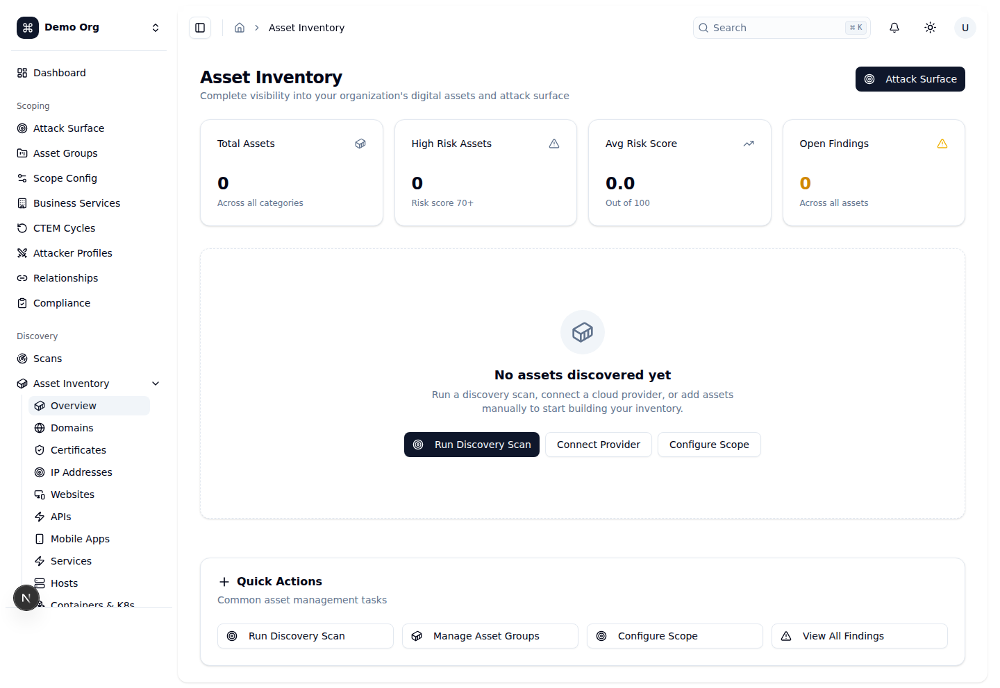
*🌙 Dark mode:* 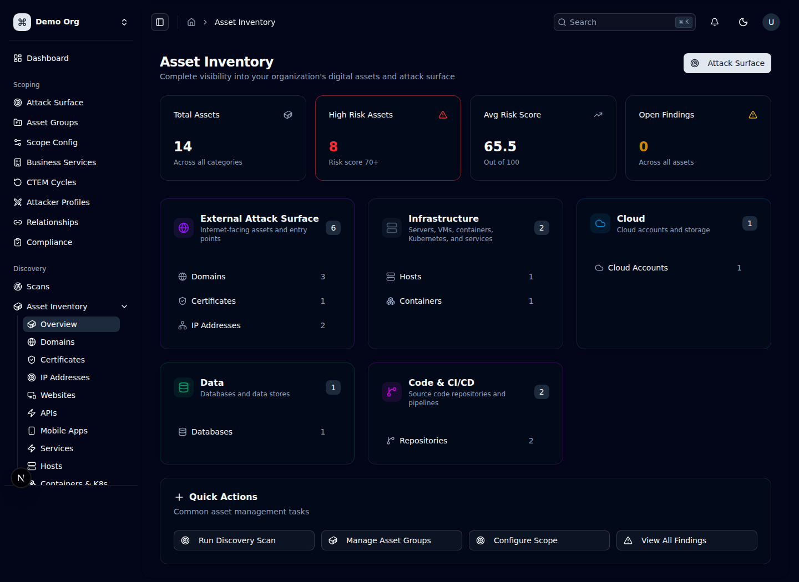

---

## Các trang tài sản theo loại

Tất cả các trang dưới đây dùng chung bảng dữ liệu thống nhất (tìm kiếm, lọc tag, bulk delete, export CSV, panel chi tiết) đã mô tả ở trên. Mỗi mục chỉ nêu đặc thù của loại tài sản: cách phát hiện và các cột riêng.

### Domains & Subdomains (`/assets/domains`)
**Mục đích:** Quản lý tên miền gốc (root) và tên miền con (subdomain), theo dõi phân cấp domain và thông tin DNS/WHOIS.
**Cách dùng:** Được phát hiện qua liệt kê DNS, Certificate Transparency, bruteforce subdomain, recon thụ động, hoặc nhập thủ công. Cột riêng: `Type` (Root/Sub), `DNS Info` (record type, resolved IP, CNAME, hoặc registrar cho root). Panel chi tiết hiển thị Registrar, Expiry Date, Root Domain, Collector, DNS Records, Resolved IPs, CNAME Target.

*🌙 Dark mode:* 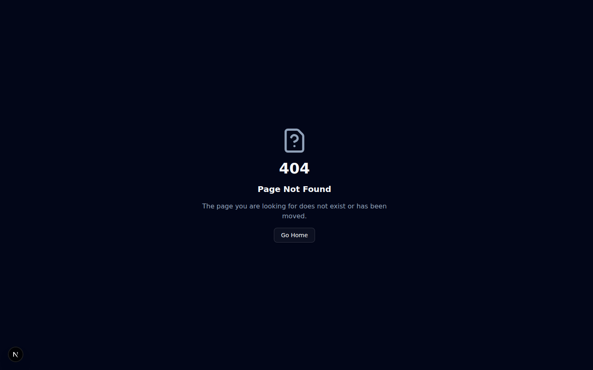

### IP Addresses (`/assets/ip-addresses`)
**Mục đích:** Quản lý địa chỉ IPv4/IPv6 trong hạ tầng, kèm thông tin ASN.
**Cách dùng:** Phát hiện qua phân giải DNS và quét mạng. Cột riêng: `ASN / Organization`, `Type` (Public/Private), `Open Ports`. Có bộ lọc `IP Type` (Public/Private).

*🌙 Dark mode:* 

### Websites (`/assets/websites`)
**Mục đích:** Quản lý tài sản ứng dụng web/website.
**Cách dùng:** Phát hiện qua web crawl, HTTP probing và tech detection trong các lần quét. Cột riêng: `Technology`, `SSL`, `Status Code`. Panel chi tiết gồm URL, công nghệ, mã HTTP, response time, server, SSL/TLS.

*🌙 Dark mode:* 

### APIs (`/assets/apis`)
**Mục đích:** Quản lý tài sản API và các endpoint.
**Cách dùng:** Phát hiện qua phân tích lưu lượng, OpenAPI spec và quét bảo mật API. Cột riêng: `Type` (REST/GraphQL/gRPC/WebSocket/SOAP), `Auth`, `Endpoints`, `Base URL`.

*🌙 Dark mode:* 

### Hosts (`/assets/hosts`)
**Mục đích:** Quản lý máy chủ vật lý và ảo (servers, VMs, compute).
**Cách dùng:** Phát hiện qua quét mạng/cổng và tích hợp cloud. Cột riêng: `IP`, `OS`, `Resources` (CPU/RAM), `Arch`, `Ports`.

*🌙 Dark mode:* 

### Services (`/assets/services`)
**Mục đích:** Quản lý dịch vụ mạng và cổng mở.
**Cách dùng:** Phát hiện qua port scanning và service detection (banner grabbing). Cột riêng: `Port`, `Protocol` (TCP/UDP), `Version`, `Technology`.

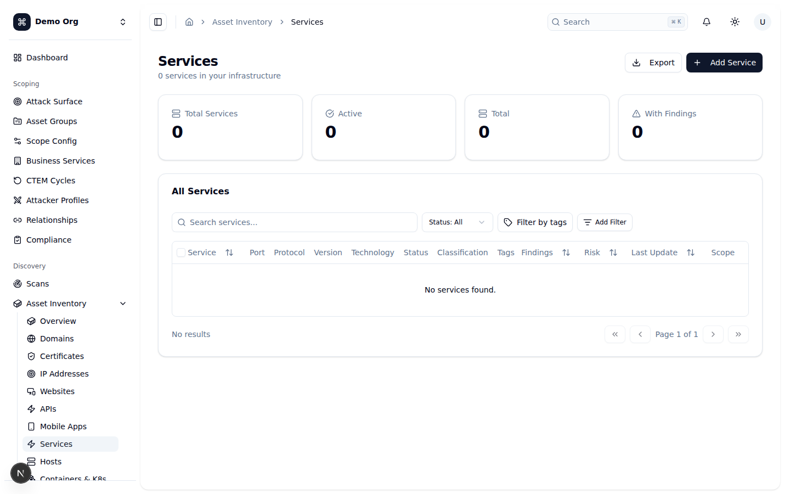
*🌙 Dark mode:* 

### Containers & Kubernetes (`/assets/containers`)
**Mục đích:** Quản lý container workloads và cụm Kubernetes (clusters, namespaces, workloads).
**Cách dùng:** Phát hiện qua tích hợp với nền tảng orchestration và registry. Cột riêng: `Kind`, `Provider` (EKS/GKE/AKS/Self-hosted/Docker), `Version`, `Namespace`.

*🌙 Dark mode:* 

### Databases (`/assets/databases`)
**Mục đích:** Quản lý tài sản cơ sở dữ liệu (mọi engine).
**Cách dùng:** Phát hiện qua quét dịch vụ và tích hợp cloud. Cột riêng: `Engine` (MySQL/PostgreSQL/MongoDB/Redis/Elasticsearch/MSSQL/Oracle…), `Size`, `Security` (mã hóa, public-access).

*🌙 Dark mode:* 

### Storage Buckets (`/assets/storage`)
**Mục đích:** Quản lý kho lưu trữ đối tượng — S3 buckets, Azure Blobs, GCS buckets.
**Cách dùng:** Phát hiện qua tích hợp nhà cung cấp cloud. Cột riêng: `Provider` (AWS/GCP/Azure), `Region`, `Size`, `Security` (mã hóa, public-access, versioning).

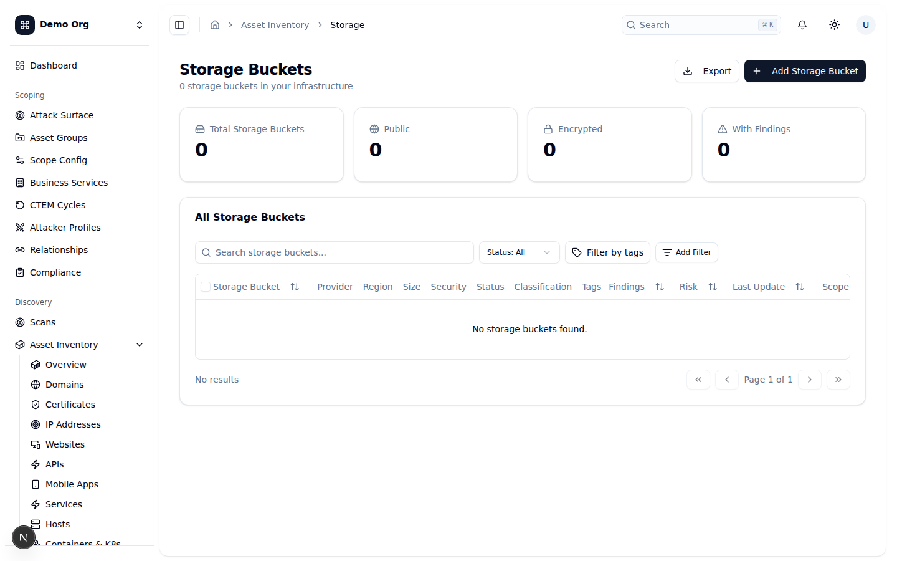
*🌙 Dark mode:* 

### Cloud Accounts (`/assets/cloud-accounts`)
**Mục đích:** Quản lý tài khoản cloud — AWS accounts, GCP projects, Azure subscriptions.
**Cách dùng:** Thêm qua kết nối nhà cung cấp cloud (Integrations). Cột riêng: `Provider` (AWS/GCP/Azure/OCI/Alibaba/DigitalOcean), `Account ID`, `Resources`, `Security` (MFA/SSO).

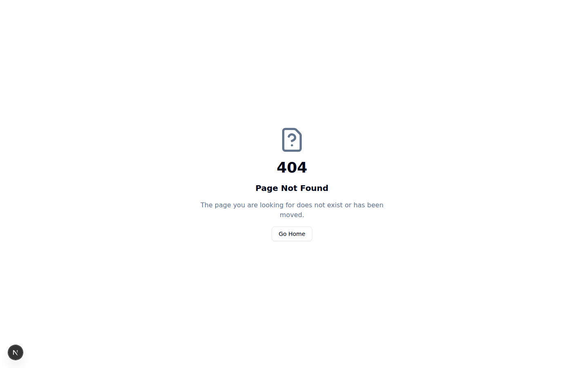
*🌙 Dark mode:* 

### Network & Security Devices (`/assets/networks`)
**Mục đích:** Quản lý thiết bị mạng và an ninh — firewalls, switches, routers, load balancers.
**Cách dùng:** Phát hiện qua quét mạng và tích hợp hạ tầng. Cột riêng: `Device Type`, `Vendor / Model`, `Firmware`, `Management IP`.

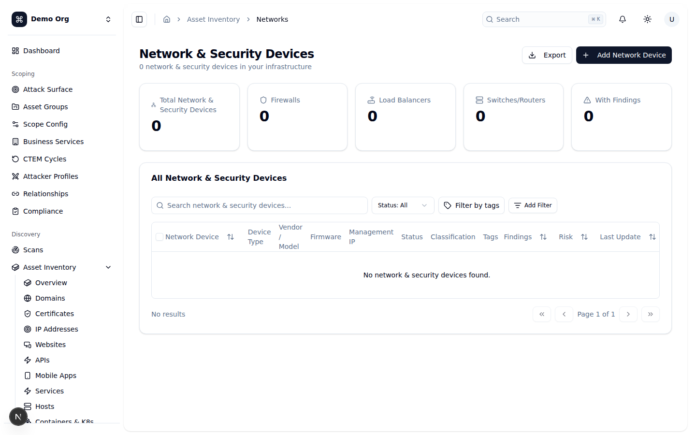
*🌙 Dark mode:* 

### Mobile Apps (`/assets/mobile`)
**Mục đích:** Quản lý ứng dụng di động (iOS/Android/Cross-platform).
**Cách dùng:** Thêm thủ công hoặc qua tích hợp app store/MDM. Cột riêng: `Version` (kèm platform và Bundle ID trong chi tiết). Có bộ lọc `Platform` (iOS/Android).

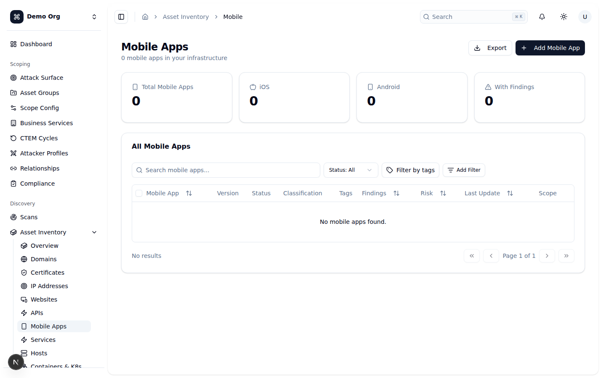
*🌙 Dark mode:* 

### Certificates (`/assets/certificates`)
**Mục đích:** Quản lý chứng chỉ SSL/TLS trong hạ tầng.
**Cách dùng:** Phát hiện qua SSL/TLS analysis và Certificate Transparency. Cột riêng: `Issuer`, `Valid Until`, `Days Left`, `Validity` (Valid/Expiring/Expired). Có bộ lọc `Validity`; panel chi tiết hiển thị Subject, thuật toán, key size, serial, SANs, wildcard.

*🌙 Dark mode:* 

### Identity & Access (`/assets/identity`)
**Mục đích:** Quản lý danh tính — IAM users, roles, service accounts trên các nhà cung cấp cloud.
**Cách dùng:** Phát hiện qua tích hợp IAM của cloud provider. Cột riêng: `Type`, `Email / ID`, `Provider` (AWS/GCP/Azure/Kubernetes), `MFA`.

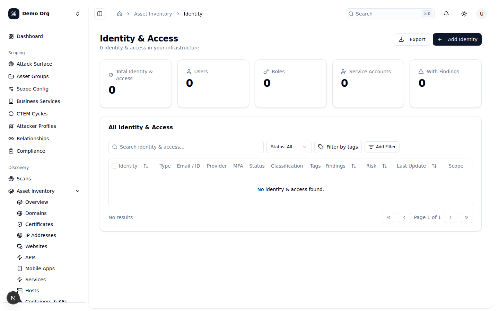
*🌙 Dark mode:* 

### Repositories (`/assets/repositories`)
**Mục đích:** Quản lý kho mã nguồn và cấu hình quét bảo mật cho chúng.
**Cách dùng:** Thêm qua kết nối SCM (GitHub/GitLab/Bitbucket/Azure DevOps/CodeCommit). Cột riêng: `Source` (provider), `Visibility` (Private/Internal/Public), `Language`. Panel chi tiết hiển thị số sao/fork, branch, thành phần dễ tổn thương (vulnerable components), findings.

*🌙 Dark mode:* 

---

## Checklist

Dùng danh sách sau để xác nhận bạn đã làm chủ module Discovery & Asset Inventory:

- [ ] Hiểu rằng tài sản được **điền vào bởi các lần quét** — chạy scan trước, xem tài sản sau.
- [ ] Phân biệt **Quick Scan** (rà nhanh một trang) và **New Scan Wizard** (cấu hình đầy đủ, có thể lên lịch).
- [ ] Hoàn thành 4 bước của New Scan Wizard: `Basic Info` → `Targets` → `Options` → `Schedule`.
- [ ] Biết kết hợp 3 nguồn mục tiêu: `Asset Groups`, `Individual Assets`, `Custom Targets`; hiểu cảnh báo IP nội bộ (SSRF).
- [ ] Sử dụng tab `Configurations` và `Runs`; bật/tắt, trigger, clone, xóa cấu hình; dùng bulk actions.
- [ ] Đọc được trang tổng quan `Asset Inventory`: 4 chỉ số chính + lưới danh mục + Quick Actions.
- [ ] Thành thạo bảng tài sản chung: tìm kiếm, lọc tag, export CSV, bulk delete, panel chi tiết.
- [ ] Hiểu cơ chế **Deduplication/Merge** (dedup reviews + merge log; Approve/Reject).
- [ ] Truy cập và đọc đúng các cột đặc thù của cả 16 trang tài sản theo loại:
  - [ ] Domains & Subdomains (`/assets/domains`)
  - [ ] IP Addresses (`/assets/ip-addresses`)
  - [ ] Websites (`/assets/websites`)
  - [ ] APIs (`/assets/apis`)
  - [ ] Hosts (`/assets/hosts`)
  - [ ] Services (`/assets/services`)
  - [ ] Containers & Kubernetes (`/assets/containers`)
  - [ ] Databases (`/assets/databases`)
  - [ ] Storage Buckets (`/assets/storage`)
  - [ ] Cloud Accounts (`/assets/cloud-accounts`)
  - [ ] Network & Security Devices (`/assets/networks`)
  - [ ] Mobile Apps (`/assets/mobile`)
  - [ ] Certificates (`/assets/certificates`)
  - [ ] Identity & Access (`/assets/identity`)
  - [ ] Repositories (`/assets/repositories`)
