# Hướng dẫn sử dụng OpenCTEM — Phần 4: Exposures, Software Components (SBOM) & Findings

## Giới thiệu: Finding, Exposure event và Software Components khác nhau thế nào?

OpenCTEM tách bạch ba lớp dữ liệu trong giai đoạn **Discovery / Prioritization** của vòng đời CTEM. Hiểu rõ sự khác biệt giúp bạn dùng đúng màn hình cho đúng việc:

- **Finding (phát hiện)** — là **một vấn đề an ninh đơn lẻ được phát hiện**, gắn với một tài sản/vị trí cụ thể: một lỗ hổng SAST trên một dòng code, một secret bị lộ trong một commit, một CVE trên một host, một phát hiện pentest... Mỗi finding có `severity`, `status`, có thể được giao việc (assign), triage bằng AI, đính kèm bằng chứng (evidence) và đi qua một quy trình trạng thái (status workflow). Đây là đơn vị làm việc chính của analyst, quản lý tại **Findings workbench** (`/findings`).

- **Exposure event (sự kiện phơi nhiễm)** — là **một điểm phơi nhiễm bề mặt tấn công đã được theo dõi và khử trùng lặp (deduplicated) theo vòng đời**. Thay vì hiện lại mỗi lần quét, một exposure được gộp thành một bản ghi duy nhất có `first_seen_at` / `last_seen_at`, một **state** (`active` → `resolved` / `accepted` / `false_positive`, có thể `reactivate`), và **lịch sử chuyển trạng thái (state history)** có người thực hiện + lý do. Exposure thiên về *góc nhìn bề mặt tấn công* (cổng mở, subdomain mới, bucket public, chứng chỉ sắp hết hạn, credential bị lộ...). Quản lý tại **Exposure Events** (`/exposures`).

  > Nói ngắn gọn: nhiều scan có thể tạo ra cùng một *finding* lặp lại, nhưng exposure pipeline gộp chúng thành **một exposure event** duy nhất có vòng đời rõ ràng. Finding là *chi tiết kỹ thuật*; exposure là *trạng thái phơi nhiễm được theo dõi liên tục*.

- **Software Components (SBOM)** — khu vực **Software Bill of Materials**, liệt kê toàn bộ thành phần/phụ thuộc (dependencies) trong các repository: trực tiếp (direct) và bắc cầu (transitive), kèm hệ sinh thái (ecosystem), giấy phép (license), lỗ hổng đã biết và cờ CISA KEV. Đây là nền tảng cho bảo mật chuỗi cung ứng (supply chain) và cho phép **xuất SBOM** theo chuẩn CycloneDX/SPDX.

> Lưu ý quyền: như mọi nơi trong nền tảng, nhiều nút/cột bị ẩn hoặc vô hiệu hóa tùy phân quyền RBAC (`findings:read/write/delete/approve/verify`, `credentials:write`, `vulnerabilities:read`...). Nếu không thấy một nút, rất có thể bạn chưa có quyền tương ứng.

---

## Security Findings (`/findings`)
**Mục đích:** Bàn làm việc (workbench) trung tâm để xem, lọc, phân loại, giao việc và khắc phục mọi finding của tenant — hợp nhất kết quả từ tất cả nguồn (SAST, DAST, SCA, Secret, IaC, Container, EASM, Pentest, Manual...).

**Cách dùng:**
1. **Tiêu đề trang** hiển thị tổng số finding và số đang mở (ví dụ `128 total findings - 95 open`). Hàng nút bên phải gồm: `Approvals` (mở `/findings/approvals`), `Refresh`, `Export` (menu thả: `Export as CSV`, `Export as JSON`, `Export as PDF Report` — PDF hiện vô hiệu hóa), và `Add Finding` (chỉ hiện nếu có quyền `findings:write`).
2. **Bộ chọn tab chính** ngay dưới tiêu đề: `All Findings`, `Groups`, `Pending Review`. Tab `Pending Review` kèm một badge đỏ đếm số finding đang chờ kiểm chứng.
3. Trong tab **`All Findings`**:
   - **Thẻ thống kê severity** (severity cards): `Critical`, `High`, `Medium`, `Low`, `Info` — các con số này lấy từ thống kê toàn cục (ổn định, không đổi theo tab lọc).
   - **Thanh lọc (filter chips)**: ô `Search findings...` (gõ có debounce 300ms), menu `Status:` (All, New, Confirmed, In Progress, Fix Applied, Resolved, False Positive, Accepted, và nhóm pentest: Draft, In Review, Remediation, Retest, Verified, Accepted Risk) và menu `Source:` (Pentest, SAST, DAST, SCA, Secret, IaC, Container, Manual, EASM). Mặc định màn hình ẩn hai trạng thái `draft` và `in_review` (WIP của pentest).
   - **Tab lọc theo severity**: `All (n)`, `Critical (n)`, `High (n)`, `Medium (n)`, `Low (n)` ngay phía trên bảng.
   - **Bảng findings** với các cột: ô chọn (checkbox), `Title` (kèm CVE/scanner phụ đề và các **badge nội tuyến**: `KEV` đỏ cho lỗ hổng đang bị khai thác theo CISA, `EPSS x.x%` cho xác suất bị khai thác trong 30 ngày tới, và biểu tượng tuyến tấn công nếu có data-flow), `Severity`, `Priority` (priority class), `Source`, `Location`, `Status`, `Created`, và menu `...` (View Details, Assign, Change Status, Copy ID, Copy Link, Mark as False Positive, Delete).
4. **Bulk actions (thao tác hàng loạt):** khi chọn ≥1 dòng, một thanh xanh hiện ra cho phép `Assign to…` (giao cho người dùng), `Change Status` (Confirmed / In Progress / Resolved — *không* có False Positive vì trạng thái này bắt buộc qua luồng phê duyệt) và `Clear Selection`.
5. Bấm vào một dòng để mở **drawer chi tiết** (xem mục dưới); bấm `View Details` để mở **trang chi tiết đầy đủ** (`/findings/{id}`).
6. **Tab `Groups`** — gom finding theo nhiều chiều: `By CVE`, `By Asset`, `By Owner`, `By Severity`, `By Source`, `By Component`, `By Type`. Mỗi thẻ nhóm hiển thị nhãn, severity/KEV/CVSS/EPSS, số tài sản bị ảnh hưởng, thanh tiến trình 4 mức (`Open` / `Fixing` / `Applied` / `Resolved`) và `% verified`. Nút `Mark Fixed` xuất hiện khi nhóm có finding `in_progress`. Ở chiều `By Owner`, nếu có nhóm `unassigned` sẽ có nút `Auto-Assign to Asset Owners`.
7. **Tab `Pending Review`** — các nhóm finding ở trạng thái `fix_applied` đang **chờ kiểm chứng (verification)**. Người có quyền `findings:verify` có thể `Verify` (xác nhận fix) hoặc mở hộp thoại `Reject Fix` (bắt buộc nhập lý do, ví dụ "Vulnerability still present — log4j 2.14.0 detected").

**Ghi chú:** `Export` chỉ xuất các finding đang hiển thị (CSV/JSON, tải về trình duyệt). Khi lỗi tải sẽ hiện màn hình "Failed to load findings" với nút `Retry`. Nút `Add Finding` và `Delete` phụ thuộc quyền (`findings:write`, `findings:delete`).
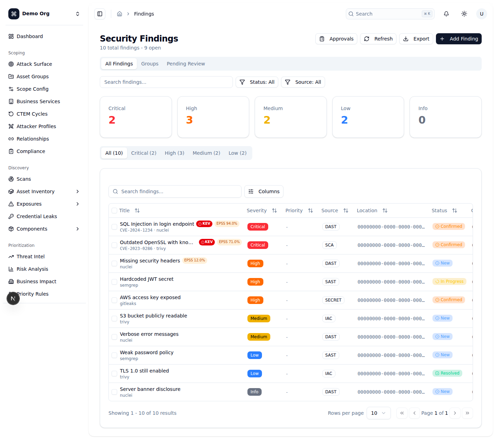
*🌙 Dark mode:* 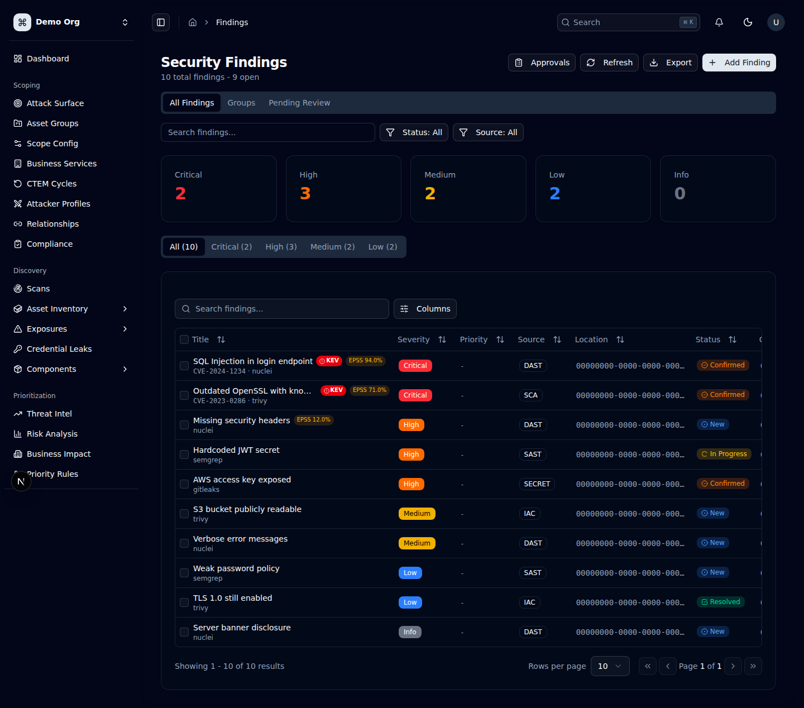

### Chi tiết một finding — drawer & trang đầy đủ
**Mục đích:** Xem toàn bộ ngữ cảnh của một finding và thực hiện hành động (đổi trạng thái, severity, giao việc, bình luận, triage AI).

**Cách dùng (drawer xem nhanh — mở khi bấm vào dòng):**
1. **Thanh công cụ** trên cùng: đóng, `Copy ID`, mở trang đầy đủ, `Copy link`.
2. **Header** hiển thị tiêu đề và **dải tín hiệu rủi ro** ngay đầu: badge `KEV` (đỏ, kèm hạn khắc phục nếu có), priority class, `CVSS x.x`, `EPSS x.x%`, `CVE-...`, `CWE-...`.
3. **Thanh hành động nhanh**: `StatusSelect` (đổi trạng thái), `SeveritySelect` (đổi mức độ), `AssigneeSelect` (giao việc, có tìm kiếm). Mọi thay đổi đều **lạc quan (optimistic)** và có toast kèm nút `Undo`.
4. Cuộn xuống xem: `Description`, `Approval History` (nếu trạng thái là false_positive/accepted), `Code Evidence` (đường dẫn file:line + đoạn code có tô sáng cú pháp, nút copy), `Affected Assets`, `Attack Path` (luồng dữ liệu nguồn → trung gian → đích, nếu có), `Remediation` (thanh tiến độ %), `Tags`, và lưới meta (`CVSS Score`, `Source`, `Discovered`, `Last Updated`).
5. Cuối drawer: ô `Add a comment...` và nút `View Full Details`. Phím tắt: **Cmd/Ctrl + Enter** mở trang đầy đủ, **Cmd/Ctrl + C** bật ô bình luận.

**Cách dùng (trang chi tiết đầy đủ `/findings/{id}` — bố cục 2 cột co giãn):**
1. **Cột trái** gồm **`FindingHeader`** (tiêu đề, badge nguồn/CVE/CWE, EPSS & KEV làm giàu từ threat-intel, các badge `Triaged` và `SLA: On Track / At Risk / Breached`), các select Status/Severity/Assignee, nút **AI Triage** và — khi trạng thái là `Fix Applied` — nút `Request Verification Scan` (nhập tên scanner để chạy quét kiểm chứng; nếu scanner vẫn tìm thấy lỗ hổng, finding sẽ được mở lại).
2. **Panel ngữ cảnh theo nguồn** (source panel) hiển thị bên dưới header tùy loại finding (secret, dependency/SCA, misconfig, DAST, compliance, web3, pentest hero...).
3. **Các tab** (thứ tự và hiển thị tùy nguồn): `Overview`, `Evidence (n)`, `Remediation`, `Attack Path (n)`, `Pentest Details`, `Related`, và `Activity` (chỉ trên mobile — desktop có panel riêng).
   - Tab **`Overview`** mở đầu bằng **thẻ `AI Analysis`** (nếu đã chạy triage): tóm tắt khuyến nghị, `Severity`, `Risk Score /100`, `Priority /100`, `Confidence`. Tiếp theo là `Description`, `Risk Assessment` (Confidence/Impact/Likelihood/Priority Rank), `Security Context`, `Compliance Impact`, `Remediation Info`, `Linked Issues`, `Vulnerability Classification`, `Tags`, `Location` (file/line/column), `Code Snippet` (tô sáng cú pháp), `Scanner Details`, kỹ thuật CVE/CWE/CVSS/OWASP (kèm liên kết ra NVD và CWE/MITRE), `Affected Assets`, và `Scanner Metadata`.
4. **Cột phải — `Activity` (timeline)**: dòng thời gian hoạt động theo thời gian thực qua SSE (biểu tượng `Wifi` xanh = đang kết nối). Bao gồm sự kiện tạo, đổi trạng thái, triage AI và bình luận. Bạn có thể **thêm/sửa/xóa bình luận** ngay tại đây, và nút `Load More` để tải thêm.

**Quy trình trạng thái (status workflow):** finding tự động dùng tập trạng thái `New → Confirmed → In Progress → Fix Applied → Resolved` (có thể `Duplicate`); finding pentest dùng `Draft → In Review → Confirmed → Remediation → Retest → Verified`. Ba trạng thái `False Positive`, `Risk Accepted` và `Accepted Risk` **bắt buộc qua phê duyệt** — chọn chúng sẽ mở `ApprovalDialog` (yêu cầu justification) thay vì đổi ngay.
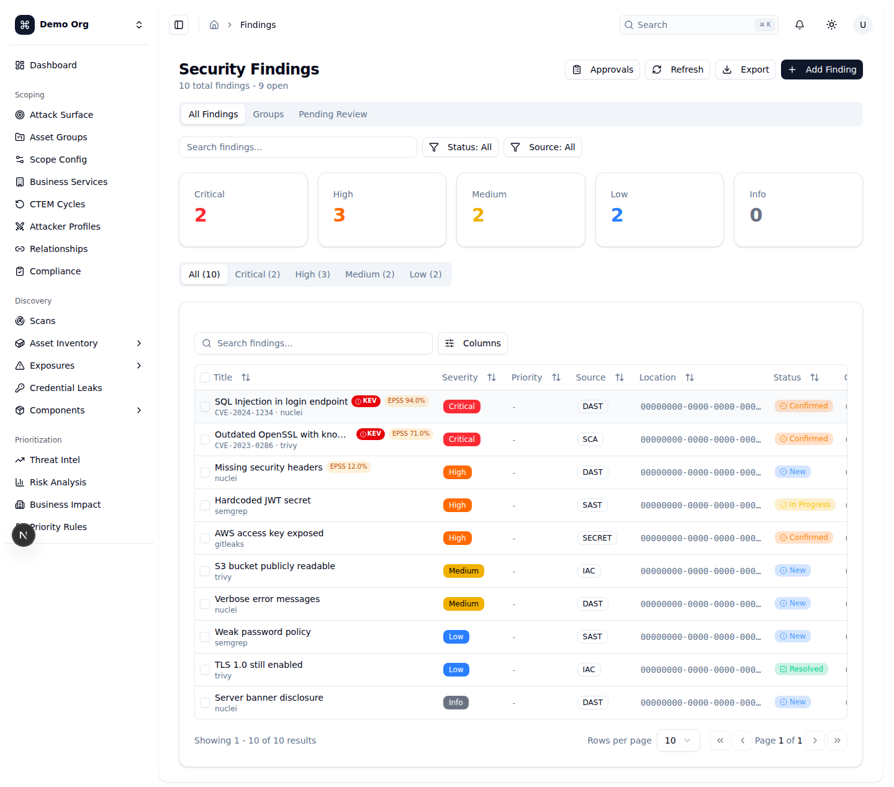

### Approval Requests (`/findings/approvals`)
**Mục đích:** Hàng đợi phê duyệt cho các yêu cầu chuyển finding sang trạng thái nhạy cảm (`False Positive`, `Risk Accepted`, `Accepted Risk`).
**Cách dùng:**
1. Link `Back to Findings` ở đầu; tiêu đề hiển thị tổng số yêu cầu và số đang chờ.
2. Hàng thẻ thống kê: `Pending`, `Approved`, `Rejected`, `Total`.
3. Tabs lọc: `All`, `Pending`, `Approved`, `Rejected`, `Canceled`. Bảng có các cột `Status`, `Finding` (link sang finding), `Requested Status`, `Justification`, `Created`, `Expires`, và menu `...`.
4. Với yêu cầu `pending`: người có quyền `findings:approve` thấy `Approve` / `Reject` (Reject bắt buộc nhập lý do, tối đa 2000 ký tự); ai cũng có thể `Cancel` yêu cầu của mình.

**Ghi chú:** Khi rỗng hiển thị "No approval requests"; lỗi tải hiện màn hình "Failed to load approvals" + `Retry`.

*🌙 Dark mode:* 

---

## Exposure Events (`/exposures`)
**Mục đích:** Theo dõi và quản lý các điểm phơi nhiễm bề mặt tấn công đã được khử trùng lặp theo vòng đời.
**Cách dùng:**
1. Tiêu đề `Exposure Events` với nút `Refresh` và `Export` (Export hiện báo "coming soon").
2. **`ExposureStatsCards`** tổng quan ở đầu trang.
3. Hai tab: **`All Exposures`** và **`Analytics`**.
4. Trong **`All Exposures`**:
   - Thẻ lọc: ô `Search exposures...`, các nút severity bật/tắt (`critical`, `high`, `medium`, `low`, `info`), và bộ chọn trạng thái dạng pill: `Needs Attention` (active, kèm số), `Resolved`, `All`. Nút `Clear` xuất hiện khi có bộ lọc đang bật.
   - Khi chọn ≥1 dòng, thanh **bulk actions** cho phép `Resolve All`, `Accept All`, `False Positive All` (Accept/False Positive bắt buộc nhập lý do).
   - **Bảng exposure** với cột `Type` (biểu tượng theo loại: network/service/domain/certificate/cloud/code/api/credential/data/config), `Title`, `Severity`, `State` (`Active`/`Resolved`/`Accepted`/`False Positive`), `Source`, `First Seen`, và menu `...` (`View Details`; với active: `Mark Resolved`, `Accept Risk`, `False Positive`; với non-active: `Reactivate`).
   - Phân trang `Previous` / `Next` ở cuối.
5. Bấm vào một dòng để mở **Detail Sheet**: header màu theo severity + badge state, các nút hành động nhanh (`Resolve` / `Accept Risk` / `False Positive`, hoặc `Reactivate`), `Description`, **Timeline** (`First Seen` / `Last Seen` / `Resolved`), **Details** (gom theo nhóm Credential/Database/Source/Code/Network; trường nhạy cảm bị che, nút `Reveal Secrets` để hiện), và **State History** (lịch sử chuyển trạng thái kèm người + lý do).
6. Tab **`Analytics`**: biểu đồ phân bố theo severity, theo state và theo loại sự kiện (`By Event Type`).

**Ghi chú:** Mọi thao tác đổi state đều ghi vào audit log. Khi không có exposure: "No exposures found — Your attack surface is looking clean!".
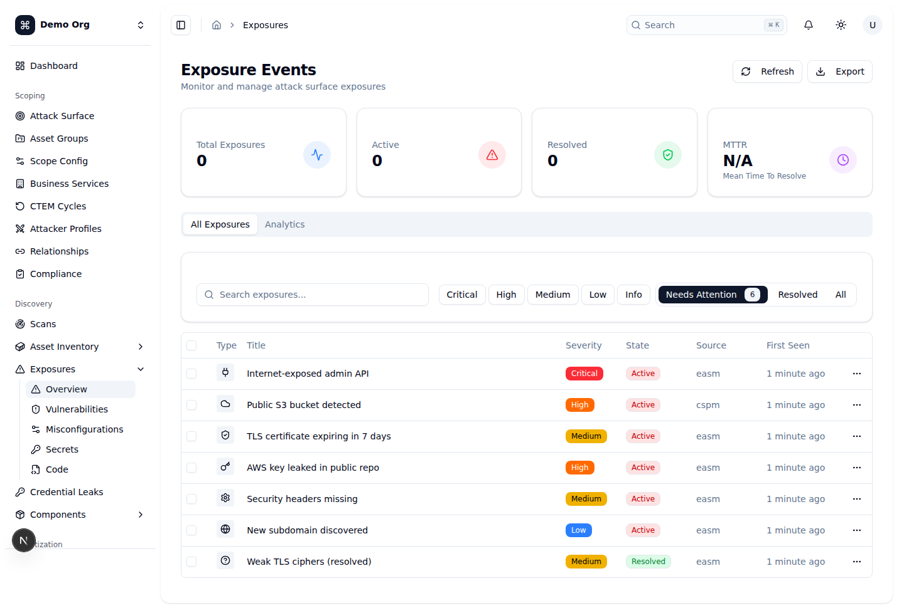
*🌙 Dark mode:* 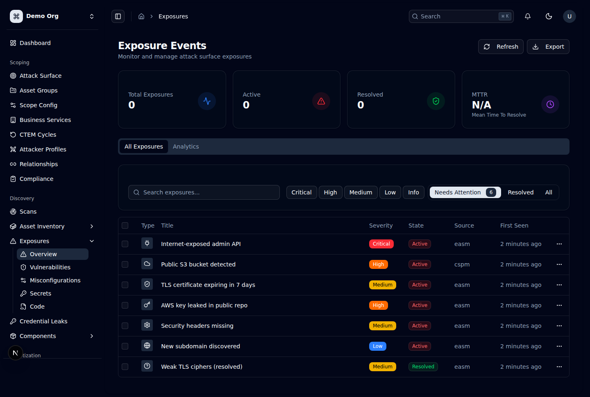

### Exposure được sinh ra từ đâu (emitters) & được làm giàu thế nào

**Emitters (bộ phát sinh exposure):** Exposure event không nhập tay — chúng được **tự động chiếu (project) từ pipeline ingest** mỗi khi có scan mới, qua một số emitter:
- **Port / Service** — từ tài sản recon (cổng mở, dịch vụ phát hiện được) → `port_open`, `service_detected`.
- **TLS / Certificate** — từ phân tích chứng chỉ: sắp hết hạn / đã hết hạn / self-signed / RSA yếu / thuật toán ký SHA1-MD5 → `certificate_expiring`, `certificate_expired`, `ssl_issue`.
- **Secret** — từ finding secret/credential → `credential_leaked` (nguồn `secret_scan`).
- **Misconfiguration** — từ finding cấu hình sai → `misconfiguration` (nguồn `misconfig_scan`).
- **Certificate Transparency** — bộ giám sát CT log (xem Phần 3) phát sinh `subdomain_discovered` và `certificate_expiring` từ crt.sh.

Mỗi emitter dùng chung một **fingerprint ổn định để khử trùng lặp**: scan lặp lại chỉ cập nhật `last_seen` (và có thể `reactivate`) thay vì tạo bản ghi mới — đây chính là cơ chế "một điểm phơi nhiễm = một exposure có vòng đời" mô tả ở đầu chương.

**Làm giàu (enrichment) trên exposure:** Ở phía API, mỗi exposure được **làm giàu lúc đọc** với các tín hiệu ưu tiên: `effective_criticality`, `is_internet_accessible`, `on_attack_path`, `epss_score` / `epss_percentile`, `is_in_kev`, `kev_due_date` (CVE lấy từ chi tiết exposure). Các trường này có trong **response của Exposure API** để tích hợp/tự động hóa. *Lưu ý:* giao diện Exposure Events hiện **chưa hiển thị** các trường làm giàu này — chúng là năng lực API, phần trình bày trên UI sẽ bổ sung sau.

**CTEM-ID catalog:** Nền tảng có một **danh mục chuẩn hóa các lớp phơi nhiễm (CTEM-ID)** — tương tự cách CVE chuẩn hóa lỗ hổng — lưu trong DB và đồng bộ định kỳ (hàng ngày, fail-open) từ một feed ngoài (`CTEM_ID_FEED_URL`, mặc định trỏ tới `ctem.org`). Đọc qua `GET /api/v1/ctem-ids`; có thể gán một CTEM-ID cho finding qua `PUT /api/v1/findings/{id}/ctem-id`. *Lưu ý:* feed mặc định hiện là placeholder nên danh mục có thể trống nếu chưa cấu hình feed thật; chưa có trang UI riêng cho danh mục này.

## Vulnerability Exposures (`/exposures/vulnerabilities`)
**Mục đích:** Bảng tổng quan lỗ hổng (vulnerability) toàn tenant cùng CVE đang tác động và danh mục CVE toàn cục.
**Cách dùng:**
1. Ba tab: **`Overview`** (mặc định), **`Active CVEs`**, **`CVE Catalog`** (hai tab sau yêu cầu quyền `vulnerabilities:read`).
2. Tab `Overview`: hàng stat cards `Total Vulnerabilities`, `Critical`, `Average CVSS`, `Overdue`; biểu đồ `Severity Distribution` (tròn), `Status Breakdown` (cột ngang) và `Vulnerability Trend` (diện tích theo thời gian).
3. Tab `Active CVEs`: các CVE hiện đang tác động lên tài sản của bạn. Tab `CVE Catalog`: tra cứu danh mục CVE toàn cục (kèm badge KEV, exploit maturity, lọc và bảng tra cứu).

**Ghi chú:** Khi chưa có dữ liệu: "No vulnerability data available — Run vulnerability scans...".
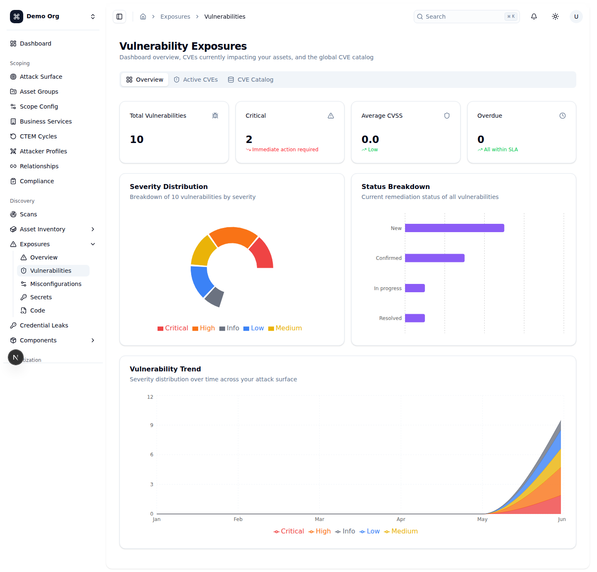
*🌙 Dark mode:* 

## Misconfiguration Exposures (`/exposures/misconfigurations`)
**Mục đích:** Nhận diện các cấu hình sai (misconfiguration) ở hạ tầng và ứng dụng.
**Cách dùng:**
1. Hàng stat cards: `Total Findings`, `Critical Misconfigs`, `Asset Coverage` (số loại tài sản giám sát), `Risk Score`.
2. Biểu đồ `Findings by Severity` (cột) và `Asset Type Distribution` (tròn).
3. Khối `Priority Fixes`: xếp các nhóm misconfiguration theo severity kèm thanh phần trăm để ưu tiên khắc phục.

**Ghi chú:** Khi chưa có dữ liệu: "No misconfiguration data available — Run configuration scans...".
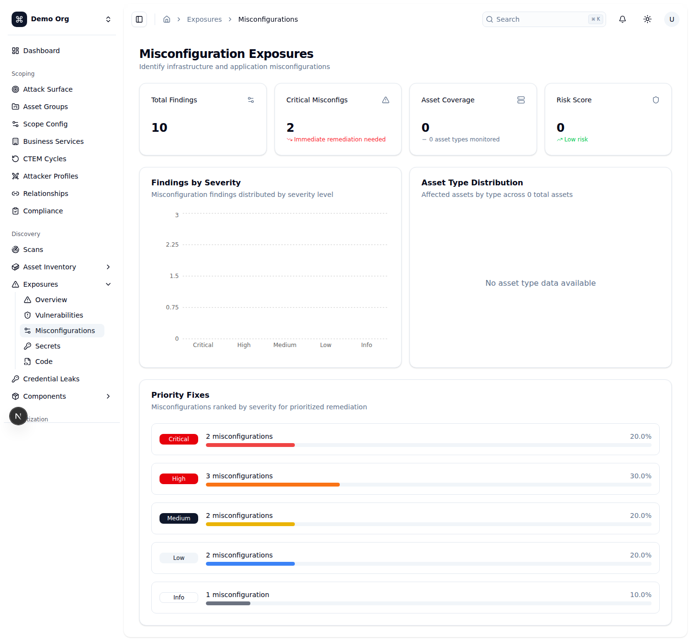
*🌙 Dark mode:* 

## Secret Exposures (`/exposures/secrets`)
**Mục đích:** Giám sát secret/credential bị lộ trong mã nguồn.
**Cách dùng:**
1. Hàng stat cards: `Total Findings`, `Repositories Affected`, `Critical Secrets` (gợi ý "Rotate immediately"), `Risk Score`.
2. Biểu đồ `Repository Coverage` (tròn: With Findings / Clean) và `Findings by Severity` (cột).
3. Khối `Remediation Priority`: danh sách ưu tiên các secret cần xử lý theo severity.

**Ghi chú:** Khi chưa có dữ liệu: "No secret exposure data available — Configure secret scanning...".
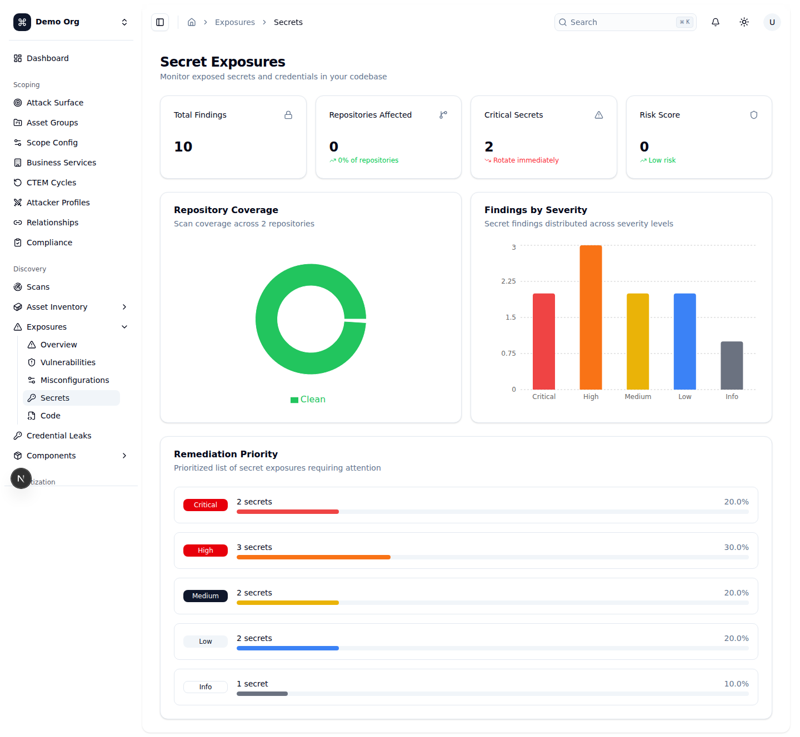
*🌙 Dark mode:* 

## Code Vulnerabilities (`/exposures/code`)
**Mục đích:** Theo dõi lỗ hổng cấp mã nguồn từ phân tích tĩnh (SAST).
**Cách dùng:**
1. Hàng stat cards: `Total Code Findings`, `Critical`, `High`, `Repositories Scanned`.
2. Biểu đồ `Severity Distribution` (tròn) và `Code Finding Trend` (diện tích theo thời gian).
3. Khối `Top Affected Repositories`: xếp hạng repository có nhiều finding nhất.

**Ghi chú:** Khi chưa có dữ liệu: "No code vulnerability data available — Configure static analysis scanners...".
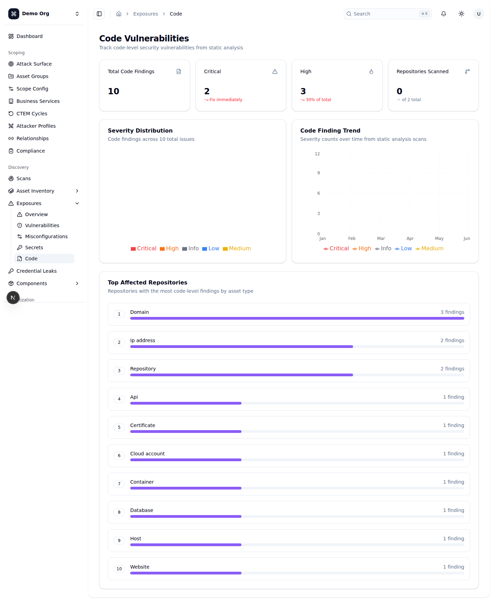
*🌙 Dark mode:* 

---

## Credential Leaks (`/credentials`)
**Mục đích:** Theo dõi các credential (thông tin xác thực) bị rò rỉ, gộp theo từng bản ghi hoặc theo danh tính (identity).
**Cách dùng:**
1. Tiêu đề `Credential Leaks` (kèm tổng số) và nút `Add Credential`.
2. Nếu có leak `Critical`, một **banner cảnh báo đỏ** hiện ở đầu với nút `Review Now` (lọc về active) và nút đóng.
3. Bốn thẻ thống kê: `Active Leaks`, `Critical Risk`, `High Risk`, `Resolved`.
4. Thẻ bảng có hai chế độ xem qua tab: **`List`** (bảng) và **`By Identity`** (gom theo email/username). Nút `Export` ở góc phải.
5. **Bộ lọc**: ô `Search credentials...`, bộ chọn `Status` (All/Active/Pending/Resolved/Inactive, kèm số) và `Source` (All Sources, Dark Web, GitHub/GitLab, Phishing, Data Breach, Internal, Other — nguồn được phân loại tự động từ chuỗi mô tả).
6. **Chế độ `List`** — bảng có cột `Credential` (tên + mô tả), `Source` (badge màu theo nhóm), `Username`, `Leak Date` (đánh dấu `Recent` nếu ≤30 ngày), `Status`, `Classification`, `Risk` (điểm rủi ro), và menu `...` (`View Details`, `Edit`, `Copy Name`, `Delete`).
7. **Chế độ `By Identity`** — mỗi thẻ là một danh tính (email/username) có thể bung ra (collapsible) để xem mọi exposure liên quan; hiển thị số exposure, nguồn, loại credential, số active/resolved và mức severity cao nhất.
8. Bấm một dòng để mở **AssetDetailSheet** của credential: stat cards (`Risk Score`, `Severity`, `Days Since Leak`), trường `Leaked Secret` (che/hiện), `Leak Details` (Source, Username, Credential Type, Leak Date, Group), tab `Related` (các credential khác của cùng danh tính), và nút nhanh `Mark Resolved` cho credential đang active.

**Ghi chú:** Hành động `Add` / `Edit` / `Delete` credential hiện là **giao diện khung** — việc thêm/sửa/xóa thực tế sẽ được nối với API ở giai đoạn sau (nút có thể hiển thị thông báo "coming soon"); `Mark Resolved` đã hoạt động qua API.
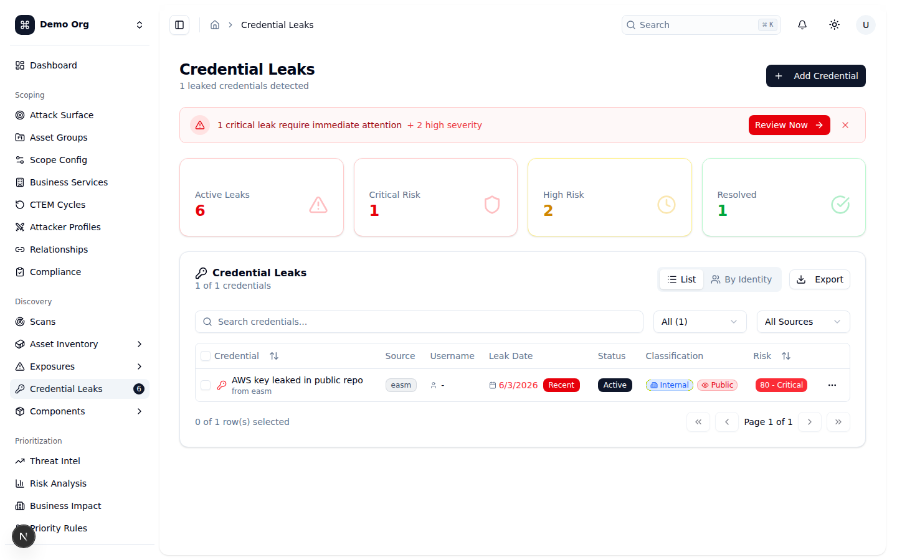
*🌙 Dark mode:* 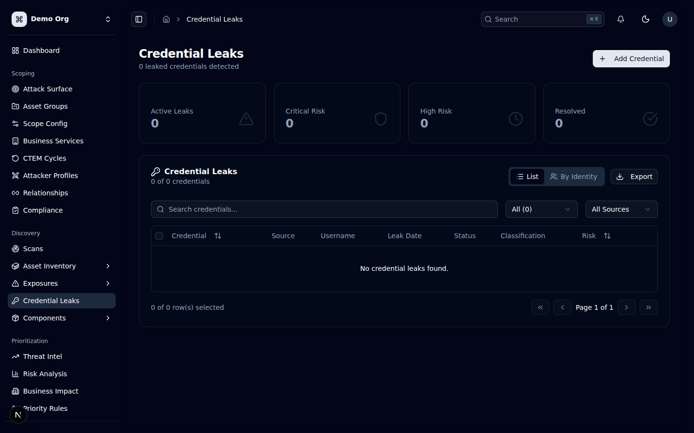

---

## Software Components (`/components`)
**Mục đích:** Trang tổng quan SBOM và bảo mật chuỗi cung ứng cho toàn bộ thành phần phần mềm của tổ chức.
**Cách dùng:**
1. Tiêu đề `Software Components` với nút `Export SBOM` (dẫn tới `/components/sbom-export`).
2. Hàng metric chính: `Total Components` (kèm số direct/transitive), `Vulnerabilities` (kèm badge `nC` critical / `nH` high), `License Risks`, `Outdated`.
3. Thẻ **`Vulnerable Components`**: liệt kê top thành phần dễ tổn thương (tên, version, ecosystem, badge `CISA KEV`, số critical/high); nút `View All` sang `/components/vulnerable`.
4. Thẻ **`Ecosystem Distribution`**: phân bố theo trình quản lý gói; nút `View All` sang `/components/ecosystems`.
5. Thẻ **`License Compliance`**: phân bố rủi ro giấy phép theo mức (critical/high/medium/low/unknown); nút `View All` sang `/components/licenses`.
6. Thẻ **`Quick Actions`**: lối tắt tới All Components, Vulnerable, Licenses, Export SBOM.
7. Nếu có thành phần dính **CISA KEV**, một banner đỏ ở cuối với nút `View KEV Components`.
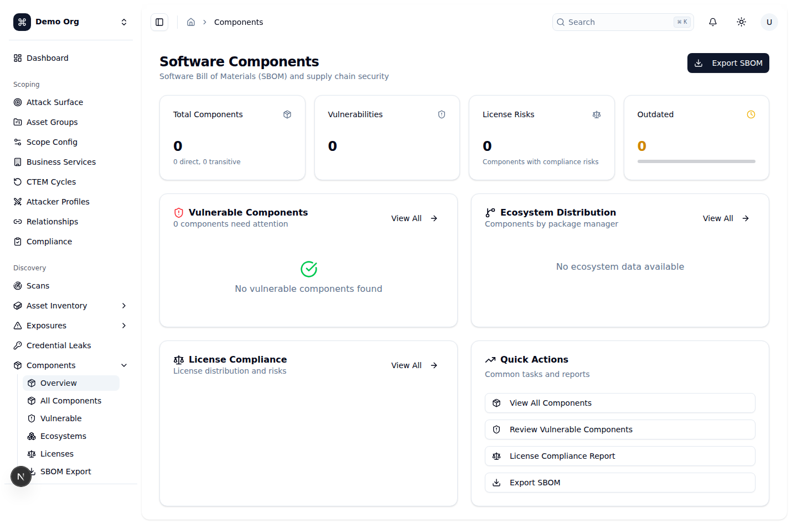
*🌙 Dark mode:* 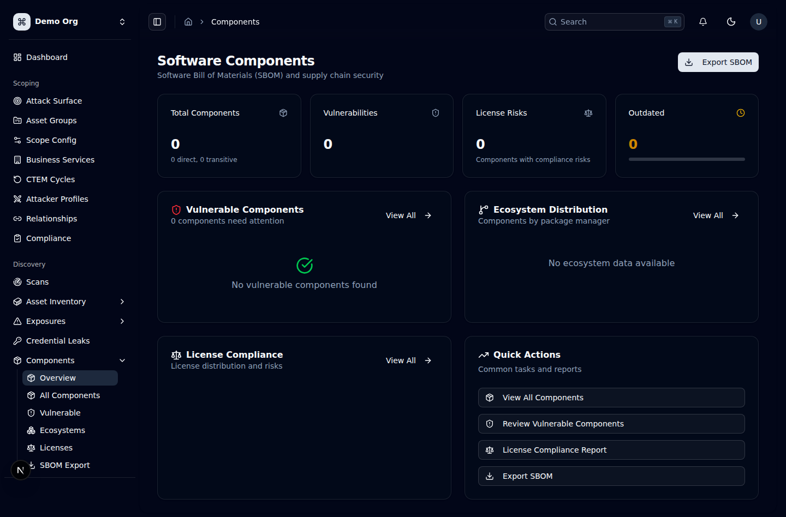

### All Components (`/components/all`)
**Mục đích:** Danh mục đầy đủ mọi thành phần phần mềm.
**Cách dùng:**
1. Tiêu đề + nút `Export CSV`.
2. Bốn thẻ thống kê có thể **bấm để lọc**: `Total Components`, `Direct Dependencies`, `Outdated`, `Vulnerable`.
3. Tab lọc: `All`, `Direct`, `Transitive`, `Outdated`, `Vulnerable` (mỗi tab kèm số đếm).
4. Ô `Search components...` và bộ chọn `Ecosystem` (danh sách lấy từ API).
5. Bảng thành phần (`ComponentTable`); bấm một dòng mở **Component Detail Sheet** (chi tiết version, license, lỗ hổng, đường dẫn phụ thuộc).
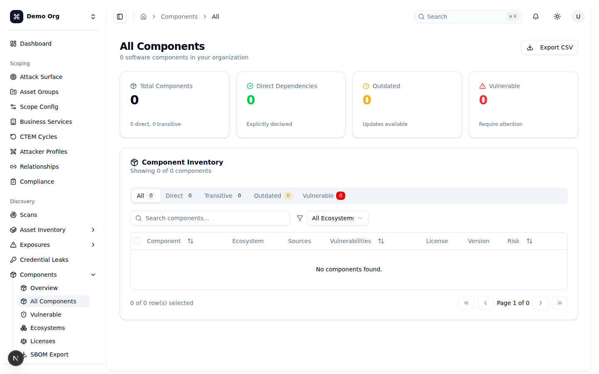
*🌙 Dark mode:* 

### Vulnerable Components (`/components/vulnerable`)
**Mục đích:** Tập trung vào các thành phần có lỗ hổng đã biết, ưu tiên các thành phần dính CISA KEV (hỗ trợ tham số `?cisaKev=true`).
**Cách dùng:** Xem danh sách thành phần dễ tổn thương cùng số lượng lỗ hổng theo severity, cờ KEV và chi tiết khắc phục/nâng cấp.
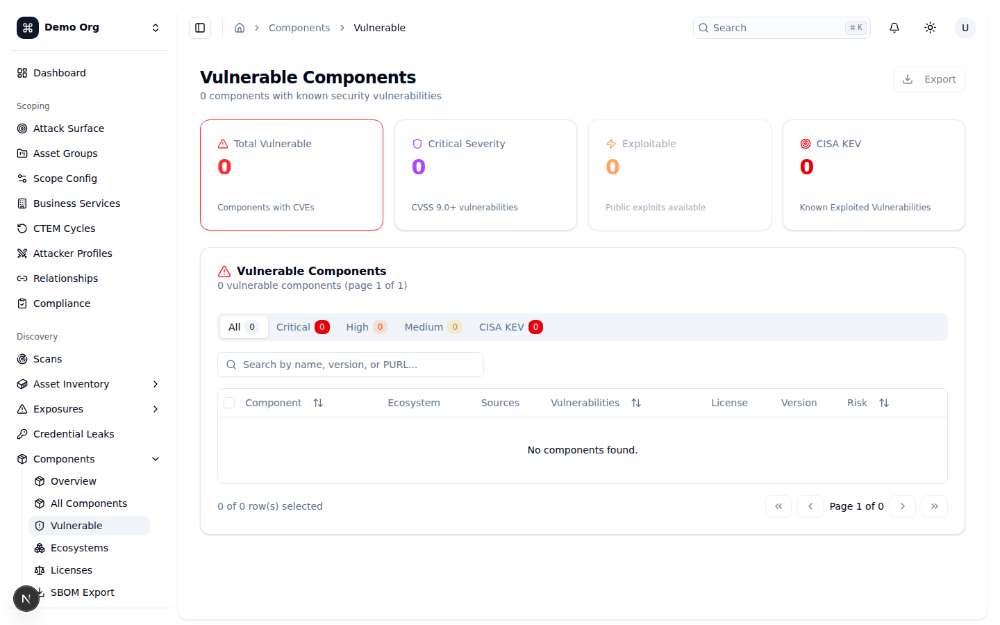
*🌙 Dark mode:* 

### Package Ecosystems (`/components/ecosystems`)
**Mục đích:** Phân tích thành phần theo hệ sinh thái gói (npm, PyPI, Maven, Go, ...).
**Cách dùng:** Xem số lượng thành phần, số vulnerable và số outdated theo từng ecosystem để biết nơi rủi ro chuỗi cung ứng tập trung.
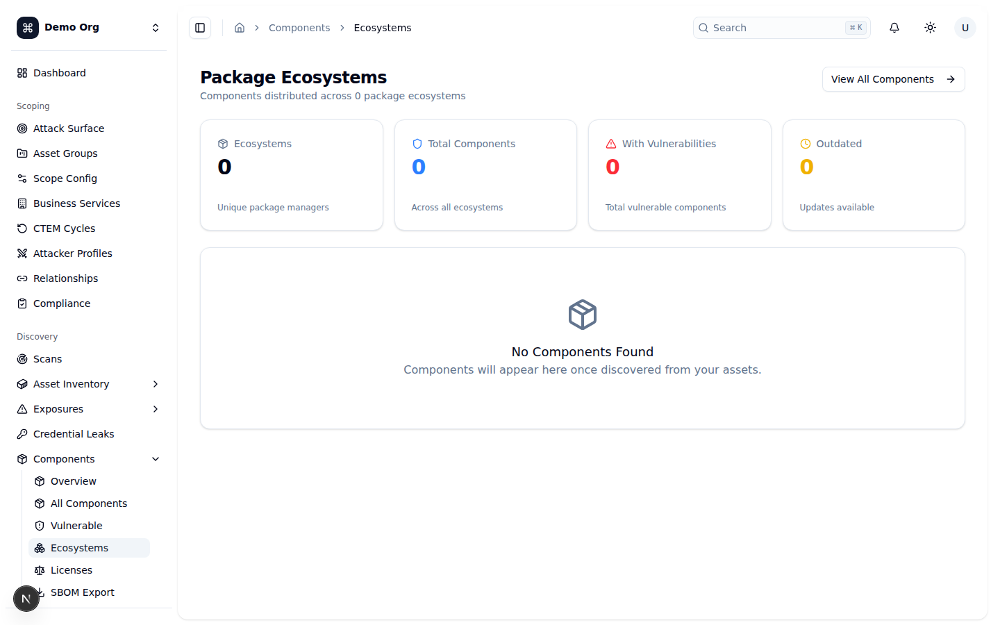
*🌙 Dark mode:* 

### License Compliance (`/components/licenses`)
**Mục đích:** Theo dõi tuân thủ giấy phép — phân bố license và mức rủi ro pháp lý/tuân thủ.
**Cách dùng:** Xem các thành phần theo giấy phép và mức rủi ro (critical/high/medium/low/unknown) phục vụ báo cáo tuân thủ.
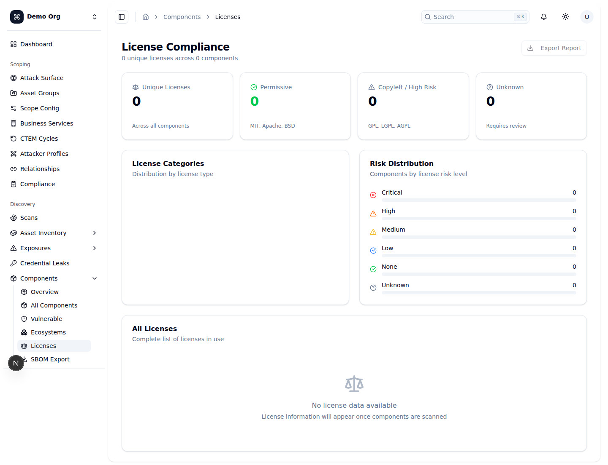
*🌙 Dark mode:* 

### Export SBOM (`/components/sbom-export`)
**Mục đích:** Tạo file Software Bill of Materials theo chuẩn công nghiệp để chia sẻ/tuân thủ (ví dụ Executive Order 14028).
**Cách dùng:**
1. Hàng tóm tắt: `Components` (số sẽ đưa vào), `Vulnerabilities`, `Licenses`, `Format` (định dạng đang chọn + JSON/XML).
2. Thẻ **`Export Configuration`**:
   - **`SBOM Format`** — chọn chuẩn: **CycloneDX** (JSON/XML — phù hợp ngữ cảnh bảo mật, được CI/CD và công cụ bảo mật hỗ trợ rộng) hoặc **SPDX** (chuẩn ISO/IEC 5962:2021, thiên về tuân thủ giấy phép).
   - **`Output Format`** — chọn `JSON` hoặc `XML` (XML tự động escape ký tự đặc biệt `& < > " '` để SBOM không bị hỏng).
   - **`Include in Export`** — ba tùy chọn bật/tắt: `Vulnerability Information` (CVE, CVSS, fix version), `License Information` (định danh SPDX), `Document Metadata` (timestamp, thông tin công cụ, chi tiết thành phần).
   - Nút **`Export SBOM`** sinh file và tải về trình duyệt (tên dạng `sbom-<format>.json/xml`), kèm toast xác nhận.
3. Thẻ **`About SBOM Formats`** giải thích CycloneDX vs SPDX, mức "Compliance Ready", và cảnh báo CISA KEV nếu có thành phần dính lỗ hổng đang bị khai thác.
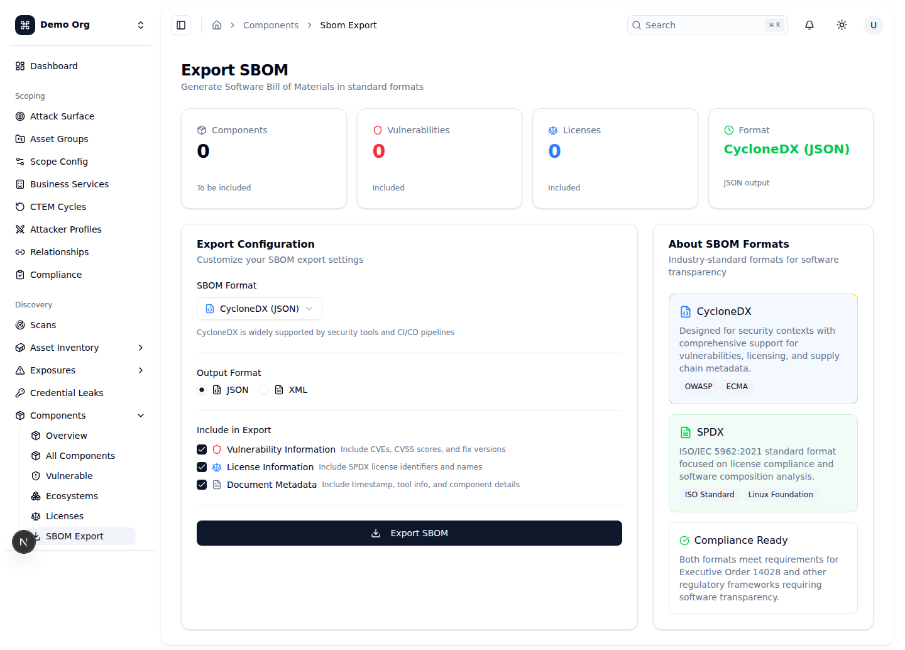
*🌙 Dark mode:* 

---

## Checklist

- [ ] Hiểu khác biệt: **finding** (vấn đề đơn lẻ) vs **exposure event** (điểm phơi nhiễm đã khử trùng lặp, có vòng đời/state history) vs **Components/SBOM** (kho phụ thuộc + xuất SBOM).
- [ ] Tại `/findings`: dùng được severity cards, filter chips (`Search`/`Status`/`Source`), tab severity, và đọc được badge `KEV`/`EPSS`/attack-path trên cột Title.
- [ ] Thực hiện được **bulk assign / change status** và `Export` (CSV/JSON).
- [ ] Mở được **drawer** và **trang chi tiết**; biết nơi xem `AI Analysis`, `Activity timeline` (real-time), `Evidence`, và đổi trạng thái qua status workflow.
- [ ] Hiểu trạng thái cần **phê duyệt** (`False Positive`, `Risk Accepted`, `Accepted Risk`) và quản lý chúng tại `/findings/approvals`.
- [ ] Biết dùng tab `Groups` (gom theo CVE/Asset/Owner...) và `Pending Review` (verify/reject fix).
- [ ] Tại `/exposures`: lọc theo state (`Needs Attention`/`Resolved`/`All`), đổi state với lý do, và đọc `State History`.
- [ ] Xem các trang phơi nhiễm chuyên biệt: `vulnerabilities`, `misconfigurations`, `secrets`, `code`.
- [ ] Tại `/credentials`: dùng được chế độ `List` và `By Identity`, che/hiện secret, `Mark Resolved`.
- [ ] Tại `/components`: điều hướng All/Vulnerable/Ecosystems/Licenses và **xuất SBOM** đúng định dạng (CycloneDX/SPDX, JSON/XML) với tùy chọn include phù hợp.
