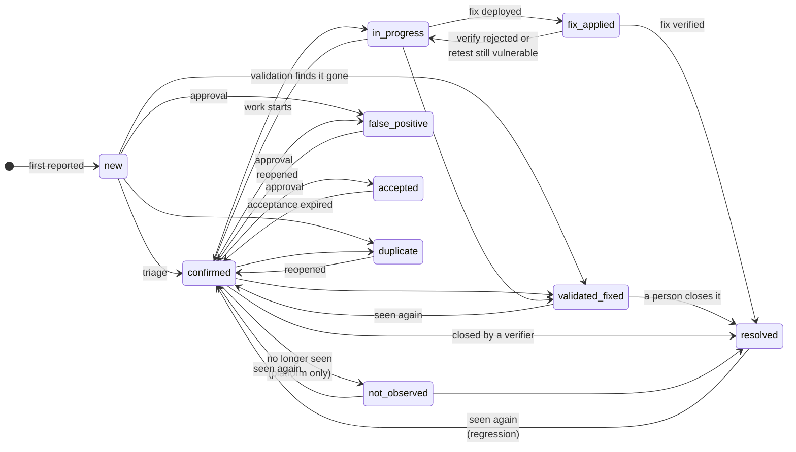
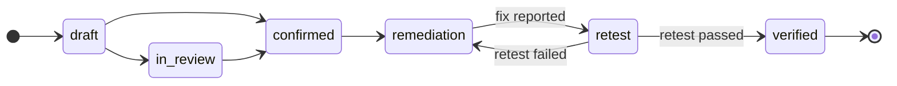

# Exposures and findings

Discovery produces two related kinds of records. Knowing the difference helps
you use the right page for the job.

- A **finding** is **one security issue** on a specific asset or location: a
  static-analysis issue on a line of code, a secret committed in a repository, a
  CVE on a host, a pentest finding. A finding has a severity, a status, a
  priority class, an assignee, evidence and comments, and moves through a status
  workflow. It is the analyst's main unit of work, handled in **Findings**
  (`/findings`).
- An **exposure event** is a **change to your attack surface that needs a
  decision**: an open port, a new subdomain, an expiring certificate, a leaked
  credential, a dangling DNS record. Repeated scans do not create new events: one
  exposure is one record with a first-seen and last-seen time, a state (active,
  resolved, accepted, false positive) and a history of state changes. Exposure
  events are handled in **Exposures** (`/exposures`).

Software components (the SBOM) are covered in
[Discovery](04-discovery.md#software-components-sbom).

As everywhere in the console, buttons and columns are hidden or disabled
according to your permissions (for example `findings:write`,
`findings:approve`, `findings:verify`).

## The findings list

**Findings** (`/findings`, in the top group of the sidebar) is the central
workbench for every finding in the organization, whatever its source (static
analysis, dependency scanning, dynamic scanning, secrets, infrastructure as
code, containers, attack-surface scanning, pentest, imports, manual).

*Figure: The findings list.*

### Header and metrics

- **Approvals** opens the [approval requests](#approval-requests).
- **Import results** loads a scanner report (see
  [Import results](#import-results)).
- **Add finding** records a finding by hand (title, description, severity,
  source, asset and location).

The metric strip is also a set of quick filters: **All findings**, **Open**,
**Critical**, **High**, **Overdue SLA**, **In CISA KEV** and **Awaiting
verification** (fixes waiting to be verified; opens the
[verify view](#verify-fixes)).

### Search, filter, group and save views

- Search by title, CVE, rule or location.
- **Finding state**: **Open** (default), **Fixed**, **Dispositioned** (false
  positive, accepted risk or duplicate; never counted as fixed) or **All**.
- The filter panel: **Assigned to me** (yours, on assets you own, or your
  team's), **Severity**, **Hide informational**, **Priority** (P0 to P3),
  **In CISA KEV**, **Reachable**, **Status**, **SLA**, **Branch** (only on a
  feature branch) and **Source**. Draft and In Review pentest findings are hidden
  until you filter on a status.
- **Group** the list by CVE, rule, asset, owner, severity, source, component,
  type or solution family. Each group shows its progress (open, fixing, applied,
  resolved).
- **Views**: save the current filters as a view, for yourself or shared with
  your groups.
- **Export** as CSV or JSON. With the export permission the server exports every
  matching finding (up to 100,000 rows; audit-logged); otherwise the current page
  is exported.

### Columns and badges

Columns: **Title**, **Severity**, **Priority** (P0 to P3), **Source**,
**Location**, **Status**, **Due / SLA** and **Created**. The title carries
inline badges: **KEV** for a CVE in the CISA Known Exploited Vulnerabilities
catalog (with its remediation date), **EPSS x%** for the probability of
exploitation in the next 30 days, and an icon when attack-path (data-flow) data
exists.

### Row and bulk actions

A row's menu: **View Details**, **Assign**, **Change Status**, **Mark as False
Positive**, **Create Jira Ticket** (when ticketing is set up), **Add to
remediation**, **Copy ID**, **Copy Link** and **Delete** (permanent, asks for
confirmation).

Select rows to **Assign to…**, create a **Remediation task**, or change the
**Status** to Confirmed, In Progress or Resolved (Resolved needs the verify
permission). False positive and accepted risk are never offered in bulk because
they need approval.

In the grouped view:

- **Mark fixed** on a CVE or asset group with work in progress records what you
  did ("What did you do to fix this?", an optional reference, and optionally the
  related CVEs of the same component).
- When grouped by owner, **Assign to asset owners** assigns the unassigned group
  to each asset's owner.

### Verify fixes

The **Awaiting verification** metric opens the verify view: fixes marked
**Fix Applied**, grouped by CVE. People with the verify permission click
**Approve** to accept the fix, or **Reject** with a reason (for example
"Vulnerability still present"); rejected findings go back to the assignee as In
Progress.

### Import results

**Import results** loads findings from a file: Nessus, Qualys (with an optional
Qualys KnowledgeBase), SARIF, trivy, grype, semgrep, gitleaks, nuclei, ZAP, vuls,
CycloneDX, SPDX, OSV, CSAF, OpenVEX, DefectDojo, or a ZIP of these. Click
**Preview** for a dry run (nothing is written), then **Import**. Findings land
only on assets you can change, and an import never resolves other findings. See
also [Ingesting results](../api/ingest.md).

## A single finding

Click a row to open the **drawer**; click **Open full details** (or press
<kbd>⌘</kbd>/<kbd>Ctrl</kbd>+<kbd>Enter</kbd>) for the full page
(`/findings/{id}`).

### The drawer

- The header shows the title, source, CVE and asset, with **Status**,
  **Severity** and **Assignee** selectors. Every change shows a toast with
  **Undo**. The menu has **Copy link** and **Create ticket**.
- **Why it matters** (the priority class and its signals), the fix,
  properties (priority, SLA due, asset, found by, first and last seen,
  occurrences, tickets, tags, ID), the description, the approval history (for
  false positive or accepted findings) and the activity.

### The full page

**Header.** Source, type, CVE (links to NVD) and CWE (links to MITRE) badges and
the title, with:

- **Re-verify**: queues a safe re-check of the finding by a validation-capable
  sensor (not offered for pentest, bug bounty, red team or manual findings;
  needs `findings:write`). See [Validation](07-validation.md#re-verify-a-finding).
- **AI Triage** (when the AI triage module is on and AI is configured): asks for
  an assessment; the result appears as **AI analysis** on the Overview tab.
- The **⋯** menu: **Copy link**, **Create ticket** and **Mark as duplicate**
  (search a finding on the same asset; comments, retests, evidence and tickets
  move to the original).

*Figure: A finding on its own page.*

*Figure: The Evidence tab: the request and response that proved the finding.*

**Properties rail.** Status, Severity, Priority, Assignee, SLA due, Asset, Found
by, First seen, Last seen, Occurrences, Resolved, Tickets, Tags and ID. For
human-sourced findings (pentest, bug bounty, red team, manual) Status, Severity
and Assignee are read-only here. A callout appears when the SLA is overdue or
breached.

**Retest** (nuclei findings with a rule ID): **Retest now** (needs the verify
permission) re-runs the detection and reports Fixed, Still vulnerable,
Regression (reopened), Not reproduced or Inconclusive.

**Why it matters.** The priority class and the deadline to fix it, the reason
sentence, and risk-signal chips grouped into exploitation, exposure and business
impact. **Set manually** marks an overridden class, "Set by rule" names the
[priority rule](06-prioritization.md#priority-rules) that set it, and an
"Ownership not confirmed" note (with **Verify ownership**) appears when the class
is held at P2 because the asset's ownership is unconfirmed. Open **How this was
scored** for the transparent priority score (see
[Prioritization](06-prioritization.md#the-transparent-priority-score)).

**Tabs:**

- **Overview**: AI analysis (when triaged), description, context, identifiers
  and scores (CVSS, EPSS, CISA KEV, CWE, OWASP, related CVEs), code location,
  scanner output and targets.
- **Evidence**: tool evidence, affected code and context, stack traces,
  attachments and uploaded evidence, validation evidence, compliance mapping, and
  **Notes** with **Add Evidence** (description, type, URL). Masked secrets in
  tool evidence can be revealed for 60 seconds by people with the reveal
  permission; every reveal is audited.
- **Remediation**: progress, recommendation, auto-fix code, remediation steps
  (**Add Step**), references, and the **Definition of Done & Acceptable Fixes**
  card (see [Mobilization](08-mobilization.md#the-engineering-ticket-brief)).
- **Attack path** (when data-flow data exists): sources, propagation steps and
  sinks.
- **Related**: findings with the same CVE, similar findings, duplicates, links
  and occurrences.

Pentest findings show a **Pentest details** tab instead of Attack path.

**Activity.** Open it from the rail ("Activity · N comments"), or press
<kbd>C</kbd>. It shows the timeline live (creation, status changes, AI triage,
comments), filtered by **All**, **Comments** or **Changes**. Write comments in
Markdown (**Write** / **Preview**); an **Internal** comment is visible only to
your organization and never sent to Jira or other integrations. You can edit and
delete your comments and add reactions. Posting needs `findings:write`.

### Status workflow

Automated findings use:

**New → Confirmed → In Progress → Fix Applied → Resolved**, plus **Validated
Fixed**, **Not Observed** (set by the platform when a finding is no longer
seen), **Duplicate**, **False Positive** and **Risk Accepted**.

| Status | Group | Set by |
|---|---|---|
| `new` | open | The first report from a scan, an import or an integration. |
| `confirmed` | open | A person; or the platform when a closed, validated-fixed or not-observed finding is seen again, a retest finds it still vulnerable, or an accepted risk expires. |
| `in_progress`, `fix_applied` | in progress | A person, or a Jira or GitHub issue linked to the finding. |
| `validated_fixed` | in progress | A validation re-check that no longer reproduces the finding. Not closed: a person with the verify permission resolves it. |
| `not_observed` | in progress | The platform only: a later scan with the same coverage no longer reports it, or a branch-only finding expired. Nobody can choose it. |
| `resolved` | closed | A person with the verify permission, a passing retest (when the retest settles findings automatically), or a scan that no longer sees it when the operator enables coverage auto-resolve (`INGEST_COVERAGE_AUTO_RESOLVE=enforce`; off by default). |
| `false_positive`, `accepted` | closed | An approved request. |
| `duplicate` | closed | A person. |

A finding that was resolved and is reported again is reopened as
`confirmed` and flagged as a **regression** (its reopen count goes up),
unless it was closed as a false positive, an accepted risk or a duplicate.

Pentest findings use: **Draft → In Review → Confirmed → Remediation → Retest →
Verified**, plus **False Positive** and **Accepted Risk**. Their status is
managed in the pentest workflow (see [Validation](07-validation.md)).

From any of these steps a pentest finding can also be marked
`false_positive` or `accepted_risk` (with approval), and either can be
reopened to `draft` or `confirmed`.

- **False Positive**, **Risk Accepted** and **Accepted Risk** always need
  approval. Choosing them opens **Request Status Approval**: enter a
  justification (up to 2,000 characters) and, for Risk Accepted, an optional
  expiry date, then **Submit for Approval**. When an approved acceptance expires,
  the finding reopens as Confirmed.
- Resolving a finding by hand needs the verify permission.

### Approval requests

**Approval Requests** (`/findings/approvals`, from the **Approvals** button) is
the queue of requests to move findings to false positive or accepted risk.

*Figure: Approval requests.*

- Cards and tabs: **Pending**, **Approved**, **Rejected**, **Canceled** and
  **All**; search by justification.
- Columns: status, finding, requested status, justification, created, expires.
- On a pending request, people with `findings:approve` (owners and admins by
  default) can **Approve** (the status changes immediately) or **Reject** with a
  reason (up to 2,000 characters). You cannot approve your own request, and
  expired requests cannot be approved or rejected.
- The requester can **Cancel** their own request.

## Exposures

**Discovery › Exposures** has five tabs: **Overview**, **Vulnerabilities**,
**Secrets**, **Code weaknesses** and **Misconfigurations**.

*Figure: Exposures.*

### Overview: exposure events

**Overview** (`/exposures`) lists attack-surface changes that need a decision:
resolve, accept or dismiss them.

1. The tabs **All exposures** and **Analytics**; the metrics **Total
   exposures**, **Needs attention**, **Resolved** and **Mean time to resolve**.
2. Search, filter by **Severity** and by state (**Needs attention**, **Closed**,
   **All states**), and **Export** to CSV.
3. Columns: exposure (with its type), severity, state (Active, Resolved,
   Accepted, False positive), source and first seen. A row's menu: **View
   details**, **Mark resolved**, **Accept risk**, **False positive** or
   **Reactivate**.
4. Select rows to **Resolve**, **Accept risk** or mark **False positive**.
   Accepting and false positive need a reason (recorded in the audit log) and the
   approval permission (`findings:approve`).
5. Click a row for its details: description, **Security context** (effective
   criticality, CISA KEV, EPSS, CVE, internet reachability), **Timeline** (first
   seen, last seen, resolved), **Details** (credential, database, source, code
   location and network fields; sensitive values are masked, with **Reveal
   secrets**) and **Activity** (every state change with who and why).

**Analytics** charts exposures by severity, by state and by event type.

Where exposure events come from (they are created automatically, not typed in):

| Source | Event types |
|---|---|
| Recon results (open ports, services, certificates) | `port_open`, `service_detected`, `certificate_expiring`, `certificate_expired`, `ssl_issue` |
| Secret findings | `credential_leaked` |
| Infrastructure-as-code and cloud-configuration findings | `misconfiguration` |
| Certificate Transparency monitoring | `subdomain_discovered`, `certificate_expiring`, `certificate_expired` |
| DNS checks on your domains | `dangling_cname`, `dangling_ns`, `email_security_weak`, and `subdomain_takeover` when a takeover is confirmed |
| Credential imports | `credential_leaked` |

Each source uses a stable fingerprint, so a repeated scan only updates the last
seen time (and can reactivate a resolved exposure) instead of creating a new
record.

The platform also keeps a catalog of standardized exposure classes (CTEM IDs),
refreshed daily from a public feed. It is available through the API
(`GET /api/v1/ctem-ids`, and `PUT /api/v1/exposures/{id}/ctem-id` to tag an
exposure); there is no console page for it.

### Vulnerabilities, Secrets, Code weaknesses, Misconfigurations

These four tabs are dashboards over findings of one kind. Each has **View N
findings**, which opens the findings list filtered to that kind.

- **Vulnerabilities** (`/exposures/vulnerabilities`): vulnerability findings and
  the CVEs behind them. The **Summary** tab shows totals, a severity
  distribution, the status mix and the finding trend. **Active CVEs** (CVEs
  affecting your assets) and **CVE catalog** (the global catalog, with CVSS,
  EPSS, public exploit and CISA KEV flags) need `vulnerabilities:read`.
- **Secrets** (`/exposures/secrets`): secrets committed to code (API keys,
  tokens, passwords): totals, repositories affected, critical secrets ("Rotate
  immediately"), risk score, severity distribution, status and remediation
  priority.
- **Code weaknesses** (`/exposures/code`): static-analysis findings: totals,
  critical, high, repositories with findings, severity distribution, finding
  trend and assets by type.
- **Misconfigurations** (`/exposures/misconfigurations`): infrastructure and
  application misconfigurations found by IaC scanning: totals, critical
  misconfigurations, asset coverage, risk score, findings by severity, assets by
  type and priority fixes.

Until there is data, each tab shows an empty state with a suggested next step.
