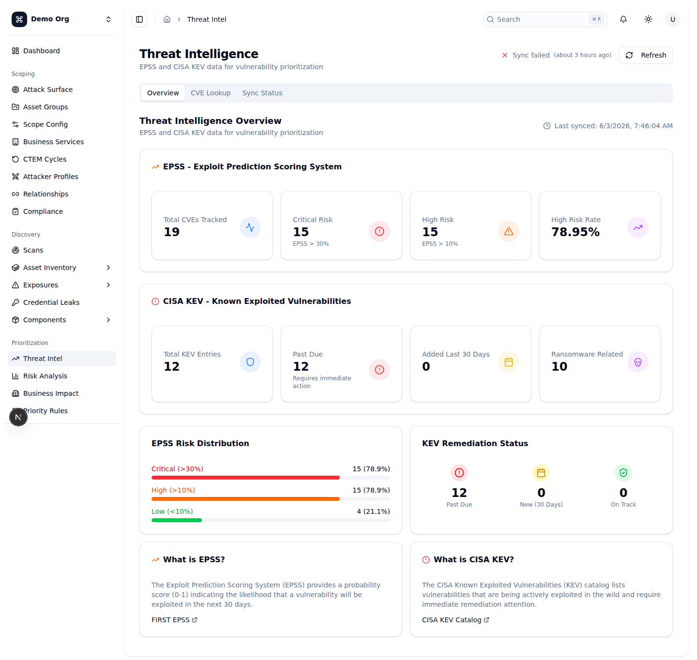
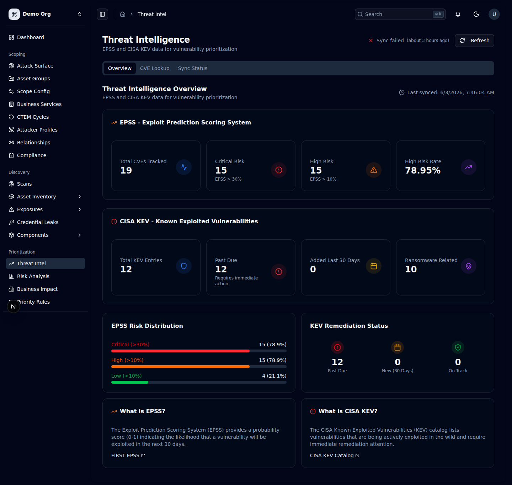
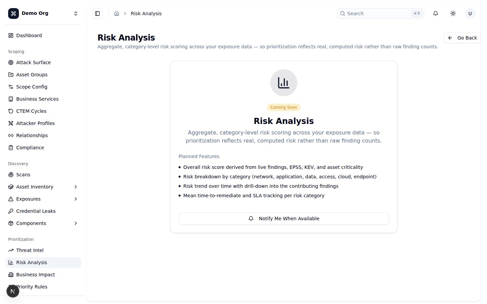
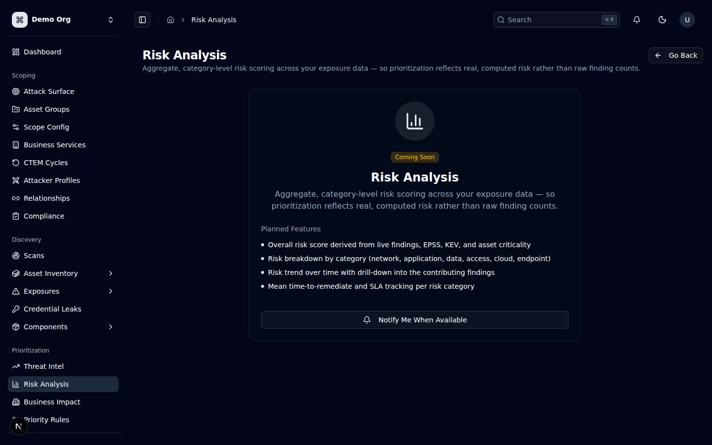
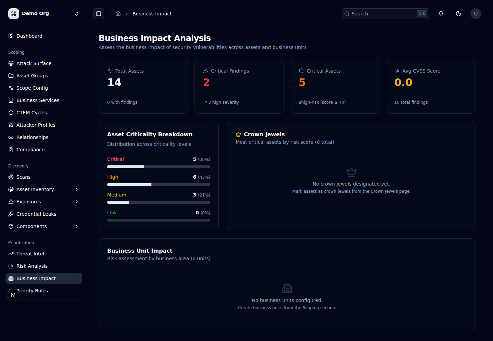
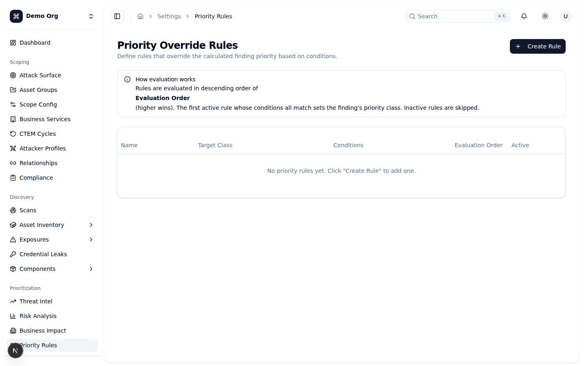
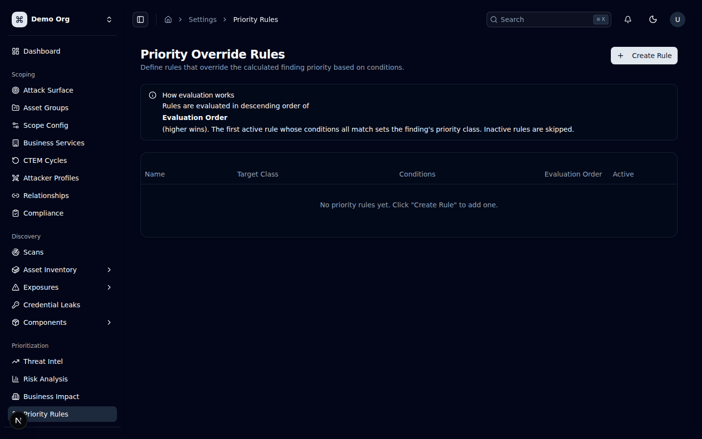
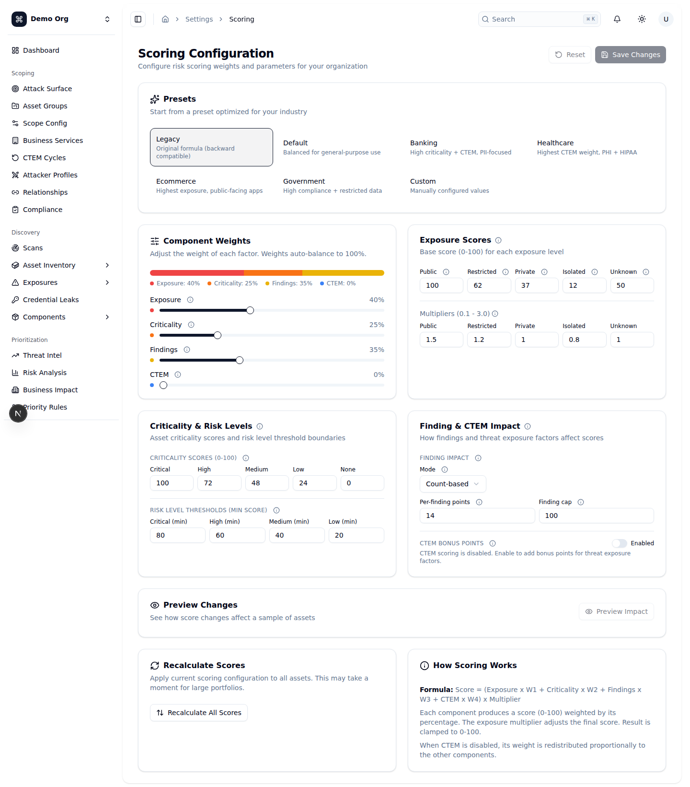
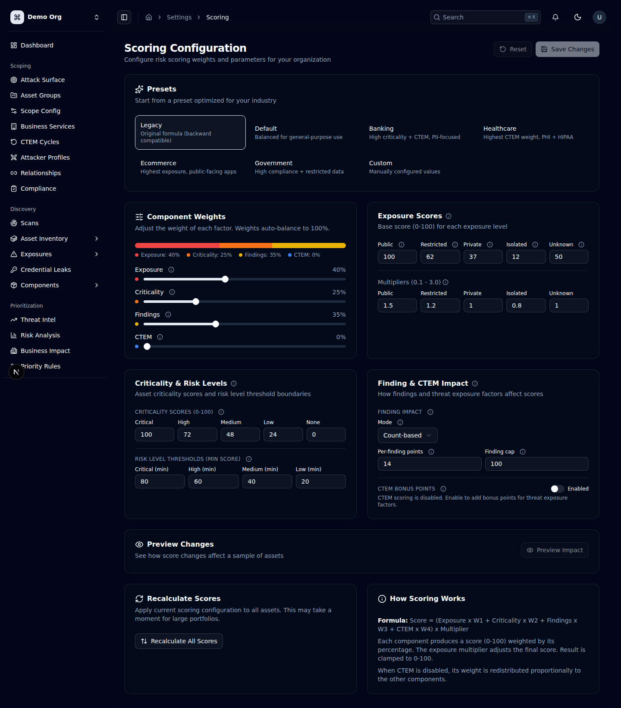

# Hướng dẫn sử dụng OpenCTEM — Phần 5: Prioritization (Ưu tiên xử lý)

## Giới thiệu: Quyết định "sửa gì trước"

**Prioritization** (Ưu tiên hóa) là giai đoạn thứ ba trong vòng đời CTEM: sau khi đã *xác định phạm vi* (Scoping), *khám phá tài sản & phơi nhiễm* (Discovery), bạn cần trả lời câu hỏi quan trọng nhất — **trong hàng trăm finding đang mở, cái nào phải sửa trước?** Số lượng finding gần như luôn vượt quá năng lực khắc phục, nên xếp hạng theo CVSS đơn thuần là không đủ.

OpenCTEM giải quyết bằng cách kết hợp nhiều tín hiệu rủi ro thành một **priority class** duy nhất (`P0`–`P3`):

- **Severity (mức độ nghiêm trọng)** — `critical` / `high` / `medium` / `low` / `info`, thường gắn với CVSS.
- **EPSS** (*Exploit Prediction Scoring System*) — xác suất (0–1) một CVE bị khai thác trong **30 ngày tới**. Một lỗ hổng "Critical" nhưng EPSS thấp ít cấp bách hơn lỗ hổng "High" đang có exploit ngoài thực địa.
- **CISA KEV** (*Known Exploited Vulnerabilities*) — danh mục các CVE **đang bị khai thác thực tế**. Có mặt trong KEV là tín hiệu ưu tiên mạnh nhất.
- **Reachability (khả năng tiếp cận)** — lỗ hổng có thực sự nằm trên đường đi mà kẻ tấn công chạm tới được hay không (cờ `is_reachable`).
- **Asset criticality (mức trọng yếu của tài sản)** — `critical` / `high` / `medium` / `low`, và cờ **crown jewel** (tài sản "viên ngọc" — quan trọng sống còn).
- **Business impact (tác động nghiệp vụ)** — finding nằm trên tài sản thuộc business unit/dịch vụ trọng yếu nào.

Nền tảng dùng các tín hiệu trên theo hai cơ chế bổ trợ nhau:

1. **Risk scoring** (chấm điểm rủi ro tài sản, 0–100) — cấu hình trọng số ở **Scoring Configuration** (`/settings/scoring`); điểm này hiển thị xuyên suốt nền tảng.
2. **Priority Override Rules** (luật ghi đè ưu tiên) — tại **Priority Override Rules** (`/settings/priority-rules`), bạn định nghĩa các luật điều kiện để **ghi đè** priority class đã tính ra (ví dụ: "KEV + crown jewel → P0").

> **Ý nghĩa các priority class** (kèm SLA gợi ý, lấy từ cấu hình trong nền tảng):
> - **`P0` — Immediate**: đang bị khai thác và reachable. SLA **7 ngày**.
> - **`P1` — Urgent**: xác suất khai thác cao và reachable. SLA **30 ngày**.
> - **`P2` — Scheduled**: rủi ro trung bình hoặc đã có biện pháp bù trừ (compensating controls). SLA **60 ngày**.
> - **`P3` — Track**: rủi ro thấp, sửa khi có cơ hội. SLA **Opportunistic**.

> Lưu ý quyền (RBAC): nhiều nút bị ẩn/khóa tùy phân quyền. Đặc biệt việc tạo/sửa/xóa luật ưu tiên cần quyền `ctem:priority_rules:write`.

---

## Threat Intelligence (`/threat-intel`)

**Mục đích:** Trung tâm dữ liệu tình báo mối đe dọa của tenant — đồng bộ và tra cứu **EPSS** và **CISA KEV** để làm giàu (enrich) cho finding và phục vụ việc ưu tiên hóa. Đây là nguồn nuôi các badge `KEV` / `EPSS` xuất hiện ở khắp nơi (danh sách findings, chi tiết finding...).

**Cách dùng:**
1. **Tiêu đề trang** hiển thị `Threat Intelligence`. Góc phải có chỉ báo đồng bộ gọn (`CompactSyncStatus`: "All syncs healthy" / "Sync pending" / "Sync failed" kèm thời điểm sync gần nhất) và nút `Refresh` để tải lại dữ liệu.
2. Trang có ba tab: `Overview`, `CVE Lookup`, `Sync Status`.
3. **Tab `Overview`** — tổng quan thống kê:
   - **Khối EPSS** (`EPSS - Exploit Prediction Scoring System`) với 4 thẻ: `Total CVEs Tracked`, `Critical Risk` (EPSS > 30%), `High Risk` (EPSS > 10%), `High Risk Rate` (tỉ lệ %).
   - **Khối CISA KEV** (`CISA KEV - Known Exploited Vulnerabilities`) với 4 thẻ: `Total KEV Entries`, `Past Due` (quá hạn khắc phục — cần hành động ngay), `Added Last 30 Days`, `Ransomware Related`.
   - Hai biểu đồ phân bố: `EPSS Risk Distribution` (Critical >30% / High >10% / Low <10%) và `KEV Remediation Status` (`Past Due` / `New (30 Days)` / `On Track`).
   - Hai thẻ giải thích `What is EPSS?` và `What is CISA KEV?` kèm liên kết ra FIRST EPSS và CISA KEV Catalog.
4. **Tab `CVE Lookup`** — tra cứu một CVE bất kỳ:
   - Nhập mã CVE vào ô (ví dụ `CVE-2021-44228`), bấm `Lookup` (hoặc Enter). Định dạng bắt buộc là `CVE-YYYY-NNNNN`; sai định dạng sẽ báo lỗi.
   - Kết quả hiển thị: header CVE kèm badge **EPSS score** và **KEV indicator**; khối `EPSS Score Details` (`Score` %, `Percentile`, `Model Version`, ngày chấm điểm, thanh đo `EPSSScoreMeter`); khối `CISA KEV Entry` (nếu có: vendor/product, tên lỗ hổng, mô tả, hành động bắt buộc, hạn khắc phục, cờ ransomware). Nếu CVE không nằm trong KEV sẽ báo "This CVE is not in the CISA KEV catalog".
5. **Tab `Sync Status`** — bảng điều khiển đồng bộ (`Data Sync Status`): mỗi nguồn (`EPSS`, `CISA KEV`) là một thẻ hiển thị trạng thái lần sync gần nhất (`Success` / `Failed` / `Pending` / `Never synced`), thời điểm sync, số bản ghi, lần sync kế tiếp và thông báo lỗi (nếu có). Mỗi nguồn có nút `Sync Now` (chạy đồng bộ ngay) và công tắc `Enabled`/`Disabled`.

**Ghi chú:** EPSS và KEV được đồng bộ định kỳ tự động; `Sync Now` chỉ dùng khi cần làm mới gấp. Dữ liệu này là **đầu vào** cho việc ưu tiên — bản thân trang không thay đổi priority của finding.

*🌙 Dark mode:* 

---

## Risk Analysis (`/risk-analysis`) — *Sắp ra mắt (Coming Soon)*

**Mục đích:** Cung cấp **điểm rủi ro tổng hợp theo nhóm danh mục** trên toàn bộ dữ liệu phơi nhiễm, để việc ưu tiên phản ánh rủi ro *được tính toán thực sự* thay vì chỉ đếm số lượng finding thô.

**Trạng thái hiện tại:** Trang này **chưa khả dụng** — hiện là một placeholder "Coming Soon". Mở `/risk-analysis` sẽ thấy màn hình giới thiệu các tính năng *dự kiến*, chứ chưa có dữ liệu hay thao tác nào hoạt động.

Các tính năng được công bố (theo nội dung placeholder), **đều là kế hoạch tương lai**:
- Điểm rủi ro tổng thể suy ra từ findings trực tiếp, EPSS, KEV và mức trọng yếu của tài sản.
- Phân tích rủi ro theo danh mục (network, application, data, access, cloud, endpoint).
- Xu hướng rủi ro theo thời gian, có thể "khoan sâu" (drill-down) vào các finding đóng góp.
- Thời gian khắc phục trung bình (MTTR) và theo dõi SLA theo từng nhóm rủi ro.

**Ghi chú:** Trong khi chờ trang này hoàn thiện, hãy dùng **Business Impact Analysis** (`/business-impact`) cho góc nhìn rủi ro theo tài sản/business unit, và **Scoring Configuration** (`/settings/scoring`) để điều chỉnh công thức điểm rủi ro.

*🌙 Dark mode:* 

---

## Business Impact Analysis (`/business-impact`)

**Mục đích:** Đánh giá **tác động nghiệp vụ** của các lỗ hổng — gắn rủi ro kỹ thuật với tài sản trọng yếu (crown jewels) và các đơn vị nghiệp vụ (business units), giúp lãnh đạo thấy "rủi ro này ảnh hưởng tới phần nào của doanh nghiệp".

**Cách dùng:**
1. **Tiêu đề** `Business Impact Analysis`.
2. **Hàng 4 thẻ chỉ số tổng quan** (lấy từ dữ liệu thật của tenant):
   - `Total Assets` (tổng tài sản, kèm số tài sản có findings).
   - `Critical Findings` (số finding critical, kèm số high severity).
   - `Critical Assets` (số tài sản criticality `critical`, kèm số tài sản high-risk có điểm ≥ 70).
   - `Avg CVSS Score` (CVSS trung bình của các finding, kèm tổng số finding).
3. **`Asset Criticality Breakdown`** — phân bố tài sản theo bốn mức trọng yếu (`Critical` / `High` / `Medium` / `Low`), mỗi mức kèm số lượng, phần trăm và thanh tiến trình.
4. **`Crown Jewels`** — danh sách (tối đa 5) tài sản trọng yếu nhất, **sắp xếp theo risk score giảm dần**; mỗi dòng hiển thị tên, loại tài sản, số findings, điểm rủi ro và nhãn mức rủi ro (`Critical` ≥75 / `High` ≥50 / `Medium` ≥25 / `Low`). Nếu chưa đánh dấu crown jewel nào, trang hướng dẫn vào trang Crown Jewels để đánh dấu.
5. **`Business Unit Impact`** — bảng các đơn vị nghiệp vụ **sắp xếp theo điểm rủi ro trung bình giảm dần**, gồm các cột: `Business Unit`, `Owner`, `Assets`, `Critical Findings`, `Total Findings`, `Avg Risk Score`, `Risk Level`. Nếu chưa cấu hình business unit nào, trang chỉ dẫn tạo từ phần Scoping.

**Ghi chú:** Toàn bộ số liệu phái sinh từ dữ liệu tài sản và findings thực tế của tenant; muốn các con số "đúng" với thực tế nghiệp vụ, hãy đánh dấu crown jewels và gán tài sản vào business units trong giai đoạn Scoping. Risk score của tài sản do **Scoring Configuration** quyết định (xem mục dưới).

*🌙 Dark mode:* 

---

## Priority Override Rules (`/settings/priority-rules`)

**Mục đích:** Định nghĩa các **luật điều kiện ghi đè** priority class đã được nền tảng tính tự động. Đây là nơi bạn mã hóa chính sách ưu tiên của tổ chức thành quy tắc tự động, ví dụ: "Bất kỳ lỗ hổng nào nằm trong KEV và reachable → ép thành `P0`".

**Cách evaluation hoạt động (rất quan trọng):**
- Các luật được đánh giá theo **`Evaluation Order` giảm dần — số lớn hơn được xét trước (ưu tiên cao hơn)**.
- Luật **đang active đầu tiên** mà **tất cả** điều kiện của nó khớp sẽ quyết định priority class của finding. Các luật phía sau bị bỏ qua.
- Luật `inactive` (công tắc `Active` tắt) bị **bỏ qua** hoàn toàn.
- Luật **không có điều kiện nào** sẽ **khớp mọi finding** (dùng cẩn thận — thường đặt ở `Evaluation Order` thấp làm "luật mặc định").

**Các trường điều kiện (field) hỗ trợ:**

| Field | Ý nghĩa | Kiểu | Toán tử cho phép | Giá trị |
|---|---|---|---|---|
| `is_in_kev` | Có trong danh mục CISA KEV | bool | `=`, `!=` | `true` / `false` |
| `is_reachable` | Lỗ hổng có thể tiếp cận được | bool | `=`, `!=` | `true` / `false` |
| `asset_is_crown_jewel` | Tài sản là crown jewel | bool | `=`, `!=` | `true` / `false` |
| `epss_score` | Điểm EPSS (0–1) | float | `=`, `>=`, `<=` | số thập phân (vd `0.5`) |
| `severity` | Mức nghiêm trọng | string | `=`, `!=`, `in` | `critical`/`high`/`medium`/`low`/`info` |
| `asset_criticality` | Mức trọng yếu tài sản | string | `=`, `!=`, `in` | `critical`/`high`/`medium`/`low` |

(Toán tử `in` dùng cho danh sách, nhập nhiều giá trị ngăn cách bởi dấu phẩy, ví dụ `critical, high`.)

**Cách dùng:**
1. **Hộp thông báo** `How evaluation works` ở đầu trang nhắc lại quy tắc đánh giá nêu trên.
2. **Bảng luật** với các cột: `Name` (kèm mô tả), `Target Class` (priority class đích, dạng badge P0–P3), `Conditions` (mỗi điều kiện hiện như một badge `field op value`), `Evaluation Order`, `Active` (công tắc bật/tắt nhanh), và menu `...`. Bảng được sắp xếp theo `Evaluation Order` giảm dần — đúng thứ tự đánh giá.
3. Bấm **`Create Rule`** (cần quyền `ctem:priority_rules:write`) để mở hộp thoại tạo luật. Trong hộp thoại:
   - `Name *` (bắt buộc, ví dụ `KEV on crown jewel → P0`).
   - `Description` (giải thích khi nào/tại sao luật áp dụng).
   - `Target Priority Class` — chọn `P0` / `P1` / `P2` / `P3`.
   - `Evaluation Order` — số nguyên (mặc định `50`); số lớn hơn được xét trước.
   - `Active` — công tắc bật/tắt luật.
   - Khối **`Conditions`**: bấm `Add Condition` để thêm dòng điều kiện. Mỗi dòng có ba ô: chọn **field**, chọn **toán tử** (danh sách toán tử tự đổi theo kiểu của field), và **giá trị** (ô nhập phù hợp kiểu: dropdown true/false cho bool, ô số cho float, dropdown cho severity/criticality, ô nhập danh sách cho toán tử `in`). Nút `X` để xóa điều kiện.
4. Trước khi lưu, bấm **`Dry run`** trong hộp thoại (chỉ bật khi đã có ≥1 điều kiện) để xem trước tác động — xem mục dưới.
5. Bấm `Create` (hoặc `Update` khi sửa) để lưu. Toast xác nhận.
6. Trên mỗi dòng, menu `...` cho phép `Edit`, `Dry run`, và `Delete` (xóa có hộp thoại xác nhận, không hoàn tác được). Công tắc `Active` ở cột riêng cho phép bật/tắt nhanh mà không cần mở hộp thoại.

### Hộp thoại Dry-Run (xem trước tác động)

**Mục đích:** Xem **luật này sẽ ảnh hưởng tới những finding nào** nếu được kích hoạt — **không thay đổi bất kỳ finding nào** (chỉ preview).

**Cách dùng & cách đọc kết quả:**
1. Mở từ nút `Dry run` (trong hộp thoại tạo/sửa, hoặc menu `...` của một luật đã lưu). Tiêu đề hiện tên luật (hoặc `(unsaved rule)` nếu là luật chưa lưu).
2. Dòng đầu cho biết luật sẽ **reclassify các finding khớp về** priority class đích nào.
3. **`Approximate impact (open findings only)`** — số lượng finding (đang mở) ước tính khớp với các **điều kiện mà UI có thể đánh giá phía client**. Hiện chỉ điều kiện `severity` được tính client-side; chỉ tính trên finding đang mở (loại bỏ `resolved`, `verified`, `false_positive`, `accepted`, `duplicate`).
4. **Cảnh báo `Approximate preview`** (nền vàng) xuất hiện khi luật có các điều kiện chỉ backend mới đánh giá được (như `is_in_kev`, `epss_score`, `is_reachable`, `asset_is_crown_jewel`, compensating controls). Các điều kiện này được tra cứu lúc phân loại thực tế trên server, nên **số khớp thật thường nhỏ hơn** con số ước tính hiển thị.
5. **`Sample findings (up to 10)`** — danh sách mẫu tối đa 10 finding khớp, kèm severity và priority class hiện tại.

**Ghi chú:** Dry-run hiện là **ước tính phía client** cho mục đích xem nhanh. Để thực sự đổi priority, hãy **lưu luật** rồi kích hoạt một đợt reclassification (reclassification sweep) từ trang **Cycles** (quyền admin). Một endpoint dry-run phía server (trả về số khớp *chính xác* cho cả các điều kiện EPSS/KEV/asset) là tính năng dự kiến tương lai.

*🌙 Dark mode:* 

---

## Scoring Configuration (`/settings/scoring`)

**Mục đích:** Cấu hình **công thức chấm điểm rủi ro tài sản (risk score 0–100)** cho toàn tổ chức. Điểm rủi ro này nuôi các trang như Business Impact và các xếp hạng tài sản trên toàn nền tảng.

**Công thức (hiển thị trong thẻ `How Scoring Works`):**
> `Score = (Exposure × W1 + Criticality × W2 + Findings × W3 + CTEM × W4) × Multiplier`

Mỗi thành phần cho ra điểm 0–100, nhân với trọng số (%) tương ứng; hệ số nhân theo mức phơi nhiễm (exposure multiplier) điều chỉnh kết quả cuối; kết quả được kẹp về khoảng 0–100. Khi CTEM bị tắt, trọng số của nó được phân bổ lại cho ba thành phần còn lại.

**Cách dùng:**
1. **Tiêu đề** `Scoring Configuration` với nút `Reset` (hoàn tác thay đổi chưa lưu) và `Save Changes` (chỉ bật khi có thay đổi *và* hợp lệ).
2. **`Presets`** — chọn nhanh bộ cấu hình tối ưu theo ngành: `Legacy`, `Default`, `Banking`, `Healthcare`, `Ecommerce`, `Government` (mỗi preset có mô tả ngắn). Chọn preset sẽ nạp cấu hình của nó; mọi chỉnh sửa thủ công sau đó chuyển preset thành `Custom`.
3. **`Component Weights`** — bốn thanh trượt trọng số: `Exposure`, `Criticality`, `Findings`, `CTEM`. Tổng các trọng số **phải bằng 100%**; khi kéo một thanh, các thanh còn lại **tự cân bằng lại** tương ứng. Có thanh phân bố trực quan (`WeightDistributionBar`).
4. **`Exposure Scores`** — điểm gốc (0–100) cho mỗi mức phơi nhiễm: `Public`, `Restricted`, `Private`, `Isolated`, `Unknown`; và **`Multipliers` (0.1–3.0)** cho từng mức (>1.0 khuếch đại rủi ro, <1.0 giảm).
5. **`Criticality & Risk Levels`**:
   - `Criticality Scores (0-100)` — điểm gốc theo mức trọng yếu tài sản: `Critical`, `High`, `Medium`, `Low`, `None`.
   - `Risk Level Thresholds (min score)` — ngưỡng điểm tối thiểu cho mỗi nhãn rủi ro: `Critical`, `High`, `Medium`, `Low`. **Bắt buộc giảm dần**: `Critical > High > Medium > Low > 0` (sai thứ tự sẽ báo lỗi đỏ và chặn lưu).
6. **`Finding & CTEM Impact`**:
   - `Finding Impact` — chọn `Mode`: **Count-based** (mỗi finding cộng điểm cố định, có ô `Per-finding points`) hoặc **Severity-weighted** (cộng điểm theo từng mức severity — `Critical`/`High`/`Medium`/`Low`/`Info`). Có `Finding cap` giới hạn số finding được tính (tránh một tài sản bị quét nhiều bị điểm cao bất công).
   - `CTEM Bonus Points` — công tắc `Enabled`; khi bật, cộng điểm thưởng theo thuộc tính phơi nhiễm: `Internet Accessible`, `PII Exposed`, `PHI Exposed`, `High Risk Compliance`, `Restricted Data` (điểm cộng dồn). Tắt CTEM thì trọng số CTEM được phân bổ lại.
7. **`Preview Changes`** — bấm `Preview Impact` (chỉ bật khi có thay đổi) để xem cấu hình mới ảnh hưởng tới một **mẫu tài sản** (top rủi ro, đáy rủi ro và mẫu ngẫu nhiên): bảng `Asset` / `Type` / `Current` / `New` / `Delta` (delta tăng tô đỏ, giảm tô xanh). Đây chỉ là xem trước, chưa ghi vào dữ liệu.
8. **`Recalculate Scores`** — bấm `Recalculate All Scores` (có hộp thoại xác nhận, *không hoàn tác được*) để áp cấu hình **đã lưu** cho **toàn bộ** tài sản. Phải lưu thay đổi trước khi recalculate.

**Ghi chú:**
- Nút `Save Changes` chỉ hoạt động khi tổng trọng số = 100% **và** các ngưỡng risk level đúng thứ tự giảm dần. Khi lưu, nếu có tài sản được tính lại điểm, toast sẽ báo số tài sản cập nhật.
- Trang cảnh báo khi bạn rời đi với thay đổi chưa lưu (`beforeunload`).
- Đây là cấu hình **risk score của tài sản** — khác với **Priority Override Rules** vốn quyết định **priority class của finding**. Hai cơ chế bổ trợ nhau: scoring xếp hạng *tài sản*, priority rules xếp hạng *finding*.

*🌙 Dark mode:* 

---

## Checklist

- [ ] Hiểu cách prioritization kết hợp **severity + EPSS + KEV + reachability + asset criticality + business impact** thành **priority class** (`P0`–`P3`), và ý nghĩa/SLA của từng class.
- [ ] Tại `/threat-intel`: đọc được tổng quan EPSS/KEV, tra cứu một CVE bằng `CVE Lookup`, và kiểm tra/kích hoạt `Sync Status`.
- [ ] Biết `/risk-analysis` hiện là **Coming Soon** (chưa khả dụng) — dùng Business Impact / Scoring trong lúc chờ.
- [ ] Tại `/business-impact`: đọc được 4 thẻ chỉ số, `Asset Criticality Breakdown`, `Crown Jewels`, và bảng `Business Unit Impact`.
- [ ] Tại `/settings/priority-rules`: hiểu **evaluation order giảm dần** + "luật active đầu tiên khớp thắng"; tạo được luật với các field (`is_in_kev`, `epss_score`, `severity`, `asset_criticality`, `is_reachable`, `asset_is_crown_jewel`), toán tử và `Target Class`.
- [ ] Dùng được **Dry-Run** để xem trước tác động và hiểu vì sao cảnh báo "Approximate preview" xuất hiện (điều kiện chỉ backend đánh giá được).
- [ ] Biết phải **lưu luật + chạy reclassification sweep từ Cycles** để priority thực sự đổi.
- [ ] Tại `/settings/scoring`: chọn preset, cân chỉnh `Component Weights` (tổng = 100%), đặt `Risk Level Thresholds` đúng thứ tự, dùng `Preview Impact` rồi `Recalculate All Scores`.
- [ ] Phân biệt rõ: **Scoring Configuration** chấm điểm *tài sản*, **Priority Override Rules** quyết định priority class của *finding*.
