# Hướng dẫn sử dụng OpenCTEM — Phần 6: Validation (Kiểm chứng & thử nghiệm phòng thủ)

## Giới thiệu: Validation trong vòng đời CTEM là gì?

**Validation** là giai đoạn trong vòng đời CTEM nhằm **chứng minh các phơi nhiễm (exposure) là có thật và có thể khai thác được**, đồng thời **kiểm tra xem hệ thống phòng thủ có phát hiện/ngăn chặn được tấn công hay không**. Thay vì chỉ dựa vào kết quả quét tự động (vốn có thể có dương tính giả), Validation trả lời câu hỏi: *"Kẻ tấn công có thực sự lợi dụng được lỗ hổng này không, và nếu họ thử thì biện pháp kiểm soát của chúng ta có hoạt động không?"*

OpenCTEM gom giai đoạn này thành ba khối công việc:

- **Manual pentest workflow (quy trình kiểm thử xâm nhập thủ công)** — lập kế hoạch và theo dõi các đợt pentest (`campaigns`), tài liệu hóa từng lỗ hổng tìm được (`findings`), kiểm chứng lại sau khi vá (`retests`), xuất báo cáo (`reports`), tái sử dụng mẫu lỗ hổng (`templates`) và đo phủ kỹ thuật theo khung MITRE ATT&CK (`mitre-coverage`).
- **Breach & Attack Simulation (mô phỏng tấn công tự động)** — chạy các kịch bản tấn công ánh xạ MITRE ATT&CK để đo tỉ lệ phát hiện/ngăn chặn của hệ thống (`/attack-simulation`).
- **Verifying controls (kiểm chứng biện pháp kiểm soát)** — theo dõi hiệu lực của các biện pháp kiểm soát bảo mật theo khung tuân thủ (`/control-testing`) và quản lý các **compensating control** giúp giảm điểm rủi ro của finding (`/controls`).

**Cách pentest finding chảy vào Findings workbench chung:** Mỗi pentest finding (tài liệu hóa trong giai đoạn Validation) cũng là một **Security Finding** của tenant. Vì vậy chúng xuất hiện song song tại **Findings workbench** (`/findings`) cùng kết quả từ SAST, DAST, SCA... với nguồn `Pentest`. Pentest finding dùng tập trạng thái riêng (`Draft → In Review → Confirmed → Remediation → Retest → Verified`, cùng `False Positive` / `Accepted Risk`); hai trạng thái `draft` và `in_review` là bản nháp (WIP) nên bị ẩn mặc định ở workbench chung. Chi tiết về workbench xem Phần 4.

> **Lưu ý quyền (RBAC):** Nhiều nút/cột bị ẩn hoặc vô hiệu hóa tùy phân quyền. Các quyền liên quan giai đoạn này gồm `pentest:write`, `pentest:campaigns:write/delete`, `pentest:findings:write`, `pentest:retests:write`, `pentest:reports:write` và `compensating-controls:write`. Nếu không thấy một nút, rất có thể bạn chưa có quyền tương ứng.

---

## Pentest Campaigns (`/pentest/campaigns`)
**Mục đích:** Lập kế hoạch, thực thi và theo dõi các đợt kiểm thử xâm nhập (engagement). Mỗi campaign gom nhóm các finding, team thực hiện, phương pháp luận và tiến độ.

**Cách dùng:**
1. **Thẻ thống kê** ở đầu trang: `Total`, `In Progress`, `Completed`, `Planning`, `Critical` (tổng số finding nghiêm trọng) và `Findings` (tổng số finding các mức).
2. **Thanh lọc**: ô `Search campaigns...` (tìm theo tên/khách hàng/mô tả), menu `Status` (Planning, In Progress, Completed, On Hold, Canceled), `Type` (Web Application, API Testing, External/Internal Pentest, Network, Mobile, Cloud Infrastructure, Wireless, Social Engineering, Physical Security...) và `Priority` (Critical/High/Medium/Low).
3. **Công tắc `My Campaigns`**: chỉ hiện các campaign mà bạn có vai trò trong đó. Người dùng thường mặc định **bật**; admin mặc định **tắt** nhưng có thể bật để lọc. Lựa chọn này được ghi nhớ qua các lần tải lại trang.
4. **Bảng campaign** với các cột: ô chọn, `Campaign` (tên + khách hàng), `Type`, `Status`, `Priority`, `Progress` (thanh % tiến độ), `Findings` (đếm theo severity), `Team` (avatar thành viên), `Due Date` (đỏ nếu quá hạn) và menu `...`.
5. **Menu `...`** trên mỗi dòng: `View Details`, `Edit` (cần `pentest:campaigns:write`), chuyển trạng thái theo ngữ cảnh (`Start Campaign`, `Put On Hold`, `Mark Completed`, `Resume`), `Export Report` (tải CSV finding của campaign) và `Delete` (cần `pentest:campaigns:delete`).
6. Bấm vào dòng để mở **drawer chi tiết** (xem/chỉnh sửa campaign, thành viên, xuất báo cáo, đổi trạng thái).
7. **Tạo mới**: nút `New Campaign` (cần `pentest:campaigns:write`) mở hộp thoại. Bắt buộc nhập `Campaign Name` và `Client Name`; tùy chọn `Description`, `Type` và `Methodology` (cả hai cho phép gõ tạo giá trị mới), `Priority`, `Client Contact`, `Start/End Date`, `Objectives` (mỗi mục một dòng) và **Team Members** (tìm theo tên/email; bạn được tự động thêm làm `Lead`, các thành viên khác chọn vai trò Lead/Tester/Reviewer/Observer).

**Ghi chú:** Khi chưa có campaign nào, bảng hiển thị "No campaigns yet." kèm gợi ý tạo mới. Nếu bật `My Campaigns` mà bạn chưa thuộc campaign nào, sẽ có thông báo và nút `Show all campaigns`. Xóa campaign sẽ **xóa kèm toàn bộ finding liên quan** và không thể hoàn tác.
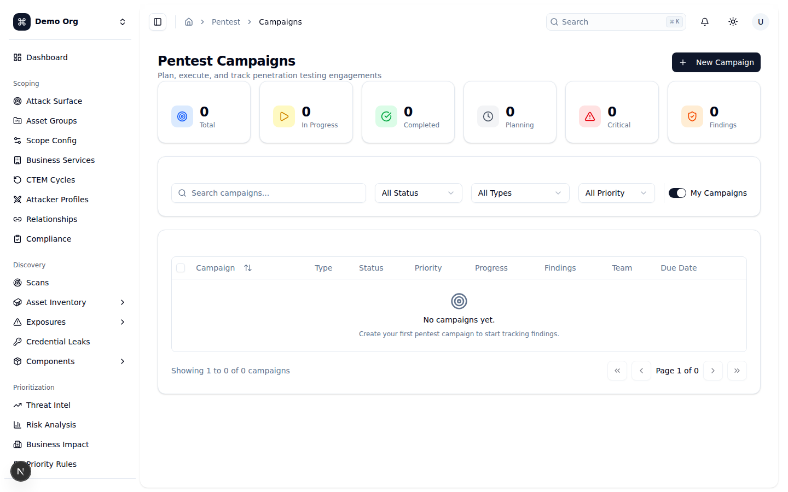
*🌙 Dark mode:* 

---

## Pentest Findings (`/pentest/findings`)
**Mục đích:** Tài liệu hóa và theo dõi các lỗ hổng bảo mật phát hiện trong quá trình pentest. Đây là nơi nhập chi tiết kỹ thuật của từng finding (PoC, CVSS, remediation...) trước khi nó hiển thị tại Findings workbench chung.

**Cách dùng:**
1. **Thẻ thống kê**: `Total`, `Critical`, `High`, `Medium`, `Remediation` (số đang chờ vá) và `Verified`.
2. **Thanh lọc**: ô `Search findings...` (tìm theo tiêu đề/mô tả/CWE/CVE, có debounce 300ms — lọc phía server), menu `Severity` (Critical/High/Medium/Low/Informational), `Status` (Draft, In Review, Confirmed, Remediation, Retest, Verified, False Positive, Accepted Risk) và `Campaign`.
3. **Bảng finding** mặc định sắp theo `Severity` giảm dần (critical lên đầu) để triage ngay. Cột: ô chọn, `Finding` (tiêu đề + badge CWE/OWASP), `Severity`, `CVSS` (điểm tô màu theo mức), `Status`, `Campaign`, `Target` (tên CTEM asset đã liên kết, hoặc target tự nhập), `Updated` và menu `...`.
4. **Menu `...`**: `View Details` (mở drawer chi tiết), `Edit` (mở form `/pentest/findings/{id}/edit`), `Copy ID`, `Export` (tải finding dưới dạng JSON đầy đủ: PoC, CVSS vector, business/technical impact, references...).
5. **Tạo mới**: nút `New Finding` (cần `pentest:write`) mở form `/pentest/findings/new`. Nếu đang lọc theo một campaign, form sẽ tự gắn sẵn campaign đó.

**Ghi chú:** Số liệu trong thẻ thống kê được tính trên trang đã tải (tối đa 100–500 finding); với tập dữ liệu rất lớn các con số severity có thể thấp hơn thực tế. Nút `New Finding` phụ thuộc quyền `pentest:write`.
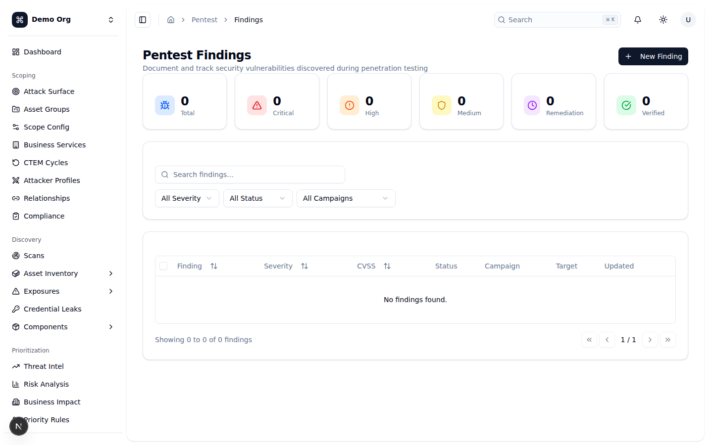
*🌙 Dark mode:* 

---

## Retest Management (`/pentest/retests`)
**Mục đích:** Kiểm chứng hiệu quả khắc phục (remediation) và theo dõi kết quả retest. Đây là bước Validation "chứng minh lại": sau khi đội phát triển báo đã vá, pentester thử lại để xác nhận lỗ hổng thực sự không còn.

**Cách dùng:**
1. **Thẻ thống kê**: `Pending` (số chờ retest), `Total Retests`, `Passed`, `Failed` và `Success Rate` (%).
2. **Thanh lọc**: ô `Search findings...`, menu `Severity` và `Campaign` (chọn "All Campaigns" để gộp finding xuyên campaign).
3. **Tab `Pending Retests`** — các finding ở trạng thái `Remediation` hoặc `Retest`. Cột: `Finding` (+ campaign), `Severity`, `Status`, `Assets` (số tài sản), `Previous Retests` (badge số lần passed/failed), `Last Updated` và hành động. Nút `Retest` (cần `pentest:retests:write`) mở hộp thoại ghi kết quả.
4. **Tab `Retest History`** — các finding đã qua retest (`Verified`, `False Positive`, `Accepted Risk`). Cột: `Finding`, `Severity`, `Current Status`, `Retest Results` (thanh % passed/total) và `Last Retest` (ngày + biểu tượng pass/fail).
5. **Hộp thoại `Submit Retest Result`**: chọn kết quả `Passed` / `Failed` / `Partial`; chọn `Test Environment` (Production/Staging/Development/QA); nhập `Notes` (bắt buộc, hỗ trợ Markdown) và đính kèm `Evidence` (ảnh chụp màn hình, HAR — tự chèn link Markdown vào ghi chú).
6. **Quy tắc chuyển trạng thái (do server quyết định theo vai trò người thực hiện):**
   - `Passed` + bạn là **Lead/Reviewer** → finding tự chuyển **Verified**; bạn là **Tester** → finding ở lại **Retest** chờ reviewer xác nhận.
   - `Failed` → finding trả về **Remediation** cho đội phát triển.
   - `Partial` → ghi nhận, **không** đổi trạng thái (Lead/Reviewer quyết định bước tiếp).

**Ghi chú:** Khi không còn gì chờ retest, tab Pending hiển thị "No Pending Retests"; tab History trống hiển thị "No Retest History". Nút `Retest` và việc đổi trạng thái lần lượt cần quyền `pentest:retests:write` và `pentest:findings:write`. Hộp thoại không cho gửi nếu `Notes` để trống.
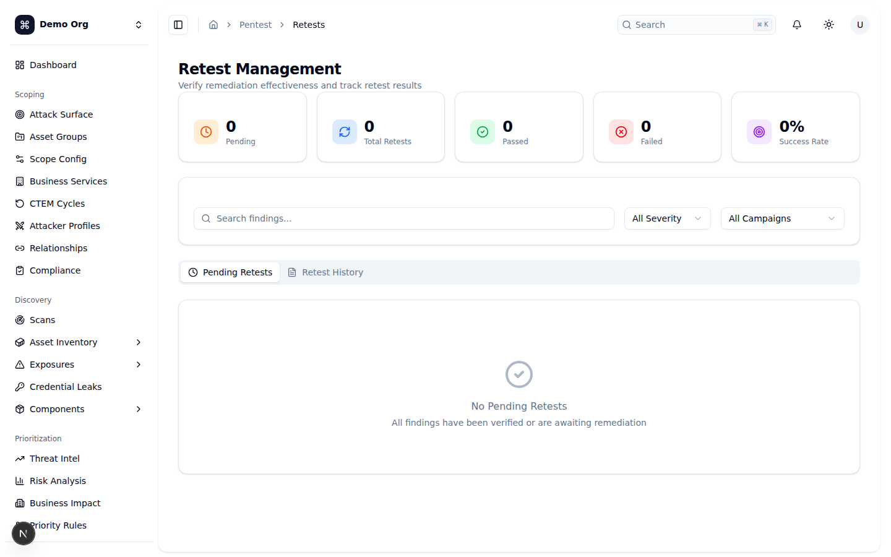
*🌙 Dark mode:* 

---

## Pentest Reports (`/pentest/reports`)
**Mục đích:** Sinh, quản lý và chia sẻ báo cáo pentest. Báo cáo gắn theo từng campaign và có thể xuất ở nhiều định dạng/đối tượng người đọc.

**Cách dùng:**
1. **Tiêu đề** hiển thị tóm tắt: tổng số báo cáo, số `completed` và tổng dung lượng.
2. **Bộ lọc**: ô `Search reports...`, menu `Select Campaign` (báo cáo gắn theo campaign — màn hình tự chọn campaign đầu tiên), `Type` (Executive Summary, Technical Report, Finding Report, Compliance Report, Remediation Report, Retest Report) và `Format` (PDF, DOCX, XLSX, HTML, JSON). Nút `Clear` xóa bộ lọc.
3. **Bảng báo cáo** (sắp xếp được theo cột): ô chọn, `Report Name` (+ campaign), `Type` (icon theo loại), `Format`, `Status` (Draft, Generating, Completed, Failed), `Size`, `Generated` (thời điểm) và hành động.
4. **Hành động trên mỗi báo cáo** (hiện khi rê chuột): với báo cáo `Completed` có `Download`, `Preview`, `Copy Link`, `Share`; menu `...` thêm `Delete` (cần `pentest:reports:write`).
5. **Sinh báo cáo**: nút `Generate Report` (dạng menu chọn campaign — mỗi mục hiện số finding) mở **ReportGeneratorDialog** để chọn loại, định dạng và tùy chọn nội dung.
6. **Thao tác hàng loạt**: chọn nhiều dòng để `Delete` hàng loạt (cần `pentest:reports:write`).
7. **Phân trang**: chọn số dòng mỗi trang (10/20/50/100) và điều hướng trang.

**Ghi chú:** Khi chưa có báo cáo, hiển thị trạng thái rỗng "No Reports Found" kèm nút `Generate Report`. Việc tải về chỉ chấp nhận URL `http(s)` (mở tab mới với `noopener,noreferrer`); URL không hợp lệ sẽ báo lỗi. Báo cáo `Generating` sẽ tự cập nhật khi hoàn tất.
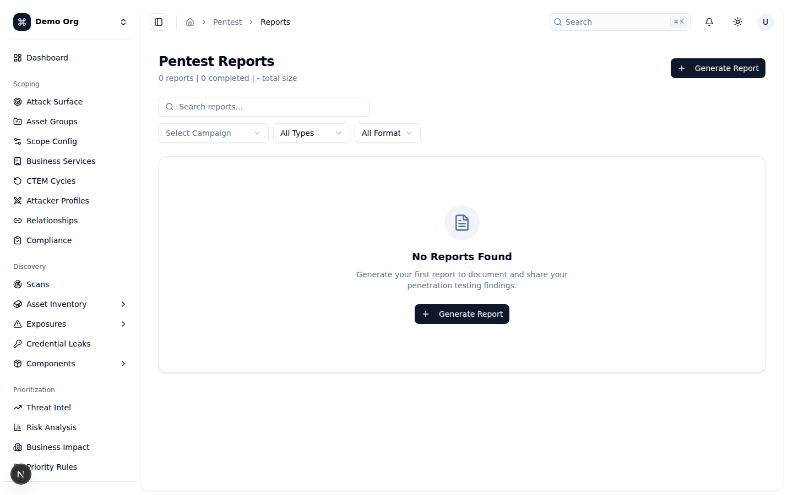
*🌙 Dark mode:* 

---

## Finding Templates (`/pentest/templates`)
**Mục đích:** Thư viện mẫu lỗ hổng (built-in + custom) để tái sử dụng khi tạo finding — chuẩn hóa mô tả, severity, CWE và khuyến nghị khắc phục giữa các đợt pentest.

**Cách dùng:**
1. **Tiêu đề** hiển thị tóm tắt: tổng số template, số `built-in` và số `custom`.
2. **Thanh lọc**: ô `Search templates...` (tìm theo tên/mô tả/CWE/tag), menu `Type` (All / Built-in / Custom), `Category` (Injection, Authentication, Authorization, Cryptographic, Configuration, Disclosure, Session, Input Validation, Logic, Other) và `Severity`. Nút `Clear` xóa bộ lọc.
3. **Chế độ xem**: chuyển giữa `Table` (mặc định) và `Grid` bằng nút ở góc phải ô tìm kiếm.
4. **Bảng/Lưới** hiển thị: tên + mô tả, `Category` (kèm icon), `Severity`, `CWE`, `Type` (Built-in có sao vàng / Custom) và `Usage` (số lần dùng). Có thể sắp xếp theo Name/Category/Severity/Usage.
5. **Menu `...` trên mỗi dòng**: `View` (mở drawer chi tiết), `Duplicate` (tạo bản sao tại `/pentest/templates/new`); template **custom** thêm `Edit` và `Delete`. Template **built-in** không thể sửa/xóa.
6. **Tạo/Import/Export**: nút `New Template` (cần `pentest:write`) mở `/pentest/templates/new`; nút `Import` (góc trên); chọn nhiều dòng để `Export` (JSON) hoặc `Delete` hàng loạt (chỉ xóa được template custom).

**Ghi chú:** Built-in template không thể xóa — chọn để xóa hàng loạt sẽ bị bỏ qua kèm thông báo. Khi không có kết quả, hiển thị "No Templates Found" (kèm nút `Clear Filters` nếu đang lọc, hoặc `Create Template`). Nút tạo mới phụ thuộc quyền `pentest:write`.
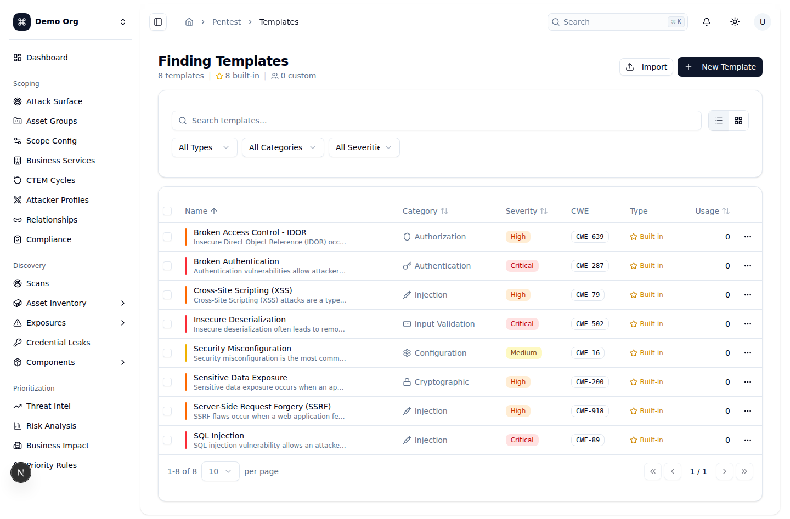
*🌙 Dark mode:* 

---

## MITRE ATT&CK Coverage (`/pentest/mitre-coverage`)
**Mục đích:** Trực quan hóa độ phủ kỹ thuật (technique) tấn công, tổng hợp từ **pentest findings** (ánh xạ qua OWASP → MITRE) và **attack simulations** (ánh xạ trực tiếp qua `mitre_technique_id`). Giúp thấy "góc tấn công" nào đã được kiểm chứng và nơi nào còn mù.

**Cách dùng:**
1. **Bộ chọn nguồn** (góc phải): `All Sources` / `Pentest Only` / `Simulation Only`. Nút `Refresh` tải lại dữ liệu; nút `Export` hiện đang **vô hiệu hóa**.
2. **Thẻ thống kê**: `Techniques Covered` (`covered/total` + % phủ, tô màu theo ngưỡng), `Pentest Findings`, `Simulations Bypassed` và `Simulations Detected`.
3. **ATT&CK Matrix Heatmap**: mỗi cột là một tactic, mỗi ô là một technique; số trong ô là tổng số finding + simulation. Màu ô thể hiện mức độ/kết quả — chú giải (legend) ngay trên heatmap: xám = chưa phủ; xanh dương/cam = pentest finding low-med/high; đỏ = critical hoặc bị bypass; vàng = phát hiện một phần; xanh lá = detected/prevented. Rê chuột lên ô để xem tên technique, số finding và số detected/bypassed.
4. **Bảng `Covered Techniques`**: liệt kê mọi technique có ít nhất một finding hoặc kết quả simulation, kèm số finding, số detected/bypassed và các badge severity.

**Ghi chú:** Đây là màn hình chỉ-đọc (phân tích). Pentest finding chỉ được ánh xạ khi có `owasp_category`; simulation chỉ ánh xạ khi có cả `mitre_technique_id` và `mitre_tactic`. Nút `Export` chưa khả dụng.
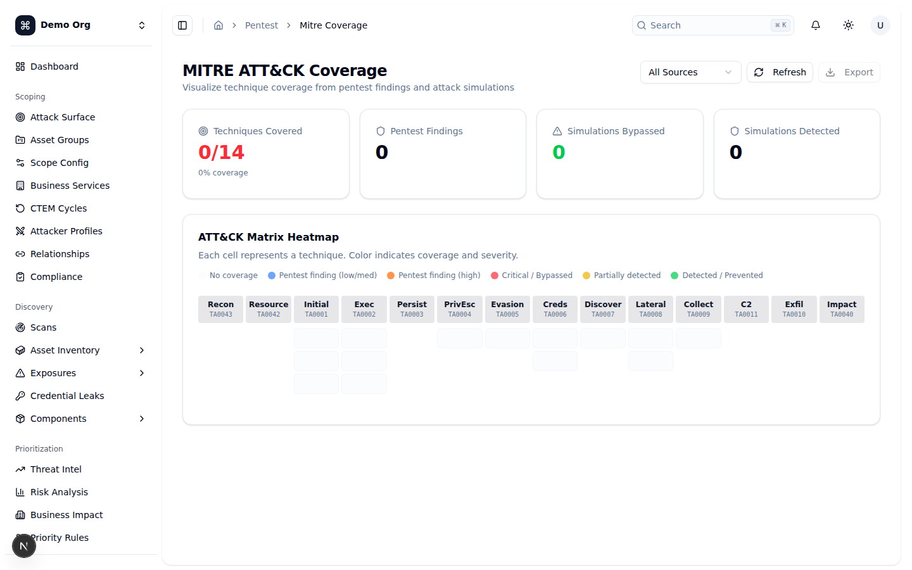
*🌙 Dark mode:* 

---

## Breach & Attack Simulation (`/attack-simulation`)
**Mục đích:** Kiểm chứng biện pháp phòng thủ bằng cách chạy các kịch bản tấn công ánh xạ MITRE ATT&CK và đo xem hệ thống có phát hiện/ngăn chặn được không.

**Cách dùng:**
1. **Thẻ thống kê**: `Total Simulations`, `Detected / Prevented`, `Bypassed` và `Avg Detection Rate` (% trung bình kèm thanh tiến độ).
2. **Bảng `Attack Simulations`**: mỗi dòng là một simulation với cột `Technique` (tên + `mitre_technique_id`), `Tactic`, `Last Run` (ngày chạy gần nhất hoặc "Never"), `Detection Rate` (thanh %), `Result` (Detected/Prevented/Bypassed/Partial/Error), `Status` (Draft/Active/Completed/Paused) và `Actions`.
3. **Nút `Run`** trên mỗi dòng chạy lại simulation đó — chỉ bật khi simulation ở trạng thái `Active`. Kết quả hiển thị qua toast và bảng tự cập nhật.
4. **`Quick Simulations`**: lưới các kịch bản nhanh thường gặp (Phishing Test, Ransomware Sim, Network Scan, Data Leak Test).

**Ghi chú:** Khi chưa có simulation, hiển thị trạng thái rỗng "No Simulations Yet". Việc **tạo mới simulation hiện chưa khả dụng** — bấm `New Simulation`, `Create Simulation` hay một kịch bản trong `Quick Simulations` đều hiện thông báo "Attack simulation creation is coming soon". Hiện chỉ chạy lại được các simulation đã có (trạng thái Active).
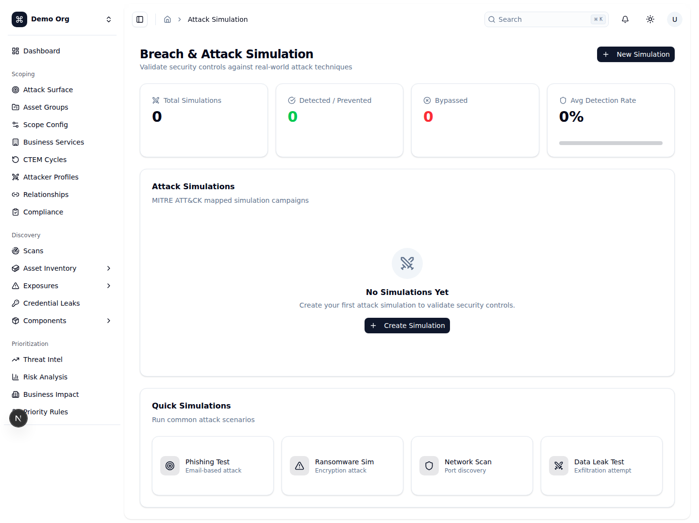
*🌙 Dark mode:* 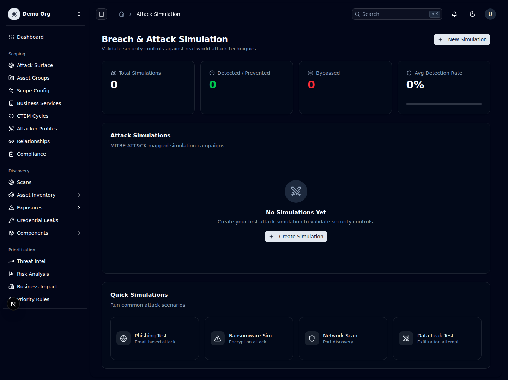

---

## Control Testing (`/control-testing`)
**Mục đích:** Theo dõi và kiểm chứng hiệu lực của các biện pháp kiểm soát bảo mật theo các khung tuân thủ (NIST CSF, ISO 27001, SOC 2, CIS Controls, PCI DSS, HIPAA, MITRE ATT&CK, Custom).

**Cách dùng:**
1. **Thẻ tóm tắt**: `Total Controls`, `Passed`, `Failed` và `Coverage` (% control đã được test, kèm thanh tiến độ).
2. **Framework Breakdown**: mỗi khung có một thẻ hiển thị tỉ lệ pass (%) cùng số pass/fail/untested.
3. **MITRE ATT&CK Coverage** (suy ra từ simulations): bảng hiển thị mỗi technique với `Detection Rate`, `Prevention Rate` và số simulation. Bảng này chỉ hiện khi có dữ liệu simulation.
4. **Bảng `Security Controls`**: mỗi dòng là một control test với cột `Control` (tên + control_id), `Framework`, `Category`, `Risk` (Critical/High/Medium/Low), `Status` (Pass/Fail/Partial/Untested/Not Applicable) và `Last Tested`.
5. **Tạo mới**: nút `Add Control Test` mở hộp thoại — bắt buộc `Name` và `Framework`; tùy chọn `Risk level`, `Control ID` (ví dụ `AC-2`, `T1078`), `Category`, `Description`, `Test procedure` (các bước kiểm tra) và `Expected result`.

**Ghi chú:** Khi chưa có control test, hiển thị "No Control Tests Yet" kèm nút thêm. Bảng MITRE coverage tự ẩn nếu không có simulation nào có `mitre_technique_id`.
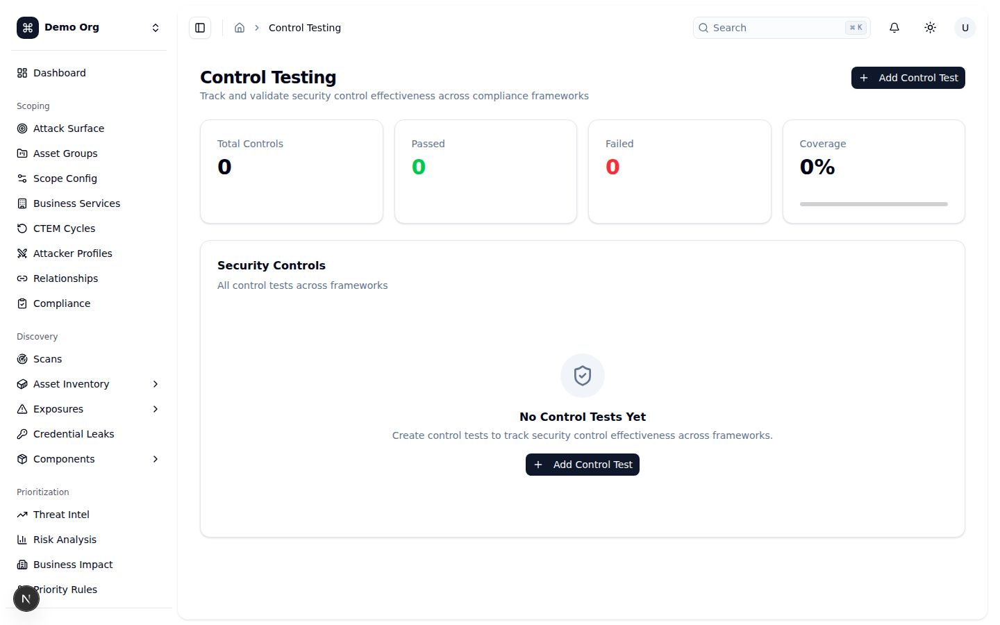
*🌙 Dark mode:* 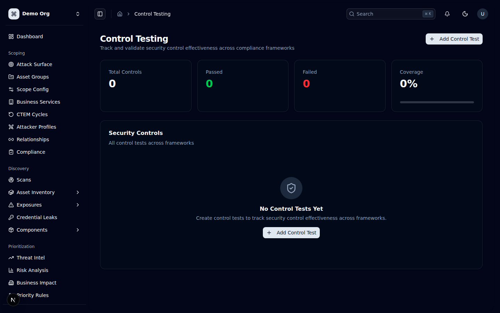

---

## Compensating Controls (`/controls`)
**Mục đích:** Quản lý các **biện pháp kiểm soát bù trừ (compensating control)** — những biện pháp giúp **giảm điểm rủi ro (risk score) của finding** khi chưa thể vá triệt để (ví dụ WAF rate limiting bù cho một lỗ hổng injection).

**Cách dùng:**
1. **Bảng `All Controls`**: cột `Name`, `Type` (Preventive/Detective/Corrective/Compensating), `Status` (Active/Inactive/Pending), `Reduction` (% giảm rủi ro), `Last Tested`, `Test Result` (Pass/Fail/Partial) và `Actions`.
2. **Tạo mới**: nút `New Control` (cần `compensating-controls:write`) mở hộp thoại — bắt buộc `Name`; tùy chọn `Description`, `Control Type` và `Reduction Factor (%)` (0–100, mặc định 20%).
3. **Ghi kết quả test**: nút `Test` (icon bình thí nghiệm) trên mỗi dòng mở hộp thoại `Record Test Result` để chọn `Pass` / `Fail` / `Partial`, cập nhật `Last Tested` và `Test Result`.
4. **Xóa**: nút thùng rác mở hộp thoại xác nhận xóa (không thể hoàn tác).

**Ghi chú:** Khi chưa có control, hiển thị "No compensating controls yet." Các nút `New Control`, `Test` và `Delete` chỉ hiện với quyền `compensating-controls:write`. `Reduction Factor` quyết định mức giảm điểm rủi ro áp lên finding liên quan.
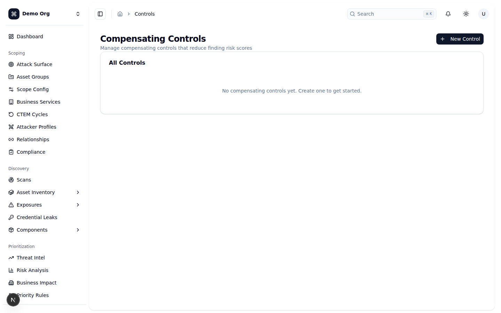
*🌙 Dark mode:* 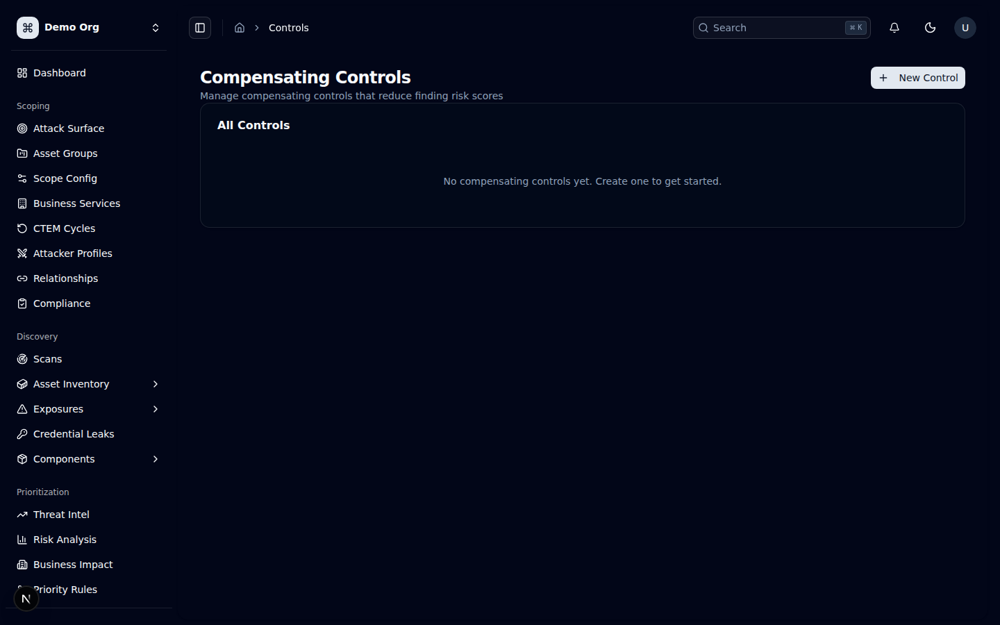

---

## Checklist

- [ ] Đã hiểu Validation = chứng minh phơi nhiễm có thật + kiểm tra hệ thống phòng thủ (pentest thủ công, mô phỏng tấn công, kiểm chứng control).
- [ ] Tạo và theo dõi đợt pentest tại **Pentest Campaigns**; gán team với vai trò Lead/Tester/Reviewer/Observer.
- [ ] Tài liệu hóa lỗ hổng tại **Pentest Findings** (PoC, CVSS, remediation) và nhớ rằng chúng cũng hiện tại Findings workbench chung (`/findings`) với nguồn `Pentest`.
- [ ] Sau khi vá, dùng **Retest Management** để xác nhận lại — nắm rõ quy tắc chuyển trạng thái theo vai trò (Lead/Reviewer auto-Verified, Tester chờ reviewer, Failed → Remediation).
- [ ] Sinh và chia sẻ **Pentest Reports** theo campaign; chọn đúng loại/định dạng cho từng đối tượng người đọc.
- [ ] Tái sử dụng **Finding Templates** (built-in/custom) để chuẩn hóa finding; nhớ built-in không sửa/xóa được.
- [ ] Dùng **MITRE ATT&CK Coverage** để thấy độ phủ kỹ thuật và các vùng còn mù (lọc theo Pentest/Simulation/All).
- [ ] Đo hiệu quả phòng thủ qua **Breach & Attack Simulation** (lưu ý: tạo mới simulation hiện "coming soon", chỉ chạy lại được simulation Active).
- [ ] Theo dõi hiệu lực kiểm soát theo khung tuân thủ tại **Control Testing**.
- [ ] Quản lý **Compensating Controls** để giảm điểm rủi ro finding khi chưa thể vá triệt để; ghi kết quả test định kỳ.
- [ ] Kiểm tra phân quyền RBAC nếu không thấy nút tạo/sửa/xóa hoặc nút Retest.
