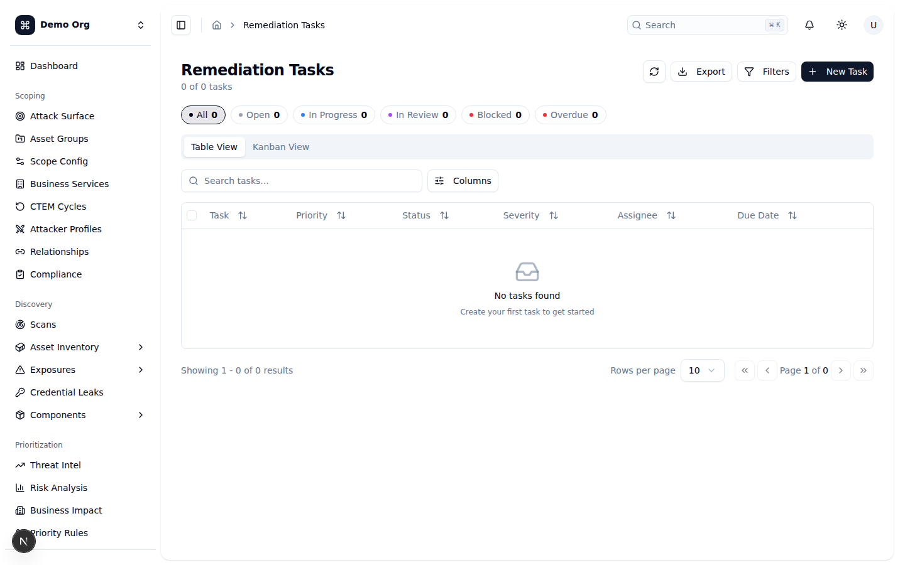
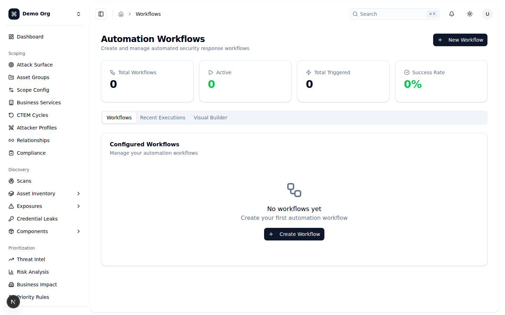
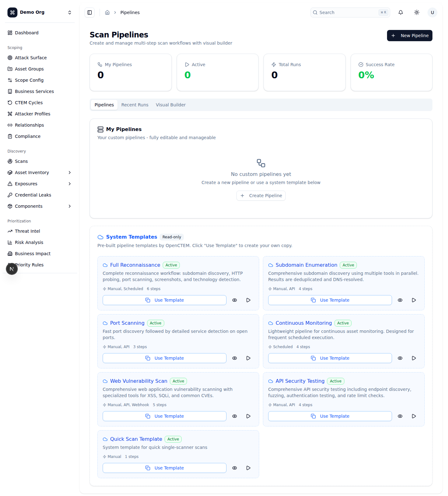

# Hướng dẫn sử dụng OpenCTEM — Phần 7: Mobilization (Huy động khắc phục & Tự động hóa)

## Giới thiệu: Mobilization là gì?

**Mobilization** là giai đoạn cuối cùng của vòng đời CTEM — nơi mọi thứ bạn đã *phát hiện* và *ưu tiên* ở các giai đoạn trước được biến thành **hành động khắc phục có theo dõi đến tận lúc đóng (closure)**, và nơi bạn **tự động hóa** các quy trình lặp đi lặp lại (quét, phản hồi sự cố). Nói cách khác, đây là khâu "huy động lực lượng" để thực sự giảm rủi ro, chứ không chỉ dừng ở việc biết mình có rủi ro gì.

Nhóm tính năng Mobilization trong OpenCTEM gồm ba trụ cột:

- **Remediation Tasks** (`/remediation`) — chuyển finding thành **task/chiến dịch khắc phục** có người phụ trách (assignee/team), độ ưu tiên, hạn chót (due date), SLA và liên kết tới các finding gốc; theo dõi trạng thái đến khi hoàn tất.
- **Automation Workflows** (`/workflows`) — **luồng phản hồi tự động** dạng node (trigger → condition → action → notification): ví dụ, khi có finding nghiêm trọng mới thì tự giao việc, gửi cảnh báo Slack, tạo Jira ticket.
- **Scan Pipelines** (`/pipelines`) — **quy trình quét nhiều bước** ghép từ nhiều scanner, có **trình dựng trực quan (visual builder)** dựa trên node để thiết kế thứ tự và phụ thuộc giữa các bước.

> **Lưu ý quyền (RBAC):** nhiều nút bị ẩn hoặc vô hiệu hóa tùy phân quyền. Tạo/sửa task cần `remediation:write`; tạo/sửa/kích hoạt workflow và pipeline cần `workflows:write`. Nếu không thấy một nút, rất có thể bạn chưa có quyền tương ứng.

---

## Remediation Tasks (`/remediation`)

**Mục đích:** Bảng điều khiển trung tâm để biến finding thành **công việc khắc phục có chủ sở hữu và hạn chót**, theo dõi tiến độ qua các trạng thái cho tới khi đóng. Trong OpenCTEM, mỗi "task" thực chất là một **chiến dịch khắc phục (remediation campaign)** — có thể gom nhiều finding lại và hiển thị số finding đã liên kết / đã giải quyết cùng phần trăm tiến độ.

**Cách dùng:**
1. **Tiêu đề trang** "Remediation Tasks" hiển thị số task đang lọc trên tổng số (ví dụ `12 of 20 tasks`). Hàng nút bên phải: `Refresh` (làm mới), `Export` (menu thả: `Export as CSV`, `Export as JSON` — chỉ xuất các task đang hiển thị), `Filters` (kèm badge đếm số bộ lọc đang bật), và `New Task` (tạo task mới).
2. **Thanh lọc nhanh (chip)** ngay trên bảng, mỗi chip có chấm màu và con số: `All`, `Open`, `In Progress`, `In Review`, `Blocked`, `Overdue`. Bấm để lọc nhanh; bấm lại để bỏ lọc.
3. **Bộ lọc chi tiết** (nút `Filters`): lọc theo `Priority` (`Urgent`, `High`, `Medium`, `Low`), `Status` (`Open`, `In Progress`, `In Review`, `Completed`, `Blocked`) và `Assignee`. Có nút `Clear all` để xóa toàn bộ bộ lọc.
4. **Hai chế độ xem** qua tab:
   - **`Table View`** — bảng với các cột: ô chọn (checkbox), `Task` (tiêu đề + dòng phụ "n findings linked"), `Priority`, `Status`, `Severity`, `Assignee` (avatar + tên, hoặc `Unassigned`), `Due Date` (kèm "Xd left" / "Xd overdue", tô đỏ nếu quá hạn) và menu `...`. Có ô tìm kiếm `Search tasks...`.
   - **`Kanban View`** — bảng cột theo trạng thái (`Open`, `In Progress`, `In Review`, `Blocked`, `Completed`); mỗi thẻ có viền trái màu theo độ ưu tiên, hiển thị assignee, ngày hạn, severity và nhãn `Overdue` nếu quá hạn.
5. **Tạo task mới** (`New Task`): mở hộp thoại với các trường `Title` (bắt buộc), `Description`, `Priority`, `Severity`, `Assignee`, `Due Date` (chọn từ lịch), `Link to Finding` (chọn từ danh sách finding đang mở để gắn task vào finding gốc) và `Estimated Hours`.
6. **Menu hành động trên mỗi dòng (`...`):** `View Details` (mở drawer chi tiết), `Open Campaign` (mở trang chiến dịch `/remediation/{id}`), `Edit`, `Reassign`, các **hành động chuyển trạng thái theo ngữ cảnh**, `Copy ID`, và `Delete`. Các hành động chuyển trạng thái phụ thuộc trạng thái hiện tại, ví dụ: `Open` → `Start Task` / `Block`; `In Progress` → `Complete` / `Block`; `In Review` → `Approve` / `Reopen`; `Blocked` → `Unblock`; `Completed` → `Reopen`.
7. **Drawer chi tiết** (bấm vào dòng hoặc `View Details`): hiển thị header với các badge priority/status/severity (+ `Overdue` nếu trễ), lưới thông tin `Assignee` / `Due Date`, mô tả, **thanh tiến độ (Progress %)**, khu `Actions` (các nút chuyển trạng thái theo ngữ cảnh + `Reassign`), metadata (`Task ID`, `Created`) và khu `Delete task` (chỉ với quyền `remediation:write`).
8. **Thao tác hàng loạt (bulk):** khi chọn ≥1 task ở Table View, một thanh xuất hiện cho phép `Reassign` và `Move to` (`In Progress` / `Review` / `Completed`).

**Liên kết tới finding & SLA:** Khi tạo task bạn có thể `Link to Finding` để gắn nó với finding gốc; dòng phụ "n findings linked" trên mỗi task cho biết quy mô chiến dịch. Hạn chót (`Due Date`) là cơ sở để theo dõi **SLA** — task quá hạn được đánh dấu `Overdue` (đỏ) và đếm riêng ở chip `Overdue`. Có màn hình chuyên dụng `/sla` và `/remediation/overdue` để theo dõi sâu hơn.

**Ghi chú:** Các trạng thái hiển thị (Open / In Progress / In Review / Completed / Blocked) được ánh xạ từ trạng thái chiến dịch của backend (`draft`, `active`, `validating`, `completed`, `paused`). Khi rỗng, bảng hiển thị "No tasks found"; khi lỗi tải hiện thẻ đỏ "Failed to load tasks" với nút `Retry`. `Export` chỉ xuất phần đang lọc. Nút `New Task`, `Edit`, `Delete` phụ thuộc quyền `remediation:write`.

---

## Automation Workflows (`/workflows`)

**Mục đích:** Tạo và quản lý các **luồng phản hồi an ninh tự động**. Một workflow là một đồ thị node: bắt đầu từ một **trigger** (sự kiện kích hoạt), đi qua các **condition** (điều kiện rẽ nhánh), thực thi các **action** (hành động) và **notification** (thông báo). Ví dụ điển hình: "Khi có finding nghiêm trọng mới → kiểm tra tài sản có phải production không → nếu có thì giao cho kỹ sư senior + gửi cảnh báo Slack + tạo Jira ticket".

**Cách dùng:**
1. **Tiêu đề trang** "Automation Workflows" với nút `New Workflow` (cần quyền `workflows:write`).
2. **Hàng thẻ thống kê:** `Total Workflows` (tổng toàn tenant), `Active`, `Total Triggered` (tổng số lần chạy) và `Success Rate` (%).
3. **Ba tab chính:**
   - **`Workflows`** — danh sách workflow đã cấu hình. Mỗi dòng hiển thị tên, badge trạng thái (`Active` / `Inactive`), mô tả, loại trigger, lần chạy gần nhất, số lần chạy + tỷ lệ thành công, và các badge tên action. Bên phải có **công tắc (Switch)** để bật/tắt workflow và menu `...`: `View Details`, `Edit in Builder`, `Run Now` (kích hoạt thủ công), `Duplicate`, `Delete`.
   - **`Recent Executions`** — lịch sử các lần chạy gần đây: thời lượng, thời điểm, số node đã hoàn tất (`x/y nodes completed`, kèm số node lỗi nếu có) và badge trạng thái (`pending` / `running` / `completed` / `failed` / `cancelled`).
   - **`Visual Builder`** — trình dựng node trực quan (xem dưới).
4. **Tạo workflow mới** (`New Workflow`): nhập `Name` và `Description`; workflow được tạo kèm sẵn một node trigger thủ công (`Manual Trigger`). Sau đó bạn vào `Visual Builder` để thêm và nối các node.
5. **Drawer chi tiết** (`View Details`): xem badge trạng thái/số lần chạy/tỷ lệ thành công, node `Trigger`, danh sách `Actions`, `Tags`, các ô thống kê và nút `Run Now`.

**Trình dựng trực quan (tab `Visual Builder`):**
- **Bảng thành phần (Components)** bên trái cho phép **kéo–thả** bốn loại node vào canvas: `Trigger` (xanh lá), `Condition` (vàng), `Action` (xanh dương), `Notification` (tím).
- **Canvas** dùng công nghệ đồ thị (xyflow) với `Background`, `Controls` (zoom/fit) và `MiniMap` thu nhỏ. **Nối node** bằng cách kéo từ điểm nối (handle) của node này sang node khác để tạo luồng. Node `Condition` có hai nhánh ra `Yes` (xanh) và `No` (đỏ).
- **Lưu:** nút `Save Workflow` (hoặc `Save Changes` khi đang sửa). Workflow **bắt buộc có ít nhất một node trigger**. Khi lưu mới, một hộp thoại hỏi `Name` / `Description` và hiển thị tóm tắt số Triggers / Conditions / Actions / Notifications. Nút `Reset` đưa canvas về mẫu mặc định; `Clear` thoát chế độ sửa.
- **Loại trigger** được hỗ trợ gồm: `Manual`, `Scheduled`, `Finding Created`, `Finding Updated`, `Finding Age`, `Asset Discovered`, `Scan Completed`, `Webhook`.

> **Lưu ý về cách sửa:** khi bấm `Edit in Builder` ở danh sách, workflow được nạp vào trình dựng và hệ thống hiển thị thông báo nhắc bạn **chuyển sang tab `Visual Builder`** để chỉnh sửa.

**Ghi chú:** Số `Total Workflows` lấy từ toàn bộ dữ liệu tenant, nhưng các số `Active` / `Total Triggered` / `Success Rate` được tính trên trang hiện tại (tối đa 50 workflow mỗi trang). Khi chưa có workflow, danh sách hiển thị "No workflows yet" + nút tạo; chưa có lần chạy nào thì tab Executions hiện "No executions yet".

---

## Scan Pipelines (`/pipelines`)

**Mục đích:** Tạo và quản lý các **quy trình quét nhiều bước (multi-step scan workflows)**. Một pipeline ghép nhiều **scanner** lại thành chuỗi/đồ thị có thứ tự và phụ thuộc (dependency), kèm **trigger** (cách khởi chạy) và **settings** (timeout, song song, lựa chọn agent). Khác với Automation Workflows (phản hồi sự kiện), pipeline tập trung vào **dàn dựng việc quét**.

**Cách dùng:**
1. **Tiêu đề trang** "Scan Pipelines" với nút `New Pipeline` (cần quyền `workflows:write`).
2. **Hàng thẻ thống kê:** `My Pipelines` (số pipeline của tenant), `Active`, `Total Runs`, `Success Rate`.
3. **Ba tab chính:**
   - **`Pipelines`** — chia làm hai khu:
     - **My Pipelines** — pipeline tùy chỉnh của bạn (sửa/quản lý đầy đủ). Mỗi dòng có tên, badge `active`/`inactive`, mô tả, loại trigger, phiên bản (`vN`), số bước (`n steps`), tags, công tắc bật/tắt và menu `...`: `View Details`, `Edit Pipeline` (mở wizard cấu hình), `Visual Builder` (mở trang dựng node `/pipelines/{id}/builder`), `Run Now`, `Clone`.
     - **System Templates** — các mẫu pipeline dựng sẵn bởi OpenCTEM, **chỉ đọc (Read-only)**. Bấm `Use Template` để **nhân bản (clone)** thành pipeline của riêng bạn rồi tùy chỉnh.
   - **`Recent Runs`** — các lần chạy pipeline gần đây: loại trigger, số bước hoàn tất (`x/y steps`) và badge trạng thái.
   - **`Visual Builder`** (xem trước, chỉ đọc) — chọn một pipeline từ danh sách để **xem trước (preview)** đồ thị workflow của nó; nếu là pipeline của tenant sẽ có nút `Edit in Builder` để mở trang dựng đầy đủ.
4. **Tạo pipeline mới** (`New Pipeline`): mở **wizard 4 bước** dạng tab:
   - **`Basics`** — `Pipeline Name` (bắt buộc), `Description`, `Tags`.
   - **`Triggers`** — định nghĩa cách khởi chạy; mỗi trigger chọn loại: `Manual`, `Scheduled` (kèm ô nhập biểu thức **cron** dạng `0 0 * * *`), `Webhook`, `API`, `On Asset Discovery`. Có thể thêm nhiều trigger.
   - **`Steps`** — các bước thực thi; mỗi bước có `Step Key`, `Name`, `Tool` (chọn scanner, hoặc "No tool" cho bước thủ công) và `Timeout (sec)`. **Kéo để sắp xếp lại thứ tự** bằng tay nắm (grip) bên trái.
   - **`Settings`** — `Timeout (seconds)` cho toàn pipeline, `Max Parallel Steps` (số bước chạy song song), `Agent Selection` (`Auto` — ưu tiên agent của tenant, dự phòng platform; `Tenant Agents Only`; `Platform Agents Only`) và công tắc `Notify on Failure`.
   Bấm `Create Pipeline` ở bước cuối để lưu.
5. **Bật/tắt** pipeline bằng công tắc trên mỗi dòng; **chạy ngay** bằng `Run Now`; **nhân bản** bằng `Clone` (đặt tên mới).
6. **Drawer chi tiết** (`View Details`): xem trigger, danh sách `Steps` (đánh số thứ tự + tên tool), khối `Settings` (`Max Parallel`, `Timeout`, `Agent`), tags; với pipeline tenant có nút `Run Now` + `Edit`, với system template có nút `Add to My Pipelines`.

### Trình dựng pipeline trực quan (`/pipelines/{id}/builder`)

**Mục đích:** Trang dựng node-based **đầy đủ** để thiết kế đồ thị các bước quét — thêm/xóa scanner, kéo–thả vị trí, nối phụ thuộc giữa các bước, và lưu lại bố cục. Mở từ menu `...` → `Visual Builder` của một pipeline, hoặc nút `Edit in Builder` trong tab xem trước.

**Cách dùng:**
1. **Thanh tiêu đề** hiển thị tên pipeline và gợi ý thao tác ("Drag nodes from palette • Connect nodes • Click to edit"). Bên phải có các badge trạng thái: `Unsaved` (vàng — có thay đổi chưa lưu), `n steps need scanner` (đỏ — có bước chưa chọn scanner), và nút `Save`. Nút mũi tên `Back` quay lại `/pipelines`; nếu còn thay đổi chưa lưu sẽ hỏi xác nhận "Unsaved Changes".
2. **Canvas đồ thị** ở giữa (xyflow) chứa:
   - Node **`Start`** — điểm vào của pipeline.
   - Các node **`Scanner`** — mỗi node là một bước quét gắn với một tool/scanner.
   - Node **`End`** — điểm kết thúc.
   Bạn **kéo–thả vị trí** node tự do; **nối** từ handle node này sang node khác để tạo **phụ thuộc (depends_on)** giữa các bước.
3. **NodePalette** (bảng công cụ bên phải) — liệt kê các **Scanner Tools** khả dụng, nhóm theo danh mục (`SAST`, `SCA`, `DAST`, `Secrets`, `IaC`, `Container`, `Recon`, `OSINT`...). Có ô `Search tools...` và hiển thị số tool khả dụng. Mỗi tool có biểu tượng, vài capability tiêu biểu và badge nguồn (`Platform` / `Custom`). **Kéo một tool từ palette vào canvas** để tạo một node scanner mới (đã điền sẵn tool và capabilities). Tool không có agent khả dụng hiển thị badge `No Agent` và không kéo được.
4. **Click vào một node scanner** để chỉnh sửa nội tuyến (tên, mô tả, đổi tool — capabilities tự cập nhật theo tool). **Xóa** node qua hành động xóa (hộp thoại xác nhận "Delete Step"; mọi phụ thuộc trỏ tới bước đó sẽ bị gỡ).
5. **Lưu** bằng nút `Save`. **Mỗi bước bắt buộc có scanner** (tool hoặc capability) — nếu còn bước thiếu, nút Save bị vô hiệu và badge đỏ nhắc số bước cần chọn scanner. Vị trí node Start/End cũng được lưu cùng bố cục.

> **System template là chỉ đọc:** nếu pipeline là system template, trang builder ở chế độ Read-only — không có palette, không nút Save; muốn sửa hãy `Clone` trước.

**Ghi chú:** Trình dựng (xyflow ~100KB+) được nạp động (lazy-load) nên chỉ tải khi bạn thực sự mở builder. Khi lỗi tải pipeline, trang hiển thị "Pipeline not found" + nút quay lại. Quét thực tế chạy trên agent theo `Agent Selection` đã cấu hình; pipeline không có scanner hợp lệ sẽ không lưu được.

---

## Checklist

- [ ] Đã chuyển các finding/nhóm finding ưu tiên cao thành **Remediation Task** có `Assignee` và `Due Date` rõ ràng.
- [ ] Đã `Link to Finding` để task gắn với finding gốc và theo dõi được tiến độ (Progress %).
- [ ] Theo dõi định kỳ chip `Overdue` và màn hình `/sla`, `/remediation/overdue` để không bỏ lỡ hạn SLA.
- [ ] Sử dụng `Kanban View` và thao tác hàng loạt (`Reassign`, `Move to`) để điều phối khối lượng công việc.
- [ ] Đã thiết kế ít nhất một **Automation Workflow** cho tình huống lặp lại (ví dụ: finding critical mới → giao việc + cảnh báo), nhớ rằng workflow phải có ≥1 node `Trigger`.
- [ ] Đã bật (`Active`) workflow cần chạy và kiểm tra tab `Recent Executions` để xác nhận tỷ lệ thành công.
- [ ] Đã tạo (hoặc `Clone` từ System Template) một **Scan Pipeline**, cấu hình `Triggers` / `Steps` / `Settings` qua wizard.
- [ ] Trong trình dựng `/pipelines/{id}/builder`: mọi bước đều đã chọn scanner (không còn badge đỏ), node `Start`/`End` và phụ thuộc giữa các bước đã đúng, và đã `Save`.
- [ ] Đã cân nhắc `Agent Selection` (Auto / Tenant / Platform) phù hợp với hạ tầng và yêu cầu confinement của tổ chức.
- [ ] Kiểm tra quyền RBAC (`remediation:write`, `workflows:write`) cho các thành viên cần tạo/sửa task, workflow và pipeline.
