# Hướng dẫn sử dụng OpenCTEM — Phần 8: Cài đặt & Quản trị (Settings & Administration)

## Giới thiệu

Khu vực **Settings & Administration** là nơi quản trị viên cấu hình toàn bộ "khung xương" của tenant: thông tin tổ chức và chính sách bảo mật, **ai-được-làm-gì** (RBAC: `Roles` + `Teams` + `Assignment Rules`), các tích hợp bên ngoài (SCM, thông báo, ticketing, SIEM, CI/CD), và **chuỗi công cụ quét** (toolchain) gồm agent nền tảng, tool, scanner template, profile quét, capability và kho secret.

Cách tổ chức tư duy:

- **Cấu hình tenant** — `Tenant Settings` (định danh tổ chức, security, API/webhook, file storage) và `General Settings` (bản địa hóa, hiển thị, làm mới dữ liệu).
- **RBAC (kiểm soát truy cập)** — gồm 3 lớp bổ trợ nhau: **`Roles`** quyết định *được LÀM gì* (permissions), **`Teams`** + **`Assignment Rules`** quyết định *được THẤY dữ liệu nào* (data scope). `User Management` là nơi mời người dùng và gán role.
- **Module & Audit** — `Module Management` bật/tắt tính năng theo tenant; `Audit Log` ghi lại lịch sử hoạt động và sự kiện bảo mật.
- **Integrations** — hub kết nối công cụ bên thứ ba.
- **Toolchain** — `Platform Agents`, `Tools`, `Scanner Templates`, `Template Sources`, `Secret Store`, `Scan Profiles`, `Capabilities` định nghĩa *cái gì chạy ở đâu và như thế nào* khi quét.

> **Lưu ý quyền (rất quan trọng):** gần như mọi nút tạo/sửa/xóa trong khu vực này đều ẩn hoặc vô hiệu hóa theo phân quyền RBAC. Các thao tác quản trị thường yêu cầu vai trò `Owner`/`Admin` hoặc các permission như `team:update`, `roles:write`, `roles:delete`, `credentials:write`... Nếu không thấy một nút, nhiều khả năng bạn chưa có quyền tương ứng.

> **Lưu ý ngôn ngữ:** giao diện có bộ chọn `Language` (tại `General Settings` và `Tenant Settings`) với các lựa chọn như English/Tiếng Việt, nhưng **lớp dịch (translation layer) chưa được nối** — toàn bộ chuỗi giao diện hiện chỉ hiển thị bằng **tiếng Anh**. Lựa chọn ngôn ngữ hiện chủ yếu ảnh hưởng đến **hướng văn bản (LTR/RTL)** chứ chưa dịch nội dung. Vì vậy hướng dẫn này giữ nguyên nhãn giao diện bằng tiếng Anh trong `code`.

---

## Tenant Settings (`/settings/tenant`)

**Mục đích:** Trang cấu hình trung tâm của tổ chức (tenant) — định danh, chính sách bảo mật/đăng nhập, truy cập API & webhook, và nơi lưu trữ file. Bố cục gồm 4 tab.

**Cách dùng:**
1. **Tab `General`** (biểu tượng tòa nhà):
   - **`Organization Information`** — ảnh đại diện/logo (hover để tải lên, tự resize về tối đa 200px; có nhãn `Unsaved changes` và nút `Save` riêng cho logo), `Organization Name`, `URL Slug`, `Website`, `Industry`.
   - **`Localization`** — `Timezone` và `Default Language` (xem lưu ý ngôn ngữ ở trên).
2. **Tab `Security`** (biểu tượng khiên):
   - **`Authentication`** — công tắc `Require MFA`, `Session Timeout`, `Email Verification`.
   - **`Identity Providers (SSO)`** — thêm/sửa nhà cung cấp SSO doanh nghiệp: `Display Name`, `Client ID`, `Client Secret`, `Allowed Email Domains` (ví dụ `example.com, corp.example.com`), `Default Role`, `Status`. Có hộp thoại xác nhận `Remove Identity Provider`.
   - **`IP Restrictions`** — nhập danh sách `Allowed IP Addresses` theo IP hoặc dải CIDR, mỗi dòng một mục (ví dụ `192.168.1.0/24`).
3. **Tab `API & Webhooks`** (biểu tượng chìa khóa):
   - **`API Access`** — công tắc `Enable API Access` và xem/quản lý `API Key`.
   - **`Webhook Configuration`** — `Webhook URL` và chọn `Events to Send` để nhận thông báo sự kiện thời gian thực.
4. **Tab `File Storage`** (biểu tượng tải lên): chọn `Storage Provider` cho việc lưu trữ (ví dụ bằng chứng pentest). Với provider dạng cloud/S3-compatible cần nhập `Bucket`, `Region`, `Endpoint` (ví dụ `https://minio.internal:9000`), `Access Key`, `Secret Key`.

**Ghi chú:** Hầu hết thao tác sửa yêu cầu quyền cập nhật tenant (vai trò `Owner`/`Admin`); khi không đủ quyền các trường bị khóa và hover hiện tooltip *"You do not have permission to update tenant settings"*. Mỗi tab có nút `Save` riêng. Việc tạo tenant mới nằm ở `/settings/tenant/create`.
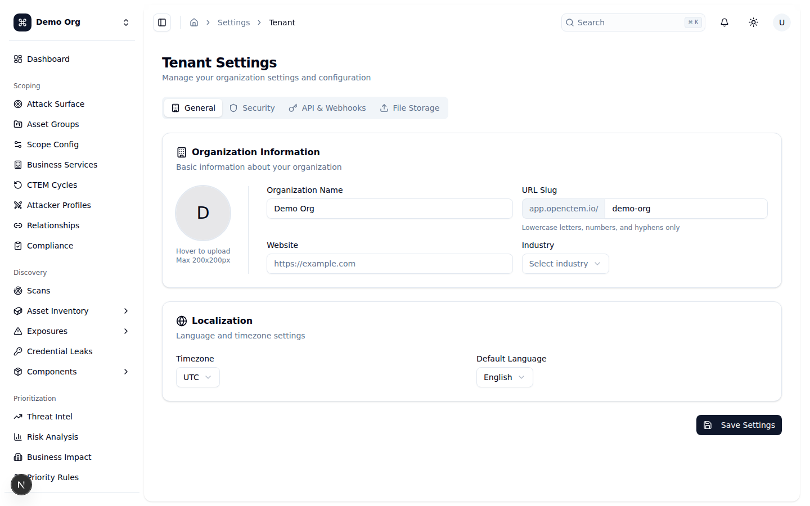

---

## General Settings (`/settings/general`)

**Mục đích:** Tùy chỉnh bản địa hóa (localization), tùy chọn hiển thị (display) và hành vi làm mới dữ liệu (data refresh) cho người dùng.

**Cách dùng:**
1. **`Localization`** (lưu lên server, áp cho tổ chức): `Language` và `Timezone`.
2. **`Display Preferences`** (lưu cục bộ trong trình duyệt): `Date Format` (`DD/MM/YYYY`, `MM/DD/YYYY`, `YYYY-MM-DD`), `Time Format` (`24-hour` / `12-hour`), và công tắc `Compact Mode` (bố cục gọn cho bảng/danh sách).
3. **`Data Refresh`** (lưu cục bộ): công tắc `Auto Refresh`; khi bật, hiện `Refresh Interval` (`30 seconds`, `1 minute`, `5 minutes`, `10 minutes`).
4. Bấm `Save Changes` để lưu (Localization gửi lên server, các tùy chọn còn lại lưu vào `localStorage`); `Reset` để khôi phục mặc định.

**Ghi chú:** `Language` hiển thị danh sách ngôn ngữ nhưng UI hiện chỉ tiếng Anh (xem lưu ý ngôn ngữ ở phần Giới thiệu). Display/Data Refresh là tùy chọn **theo trình duyệt của từng người dùng**, không đồng bộ giữa các thiết bị.
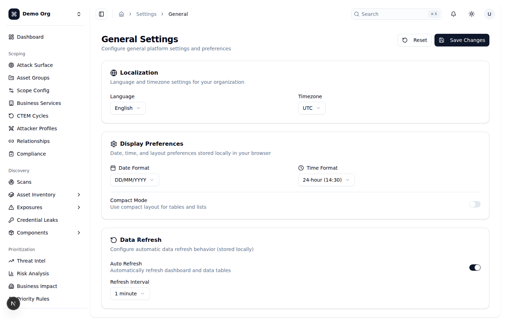

---

## User Management (`/settings/users`)

**Mục đích:** Quản lý thành viên trong tenant — mời người mới, gán/đổi vai trò, tạm ngưng/kích hoạt và theo dõi lời mời đang chờ.

**Cách dùng:**
1. Tiêu đề trang `User Management` có nút `Invite` (mở hộp thoại `Invite Team Member`) và `Refresh`.
2. **Thẻ thống kê** ở đầu hiển thị số thành viên (active...).
3. **Bảng thành viên** lọc theo tab trạng thái (`all`, `active`, `suspended`...), có ô `Search users...`. Mỗi dòng hiển thị người dùng, vai trò (roles), trạng thái (`STATUS_DISPLAY` ánh xạ nhãn), và menu thao tác (đổi role, suspend/activate, xóa).
4. **Mời người dùng:** trong hộp thoại `Invite Team Member`, nhập `Email Address` (ví dụ `colleague@company.com`) rồi `Assign Roles` — chọn một hoặc nhiều vai trò (chia nhóm `System Roles` và `Custom Roles`, mỗi thẻ hiển thị tên, mô tả và số permission). Gửi để tạo lời mời qua email.
5. **Khu vực lời mời (Invitations):** danh sách "Invitations waiting to be accepted" với các nút theo dòng: `Copy invitation link`, `Resend invitation email`, `Cancel invitation`.

**Ghi chú:** Một người dùng có thể giữ **nhiều vai trò** cùng lúc. Mời thành viên / đổi vai trò yêu cầu quyền quản trị thành viên (vai trò `Owner`/`Admin`).
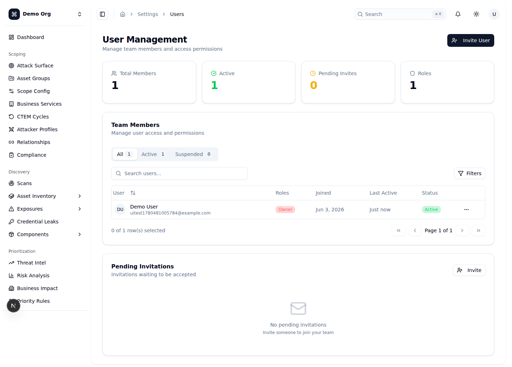

---

## Roles (`/settings/roles`)

**Mục đích:** Định nghĩa **vai trò (role)** và tập **quyền (permissions)** đi kèm — đây là lớp "được LÀM gì" của RBAC. Người dùng có thể mang nhiều role.

**Cách dùng:**
1. Tiêu đề `Roles` có nút `Create Role` (chỉ hiện với quyền `roles:write`).
2. **Ba thẻ thống kê** vừa là bộ lọc nhanh: `Total Roles`, `System Roles`, `Custom Roles`. Tab lọc tương ứng: `All Roles`, `System`, `Custom`.
3. **Bảng roles** với các cột: `Role` (tên + mô tả, gắn badge `System` cho role hệ thống — `owner`, `admin`, `member`, `viewer`), `Permissions` (số quyền, được lọc theo các module mà tenant đang bật), `Data Access` (`Full Access` hoặc `Group-based`), `Level` (`hierarchy_level`), `Created`, và menu `...`.
4. Menu `...` / bấm vào dòng: `View Details` (mở sheet chi tiết). Với **role tùy chỉnh (không phải System)** còn có `Edit Role` (`roles:write`) và `Delete Role` (`roles:delete`).
5. `Create Role` / `Edit Role` mở sheet để đặt tên, mô tả và chọn tập permission.

**Ghi chú:** **Role hệ thống không thể sửa/xóa** (checkbox chọn cũng bị khóa). Xóa role hiện hộp thoại xác nhận và cảnh báo "Users with this role will lose its permissions". `Data Access = Full Access` nghĩa là role bỏ qua giới hạn theo Team (thấy toàn bộ dữ liệu); `Group-based` nghĩa là phạm vi dữ liệu do Team quyết định.
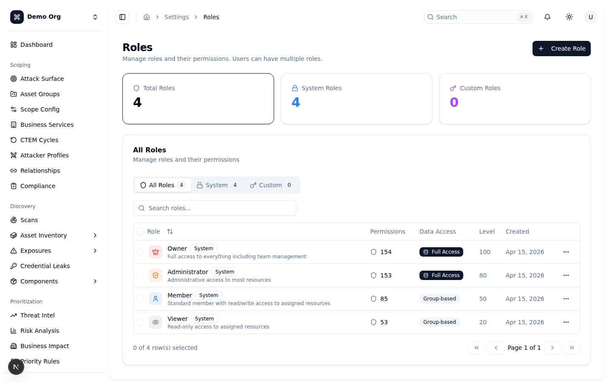

---

## Teams (`/settings/access-control/groups`)

**Mục đích:** Nhóm người dùng thành **Team** để kiểm soát **phạm vi dữ liệu được THẤY** (data scope) — lớp "SEE" của RBAC, bổ trợ cho `Roles` (lớp "DO").

**Cách dùng:**
1. Tiêu đề `Teams` có nút `Create` (tạo team) và `Refresh`.
2. Ô `Search teams...` để tìm; mỗi team hiển thị tên/mô tả và các thao tác quản lý thành viên.
3. **Tạo team:** hộp thoại nhập `Name` (ví dụ `Security Team, DevOps`) và `Description` ("Describe the purpose of this group...").
4. Xóa team có hộp thoại xác nhận.

**Ghi chú:** Team quyết định người dùng nhìn thấy tài sản/dữ liệu nào, trừ khi role của họ có `Full Access`. Yêu cầu quyền quản trị truy cập (thường gắn permission `team:update`).
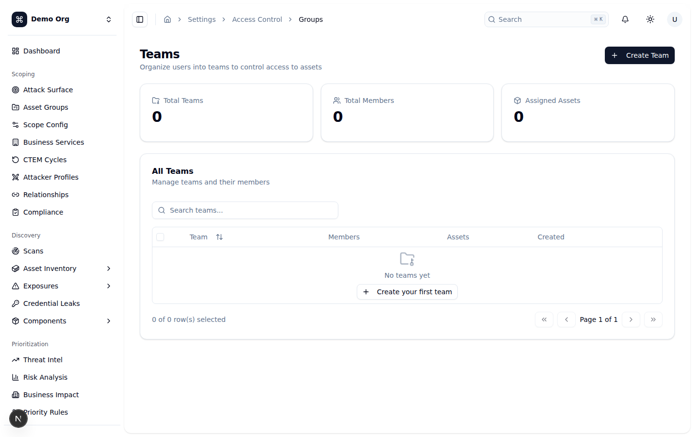

---

## Assignment Rules (`/settings/access-control/assignment-rules`)

**Mục đích:** Tự động gán tài sản vào các Team dựa trên điều kiện — để không phải gán thủ công khi tài sản mới được phát hiện.

**Cách dùng:**
1. Tiêu đề `Assignment Rules` có nút `Create` và `Refresh`.
2. **Bảng rule** với cột `Priority` (badge số) và `Conditions` (các điều kiện đã đặt). Ghi chú trên trang: *"Rules are evaluated in priority order when assigning assets to groups"* — rule được duyệt theo thứ tự ưu tiên.
3. **Tạo rule:** đặt `Name`, `Description`, `Priority` (số, càng nhỏ càng ưu tiên trước), chọn **target group** (Team đích) và cấu hình các `conditions` (ánh xạ thuộc tính → danh sách giá trị). Điều kiện rỗng sẽ bị bỏ qua khi lưu.

**Ghi chú:** Đây là cơ chế tự động hóa data scope: khi tài sản khớp điều kiện, nó được gán vào Team tương ứng. Yêu cầu quyền quản trị truy cập.
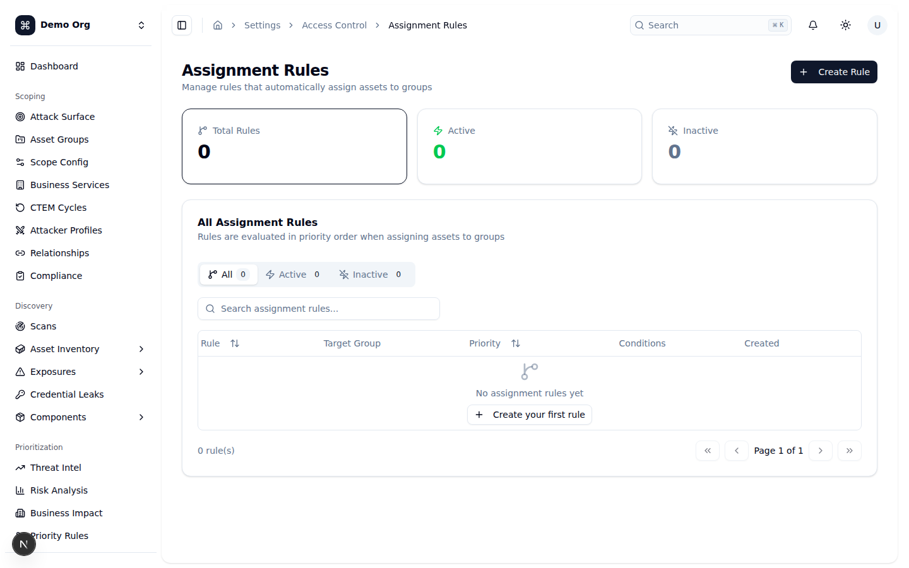

---

## Module Management (`/settings/modules`)

**Mục đích:** Bật/tắt các **module tính năng** theo tenant để gọn hóa giao diện và phù hợp gói sử dụng. Module bị tắt sẽ ẩn khỏi điều hướng và lọc bớt permission tương ứng trong `Roles`.

**Cách dùng:**
1. Tiêu đề `Module Management` với mô tả: *"Core modules required for platform operation cannot be disabled."* Có nút reset về mặc định.
2. **Thẻ tổng quan:** `Enabled`, (Disabled), và `Core (Always On)`.
3. Module được chia làm **Core** (luôn bật, không thể tắt) và **Feature modules** có thể bật/tắt; nhóm theo danh mục: `Core`, `Discovery`, `Prioritization`, `Validation`, `Mobilization`, `Insights`, `Settings`, `Data`, `Operations`, `Platform`.
4. Bật/tắt một module rồi `Save` để áp dụng (hoặc `Discard` để hủy thay đổi đang chờ).
5. Có **đồ thị phụ thuộc**: nếu bật/tắt vi phạm ràng buộc, hệ thống chặn và hiển thị danh sách `blockers`/`required` (badge "Needs N" / "Used by N"); bạn có thể giải quyết theo gợi ý (cascade resolver). Nút `Reset Modules to Defaults` đưa về trạng thái mặc định (bật tất cả) sau khi xác nhận.

**Ghi chú:** Module lõi không thể tắt vì cần cho vận hành nền tảng. Tắt module sẽ ẩn các quyền liên quan khỏi danh sách permission của role.
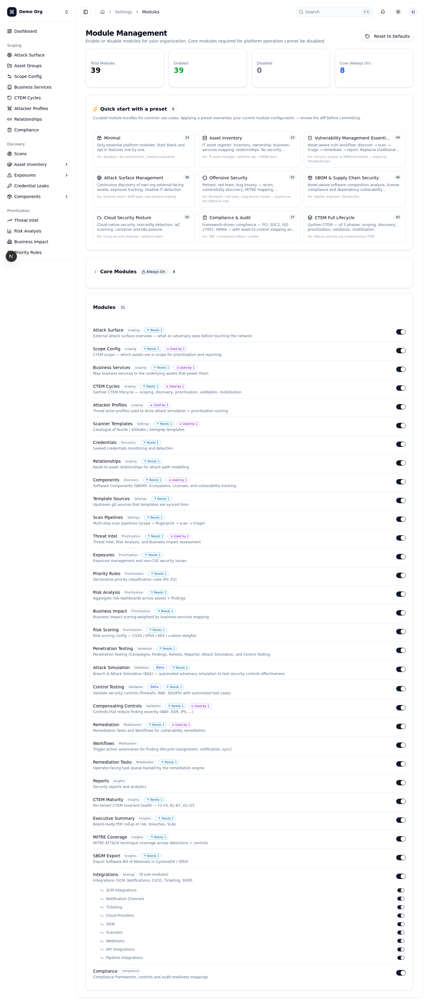

---

## Audit Log (`/settings/audit`)

**Mục đích:** Xem lịch sử hoạt động và các sự kiện bảo mật của tenant — ai đã làm gì, lên tài nguyên nào, kết quả ra sao.

**Cách dùng:**
1. Tiêu đề `Audit Log` có nút `Refresh`.
2. **Bốn thẻ thống kê (7 ngày gần nhất):** `Total Events (7 days)`, `Successful`, `Failed`, `Denied`.
3. **Bảng `Activity History`** ("N events found") với ô `Search by actor, action, resource...`, công tắc ẩn sự kiện hệ thống (`exclude-system`), và bộ lọc `Result` và `Severity`. Mỗi dòng hiển thị actor (email hoặc `System`), hành động, tài nguyên, kết quả, mức độ và thời gian.
4. Bấm một dòng để mở chi tiết sự kiện.

**Ghi chú:** Trang này hiển thị log dạng chỉ-đọc cùng bộ lọc/thống kê; mục đích là phục vụ điều tra và tuân thủ. Truy cập thường giới hạn cho quản trị viên. (Việc xác minh tính toàn vẹn chuỗi log ở tầng hạ tầng/backend, không thao tác trên giao diện này.)
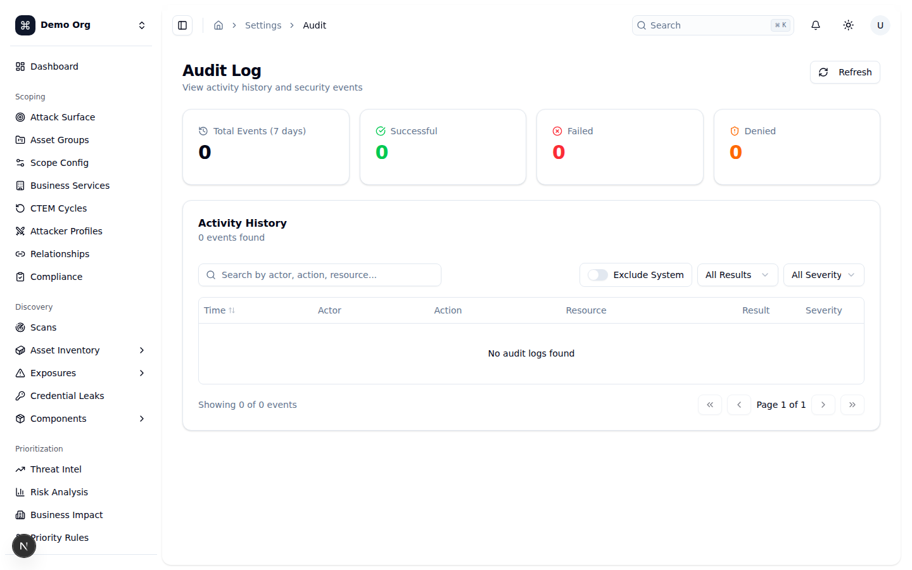

---

## Asset Lifecycle (`/settings/asset-lifecycle`)

**Mục đích:** Tự động chuyển các tài sản "cũ/ì" (stale) ra khỏi kho tài sản đang hoạt động, để operator tập trung vào tín hiệu phơi nhiễm còn tươi mới.

**Cách dùng:**
1. Trang hiển thị form `LifecycleSettingsForm` để cấu hình ngưỡng/luật chuyển trạng thái tài sản theo độ "cũ".
2. Chỉnh thông số và lưu trong form.

**Ghi chú:** Cần permission `team:update` để xem hoặc thay đổi. Nếu thiếu quyền, trang hiện cảnh báo *"Insufficient permissions — You need the team:update permission..."*. Nếu endpoint không khả dụng trên môi trường, hiện *"Failed to load settings"*.
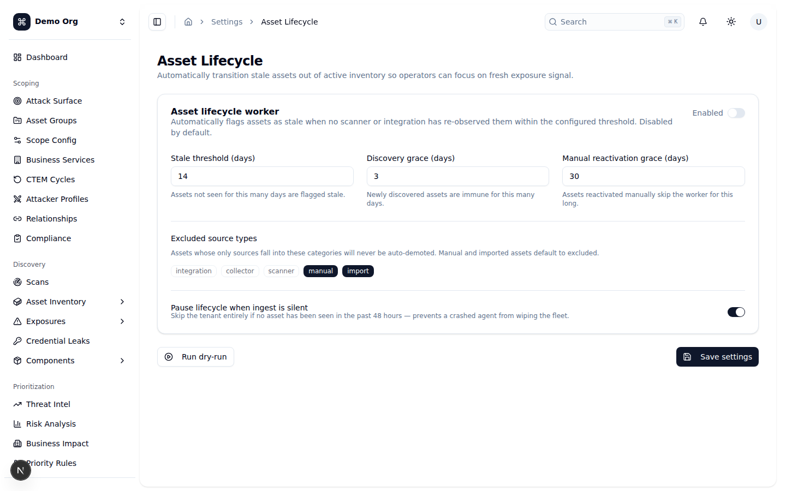

---

## Integrations (hub) (`/settings/integrations`)

**Mục đích:** Trang đầu mối ("hub") liệt kê các nhóm tích hợp bên thứ ba và trạng thái kết nối, dẫn tới từng trang con.

**Cách dùng:**
1. Tiêu đề `Integrations` — *"Connect with third-party tools and services"*.
2. **Các danh mục (category)** dẫn tới trang con tương ứng:
   - `SCM Connections` → `/settings/integrations/scm` (GitHub, GitLab, Bitbucket, Azure DevOps)
   - `Notifications` → `/settings/integrations/notifications` (Slack, Teams, Telegram, Webhook)
   - `CI/CD Pipelines` → `/settings/integrations/cicd` (Jenkins, GitHub Actions, GitLab CI)
   - `Ticketing Systems` → `/settings/integrations/ticketing` (Jira, ServiceNow, Linear)
   - `SIEM & Monitoring` → `/settings/integrations/siem` (Splunk, Datadog, Elastic)
3. Khu vực hoạt động đồng bộ hiển thị các lần sync gần nhất; khi chưa có sẽ thấy "No sync activity yet" / "No integrations configured yet".

**Ghi chú:** Hub chỉ điều hướng; cấu hình thực hiện trong từng trang con. Lưu ý SIEM và CI/CD hiện là *Coming Soon* (xem bên dưới).
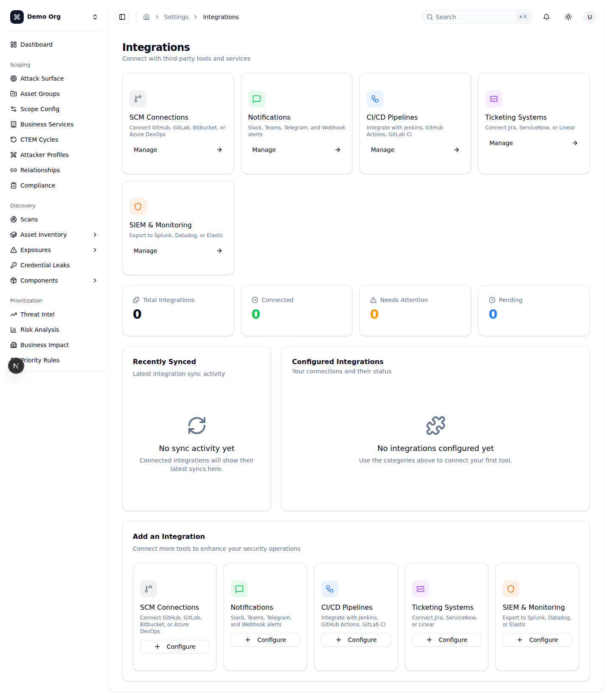

### SCM Connections (`/settings/integrations/scm`)

**Mục đích:** Quản lý kết nối tới hệ thống quản lý mã nguồn (SCM): GitHub, GitLab, Bitbucket, Azure DevOps — phục vụ quét code/repo.

**Cách dùng:**
1. Nút `Refresh` và nút thêm kết nối mới (mở hộp thoại Add).
2. **Thẻ thống kê** kết nối ở đầu; **bảng** với cột `Connection` và các thao tác (sync, sửa, xóa) theo dòng.
3. Thêm kết nối: chọn provider và nhập thông tin xác thực; khi chưa có kết nối nào, dùng nút trong vùng trống để tạo cái đầu tiên.

**Ghi chú:** Yêu cầu quyền quản trị tích hợp. Token/credential nhạy cảm — cân nhắc dùng `Secret Store` cho thông tin xác thực dùng lại.
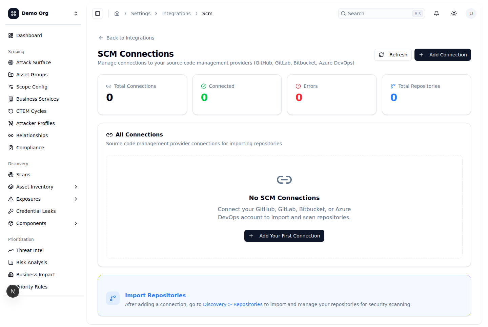

### Notification Integrations (`/settings/integrations/notifications`)

**Mục đích:** Quản lý kênh nhận thông báo bảo mật: **Slack, Microsoft Teams, Telegram, Email và Webhook tùy chỉnh**.

**Cách dùng:**
1. Tiêu đề `Notification Integrations` có nút `Add Channel` (và `Refresh`).
2. **Thẻ thống kê** (`Total Channels`...) và **bảng** `Notification Channels` với cột `Channel`, `Provider` (hiển thị nhãn: `Slack`, `Microsoft Teams`, `Telegram`, `Webhook`, `Email`), tên kênh (`#channel_name` nếu có), trạng thái và lần sync cuối.
3. **Thêm kênh:** chọn provider rồi nhập cấu hình tương ứng (webhook URL cho Slack/Teams/Webhook, bot token + chat id cho Telegram...).
4. **Kiểm thử:** mỗi kênh có hành động gửi thử (`Test`) — nếu thành công hiện toast *"Test notification sent to ..."*, nếu lỗi hiện *"Test notification failed"*.

**Ghi chú:** Khi chưa có kênh nào, dùng `Add Your First Channel`. Yêu cầu quyền quản trị tích hợp.
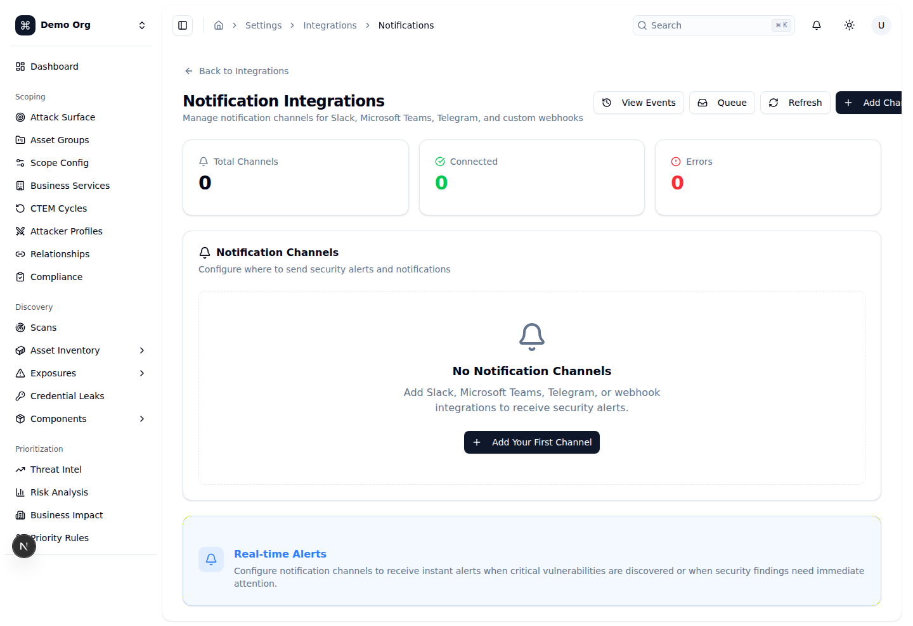

### Ticketing Integration (`/settings/integrations/ticketing`)

**Mục đích:** Kết nối hệ thống quản lý ticket để tự động hóa theo dõi khắc phục (remediation tracking).

**Cách dùng:**
1. Tiêu đề `Ticketing Integration` có nút thêm (mở hộp thoại `Connect Ticketing System`).
2. **Thẻ thống kê:** `Connected Systems` (… of N configured), `Tickets Created` (ticket tự sinh).
3. **Kết nối:** chọn `Provider` (`Jira Cloud`, `Linear`...), nhập `Connection name` (ví dụ `Security Remediation Board`), URL/host (ví dụ `https://yourorg.atlassian.net`), khóa dự án (ví dụ `SEC`) và `API token`.
4. Mỗi kết nối có nút `Sync now`; nút `Configure` hiện đang ở trạng thái khóa/đang phát triển.

**Ghi chú:** Yêu cầu quyền quản trị tích hợp. Provider hỗ trợ tùy môi trường (Jira/Linear thấy trong giao diện thêm kết nối).
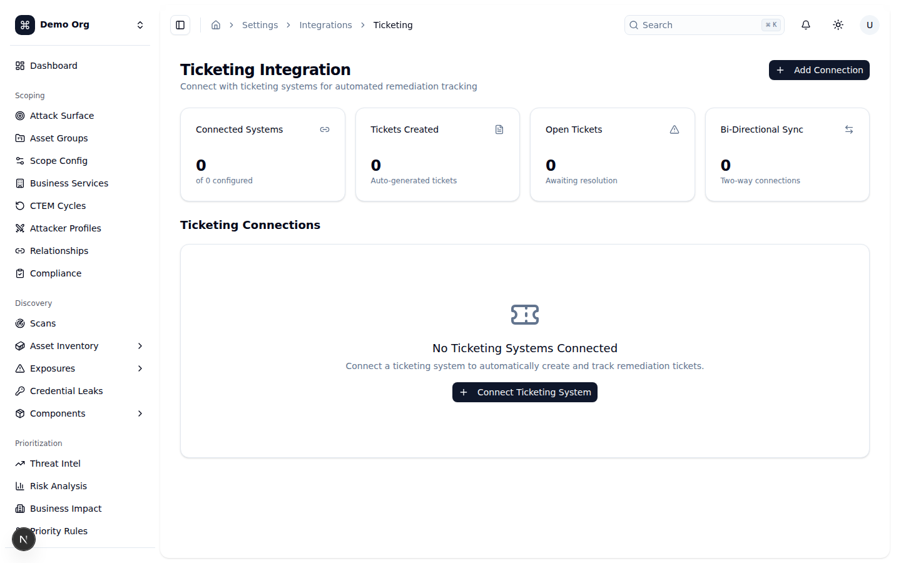

### SIEM Integration (`/settings/integrations/siem`) — Coming Soon

**Mục đích:** (Dự kiến) Chuyển tiếp findings, thay đổi tài sản và kết quả quét sang nền tảng SIEM/SOAR để giám sát tập trung và phản ứng sự cố tự động.

**Ghi chú:** Trang này hiện là **`Coming Soon`** (render qua `ComingSoonPage`) — chưa có thao tác cấu hình.
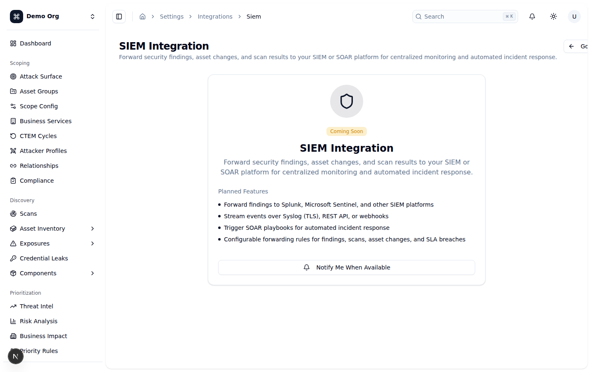

### CI/CD Integration (`/settings/integrations/cicd`) — Coming Soon

**Mục đích:** (Dự kiến) Tích hợp quét bảo mật vào pipeline CI/CD và chặn (gate) việc triển khai dựa trên findings.

**Ghi chú:** Trang này hiện là **`Coming Soon`** (render qua `ComingSoonPage`) — chưa có thao tác cấu hình.
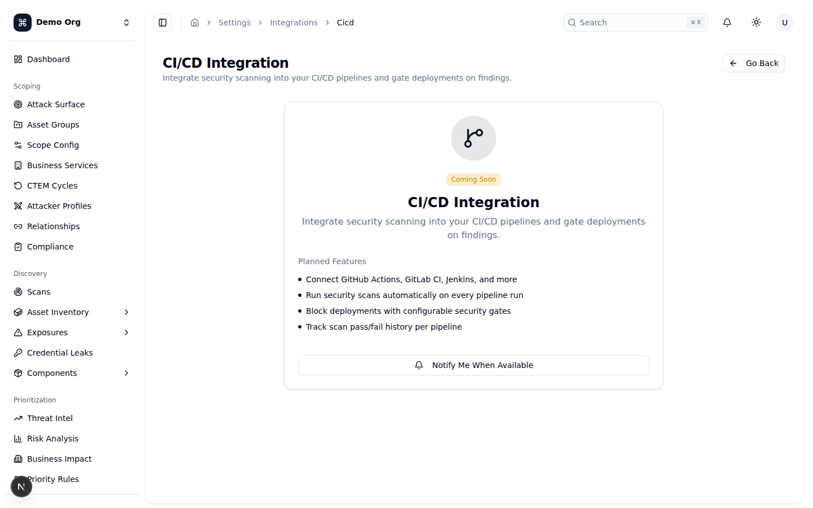

---

## Platform Agents (`/agents`)

**Mục đích:** Đăng ký và quản lý **agent nền tảng** — các tiến trình thực thi job quét/thu thập (đặc biệt cho mục tiêu nội bộ, nơi nền tảng SaaS không tiếp cận trực tiếp). Trang theo dõi trạng thái online/offline, lỗi và số job đang chạy.

**Cách dùng:**
1. **Bốn thẻ trạng thái:** số agent `online` (xanh), `offline`, `error` (đỏ nếu >0), và `Active Jobs` (vàng).
2. Khối `Agents` hiển thị "N agents - M active jobs", với `Refresh`, `Export`, và nút `Add Agent`.
3. **Tab theo loại agent:** `All`, `Daemon`, `Standalone`, `Collectors` — kèm ô `Search agents...` và bộ lọc `Status`.
4. **Đăng ký agent (`Add Agent`)** — hộp thoại 2 bước:
   - **Bước 1:** chọn `Agent Type`, nhập `Name` và `Description` (tùy chọn), chọn `Execution Mode` (mặc định `daemon`).
   - **Bước 2:** hệ thống tạo và hiển thị **API key** một lần duy nhất — cảnh báo *"Save this API key now. You won't be able to see it again."*. Dùng nút copy để lưu key (dùng để cấp phép agent đăng ký/giữ lease với nền tảng) rồi bấm `Done`.
5. Mỗi agent có thao tác: xem cấu hình (`agent-config-dialog`), sửa (`edit-agent-dialog`), tạo lại khóa (`regenerate-key-dialog`) và xóa (có xác nhận `Delete Agent`).

**Ghi chú:** API key chỉ hiện một lần — nếu mất phải dùng `Regenerate key`. Quản trị agent là thao tác đặc quyền (yêu cầu vai trò quản trị nền tảng).
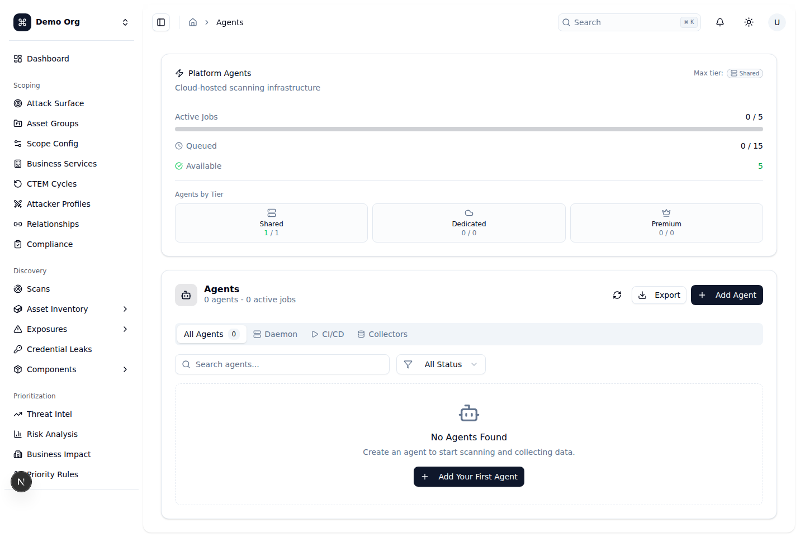

---

## Tools (`/tools`)

**Mục đích:** Danh mục (catalog) các **công cụ quét** mà nền tảng/agent có thể chạy — nguồn để xây dựng `Scanner Templates` và `Scan Profiles`.

**Cách dùng:**
1. Khối `Tool Registry` có hai chế độ (tab): công cụ **built-in** (do nền tảng cung cấp, chỉ-đọc) và **custom** (do tenant thêm). Nút `Add` chỉ khả dụng ở chế độ custom (`isCustomToolsMode`).
2. `Refresh`, `Export`, ô `Search tools...`, và bộ lọc theo **danh mục** (`categoryFilter`) — lấy từ category của từng tool.
3. Mỗi tool hiển thị danh mục, phiên bản hiện tại (`current_version`) và mô tả.

**Ghi chú:** Công cụ built-in là read-only; chỉ tool custom mới sửa/xóa được. Khi rỗng (ở chế độ custom) có nút thêm tool đầu tiên.
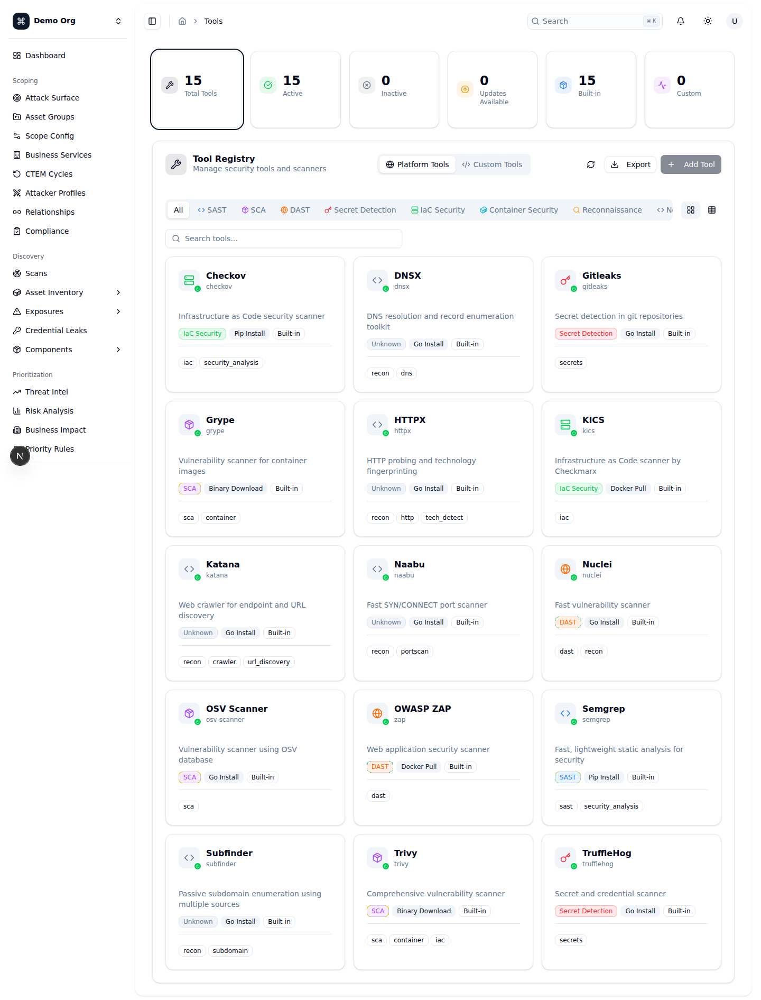

---

## Scanner Templates (`/scanner-templates`)

**Mục đích:** Quản lý **mẫu cấu hình scanner** (scanner template) — định nghĩa sẵn cách chạy một loại quét để tái sử dụng.

**Cách dùng:**
1. Khối `Scanner Templates` có `Refresh` và nút `Add` (tạo template).
2. Ô `Search templates...`, bộ lọc theo loại (`All Types`) và theo trạng thái (`All Statuses`: `Active`, `Deprecated`...).
3. Mỗi template hiển thị badge **loại** (`TemplateType`) và **trạng thái** (`TemplateStatus`), kèm menu thao tác.
4. Thao tác gồm chỉnh sửa, **deprecate** (đánh dấu ngừng dùng — có xác nhận) và xóa (có xác nhận).

**Ghi chú:** Trạng thái `Deprecated` giúp loại template cũ khỏi danh sách chọn mà không xóa hẳn. Yêu cầu quyền tương ứng để tạo/sửa/xóa.
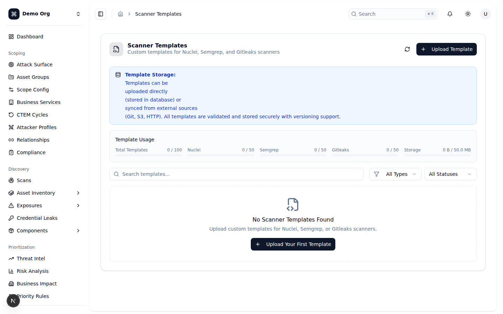

---

## Template Sources (`/template-sources`)

**Mục đích:** Khai báo **nguồn template** (ví dụ kho Git chứa template scanner) để nền tảng đồng bộ về và sử dụng.

**Cách dùng:**
1. Khối `Template Sources` có `Refresh` và nút `Add` (thêm nguồn).
2. Ô `Search sources...`; mỗi nguồn hiển thị thông tin kết nối và thao tác (đồng bộ, sửa, xóa — có xác nhận khi xóa).

**Ghi chú:** Nguồn thường cần thông tin xác thực (Git token...) — lấy từ `Secret Store`. Khi rỗng có nút thêm nguồn đầu tiên.
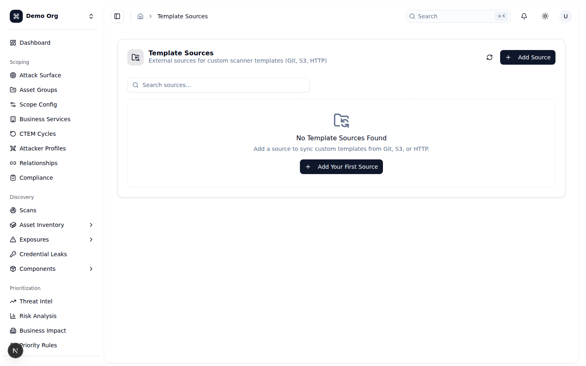

---

## Secret Store (`/secret-store`)

**Mục đích:** Lưu trữ an toàn các **credential dùng cho template source và quét** (Git token, AWS key, bearer/GitLab token...). Mô tả trang: *"Securely store credentials for template sources (Git tokens, AWS keys, etc.)"*.

**Cách dùng:**
1. Khối `Secret Store` có `Refresh` và nút `Add` (thêm credential).
2. Ô `Search credentials...`; mỗi credential hiển thị loại (badge theo kiểu: bearer token, GitLab token...) và trạng thái, kèm thao tác sửa/xóa (có xác nhận khi xóa).

**Ghi chú:** Giá trị secret được lưu an toàn và không hiển thị lại sau khi nhập. Yêu cầu quyền credential (`credentials:write` để tạo/sửa). Dùng kho này thay vì dán secret trực tiếp vào từng tích hợp.
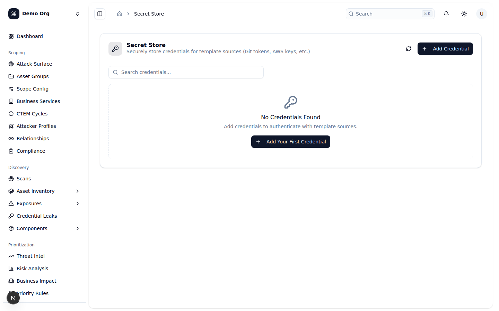

---

## Scan Profiles (`/scan-profiles`)

**Mục đích:** Tạo **profile quét tái sử dụng** — gói cấu hình tool/tham số để khởi chạy quét nhất quán. Mô tả: *"Reusable scan configurations with tool settings"*.

**Cách dùng:**
1. Khối `Scan Profiles` có `Refresh` và nút tạo profile.
2. Ô `Search profiles...`; mỗi profile hiển thị tên, mô tả và thao tác (sửa/xóa — có xác nhận khi xóa).
3. Tạo/sửa profile để chọn tool và thiết lập tham số dùng lại khi chạy quét.

**Ghi chú:** Profile giúp chuẩn hóa cách quét giữa các lần/đội nhóm. Khi rỗng có nút tạo profile đầu tiên.
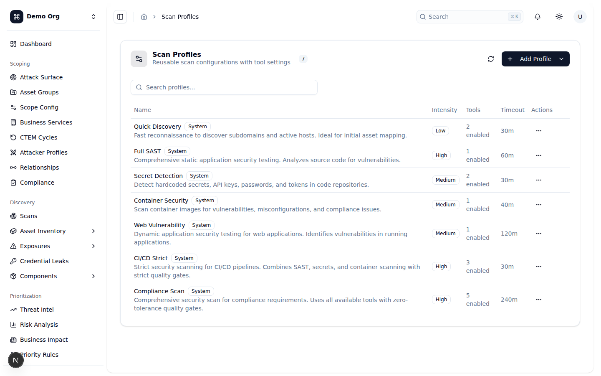

---

## Capabilities (`/capabilities`)

**Mục đích:** Định nghĩa **năng lực (capability)** của công cụ — "tool có thể LÀM gì" (loại quét/hành động mà tool hỗ trợ). Mô tả: *"Manage what tools can do"*.

**Cách dùng:**
1. Khối `Tool Capabilities` có hai tab: **`Platform`** (capability built-in, chỉ-đọc) và **`Custom`** (do tenant tạo). Có đếm số lượng từng nhóm.
2. `Refresh`, ô `Search capabilities...`, bộ lọc theo danh mục.
3. Nút tạo capability chỉ khả dụng ở tab **`Custom`** (`isCustomMode`); ở tab `Platform` các mục là read-only (có chú thích).
4. Mỗi capability có xem chi tiết; với capability custom còn có sửa/xóa (xóa hiển thị thống kê mức độ đang được sử dụng — `usage stats` — để cảnh báo trước khi xóa).

**Ghi chú:** Capability nền tảng (built-in) không thể sửa/xóa. Tạo capability custom yêu cầu quyền tương ứng.
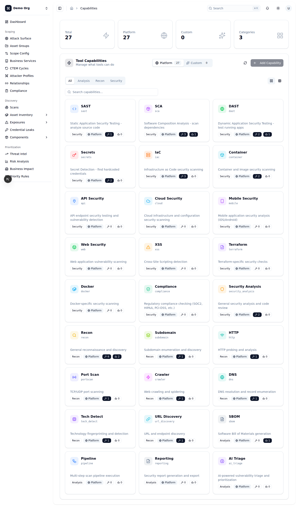

---

## Checklist

Dùng danh sách dưới đây khi thiết lập hoặc rà soát cấu hình & quản trị một tenant:

- [ ] **Tenant** — đã đặt `Organization Name`, logo, `Industry`, `Timezone`/`Language` (`/settings/tenant` → tab `General`).
- [ ] **Bảo mật tenant** — bật `Require MFA` và `Email Verification` phù hợp; cấu hình `Session Timeout`; thiết lập `IP Restrictions` nếu cần; nối SSO (`Identity Providers`) nếu dùng (tab `Security`).
- [ ] **API & Storage** — chỉ bật `API Access`/`Webhook` khi cần; cấu hình `File Storage` (bucket/endpoint/keys) cho bằng chứng (tab `API & Webhooks`, `File Storage`).
- [ ] **General** — kiểm tra `Date/Time Format`, `Compact Mode`, `Auto Refresh` (`/settings/general`). Nhớ: UI hiện chỉ tiếng Anh.
- [ ] **RBAC – Roles** — rà soát role hệ thống; tạo role custom theo nguyên tắc tối thiểu quyền; đặt `Full Access` vs `Group-based` đúng nhu cầu (`/settings/roles`).
- [ ] **RBAC – Teams & Rules** — tạo Team theo phạm vi dữ liệu; cấu hình `Assignment Rules` theo `Priority` để tự gán tài sản (`/settings/access-control/...`).
- [ ] **Users** — mời thành viên, gán đúng role, dọn `Invitations` treo (`/settings/users`).
- [ ] **Modules** — bật/tắt module theo nhu cầu; tôn trọng ràng buộc phụ thuộc; module Core luôn bật (`/settings/modules`).
- [ ] **Audit** — biết nơi truy vết hoạt động/sự kiện bảo mật; dùng bộ lọc `Result`/`Severity` khi điều tra (`/settings/audit`).
- [ ] **Asset Lifecycle** — cấu hình ngưỡng đưa tài sản cũ ra khỏi inventory (cần `team:update`) (`/settings/asset-lifecycle`).
- [ ] **Integrations** — nối `SCM` cho quét code; cấu hình `Notifications` (Slack/Teams/Telegram/Email/Webhook) và gửi thử; nối `Ticketing` cho remediation. (`SIEM`, `CI/CD` còn `Coming Soon`.)
- [ ] **Toolchain** — đăng ký `Platform Agents` (lưu API key một lần!); rà `Tools`/`Capabilities`; khai báo `Template Sources` + `Secret Store`; chuẩn hóa `Scanner Templates` và `Scan Profiles`.
- [ ] **Quyền** — xác nhận quản trị viên có vai trò `Owner`/`Admin` và các permission cần thiết (`team:update`, `roles:write/delete`, `credentials:write`...).
