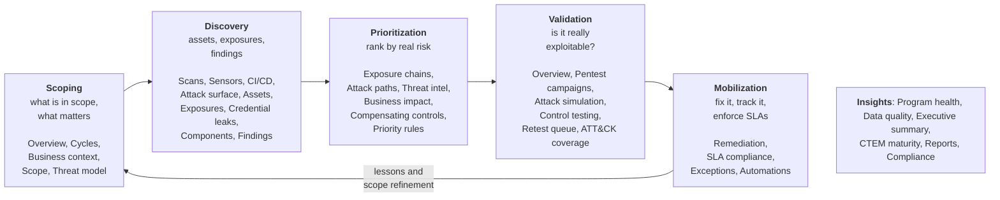

# User guide

This guide is for the people who work in the OpenCTEM web console every day:
security analysts, engineers, team leads and organization owners. It explains
what each part of the console does and how to do the tasks you will actually
do, step by step.

Installing, configuring or operating the platform is covered in
[Install](../install/index.md), [Configuration](../configuration/index.md) and
[Operations](../operations/index.md). Scanning infrastructure (sensors, scan
zones) is covered in [Sensors](../sensors/index.md) and
[Scanning](../scanning/index.md).

## The mental model: the CTEM loop

OpenCTEM is organized around **Continuous Threat Exposure Management (CTEM)**, a
repeatable five-stage loop. The left sidebar follows that loop from top to
bottom, and so does this guide.

Each box lists the sidebar entries of that stage. **Findings** sits at the top of
the sidebar, next to the dashboard and **My work**, because every stage uses it.

| Stage | Goal | Chapter |
|---|---|---|
| **Scoping** | Decide what is in scope and attach business context | [Scoping](03-scoping.md) |
| **Discovery** | Find assets and the exposures on them | [Discovery and the asset inventory](04-discovery.md), [Exposures and findings](05-exposures-and-findings.md) |
| **Prioritization** | Rank what to fix first | [Prioritization](06-prioritization.md) |
| **Validation** | Prove that exposures are real and that fixes and controls work | [Validation](07-validation.md) |
| **Mobilization** | Drive remediation to closure and automate the routine | [Mobilization](08-mobilization.md) |

You run the loop as **CTEM cycles**: time-boxed passes with a written charter and
a frozen scope, so every round is measurable and each one learns from the last.
That is the most important workflow in the product; it is covered first in
[Scoping](03-scoping.md#ctem-cycles-start-here).

## Chapters

1. [Getting started and the dashboard](01-getting-started.md): sign in
   (password, two-factor, SSO), choose an organization, accept an invitation, the
   dashboard, notifications and your own account.
2. [Team and access](02-team-and-access.md): members and invitations, roles and
   permissions, teams (data scope) and assignment rules, sign-in policy, SCIM,
   API keys, AI access (MCP) and the audit log.
3. [Scoping](03-scoping.md): CTEM cycles, business context (crown jewels,
   services, business units), the scan scope, the threat model.
4. [Discovery and the asset inventory](04-discovery.md): scans, scan runs and
   scan workflows, sensors, CI/CD, the attack surface, the asset inventory,
   credential leaks and software components (SBOM).
5. [Exposures and findings](05-exposures-and-findings.md): the findings
   workbench, triage, approvals, re-verification and the exposure views.
6. [Prioritization](06-prioritization.md): priority classes, exposure chains and
   attack paths, threat intelligence, business impact, compensating controls,
   priority rules and risk scoring.
7. [Validation](07-validation.md): automated re-verification, pentest
   campaigns, the retest queue, ATT&CK coverage, attack simulation and control
   testing.
8. [Mobilization](08-mobilization.md): remediation tasks and campaigns, solution
   families, tickets, SLA policies and compliance, exceptions and automations.
9. [Insights and reports](09-insights-and-reports.md): program health, data
   quality, executive summary, CTEM maturity, reports and compliance.
10. [Settings and integrations](10-settings-and-integrations.md): the settings
    area, organization settings, modules, policies, scanning settings and
    integrations.
11. [Platform administration](11-platform-administration.md): the admin console
    for platform administrators.

## Things worth knowing up front

- **Your organization is isolated.** Everything you see and do is scoped to the
  organization you are working in. You can belong to several and switch between
  them.
- **What you can do depends on your roles.** Access is allow-only: your
  abilities are the union of the permissions your roles grant. If a button is
  missing or disabled, you most likely lack the permission (hover a disabled
  control: it usually says why).
- **What you can see depends on your teams.** Members who are in no team see no
  assets or findings until an administrator adds them to a team or grants them
  an asset. Owners, admins and roles with full data access see everything. See
  [Team and access](02-team-and-access.md#teams-and-assignment-rules).
- **What appears in the sidebar depends on modules.** If a whole area is missing,
  its module is turned off under
  [Settings › Organization › Modules](10-settings-and-integrations.md#modules).
- **Most assets come from scans and integrations.** You enrich them with
  context: criticality, owner, business unit, crown-jewel status.
- **Sensitive actions need a second person.** Marking a finding a false positive
  or accepting its risk goes through an approval request, and verifying a fix
  is a separate permission from triaging it.
- **Lists start empty.** Until the first scan or import, most data pages show an
  honest empty state with a suggested next step, not sample numbers.
